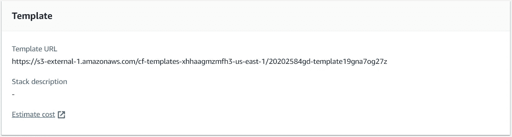

# 从头开始构建云架构堆栈

> 原文：<https://towardsdatascience.com/building-a-cloudformation-stack-from-scratch-691ea3a71571?source=collection_archive---------28----------------------->

## 新冠肺炎推文的数据接收管道

**什么是自动气象站云形成**

CloudFormation(CF)是一项服务，它允许您通过模板设置和管理 AWS 资源。这使得您可以将更多的时间用于开发应用程序，而不是管理和配置资源。

所以如果要建立以下基础设施；

*   安全小组
*   EC2 实例
*   一卷
*   托管数据库(如 Amazon RDS)

AWS CF 将使用正确的配置按正确的顺序配置所有资源

自动气象站云形成的一些好处:

*   代码为的*基础设施*
*   因为资源不是手动创建的，所以可以通过 git 建立版本控制。对基础设施的改变现在可以通过代码来控制。
*   一旦创建了一个模板，您可以通过估计成本选项找出每月的成本！
*   通过创建堆栈或删除它，部署或销毁任何资源也很容易。

**我们将从这篇文章中学到什么？**

在本帖中，我们将创建一个 CloudFormation 堆栈来提供以下资源:

*   一个弹性搜索域:用于存储和查询推文
*   一个 S3 桶:存储未能处理的推文
*   Kinsesis firehose:用于流式传输 covid19 推文
*   Lambda 函数:用于处理推文

AWS 数据管道。使用 draw.io 创建

首先让我们了解我们正在处理的数据，然后我们将了解摄取管道。

**新冠肺炎推特流**

Twitter 在他们的 Twitter 开发者实验室中发布了一个流媒体端点。流媒体端点将根据其内部 COVID19 注释返回推文。端点配置了一组过滤器，提供了关于该主题的对话的综合视图。

 [## 概观

### 有兴趣探索实验室吗？我们在实验室中发布的端点是可能会更广泛发布的工具的预览…

developer.twitter.com](https://developer.twitter.com/en/docs/labs/covid19-stream/overview) 

这些推文是由南加州大学的一个团队从流媒体端点收集的。该数据集根据知识共享署名-非商业性使用-类似共享 4.0 国际公共许可证( [CC BY-NC-SA 4.0](https://creativecommons.org/licenses/by-nc-sa/4.0/) )进行许可。通过使用该数据集，您同意遵守许可中的规定，继续遵守 Twitter 的[服务条款](https://developer.twitter.com/en/developer-terms/agreement-and-policy)，并引用以下手稿:

> *Chen E，Lerman K，Ferrara E 追踪关于新冠肺炎疫情的社交媒体话语:公共冠状病毒推特数据集的开发 JMIR 公共卫生监测 2020；PMID: 32427106*

截至 2020 年 9 月 14 日，该数据集拥有超过 5 . 38 亿条推文！

Covid19 数据集中的推文总数

**数据摄取管道**

由于 Twitter 开发人员 API 的 ToS，只有 tweet IDs 存储在 github repo 中。这被称为*将推文*脱水。

*更新推文*是当我们使用推文 ID 并调用 twitter API 来填充其他字段(字典键)时，*更新的推文*然后被放入一个数据流中，该数据流写入 Kinesis firehose。

Lambda 函数用于处理批量为 5MiB 的推文。

Lambda 函数用于从 *Tweet 对象*中选择特定的一组键。

处理后的 tweets 随后被存储在 ElasticSearch 域中。如果流程失败，它们将被路由到 S3 存储桶。S3 存储桶也可以用来存储 e S 索引的快照。

**给推文 id 补水**

我已经在下面的 github repo 中上传了这个项目的 python 代码和其他文件。请随意使用、分享和使用它:

[https://github . com/skyprince 999/Data-Engineering-covid 19-ETL](https://github.com/skyprince999/Data-Engineering-Covid19-ETL)

我们现在将创建用于调配资源的堆栈。

**S3 铲斗的造云模板**

这是我们栈中最简单的模板。事实上，您甚至不需要指定 bucket-name！

**弹性搜索领域的云信息模板**

我们将使用模板为 ES 域提供配置。我们在集群中有 **4 个数据节点**(*实例计数*)每个都是类型 **t2.small** ( *实例类型*)

所有节点都有 **35GiB** 的 EBS 卷( *VolumeSize* )

ElasticSearch 版本是最新的(**7.7**)(*elastic search version*)

下一个要点是提供 es 域的访问策略。我们允许在域上执行所有操作。对 SourceIP (*)也没有限制，这意味着您可以从任何 IP 地址访问该域。

*这不是配置访问策略*的最佳实践。您可以将访问策略更改为更具限制性。

**kine sis 消防水带云形成模板**

cloudformation 模板用于配置 Kinesis 消防软管。该流的类型为 *DirectPut。*数据的缓冲时间间隔为 300 秒或直到大小为 5mb！

> 处理后的数据存储在 ElasticSearch 域中，而失败的数据存储在 S3 桶中。因为 ES 域和 S3 桶是通过 CF 栈创建的。我们可以通过使用 **Fn::GetAtt** 函数来访问他们的域名

查看我的公共 github repo 中完整的 CloudFormation 模板:

 [## sky prince 999/数据工程-Covid19-ETL

### 通过在 GitHub 上创建帐户，为 skyprince 999/Data-Engineering-covid 19-ETL 开发做出贡献。

github.com](https://github.com/skyprince999/Data-Engineering-Covid19-ETL) 

模板文件可以通过 CloudFormation 控制台上传。

云形成控制台。上传模板 yaml 文件

在设计器中检查模板，然后将其上传到 S3 存储桶。

为堆栈提供一个名称，然后检查配置。您可以使用 AWS 估算器来计算资源的成本。

我们配置的总成本约为 2300 美元(每年)；每月支付约 200 美元

