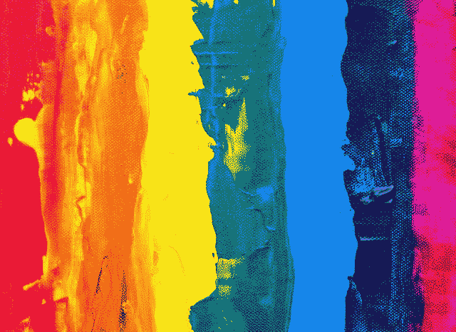
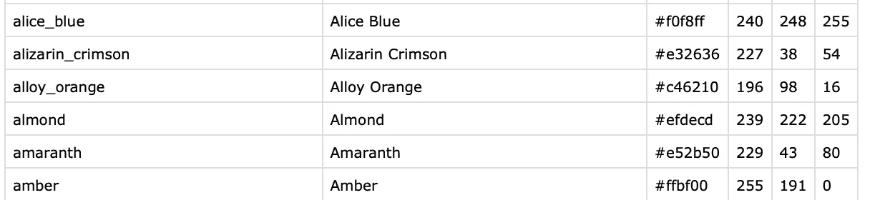

# 用 Python 构建颜色识别器

> 原文：<https://towardsdatascience.com/building-a-color-recognizer-in-python-4783dfc72456?source=collection_archive---------3----------------------->

## 使用 OpenCV 的简单实用的机器学习应用程序


在 [Unsplash](https://unsplash.com/?utm_source=unsplash&utm_medium=referral&utm_content=creditCopyText) 上由 [Kelli Tungay](https://unsplash.com/@kellitungay?utm_source=unsplash&utm_medium=referral&utm_content=creditCopyText) 拍摄的照片

在这篇文章中，我将向你展示如何使用 Python 来构建你自己的颜色识别器。这个过程也称为“颜色检测”。我们将创建一个基本的应用程序来帮助我们检测图像中的颜色。该程序还将返回颜色的 RGB 值，这非常有用。许多图形设计人员和网页设计人员会理解 RGB 值是如何有用的。构建颜色识别器是开始使用计算机视觉的一个很好的项目。

如果你以前没有听说过计算机视觉，这是了解它的最好时机。大多数机器学习和人工智能领域都与计算机视觉有着紧密的联系。随着我们的成长和探索，看到外面的世界对我们的发展有很大的影响。这对机器来说也是一样的，它们通过图像来观察外部世界，这些图像被转换成计算机可以理解的数据值。

在以前的帖子中，我展示了如何[检测人脸](/simple-face-detection-in-python-1fcda0ea648e)以及如何[识别图像中的人脸](/building-a-face-recognizer-in-python-7fd6630c6340)，这些都是在人工智能和计算机视觉中实践 python 的伟大项目。让我们做点工作吧！

# 目录

*   ***入门***
*   ***库***
*   ***定义图像***
*   ***颜色识别***
*   ***应用***
*   ***结果***

# 入门指南

我们将为这个项目使用三个主要模块。他们是 NumPy，熊猫和 OpenCv。OpenCv 是一个高度优化的库，专注于实时应用。

> OpenCV(开源计算机视觉库)是一个开源的计算机视觉和机器学习软件库。OpenCV 旨在为计算机视觉应用提供一个公共基础设施，并加速机器感知在商业产品中的应用。
> 
> 来源:[https://opencv.org](https://opencv.org/)

[](https://lifexplorer.medium.com/subscribe) [## 每当贝希克居文出版时收到电子邮件。

### 每当贝希克居文出版时收到电子邮件。注册后，如果您还没有，您将创建一个中型帐户…

lifexplorer.medium.com](https://lifexplorer.medium.com/subscribe) 

# 图书馆

如前所述，本项目将使用三个模块。要使用这些模块，我们必须安装必要的库。使用 pip 安装库是一个非常简单的步骤。Pip 是一个包管理工具。我们将使用命令行界面进行安装。下面是一次安装所有 3 个库的代码行:

```
pip install numpy pandas opencv-python
```

安装完成后，我们必须将它们导入我们的程序。在您喜欢的代码编辑器中打开一个新文件。以下是关于如何导入已安装库的代码:

```
import numpy as np
import pandas as pd
import cv2
```

OpenCv 作为 cv2 导入。对于其他库，我们将它们“作为”导入，以便在程序中更容易调用它们。

完美！现在，我们可以进入下一步，我们将定义要用来测试颜色识别器应用程序的图像。

# 定义图像

你可以选择任何你想要的图像。我会将我的图像保存在与我的程序相同的文件夹中，这样更容易查找和导入。

```
img = cv2.**imread**("color_image.jpg")
```

为了给你一些想法，这里是我将在这个项目中使用的图像:



照片由[斯蒂夫·约翰森](https://www.pexels.com/@steve?utm_content=attributionCopyText&utm_medium=referral&utm_source=pexels)从[派克斯](https://www.pexels.com/photo/photo-of-rainbow-colored-painting-on-canvas-1704119/?utm_content=attributionCopyText&utm_medium=referral&utm_source=pexels)拍摄

太好了！你准备好编程了吗？抓紧时间，让我们进入下一步。

# 颜色识别

让我问你一个好问题。*你知道机器是如此纯洁吗？嗯，我认为他们是因为你教他们什么，他们就学什么。它们就像一块白色的大画布。而你的程序就是你的画笔:)*

## 教授颜色

首先，我们要教他们颜色。为此，我们需要包含颜色名称和一些与这些颜色匹配的值的数据。因为大多数颜色可以用红色、绿色和蓝色来定义。这就是为什么我们将使用 RGB 格式作为我们的数据点。我找到了一个现成的 csv 文件，其中有大约 1000 个颜色名称和 RGB 值。这里是 [GitHub](https://github.com/codebrainz/color-names/blob/master/output/colors.csv) 链接。我们将在程序中使用这个 csv 文件。该文件的截图可以让您有所了解:



colors.csv

让我们使用 *read_csv* 方法将 *colors.csv* 文件导入到我们的程序中。因为我们下载的 csv 文件没有列名，所以我将在程序中定义它们。这个过程被称为数据操作。

```
index=["color", "color_name", "hex", "R", "G", "B"]csv = pd.read_csv('colors.csv', names=index, header=None)
```

## 全局变量

在下面的步骤中，我们将定义两个函数。为了让应用程序顺利工作，我们需要一些全局变量。你将知道在使用函数时全局变量是如何有用的。

```
clicked = False
r = g = b = xpos = ypos = 0
```

## 颜色识别功能

当我们双击图像的一个区域时，这个函数将被调用。它将返回颜色名称和该颜色的 RGB 值。这就是奇迹发生的地方！

```
def recognize_color(R,G,B):
    minimum = 10000
    for i in range(len(csv)):
        d = abs(R- int(csv.loc[i,"R"])) + abs(G- int(csv.loc[i,"G"]))+ abs(B- int(csv.loc[i,"B"]))
        if(d<=minimum):
            minimum = d
            cname = csv.loc[i,"color_name"]
    return cname
```

## 鼠标点击功能

这个函数用来定义我们的双击过程。在创建我们的应用程序部分时，我们将需要它。

```
def mouse_click(event, x, y, flags, param):
    if event == cv2.EVENT_LBUTTONDBLCLK:
        global b,g,r,xpos,ypos, clicked
        clicked = True
        xpos = x
        ypos = y
        b,g,r = img[y,x]
        b = int(b)
        g = int(g)
        r = int(r)
```

希望你还和我在一起！这看起来可能有点复杂，但是当你开始在编辑器中写它们时，大局就会变得清晰起来。我尽最大努力让事情简单易懂。我会在这篇文章的最后加上我的联系方式，如果你需要任何帮助，请联系我。

# 应用

我很高兴你走到了这一步。在这一步，我们将使用 OpenCV 方法打开图像作为一个新窗口。在该窗口中，我们将使用之前定义的函数。这个应用程序非常简单，当你双击图像上的某个区域时，它会返回颜色名称和颜色值。

## 应用程序窗口

首先，让我向您展示如何使用 OpenCV 在新窗口中打开图像文件。

```
cv2.namedWindow('Color Recognition App')
```

其次，让我们调用我们创建的鼠标点击函数。这为我们的应用程序提供了更多的功能。

```
cv2.setMouseCallback('Color Recognition App', mouse_click)
```

## 应用程序

下面是开始我们的应用程序窗口工作的 while 循环。

```
while(1):cv2.imshow("Color Recognition App",img)
    if (clicked):

        #cv2.rectangle(image, startpoint, endpoint, color, thickness)-1 fills entire rectangle 
        cv2.rectangle(img,(20,20), (750,60), (b,g,r), -1)#Creating text string to display( Color name and RGB values )
        text = recognize_color(r,g,b) + ' R='+ str(r) +  ' G='+ str(g) +  ' B='+ str(b)

        #cv2.putText(img,text,start,font(0-7),fontScale,color,thickness,lineType )
        cv2.putText(img, text,(50,50),2,0.8,(255,255,255),2,cv2.LINE_AA)#For very light colours we will display text in black colour
        if(r+g+b>=600):
            cv2.putText(img, text,(50,50),2,0.8,(0,0,0),2,cv2.LINE_AA)

        clicked=False
```

## 关闭应用程序

如果您使用过 OpenCV 项目，您可能对这个步骤很熟悉。我们必须定义如何结束和关闭应用程序窗口。否则，它将永远运行，因为我们使用了 *while(1)* 来启动应用程序。添加下面几行对于您将来的项目来说是一个很好的实践。

```
#Break the loop when user hits 'esc' key    
    if cv2.waitKey(20) & 0xFF ==27:
        breakcv2.destroyAllWindows()
```

# 结果

目前，我正在为这个项目制作一个演示视频。我收到了许多关于演示视频的积极反馈，它让我更好地了解了项目和申请流程。视频将发布在我的 [**youtube 频道**](https://www.youtube.com/channel/UCmo4tnTcj92DlzES5hvlWwQ) 上。

(更新:视频准备好了，下面有。谢谢😊)

视频演示

恭喜你。！您已经创建了一个很酷的计算机视觉应用程序，它可以识别图像中的颜色。现在，您对如何在实际项目中使用计算机视觉有了一些了解。希望你喜欢读我的文章。如果你今天学到了新东西，我会很高兴的。从事像这样的动手编程项目是提高编码技能的最好方式。

如果您在执行代码时有任何问题，请随时[联系我](https://sonsuzdesign.blog/)。

> 关注我的[博客](https://medium.com/@lifexplorer)和[走向数据科学](https://towardsdatascience.com/)以获得灵感。谢谢你，

# 更多计算机视觉项目:

[](/rendering-text-on-video-using-python-1c006519c0aa) [## 使用 Python 渲染视频文本

### 使用 moviePy 库的动手机器学习项目

towardsdatascience.com](/rendering-text-on-video-using-python-1c006519c0aa) [](/building-a-face-recognizer-in-python-7fd6630c6340) [## 用 Python 构建人脸识别器

### 使用 OpenCv 库进行实时人脸识别的分步指南

towardsdatascience.com](/building-a-face-recognizer-in-python-7fd6630c6340)