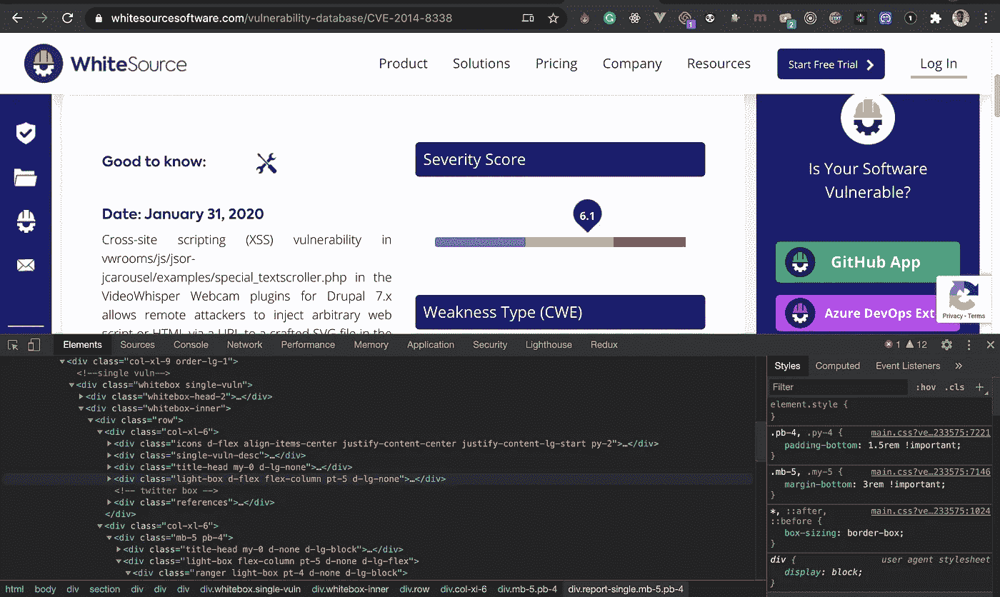
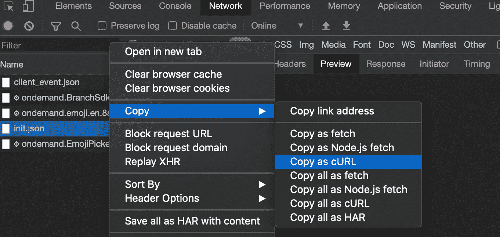
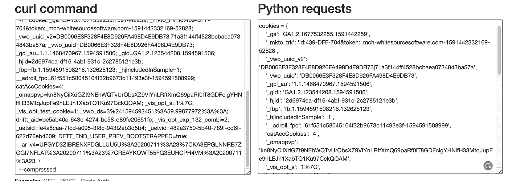

# 构建命令行应用程序来检查开源漏洞

> 原文：<https://towardsdatascience.com/building-a-command-line-application-to-check-for-open-source-vulnerabilities-360a3024528f?source=collection_archive---------35----------------------->


弗朗茨·哈文·阿西图纳在 [Unsplash](https://unsplash.com?utm_source=medium&utm_medium=referral) 上拍摄的照片

开源软件、编程语言或项目中的漏洞是一件大事，因为一次利用可能会导致许多混乱，并导致大组织数千美元的损失。

许多公司一直在关注软件中的漏洞、依赖性和他们在驱动系统时使用的语言，因为如果其中一个漏洞被利用，它们可能会受到攻击。

幸运的是，我们有一个公共数据库，所有新发现的漏洞和常见弱点都在其中公布，并在发现后立即提供修复。这些公开发布的漏洞数据库可以在类似 [CVE](https://cve.mitre.org/) 、 [NVD](https://nvd.nist.gov/) 、[白源](http://vuln.whitesource.com/)漏洞数据库等网站上找到。

通过这些网站，您可以轻松地查找带有 ID 的漏洞，并获得相关信息。您可以了解严重性级别、受影响的组件、有时是什么导致了错误、如何临时或永久地修复它。

我们还可以通过构建一个简单的命令行应用程序来查找漏洞细节和信息，从而自动化并加速这一过程。

因此，在本文中，我们将探讨如何使用 Python 构建一个命令行实用程序来查找漏洞细节。

# 设置 Python 环境

构建命令行实用程序的第一步是设置 Python 开发环境。当从事 Python 项目时，我总是建议建立一个虚拟环境，因为它使事情变得更容易，并有助于避免模块版本中的冲突。

如果您使用 Python 3，您可以轻松运行 python3 -m venv <name>来创建虚拟环境，或者安装 virtualenvwrapper 或 virtualenv 来帮助设置虚拟环境。你可以在这里阅读更多关于如何设置你的环境的[。](https://siitgo.com/pages/lpythontz-3/1511/python-3-environment-setup)</name>

一旦您的环境启动，下一件事就是安装构建我们的应用程序所需的模块:

```
$ pip install requests beautifulsoup4 click lxml
```

对于这个项目，我们安装了:

1.  请求:Python HTTP 请求客户端库
2.  BeautifulSoup:用于从 HTML 和 XML 解析和提取数据的 Python 库
3.  点击:一个丰富的 python 命令行框架
4.  LXML:用于处理 HTML 和 XML 的 BeautifulSoup deps。

接下来，我们可以使用以下内容创建文件夹结构:

```
$ mkdir vulr && cd vulr
$ touch scraper.py main.py __init__.py
```

以下是适用于您的环境的完整设置命令:

```
$ python3 -m venv vulr-env && source vulr-env/bin/activate$ pip install requests beautifulsoup4 click lxml$ mkdir vulr && cd vulr$ touch scraper.py main.py __init__.py$ pip freeze > requirements.txt$ touch readme.md .gitignore # optional
```

您应该会得到如下所示的内容:


# 编写我们的网页抓取器

要使用我们的命令行从 WhiteSource 漏洞数据库中获取详细信息，我们需要构建一个简单的 web scraper，用于从数据库中提取所需的数据和关于漏洞的信息。

之前我们安装了 Requests 和 Beautifulsoup，我们将一起使用它们来构建一个简单的刮刀，并提取关于漏洞的所有可用细节。

基本上，当给定一个特定漏洞的 CVE ID 时，我们的网络抓取器将提取该漏洞的可用信息。为了便于识别，CVE ID 是给每个已发布漏洞的唯一 ID。

现在让我们为我们的 scraper 编写一个基本的代码设置:

```
import requests
from bs4 from BeautifulSoupBASE_URL = "[https://www.whitesourcesoftware.com/vulnerability-database/](https://www.whitesourcesoftware.com/vulnerability-database/)"def get_html(url):
   request = requests.get(url)
   if request.status_code == 200:
     return request.content
   else:
    raise Exception("Bad request")def lookup_cve(name):
   pass
```

上面我们已经为我们的网页抓取器创建了一个基本结构。我们添加了 WhiteSource 漏洞查找 URL，添加了获取请求的 HTML 内容的函数，还添加了一个空的 lookup_cve 函数。

现在让我们前往这个 [WhiteSource Vuln Lab](https://www.whitesourcesoftware.com/vulnerability-database/CVE-2014-8338) ，打开开发者控制台，研究页面的 DOM 结构。



接下来的事情是提取请求网页时发送的标题和 cookies。为了向网页发送一个成功的请求，我们需要像浏览器一样工作，这样我们就不会得到一个禁止的错误。

您可以在“Network”选项卡上执行此操作，因此单击“on ”,然后单击“All”。然后点击发送的请求以获取网页。它通常是浏览器发出的第一个请求。


右键单击它，鼠标悬停在复制上，然后单击复制为卷曲。这将以 cURL 格式复制请求，包括其标题和 cookies:



现在提取 cURL 命令，包括 Python 请求的头和 cookies，我们可以很容易地使用[这个工具](https://curl.trillworks.com/)。这将有助于将 cURL 命令转换成任何语言和流行的 HTTP 请求库。

你所需要做的就是粘贴你的 cURL 命令，选择 Python，你就会得到一个格式良好的 Python 请求实现:



现在，从第二个文本框开始，我们将复制出 headers 和 cookies 字典，并更新我们的代码，如下所示:

```
import requests
from bs4 from BeautifulSoupBASE_URL = "[https://www.whitesourcesoftware.com/vulnerability-database/](https://www.whitesourcesoftware.com/vulnerability-database/)"cookies = {
'_ga': 'GA1.2.1677532255.1591419793179',
...
}headers = {
'authority': '[www.whitesourcesoftware.com'](http://www.whitesourcesoftware.com'),
'cache-control': 'max-age=0',
...
}def get_html(url):
   request = requests.get(url, headers=headers, cookies=cookies)
   print(request.content)
   if request.status_code == 200:
     return request.content
   else:
     raise Exception("Bad request")
```

接下来要做的是使用 dom 结构有序地提取页面上显示的所有信息。

根据上面的代码，我们:

1.  提取了描述、日期、语言、引用、严重性分数、top_fix、弱点和报告。
2.  我们添加了另一个函数 extract_cvs_table，从页面右侧的 cvs 表中提取数据。
3.  然后我们将结果组织成一个简单的字典

要测试这一点，只需调用函数并传递 CVE id:

```
cve_details = lookup_cve("CVE-2020-6803")print(cve_details)
```

然后运行:

```
$ python scraper.py
```


瞧啊。我们已经成功地创建了我们的网络刮刀。

# 构建我们的命令行应用程序

现在要做的下一件事是使用我们之前安装的 click 库构建我们的命令行应用程序。

正如我之前简要解释的，Click 是一个命令行框架，由于其简单性和结构性，它是你能找到的最好的框架之一。

首先，让我们看看 main.py 中的 CLI 代码设置:

```
import sys
import click[@click](http://twitter.com/click).group()
[@click](http://twitter.com/click).version_option("1.0.0")
def main():
    """Vulnerability Lookup CLI"""
    print("Hey")[@main](http://twitter.com/main).command()
[@click](http://twitter.com/click).argument('name', required=False)
def look_up(**kwargs):
    """Get vulnerability details using its CVE-ID on WhiteSource Vuln Database"""
    click.echo(kwargs)if __name__ == '__main__':
    args = sys.argv
    if "--help" in args or len(args) == 1:
        print("Vulnerability Checker - Vulr")
    main()
```

通过上面的设置，我们创建了一个名为 look_up 的命令，并向该命令传递了一个参数——name。这将是用于获取漏洞信息的命令。

要在这个命令上实现 web scraper，您需要从 scraper.py 导入 lookup_cve，并将参数传递给函数。一旦我们这样做了，我们就可以通过打印来显示结果数据。

下面是如何做到这一点:

要运行此程序:

```
$ python main.py look-up CVE-2014-8338
```


哒哒！我们的命令行应用程序正在工作。

# 最后的想法

到目前为止，我们已经探索了如何构建一个 web scraper 来从 WhiteSource 漏洞数据库中提取数据，以获得漏洞信息，并在命令行应用程序中实现它，以便它可以用于直接从命令行显示漏洞细节。

接下来你可以在 PyPI 上发布它，这样其他用户就可以使用 PIP 包管理器来安装和使用它。