# 用 Elasticsearch、Kubeflow 和 Katib 构建一个完整的基于人工智能的搜索引擎

> 原文：<https://towardsdatascience.com/building-a-complete-ai-based-search-engine-with-elasticsearch-kubeflow-and-katib-590c7b27eb8f?source=collection_archive---------12----------------------->

## 让我们看看如何在 Kubernetes 的基础上建立一个完整的搜索引擎，提供人工智能个性化的结果

建立搜索系统很难。让他们准备好机器学习真的很难。开发一个完整的集成 AI 的搜索引擎框架真的真的很难。

所以我们做一个吧。✌️

在这篇文章中，我们将从头构建一个搜索引擎，并讨论如何通过使用 Kubeflow 和 Katib 添加机器学习层来进一步优化结果。考虑到用户的上下文，这个新层将能够检索结果，这也是本文的主要焦点。

正如我们将看到的，多亏了 Kubeflow 和 Katib，最终的结果相当简单、高效且易于维护。

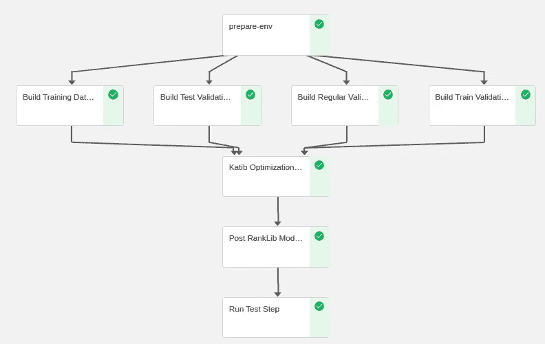

由 Kubeflow 执行的完整管道，负责协调整个系统。图片作者。

为了在实践中理解这些概念，我们将通过实践经验来实现这个系统。因为它是建立在 Kubernetes 之上的，所以您可以使用任何您喜欢的基础设施(只要经过适当的修改)。在这篇文章中，我们将使用谷歌云平台( [GCP](https://cloud.google.com/) )。

我们首先简要介绍概念，然后讨论系统实现。

所以，没有进一步的麻烦，

# 1.你知道，为了搜索

如果你接受为你的公司建立一个搜索系统的挑战，或者想为你自己建立一个，你很快就会意识到最初的步骤有些简单。

首先，搜索引擎必须包含用于检索的文档。由于我们将与 Elasticsearch 合作，让我们将其作为参考(关于介绍，请参考他们的[官方文件](https://www.elastic.co/guide/en/elasticsearch/guide/current/index.html)

文档应该按照 JSON 格式上传到 Elasticsearch。例如，如果我们正在为一个时尚电子商务商店构建一个搜索引擎，这里有一个文档示例:


上传到 Elasticsearch 的文档示例。图片作者。

接下来是检索步骤，本质上是将搜索查询与文档字段进行匹配:

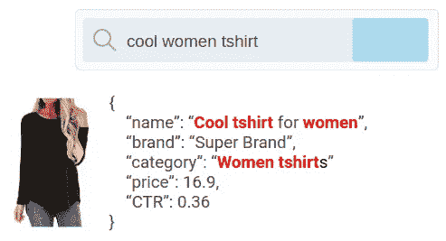

搜索词与文档字段匹配的示例。图片作者。

排序阶段应用一些数学规则，如 [TF-IDF](https://en.wikipedia.org/wiki/Tf%E2%80%93idf) 或 [BM25F](https://en.wikipedia.org/wiki/Okapi_BM25) 来找出如何正确排序，从最佳到最差匹配对文档进行排序。大概是这样的:

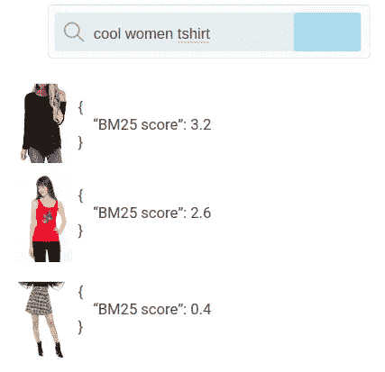

Elasticsearch 在数据库中存储的文档中运行 BM25 评分检索到的正确排名的结果示例。图片作者。

进一步的优化可以利用包含性能指标的文档的特定字段。例如，在前面的例子中，我们知道 t 恤的点击率(CTR，即点击和总印象之间的原因)是 *CTR=0.36* 。可以使用该信息添加另一个检索层，并且将具有更好 CTR 的文档显示在顶部(也称为“提升”):

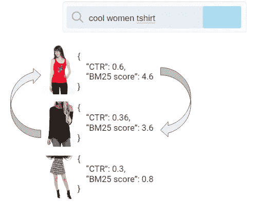

在检索规则中添加性能指标层的示例。先前的第二好的文档上升到结果的顶部。图片作者。

到目前为止一切顺利。但是让我们看看如何进一步优化更多。

考虑每个用户都有一个特定的上下文。再以我们的时尚网店为例。一些交通可能来自南方地区，那里可能比北方地区更热。他们可能更愿意穿轻薄的衣服，而不是冬季专用的产品。

等式中还可以加入更多的上下文:我们可以根据顾客喜欢的品牌、类别、颜色、尺寸、使用的设备、平均消费金额、职业、年龄来区分他们，这样的例子不胜枚举…

这样做也需要一些额外的工具。让我们深入一点。

# 2.机器学习层

Learn-to-rank ( [LTR](https://en.wikipedia.org/wiki/Learning_to_rank) )是机器学习的一个领域，它研究的算法的主要目标是对一系列文档进行适当的排序。

它本质上像任何其他学习算法一样工作:它需要一个训练数据集，遭受诸如[偏差](https://en.wikipedia.org/wiki/Bias%E2%80%93variance_tradeoff)之类的问题，每个模型都比某些场景有优势，等等。

基本上改变的是，训练过程的成本函数被设计成让算法学习排序，并且模型的输出是给定文档对于给定查询的匹配程度的值。

从数学上讲，它简单地由下式给出:


在我们的例子中, **X** 包含了我们想要用来为搜索添加上下文的所有特性。它们可以是诸如用户的地区、他们的年龄、喜爱的品牌、查询和文档字段之间的相关性等值。

*f* 是应该被训练和评估的排序模型。

最后， **J** 对*判断*进行了扩展，对于我们来说，它是一个范围从 0(意味着对于给定的查询特性，文档不是很好的匹配)到 4(文档是非常好的匹配)的整数值。我们通过使用判断从最好到最差排列文档*。*

我们的主要目标是获得 *f* ，因为它表示将机器学习层添加到搜索结果中的排序算法。为了获得 *f* ，我们需要一个已经包含判断值的数据集，否则我们无法训练模型。

事实证明，找到这些价值是相当具有挑战性的。虽然如何做到这一点的细节不会在这里讨论，这篇[的帖子](/how-to-extract-relevance-from-clickstream-data-2a870df219fb)对这个话题有一个彻底的讨论；简而言之，我们使用用户与搜索引擎交互的点击流数据(他们的点击和购买)来拟合模型，这些模型的变量产生了判断值的代理。


在 [pyClickModels](https://github.com/WillianFuks/pyClickModels) 上实现的图形模型示例，用于查找与搜索引擎结果相关联的文档的相关性。图片作者。

在计算判断之后，我们剩下的是训练排名模型。Elasticsearch 已经提供了一个[学习排名](https://github.com/o19s/elasticsearch-learning-to-rank)插件，我们将在这个实现中使用。该插件提供了从决策树到神经网络的各种排序算法。

这是所需培训文件的一个示例:

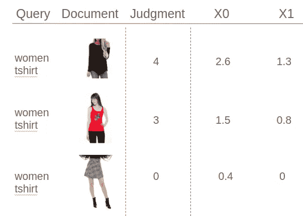

Elasticsearch Learn2Rank 插件要求的训练步骤的输入文件示例。图片作者。

这个想法是为每个查询(“women t-shirt”)注册结果页面中打印的所有文档。对于每个人，我们计算他们的预期判断并构建特征矩阵**X**。

在实践中，我们将首先准备所有这些数据，并将其输入到 Elasticsearch 的 Learn-To-Rank 插件中，这将产生一个经过训练的排名模型。然后，它可以用来添加我们正在寻找的个性化层。

关于建造 X 的更多细节将很快被讨论。

我们现在准备训练模型。到目前为止一切顺利。但是，我们仍然有一个棘手的问题:如何知道它是否有效？

# 2.1 估价框架

我们可以从几种方法中选择来检查排名模型的性能。我们将在这里讨论的是基于用户点击或购买的平均[](http://yifanhu.net/PUB/cf.pdf)*排名指标( *pySearchML* 只关注购买事件，但点击可以互换使用)。*

*数学上，它由下式给出:*

*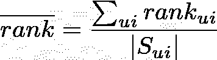*

*该公式参考完整的文档列表，对与每个购买(或点击)的项目相关联的每个排名进行求和。分母只是流程中汇总的商品数量的基数(用户点击或购买的商品总数)。*

*实际上，在训练一个排名模型后，我们将遍历验证数据集(包含用户搜索的内容和购买的内容)，并使用每个搜索词向 Elasticsearch 发送一个查询。然后，我们将结果与用户购买的东西进行比较，以计算适当的平均排名。*

*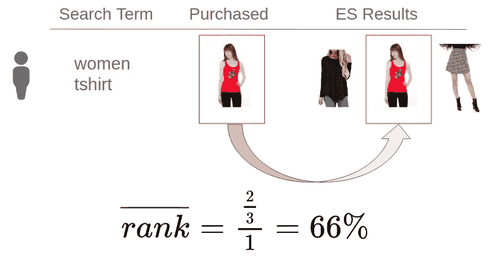*

*实践中的验证框架示例。对于数据集中的每个用户，我们使用他们的搜索词从 ES 结果中检索已经实现的排名模型。然后，我们获取用户购买商品的平均排名以及它们在 ES 结果中的位置。图片作者。*

*上图说明了这个概念。对于每个用户，我们将他们的搜索词发送到 Elasticsearch，其中已经包含了最近训练的模型。然后，我们将搜索结果与用户购买的内容进行比较，并计算排名。在前面的示例中，红色 t 恤出现在 3 个检索到的项目中的位置 2。因为只购买了一件商品，所以*排名=66%。**

*我们对数据库中的所有用户运行相同的计算，然后对它们进行平均，得到最终的排名表达式。*

*请注意，最终的等级度量必须低于 *50%* ，否则该算法只是作为文档的随机选择器来执行。*

*这个值很重要，因为它用于选择最佳排名模型。这就是我们使用 Kubeflow 的 Katib 的地方。*

*现在让我们看看如何将所有这些概念放在一起并构建搜索引擎:*

# *3.库伯流程编排*

*如前所述，Kubeflow 是管道处理的指挥者。它的职责多种多样，从为 Elasticsearch 和培训准备数据到运行整个培训流程。*

*它通过定义组件及其各自的任务来工作。对于 pySearchML，下面是实现的完整的[管道](https://github.com/WillianFuks/pySearchML/blob/master/kubeflow/pipelines/pipeline2.py):*

*管道是通过接收各种输入参数来定义的，比如`bucket`和`model_name`，我们将能够在执行时更改这些值(我们很快就会看到)。*

*让我们看看管道实施中的每个组件及其用途:*

*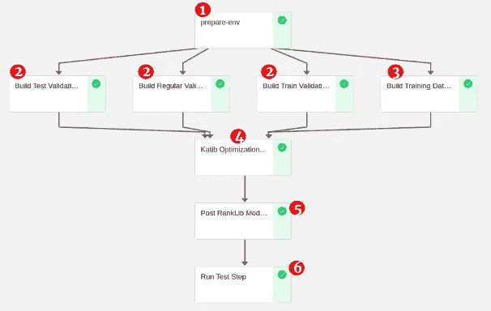*

*在 pySearchML 中逐步实现。图片作者。*

## *1.准备 _ 环境*

*下面是如何定义 *prepare_env* 组件的:*

*   **图像*是在该步骤中运行的组件的 docker 引用。*
*   **参数*是发送给在 Docker 的映像`ENTRYPOINT`中执行的脚本的输入参数。*
*   **pvolumes* 将卷声明装入`\data`。*

*[这里是](https://github.com/WillianFuks/pySearchML/tree/master/kubeflow/components/prepare_env)prepare _ env 中的所有文件:*

*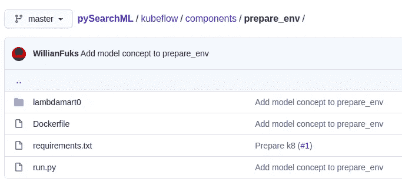*

*   *`run.py`负责针对 [BigQuer](https://cloud.google.com/bigquery) y 运行查询，并准备 Elasticsearch。它的输入参数之一是`model_name`,它设置使用哪个文件夹作为处理数据的参考。`lambdamart0`是一种已经实现的算法，可用于 Google Analytics(GA) [公共样本](https://console.cloud.google.com/marketplace/product/obfuscated-ga360-data/obfuscated-ga360-data?filter=solution-type:dataset&filter=category:analytics&id=45f150ac-81d3-4796-9abf-d7a4f98eb4c6&project=pysearchml&folder=&organizationId=)数据集。*
*   *`[Dockerfile](https://github.com/WillianFuks/pySearchML/blob/master/kubeflow/components/prepare_env/Dockerfile)`将整个代码捆绑在一起，并作为`ENTRYPOINT`执行`run.py`脚本:*

*   *`lambdamart0`是一个文件夹，专用于以此命名的算法的实现。它是为处理 GA 公共数据而构建的，是该系统的一个示例。以下是它包含的文件:*

*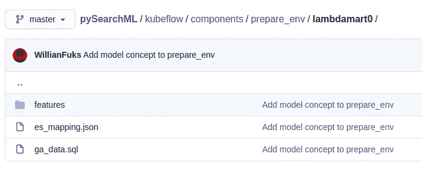*

*   *`[ga_data.sql](https://github.com/WillianFuks/pySearchML/blob/master/kubeflow/components/prepare_env/lambdamart0/ga_data.sql)`是一个查询，负责从 GA 公共数据集中检索文档，并将其导出到 Elasticsearch*
*   *`[es_mapping.json](https://github.com/WillianFuks/pySearchML/blob/master/kubeflow/components/prepare_env/lambdamart0/es_mapping.json)`是文档中每个字段的索引定义*
*   *如前所述，`[features](https://github.com/WillianFuks/pySearchML/tree/master/kubeflow/components/prepare_env/lambdamart0/features)`携带 **X** 的值。在`lambdamart0`示例中，它使用 GA 公共数据作为构建特性的参考。*

*请注意名为`[name.json](https://github.com/WillianFuks/pySearchML/blob/master/kubeflow/components/prepare_env/lambdamart0/features/name.json)`的特性:*

*学习排名插件要求将每个特征定义为有效的弹性搜索查询，并且分数结果与 **X.** 相关联*

*在前面的例子中，它接收一个参数`search_term`，并继续对返回 BM25 匹配的每个文档的字段`name`进行匹配，这实际上变成了我们的“ **X0** ”。*

*在查询和名称字段之间使用 BM25 不足以增加结果的个性化。定制层的另一个进步是定义如下的`[channel_group.json](https://github.com/WillianFuks/pySearchML/blob/master/kubeflow/components/prepare_env/lambdamart0/features/channel_group.json)`:*

*它接收参数`channel_group`(将用户带到我们的网络商店的渠道)作为输入，并返回相应渠道的 CTR。*

*这有效地准备了模型来区分用户的来源以及如何对每个组进行排序。具体来说，例如，来自付费渠道的用户可能与来自有机渠道的用户行为不同。如果训练足够好，排序算法应该准备好处理这些情况。*

*尽管如此，这并没有告诉如何通过使用每个用户的内在特征来个性化结果。因此，这里有一个解决这个问题的可能性。特征`[avg_customer_price.json](https://github.com/WillianFuks/pySearchML/blob/master/kubeflow/components/prepare_env/lambdamart0/features/avg_customer_price.json)`定义为:*

*它接收参数`customer_avg_ticket`作为输入，并为每个文档返回平均用户票和文档价格之间的距离的日志。*

*现在，排名模型可以在训练阶段学习如何根据每个项目的价格与用户在网站上的平均支出的距离来管理每个项目的排名。*

*有了这三种类型的功能，我们可以在 Elasticsearch 的基础上为搜索系统添加一个完整的个性化层。特性可以是任何东西，只要它可以被抽象成一个有效的搜索查询，并且它们必须返回一些最终被翻译成我们的值 **X** 的评分标准。*

*对于 *prepare_env* 组件中的内容:*

*   *要素被导出到 Elasticsearch。*
*   *Elasticsearch 上创建了一个定义文档字段的索引。*
*   *从 [BigQuery](https://cloud.google.com/bigquery) 查询文档并上传到 Elasticsearch。*
*   *[创建 RankLib 需求](https://github.com/WillianFuks/pySearchML/blob/master/kubeflow/components/prepare_env/run.py#L184:L185)(特性集存储等等)。*

*为了用新的数据和特性实现新的模型，只需在 prepare_env(类似于`modelname2`)中创建另一个文件夹，并设置它将如何查询数据并将它们上传到 Elasticsearch。*

## *2.验证数据集*

*这是一个简单的步骤。它包括从 BigQuery 检索数据，其中包含用户搜索的内容、搜索的上下文和购买的产品列表。*

*下面是用于检索数据的 BigQuery [查询](https://github.com/WillianFuks/pySearchML/blob/master/kubeflow/components/data/validation/validation.sql)。它基本上选择所有用户，他们的搜索和购买，然后结合他们的背景。结果的一个例子:*

*`search_keys`可以包含设置客户上下文的任何可用信息。在前面的例子中，我们在网站上使用他们的渠道组和平均消费票。*

*这些数据是我们在计算之前讨论的平均排名时输入到验证框架中的。*

*请注意，系统构建了三个不同的验证数据集:一个用于训练期，另一个用于常规验证，最后第三个用于最终测试步骤。这里的想法是分析训练模型的偏差和方差。*

## *3.训练数据集*

*如前所述，这是负责构建 RankLib 训练文件的组件。完整的[脚本](https://github.com/WillianFuks/pySearchML/blob/master/kubeflow/components/data/train/run.py)其实相当简单。首先，它从 BigQuery 下载包含用户在搜索页面上的交互的输入点击流数据。这里有一个例子:*

*请注意，与搜索相关的关键字在`search_keys`中聚集在一起。这些值是我们发送给 Elasticsearch 并适当替换每个特性 **X** 的值，如 *prepare_env* 中所述。在前面的 JSON 示例中，我们知道用户搜索上下文是:*

*   *已搜索*酒具*。*
*   *直接来到店里。*
*   *在网站上平均花费 20 美元。*

*`judgment_keys`将用户在搜索页面上看到的文档组成的会话和他们在给定文档上的交互结合起来。*

*这些信息随后被发送到 [pyClickModels](https://github.com/WillianFuks/pyClickModels) ，后者处理数据并评估每个查询-文档对的判断。结果是换行符分隔的 JSON 文档，如下所示:*

*注意，键的值是`search_term:bags|channel_group:organic|customer_avg_ticket:30`。*

*如前所述，我们希望我们的搜索引擎知道上下文，并在此基础上进一步优化。因此，判断是基于整个选定的上下文提取的，而不仅仅是 search_term。*

*通过这样做，我们可以区分每个上下文的文档，例如，我们会有这样的场景，对于来自北方地区的客户，产品接收到的判断为 4，否则为 0。*

*请注意，pyClickModels 给出的判断值的范围是 0 到 1。由于 Learn-To-Rank Elasticsearch 插件是建立在 RankLib 之上的，这个值的范围应该在整数 0 和 4 之间，包括 0 和 4。我们接下来要做的是，用变量的百分位数作为参考来转换变量。下面是构建最终判决文件的完整代码:*

*以下是此步骤的输出示例:*

*这些数据需要转换成 RankLib 所需的训练文件。在这里，我们将判断、文档、查询上下文的信息与特性 **X** 结合起来(这里是从 Elasticsearch 检索 **X** 的[代码示例)。](https://github.com/WillianFuks/pySearchML/blob/master/kubeflow/components/data/train/run.py#L124)*

*上一步中包含搜索上下文和判断键的每一个 JSON 行都被循环并作为一个查询发送给 Elasticsearch，输入参数为`search_keys`。结果将是从先前的*准备 _ 环境*步骤中已经定义的 **X** 的每个值。*

*最终结果是一个类似如下的培训文件:*

*对于每个查询和每个文档，我们都有由 pyClickModels 计算出的估计判断、查询的 id 以及一个特性列表 **X** 及其各自的值。*

*有了这个文件，我们现在可以训练排名算法。*

## *4.Katib 优化*

*[Katib](https://github.com/kubeflow/katib) 是一款来自 Kubeflow 的工具，它提供了一个自动超参数优化的接口。它有几种可用的方法；pySearchML 中选择的是贝叶斯优化。*

*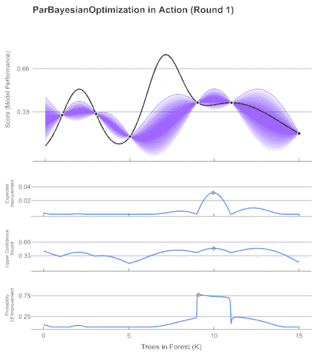*

*贝叶斯优化算法的例子。随着它从允许的域中采样更多的数据点，它可能越接近给定函数的最佳值。在 pySearchML 中，域是一组变量，设置排名器应该如何拟合数据，它优化的成本函数是平均排名。图片来自[维基媒体基金会](https://commons.wikimedia.org/wiki/File:GpParBayesAnimationSmall.gif)。*

*Katib 所做的是根据[勘探-开采](https://en.wikipedia.org/wiki/Bayesian_optimization)之间的权衡为每个超参数选择一个新值。然后，它测试新模型并观察用于未来步骤的结果。*

*对于 pySearchML，每个参数都是一个 [RankLib](https://sourceforge.net/p/lemur/wiki/RankLib%20How%20to%20use/) 的输入，RankLib 设置模型将如何拟合(例如使用多少棵树、总叶节点、网络中有多少神经元等等)。*

*Katib 是通过 Kubernetes 的[自定义资源](https://kubernetes.io/docs/concepts/extend-kubernetes/api-extension/custom-resources/)定义的。我们可以通过定义一个 YAML 文件并将其部署到集群来运行它，如下所示:*

*`kubectl create -f katib_def.yaml`*

*Katib 要做的是通读 YAML 文件并开始[试验](https://github.com/kubeflow/katib)，每个试验一个特定的超参数值。它可以实例化并行运行的多个 pod，执行实验定义中指定的代码。*

*以下是此步骤中的文件:*

*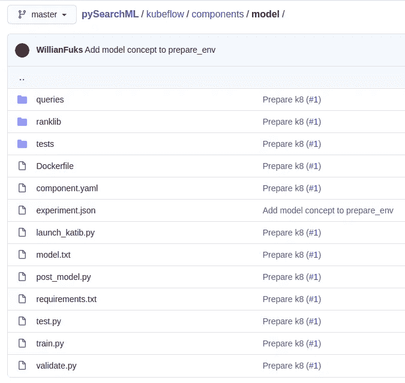*

*`[launch_katib.py](https://github.com/WillianFuks/pySearchML/blob/master/kubeflow/components/model/launch_katib.py)`负责从 Python 脚本启动 Katib。它接收输入参数，构建 YAML 定义，并使用 Kubernetes APIs 从脚本本身启动 Katib。*

*`[experiment.json](https://github.com/WillianFuks/pySearchML/blob/master/kubeflow/components/model/experiment.json)`作为实验定义的模板。下面是它的定义:*

*它本质上定义了并行运行多少个 pods，以及为每个试验运行哪个 Docker 图像及其输入命令。请注意，并行运行的 pods 总数以及最大试验次数在 pySearchML 中是硬编码的。最好的方法是从管道执行中接收这些参数，并相应地替换它们。*

*[launch_katib.py](https://github.com/WillianFuks/pySearchML/blob/master/kubeflow/components/model/launch_katib.py) 将读取该模板，构建最终的 YAML 定义并将其发送给 Kubernetes，后者将启动 katib 流程。*

*其中一个输入参数是 *ranker* 它是从 RankLib(如 lambdaMart、listNet 等)中选择的排序算法。每个排名器都有自己的一组参数，下面是 launch_katib.py 中实现的 LambdaMart 算法的示例:*

*Katib 将从上面定义的域中选择参数，并运行 [train.py](https://github.com/WillianFuks/pySearchML/blob/master/kubeflow/components/model/train.py) ，其中 RankLib 被有效地用于训练排名模型。Python 中实现的命令示例:*

*这个字符串被发送给一个`subprocess`调用(注意它需要 Java，因为 RankLib ),这个调用启动了训练过程。结果是一个新训练的排名模型，可以导出到 Elasticsearch。*

*当模型合适时，调用 [validate.py](https://github.com/WillianFuks/pySearchML/blob/master/kubeflow/components/model/validate.py) 来计算期望的等级。发生的步骤是:*

*   *该脚本遍历验证数据集中的每个 JSON。*
*   *每一行都包含搜索上下文，然后用于构建 Elasticsearch 查询。下面是模型`lambdamart0`使用的查询，我们稍后会用到它:*

*   *给定最近构建的查询，向 Elasticsearch 发送一个请求。*
*   *在搜索结果和购买的文档之间进行比较。*

*下面是负责构建 Elasticsearch 查询的代码:*

*注意，参数`rescore_query`触发了 Elasticsearch learn-to-rank 插件上的机器学习层。*

*最后，函数`compute_rank`将所有这些放在一起，如下所示:*

*Katib 实例化[sidecars pod](https://www.magalix.com/blog/the-sidecar-pattern)，它通过训练 pod 的 stdout 保持读取。当它识别字符串`Validation-rank=(...)`时，它使用该值作为优化过程的结果。*

*在该过程中使用了一个持久卷来保存由 Katib 训练的最佳模型的定义，该模型将被我们的下一个组件使用。*

## *5.后等级模型*

*最困难的部分已经完成了。现在所发生的是脚本简单地跟踪保存在文本文件中的最佳模型的定义，并将其上传到 Elasticsearch。*

*请注意，这种设计的主要优势之一是，该组件可以将模型导出到生产弹性搜索，而整个优化可以在分段复制引擎上进行。*

## *6.最终测试*

*最后，当最佳模型被导出到 Elasticsearch 时，该系统就拥有了最佳优化排序模型。在该步骤中，执行最终验证，以便不仅验证一切工作正常，而且提供关于系统是否遭受偏差变化的进一步信息。*

*差不多就是这样！现在让我们运行一些代码来看看整个框架的运行情况。*

# *4.动手操作部分*

*是时候在实践中实现整个架构了！完整的代码可从 pySearchML 资源库获得:*

*[](https://github.com/WillianFuks/pySearchML) [## WillianFuks/pySearchML

### 此时您不能执行该操作。您已使用另一个标签页或窗口登录。您已在另一个选项卡中注销，或者…

github.com](https://github.com/WillianFuks/pySearchML) 

在这一节中，我们将使用 GCP 来用真实数据运行代码。此外，请记住，运行这个实验会有相关的成本(几美分)。

对于那些刚到 GCP 的人，有一个持续一年的 300 美元的免费信用礼品；只需[登录](https://cloud.google.com/getting-started)并为本教程创建一个项目(例如 *pysearchml* )。您最终应该可以访问如下所示的仪表板:

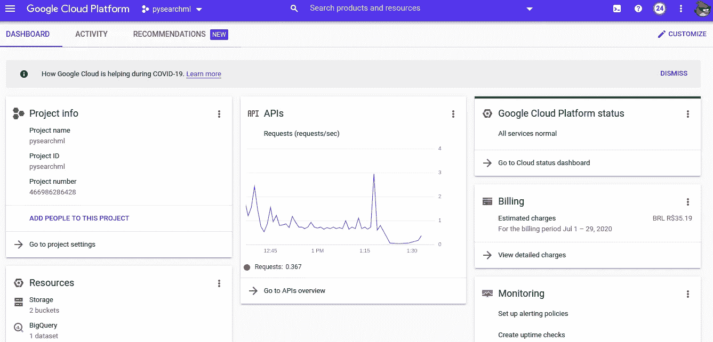

GCP 仪表板项目示例。图片作者。

通过命令行与 GCP 交互需要 gcloud 。安装它非常简单。初始设置完成后，确保您可以通过运行以下命令登录:

```
gcloud auth login
```

现在剩下的就很简单了。将 pySearchML 克隆到您的本地:

```
git clone pysearchml && cd pySearchML
```

[在您的平台中启用](https://console.developers.google.com/apis/library/container.googleapis.com) Kubernetes 引擎。之后，只需触发执行 [cloudbuild](https://cloud.google.com/cloud-build) ，它将负责创建整个所需的基础设施(这一步应该需要 5~10 分钟)。

下面是[构建](https://github.com/WillianFuks/pySearchML/tree/master/kubeflow/build)如何触发运行:

您可以在变量`SUBSTITUTIONS`中选择合适的值。注意`_VERSION`设置了要导出到 Kubeflow 的管道版本。设置好一切后，只需运行脚本:

```
./kubeflow/build/build.sh
```

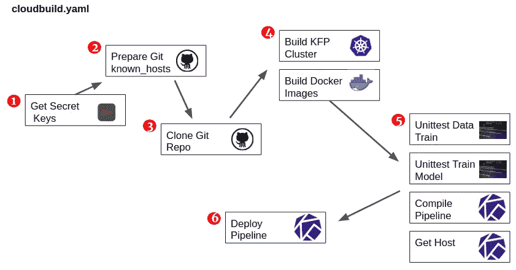

在 cloudbuild 上执行的步骤。图片作者。

1.  准备密钥以允许访问和授权进入 GCP 工具。
2.  在构建机器中准备已知主机。
3.  本地克隆 pySearchML。
4.  在步骤 4 中运行的文件 [create_k8.sh](https://github.com/WillianFuks/pySearchML/blob/master/bin/create_k8s.sh) 负责在 Google Kubernetes 引擎( [GKE](https://cloud.google.com/kubernetes-engine) )之上创建 Kubernetes 集群，以及部署 Elasticsearch、Kubeflow 和 Katib。与此同时，系统所需的所有 Docker 映像都被构建并部署到 Google Container Registry([GCR](https://cloud.google.com/container-registry))中，供以后在 Kubeflow 中使用。
5.  运行几个单元测试。这些对于确认系统是否按预期运行非常重要。此外，它并行编译 Kubeflow 管道。
6.  最后，将管道部署到集群。

完成后，如果你浏览到你的控制台并选择“Kubernetes 引擎”，你会看到它已经启动并运行:

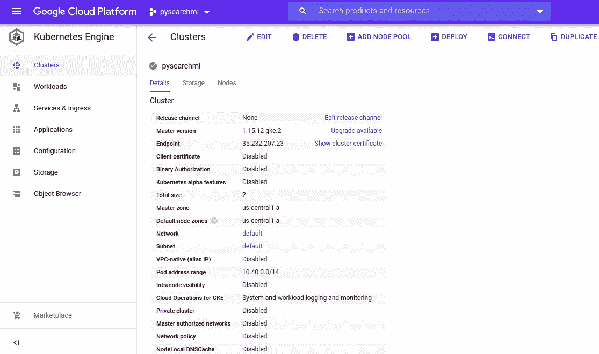

Kubernetes 集群部署到 GKE 准备运行。图片作者。

这是一个小集群，因为我们不会使用太多数据，这有助于进一步节省成本。

已经安装了 Kubeflow 和 Katib。要访问它，首先运行以下命令将您的 gcloud 连接到集群:

```
gcloud container clusters get-credentials pysearchml
```

之后，通过运行以下命令将处理 Kubeflow 的服务移植到本地:

```
kubectl port-forward -n kubeflow svc/ml-pipeline-ui 8080:80 1>/dev/null &
```

现在，如果您在端口 8080 上访问本地主机，您应该会看到以下内容:

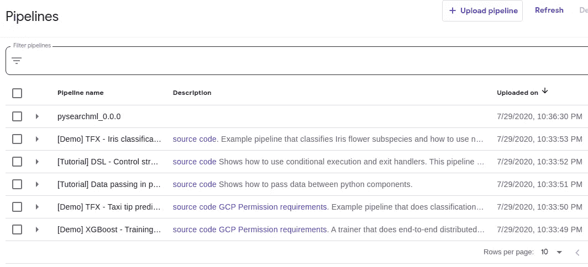

Kubeflow 仪表盘。图片作者。

并且流水线准备好执行。

这个实验使用公开的[谷歌分析样本](https://console.cloud.google.com/marketplace/product/obfuscated-ga360-data/obfuscated-ga360-data?filter=solution-type:dataset&filter=category:analytics&id=45f150ac-81d3-4796-9abf-d7a4f98eb4c6&project=pysearchml&folder=&organizationId=)数据集，它由在谷歌商店浏览的一小部分客户样本组成。它从`20160801`到`20170801`不等，包含每个用户搜索的内容以及他们如何与搜索结果交互。

选择`pysearchml_0.0.0`，然后选择“+创建运行”。您应该看到一个屏幕，其中显示了 Python 管道脚本中定义的所有可能的输入参数。选择合适的参数后，运行代码即可。

执行后，预期的结果如下:


完全执行 pySearchML 中定义的整个管道。图片作者。

Katib 组件的输出:

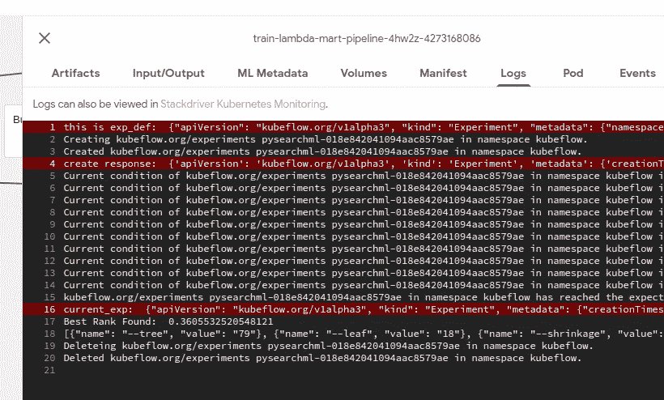

Katib 组件打印的输出示例。图片作者。

我们可以看到一个排名 *36.05%* 。然后，我们可以比较测试组件的结果:

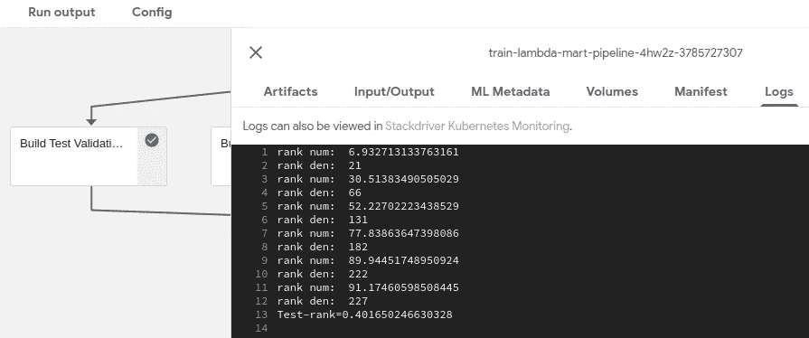

测试组件打印的输出示例。图片作者。

这里的排名是 40.16 *%* 比验证数据集差一点。这可能表明模型有点过度拟合；更多的数据或进一步的参数探索可能有助于缓解这个问题。

而且，差不多，你有它！Elasticsearch 现在有一个经过全面训练的新的机器学习层，可以根据客户的背景来改善结果。

如果您想浏览为每个步骤创建的文件，有一个可用的部署。在 pySearchML 文件夹中，只需运行:

```
kubectl apply -f kubeflow/disk-busybox.yaml
```

如果您运行`kubectl -n kubeflow get pods`，您会看到其中一个 pod 的名称类似于“nfs-busybox-(…)”。如果你进入它，你就可以访问这些文件:

```
kubectl -n kubeflow exec -it nfs-busybox-(...) sh
```

它们应该位于`/mnt/pysearchml`。

还有一个快速和肮脏的可视化的整个过程。只需运行:

```
kubectl port-forward service/front -n front 8088:8088 1>/dev/null &
```

在`localhost:8088`访问你的浏览器。您应该会看到这个(又快又难看)的界面:

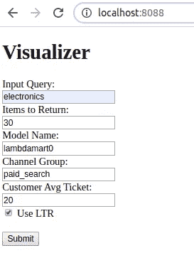

用于在新培训的 Elasticsearch 上运行查询的前端界面。图片作者。

结果示例:

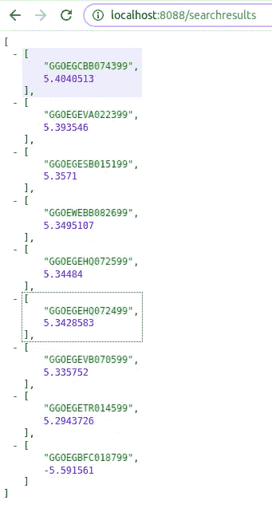

它不仅允许我们摆弄结果，还能让我们更好地了解优化管道是否在工作。

这几乎就是让一个完整的搜索引擎运行人工智能优化来处理任何商店的收入流量所需要的全部。

# 5.结论

现在，这是一个挑战！

构建 pySearchML 相当困难，我可以有把握地说这是我所面临的最残酷的挑战之一😅。无数的设计、架构、基础设施被考虑，但大多数都失败了。

在 Kubeflow 和 Katib 之上集成整个流程的实现只是在几个备选方案已经测试过之后才实现的。

这种设计的优点是最终代码变得非常简单和直接。它是完全模块化的，每个组件负责一个简单的任务，Kubeflow 协调整个执行过程。最重要的是，我们可以把主要精力放在代码开发上，让 Katib 去做寻找最佳参数的艰苦工作。

开发过程并不简单。必须吸取几个教训，包括来自 Kubernetes 的概念及其可用资源。尽管如此，这一切都是值得的。结果，一个完整的搜索引擎可以用几行代码从零开始构建，准备好处理真正的流量。

作为下一步，人们可能会考虑用某种深度学习算法来取代 RankLib，这种算法将进一步从数据中提取上下文。这样做的主要挑战之一是系统的响应时间可能会增加，成本也会增加(必须评估利弊)。

不管使用什么排序算法，体系结构在很大程度上保持不变。

希望这对于在这个领域工作的人来说是一个有用的帖子。现在是时候让我们休息一下，思考一下学到的教训，为下一次冒险做准备了:)。

至于这个帖子，它当然值得以任务完成[配乐](https://open.spotify.com/playlist/6DDVtTmNRo32PUGy3vsRCC)结束。

和往常一样，

*下次任务再见；)!**