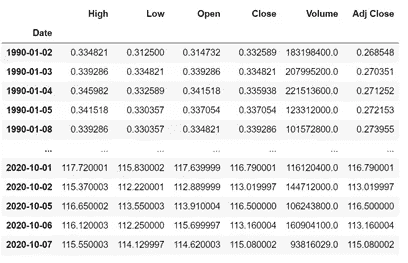
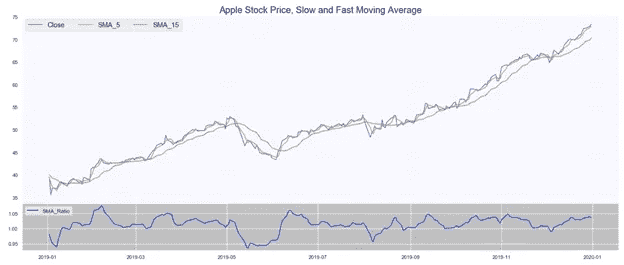
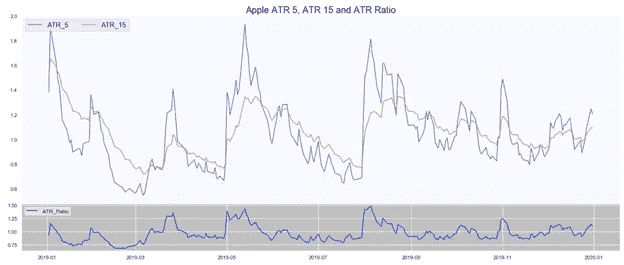
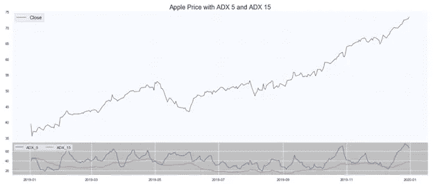
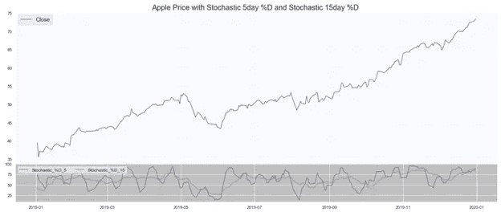
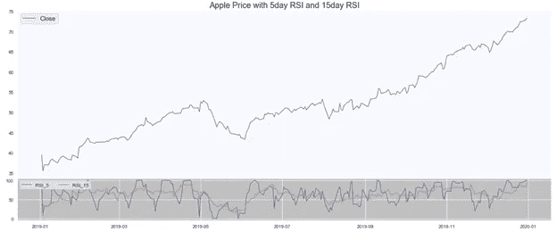
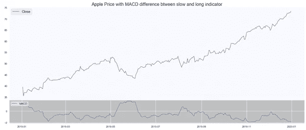
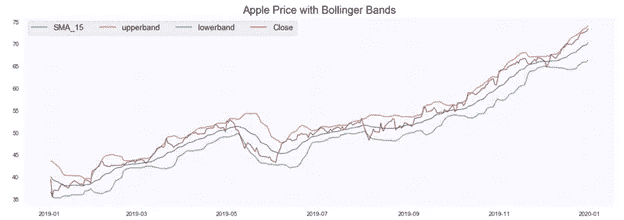
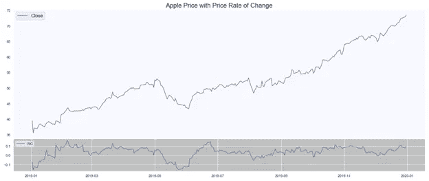

# 用 Python 为量化交易构建一套全面的技术指标

> 原文：<https://towardsdatascience.com/building-a-comprehensive-set-of-technical-indicators-in-python-for-quantitative-trading-8d98751b5fb?source=collection_archive---------4----------------------->

## **机器学习和统计算法的可定制综合指标**

***来自《走向数据科学》编辑的提示:*** *虽然我们允许独立作者根据我们的* [*规则和指导方针*](/questions-96667b06af5) *发表文章，但我们不认可每个作者的贡献。你不应该在没有寻求专业建议的情况下依赖一个作者的作品。详见我们的* [*读者术语*](/readers-terms-b5d780a700a4) *。*

**概述**

预测资产价格变动一直是一个广泛研究的领域，旨在开发能够“准确”捕捉这些资产价格变动的阿尔法生成交易策略。鉴于大多数资产价格的随机性质，我有保留地准确地说，根据定义，资产价格本质上是随机的。因此，这个想法集中于执行某种分析，以某种程度的信心捕捉这个随机元素的运动。在用于预测这种运动的众多方法中，技术指标已经存在了相当一段时间(据说从 19 世纪开始使用)，作为形成对潜在运动的看法的方法之一。

在算法交易普及之前，技术指标主要由交易者使用，他们会在交易屏幕上查看这些指标来做出买卖决定。尽管这仍然非常普遍，但鉴于机器学习和其他统计工具在短时间内分析这些数据的能力，以及计算机用几十年的数据进行回溯测试的计算能力，技术分析已经进入了自动化交易。

尽管本文并不支持或反对使用技术分析，但下面的技术指标可以用来进行各种回溯测试，并得出对其预测能力的看法。

**技术指标**

本文将重点介绍专业人士和学者广泛使用的技术指标，以及我认为对自动交易最有益的技术指标。指标列表包括:

1.简单移动平均线(快速和慢速)

2.平均真实范围

3.平均方向指数(快速和慢速)

4.随机振荡器(快速和慢速)

5.相对强度指数(快和慢)

6.移动平均收敛发散

7.布林线

8.变动率

**数据**

使用 pandas datareader for Yahoo finance 数据库，我提取了从 1990 年 1 月到今天的每日苹果和网飞股票数据。在本文中，大多数指标都是使用收盘而不是调整收盘创建的。这是留给读者选择价格。

由于技术指标在短期内效果最好，我将分别用 5 天和 15 天作为我的快速和慢速信号。然而，这可能会根据投资期限而改变。以下指示器可定制为任何持续时间，只需更改一个参数。

作者图片

**简单移动平均线**

简单移动平均线是最常见的技术指标之一。SMA 计算给定时间间隔内的平均价格，并用于确定股票的趋势。如上所述，我将创建一个慢速 SMA (SMA_15)和一个快速 SMA (SMA_5)。为了给机器学习算法提供已经设计的因子，还可以使用(SMA_15/SMA_5)或(SMA_15 - SMA_5)作为因子来捕捉这两个移动平均线之间的关系。

作者图片

**简单移动平均线成交量**

与价格的简单移动平均线相似，成交量的简单移动平均线提供了对股票显示的信号强度的洞察。

**怀尔德的平滑**

在讨论下一个指标之前，我想提一下其他指标常用的另一种平滑或移动平均线。虽然 SMA 相当常见，但它包含了过去对每个值给予同等权重的偏见。为了解决这个问题，Wells Wilder 引入了一个新版本的 smoothening，将更多的权重放在最近的事件上。我们将对以下大部分指标使用怀尔德平滑法，以下是通常可用于获得该平滑法的函数。

**平均真实范围(ATR)**

平均真实范围是一种常用的技术指标，用于衡量市场的波动性，以真实范围的移动平均值来衡量。公司的 ATR 越高，意味着股票的波动性越高。然而，ATR 主要用于确定何时退出或进入交易，而不是交易股票的方向。

如上所述，慢速 ATR 代表 5 天移动平均线，快速 ATR 代表 15 天移动平均线。

真实范围定义为以下最大值:

a.高低

b.abs(高-前收盘)

c.abs(低-先前收盘)

作者图片

**平均方向性指数(ADX)**

平均方向指数是由怀尔德开发的，用于评估股票价格趋势的强度。它的两个主要组成部分，+DI 和-DI 有助于确定趋势的方向。一般来说，ADX 为 25 或以上表明趋势强劲，ADX 小于 20 表明趋势疲软。ADX 的计算相当复杂，需要一定的步骤。

我也会计算 5 天和 15 天的 ADX。

作者图片

**随机振荡器**

随机振荡器是一种动量指标，旨在识别超买和超卖的证券，常用于技术分析。

作者图片

**相对强弱指数**

RSI 是最常见的动量指标之一，旨在量化价格变化和这种变化的速度。

作者图片

**移动平均线收敛发散(MACD)**

MACD 使用两条指数移动平均线，并根据它们的趋同或趋异进行趋势分析。尽管大多数常用的 MACD 慢速和快速信号分别基于 26 天和 12 天，我还是用了 15 天和 5 天来和其他指标保持一致。

作者图片

**布林线**

布林线捕捉股票的波动性，用于识别超买和超卖的股票。布林线由三个主要元素组成:简单的移动平均线，高于移动平均线 2 个标准差的上限和低于移动平均线 2 个标准差的下限。

作者图片

**变化率**

变化率是一个动量指标，它解释了相对于之前价格固定时期的价格动量。

作者图片

**结论**

这些技术指标在捕获的时间范围方面是高度可定制的，并且允许有助于创建更好模型的各种特征工程。这些值可以直接适合机器学习模型，也可以形成更大模型的因素子集。

还有许多其他指标可以考虑，即使不太重要。本文中列出的指标绝不是一个详尽的指标列表，而是我在模型中使用的指标列表。

在我的下一篇文章中，我将解释这些指标在机器学习模型中的实现，并更深入地创建和仔细回测该策略。

请在下面留下你的评论和建议。