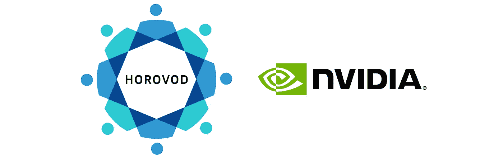

# 为 Horovod 营造康达环境

> 原文：<https://towardsdatascience.com/building-a-conda-environment-for-horovod-773bd036bf64?source=collection_archive---------35----------------------->

## 如何使用 Horovod 开始 DNNs 的分布式训练？



来源:[https://eng.uber.com/nvidia-horovod-deep-learning/](https://eng.uber.com/nvidia-horovod-deep-learning/)

# 什么是 Horovod？

[Horovod](https://github.com/davidrpugh/stochastic-expatriate-descent/blob/master/_posts) 是针对 [TensorFlow](https://www.tensorflow.org/) 、 [Keras](https://keras.io/) 、 [PyTorch](https://pytorch.org/) 、 [Apache MXNet](https://mxnet.incubator.apache.org/) 的开源分布式培训框架。Horovod 最初由优步开发，供内部使用，几年前开源，现在是官方的 Linux 基金会人工智能项目。

在这篇文章中，我描述了我如何为我的深度学习项目构建 Conda 环境，当时我正在使用 Horovod 来实现跨多个 GPU 的分布式训练(在同一节点上或分布在多个节点上)。如果你喜欢我的方法，那么你可以利用 [GitHub](https://github.com/kaust-vislab/horovod-gpu-data-science-project) 上的模板库来开始你的下一个 Horovod 数据科学项目！

# 安装 NVIDIA CUDA 工具包

你需要做的第一件事是在你的工作站上安装 NVIDIA CUDA Toolkit 的[合适版本](https://developer.nvidia.com/cuda-toolkit-archive)。我使用的是[NVIDIA CUDA Toolkit 10.1](https://developer.nvidia.com/cuda-10.1-download-archive-update2)[(文档)](https://docs.nvidia.com/cuda/archive/10.1/)，它可以与 Horovod 目前支持的所有三个深度学习框架一起工作。

## 为什么不用`cudatoolkit`包呢？

通常，当使用 Conda 安装 PyTorch、TensorFlow 或支持 GPU 的 Apache MXNet 时，您只需将适当版本的`[cudatoolkit](https://anaconda.org/anaconda/cudatoolkit)`包添加到您的`environment.yml`文件中。

不幸的是，至少在目前，`[conda-forge](https://conda-forge.org/)`提供的`cudatoolkit`包不包括 [NVCC](https://docs.nvidia.com/cuda/archive/10.1/cuda-compiler-driver-nvcc/index.html) ，如果你需要编译扩展，它是将 Horovod 与 PyTorch、TensorFlow 或 MXNet 一起使用所必需的。

## `cudatoolkit-dev`套餐怎么样？

虽然有来自`conda-forge`的包含 NVCC 的`[cudatoolkit-dev](https://anaconda.org/conda-forge/cudatoolkit-dev)`软件包，但我很难让这些软件包持续正确地安装。一些可用的构建需要手动干预来接受许可协议，这使得这些构建不适合安装在远程系统上(这是关键的功能)。其他版本似乎可以在 Ubuntu 上运行，但不能在其他版本的 Linux 上运行。

我鼓励你尝试将`cudatoolkit-dev`添加到你的`environment.yml`文件中，看看会发生什么！这个包[维护得很好](https://github.com/conda-forge/cudatoolkit-dev-feedstock)，所以也许将来它会变得更加稳定。

## 使用`nvcc_linux-64`元包！

获得 NVCC 并仍然使用 Conda 管理所有其他依赖项的最可靠方法是在您的系统上安装 NVIDIA CUDA Toolkit，然后安装来自`conda-forge`的元包`[nvcc_linux-64](https://anaconda.org/nvidia/nvcc_linux-64)`，该元包配置您的 Conda 环境，以使用安装在系统上的 NVCC 以及安装在 Conda 环境中的其他 CUDA Toolkit 组件。关于这个包的更多细节，我建议通读 GitHub 上的问题主题。

# `environment.yml`文件

我更喜欢在 Conda `environment.yml`文件中指定尽可能多的依赖项，并且只在`requirements.txt`中指定通过 Conda 通道不可用的依赖项。查看[官方 Horovod 安装指南](https://horovod.readthedocs.io/en/latest/install_include.html)了解所需依赖项的详细信息。

## 通道优先级

我使用推荐的通道优先级。注意`conda-forge`比`defaults`有优先权。

```
name: nullchannels:
  - pytorch
  - conda-forge
  - defaults
```

## 属国

关于依赖关系，有一些事情值得注意。

1.  尽管我已经手动安装了 NVIDIA CUDA 工具包，但我仍然使用 Conda 来管理其他所需的 CUDA 组件，如`cudnn`和`nccl`(以及可选的`cupti`)。
2.  我使用了两个元包`cxx-compiler`和`nvcc_linux-64`，以确保安装了合适的 C 和 C++编译器，并且最终的 Conda 环境能够识别手动安装的 CUDA 工具包。
3.  Horovod 需要一些控制器库来协调各种 Horovod 进程之间的工作。通常这将是一些 MPI 实现，如 [OpenMPI](https://www.open-mpi.org/) 。然而，我没有直接指定`openmpi`包，而是选择了`[mpi4py](https://mpi4py.readthedocs.io/en/stable/)` Conda 包，它提供了一个支持 cuda 的 OpenMPI 构建(假设您的硬件支持它)。
4.  Horovod 还支持 Gloo 集体通信库，可以用来代替 MPI。我加入`cmake`是为了确保 Gloo 的 Horovod 扩展已经完成。

以下是核心必需依赖项。完整的`environment.yml`文件可以在 [GitHub](https://github.com/kaust-vislab/horovod-gpu-data-science-project/blob/master/environment.yml) 上获得。

```
dependencies:
  - bokeh=1.4
  - cmake=3.16 # insures that Gloo library extensions will be built
  - cudnn=7.6
  - cupti=10.1
  - cxx-compiler=1.0 # insures C and C++ compilers are available
  - jupyterlab=1.2
  - mpi4py=3.0 # installs cuda-aware openmpi
  - nccl=2.5
  - nodejs=13
  - nvcc_linux-64=10.1 # configures environment to be "cuda-aware"
  - pip=20.0
  - pip:
    - mxnet-cu101mkl==1.6.* # MXNET is installed prior to horovod
    - -r file:requirements.txt
  - python=3.7
  - pytorch=1.4
  - tensorboard=2.1
  - tensorflow-gpu=2.1
  - torchvision=0.5
```

## `requirements.txt`文件

在`requirements.txt`文件中列出了所有的`pip`依赖项，包括 Horovod 本身，以便安装。除了 Horovod，我通常还会使用`pip`来安装 JupyterLab 扩展，以通过`[jupyterlab-nvdashboard](https://github.com/rapidsai/jupyterlab-nvdashboard)`实现 GPU 和 CPU 资源监控，并通过`[jupyter-tensorboard](https://github.com/lspvic/jupyter_tensorboard)`实现 Tensorboard 支持。

```
horovod==0.19.*
jupyterlab-nvdashboard==0.2.*
jupyter-tensorboard==0.2.*# make sure horovod is re-compiled if environment is re-built
--no-binary=horovod
```

注意文件末尾的`--no-binary`选项的使用。包含此选项可确保每当重建 Conda 环境时，Horovod 都会重建。

完整的`requirements.txt`文件可在 [GitHub](https://github.com/kaust-vislab/horovod-gpu-data-science-project/blob/master/requirements.txt) 上获得。

# 建筑康达环境

在添加了应该通过`conda`下载到`environment.yml`文件的任何必要的依赖项和应该通过`pip`下载到`requirements.txt`文件的任何依赖项之后，您可以通过运行以下命令在项目目录的子目录`env`中创建 Conda 环境。

```
export ENV_PREFIX=$PWD/env
export HOROVOD_CUDA_HOME=$CUDA_HOME
export HOROVOD_NCCL_HOME=$ENV_PREFIX
export HOROVOD_GPU_OPERATIONS=NCCL
conda env create --prefix $ENV_PREFIX --file environment.yml --force
```

默认情况下，Horovod 会尝试为所有检测到的框架构建扩展。有关在构建 Horovod 之前可以设置的其他环境变量的详细信息，请参见 Horovod 文档中关于[环境变量](https://horovod.readthedocs.io/en/latest/install_include.html#environment-variables)的内容。

创建新环境后，您可以使用以下命令激活该环境。

```
conda activate $ENV_PREFIX
```

# `postBuild`文件

如果您希望使用包含在`environment.yml`和`requirements.txt`文件中的任何 JupyterLab 扩展，那么您可能需要重新构建 JupyterLab 应用程序。

为了简单起见，我通常在一个`postBuild`脚本中包含重新构建 JupyterLab 的指令。下面是这个脚本在我的 Horovod 环境中的样子。

```
jupyter labextension install --no-build @pyviz/jupyterlab_pyviz
jupyter labextension install --no-build jupyterlab-nvdashboard 
jupyter labextension install --no-build jupyterlab_tensorboard
jupyter serverextension enable jupyterlab_sql --py --sys-prefix
jupyter lab build
```

使用以下命令生成`postBuild`脚本。

```
conda activate $ENV_PREFIX # optional if environment already active
. postBuild
```

# 用 Bash 脚本将这一切包装起来

我通常将这些命令打包成一个 shell 脚本`create-conda-env.sh`。运行 shell 脚本将设置 Horovod 构建变量，创建 Conda 环境，激活 Conda 环境，并构建带有任何附加扩展的 JupyterLab。

```
#!/bin/bash --loginset -eexport ENV_PREFIX=$PWD/env
export HOROVOD_CUDA_HOME=$CUDA_HOME
export HOROVOD_NCCL_HOME=$ENV_PREFIX
export HOROVOD_GPU_OPERATIONS=NCCLconda env create --prefix $ENV_PREFIX --file environment.yml --force
conda activate $ENV_PREFIX
. postBuild
```

我通常将脚本放在我的项目根目录下的一个`bin`目录中。该脚本应该从项目根目录运行，如下所示。

```
./bin/create-conda-env.sh # assumes that $CUDA_HOME is set properly
```

# 验证 Conda 环境

构建 Conda 环境后，您可以使用以下命令检查 Horovod 是否已构建为支持深度学习框架 TensorFlow、PyTorch、Apache MXNet 以及控制器 MPI 和 Gloo。

```
conda activate $ENV_PREFIX # optional if environment already active
horovodrun --check-build
```

您应该会看到类似下面的输出。

```
Horovod v0.19.4:Available Frameworks:
    [X] TensorFlow
    [X] PyTorch
    [X] MXNetAvailable Controllers:
    [X] MPI
    [X] GlooAvailable Tensor Operations:
    [X] NCCL
    [ ] DDL
    [ ] CCL
    [X] MPI
    [X] Gloo
```

# 列出 Conda 环境的内容

要查看安装到环境中的软件包的完整列表，请运行以下命令。

```
conda activate $ENV_PREFIX # optional if environment already active
conda list
```

# 更新 Conda 环境

如果您在创建环境之后向`environment.yml`文件或`requirements.txt`文件添加(从其中移除)依赖项，那么您可以使用以下命令重新创建环境。

```
conda env create --prefix $ENV_PREFIX --file environment.yml --force
```

然而，每当我添加新的依赖项时，我更喜欢重新运行 Bash 脚本，这将重新构建 Conda 环境和 JupyterLab。

```
./bin/create-conda-env.sh
```

# 摘要

为我的深度学习项目找到一个可重复的构建 Horovod 扩展的过程是很棘手的。我的解决方案的关键是使用来自`conda-forge`的元包，以确保安装了适当的编译器，并且最终的 Conda 环境知道系统安装了 NVIDIA CUDA Toolkit。第二个关键是使用`requirements.txt`文件中的`--no-binary`标志来确保每当 Conda 环境被重新构建时 Horovod 也被重新构建。

如果你喜欢我的方法，那么你可以利用 [GitHub](https://github.com/kaust-vislab/horovod-gpu-data-science-project) 上的模板库来开始你的下一个 Horovod 数据科学项目！