# 构建基于内容的图书推荐引擎

> 原文：<https://towardsdatascience.com/building-a-content-based-book-recommendation-engine-9fd4d57a4da?source=collection_archive---------14----------------------->


来源:图片由 [Pixabay](https://pixabay.com/?utm_source=link-attribution&utm_medium=referral&utm_campaign=image&utm_content=2507902) 的 [TuendeBede](https://pixabay.com/users/TuendeBede-3187213/?utm_source=link-attribution&utm_medium=referral&utm_campaign=image&utm_content=2507902) 提供

## 根据书籍描述和名称推荐相似的书籍

如果我们计划购买任何新产品，我们通常会询问我们的朋友，研究产品的特点，将该产品与类似产品进行比较，阅读互联网上的产品评论，然后我们做出决定。如果所有这些过程都被自动处理并高效地推荐产品，会有多方便？推荐引擎或推荐系统是这个问题的答案。

基于内容的过滤和基于协作的过滤是两种流行的推荐系统。在这篇博客中，我们将看到如何使用 Goodreads.com 数据构建一个简单的基于内容的推荐系统。

## 基于内容的推荐系统

基于内容的推荐系统通过获取项目的相似性来向用户推荐项目。该推荐系统基于描述或特征来推荐产品或项目。它根据产品的描述来识别产品之间的相似性。它还会考虑用户以前的历史，以便推荐类似的产品。

例如:如果用户喜欢西德尼·谢尔顿的小说“告诉我你的梦”，那么推荐系统推荐用户阅读西德尼·谢尔顿的其他小说，或者推荐体裁为“非小说”的小说。(西德尼·谢尔顿小说属于非小说体裁)。

正如我上面提到的，我们使用 goodreads.com 的数据，没有用户阅读历史。因此，我们使用了一个简单的基于内容的推荐系统。我们要用一个书名和图书描述来搭建两个推荐系统。

我们需要找到与给定书籍相似的书籍，然后向用户推荐这些相似的书籍。如何发现给定的书是相似还是不相似？使用相似性度量来找到相同的结果。

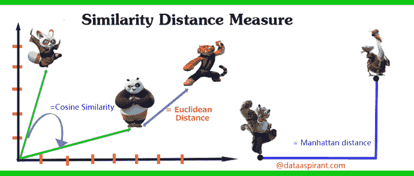

来源: [dataaspirant](https://dataaspirant.com/2015/04/11/five-most-popular-similarity-measures-implementation-in-python/)

有不同的相似性度量可用。余弦相似度被用于我们的推荐系统来推荐书籍。有关相似性度量的更多详细信息，请参考此[文章](https://dataaspirant.com/2015/04/11/five-most-popular-similarity-measures-implementation-in-python/)。

## 数据

我从 goodreads.com 那里搜集了有关商业、非小说和烹饪类型的书籍细节。

```
# Importing necessary libraries
import pandas as pd
import numpy as np
import pandas as pd
import numpy as np
from nltk.corpus import stopwords
from sklearn.metrics.pairwise import linear_kernel
from sklearn.feature_extraction.text import CountVectorizer
from sklearn.feature_extraction.text import TfidfVectorizer
from nltk.tokenize import RegexpTokenizer
import re
import string
import random
from PIL import Image
import requests
from io import BytesIO
import matplotlib.pyplot as plt
%matplotlib inline# Reading the file
df = pd.read_csv("goodread.csv")#Reading the first five records
df.head()#Checking the shape of the file
df.shape()
```

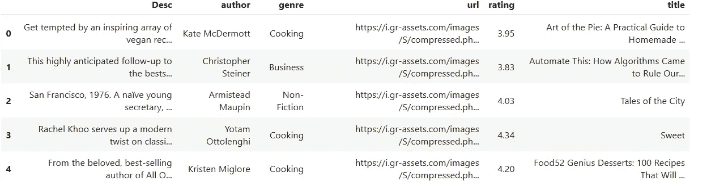

我们的数据集中总共有 3592 本书的详细信息。它有六列

书名->书名

评分->用户给出的图书评分

体裁->类别(书的类型)。对于这个问题，我只选择了三种类型，如商业、非小说和烹饪

作者->图书作者

Desc ->图书描述

URL ->图书封面图片链接

# 探索性数据分析

## **流派分布**

```
# Genre distribution
df['genre'].value_counts().plot(x = 'genre', y ='count', kind = 'bar', figsize = (10,5)  )
```

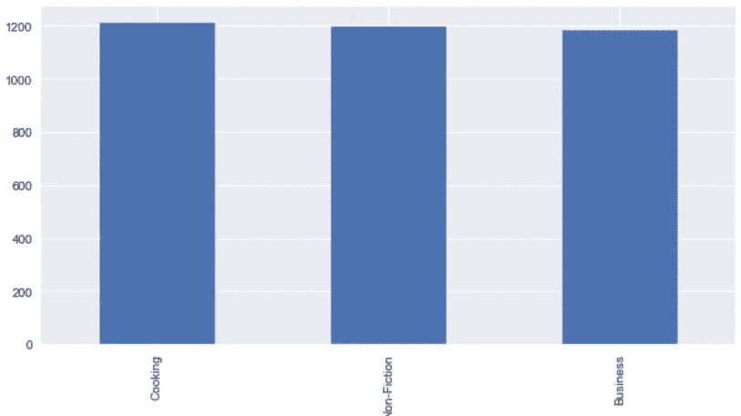

随机打印书名和描述

```
# Printing the book title and description randomly
df['title'] [2464]
df['Desc'][2464]
```

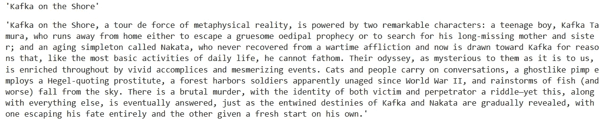

```
# Printing the book title and description randomly
df['title'] [367]
df['Desc'][367]
```

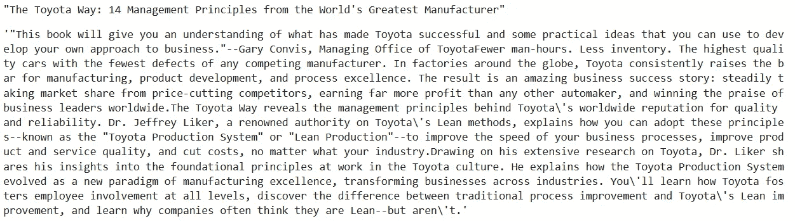

## 图书描述—字数分布

```
# Calculating the word count for book description
df['word_count'] = df2['Desc'].apply(lambda x: len(str(x).split()))# Plotting the word count
df['word_count'].plot(
    kind='hist',
    bins = 50,
    figsize = (12,8),title='Word Count Distribution for book descriptions')
```

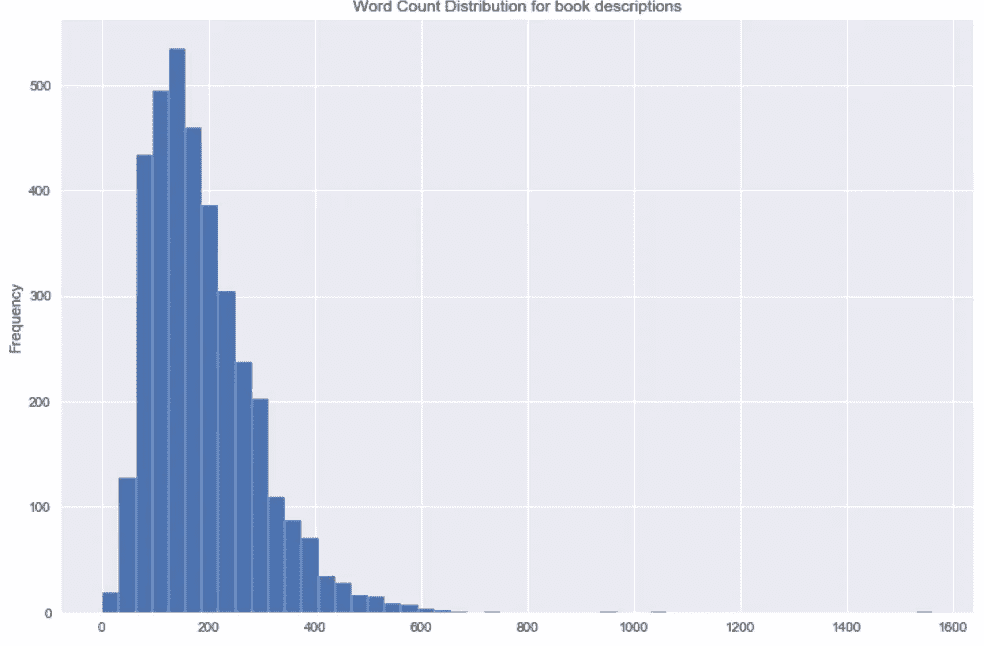

我们没有更长的书籍描述。很明显，好的读物只是提供了一个简短的描述。

## 图书说明中词类标签的分布

```
from textblob import TextBlob
blob = TextBlob(str(df['Desc']))
pos_df = pd.DataFrame(blob.tags, columns = ['word' , 'pos'])
pos_df = pos_df.pos.value_counts()[:20]
pos_df.plot(kind = 'bar', figsize=(10, 8), title = "Top 20 Part-of-speech tagging for comments")
```

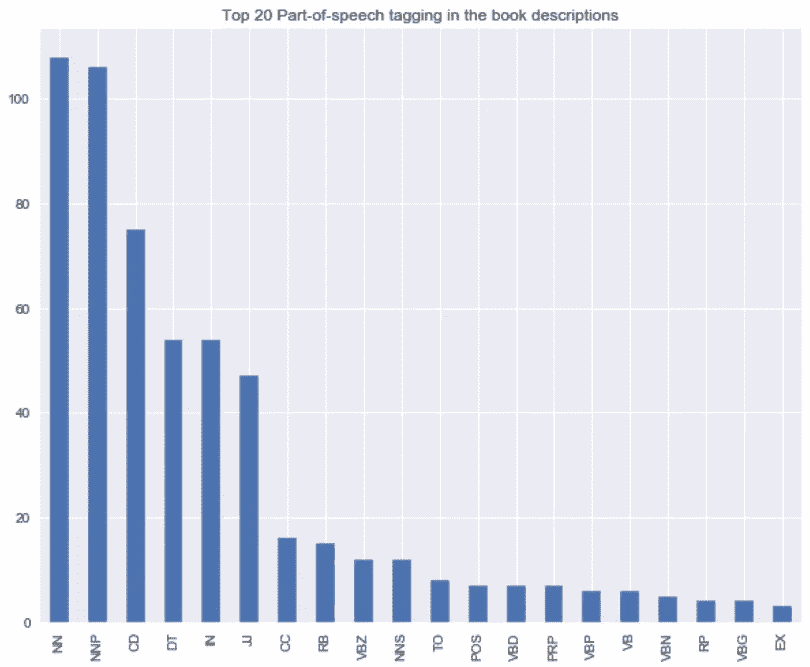

## 图书描述的二元模型分布

```
#Converting text descriptions into vectors using TF-IDF using Bigram
tf = TfidfVectorizer(ngram_range=(2, 2), stop_words='english', lowercase = False)
tfidf_matrix = tf.fit_transform(df['Desc'])
total_words = tfidf_matrix.sum(axis=0) 
#Finding the word frequency
freq = [(word, total_words[0, idx]) for word, idx in tf.vocabulary_.items()]
freq =sorted(freq, key = lambda x: x[1], reverse=True)
#converting into dataframe 
bigram = pd.DataFrame(freq)
bigram.rename(columns = {0:'bigram', 1: 'count'}, inplace = True) 
#Taking first 20 records
bigram = bigram.head(20)#Plotting the bigram distribution
bigram.plot(x ='bigram', y='count', kind = 'bar', title = "Bigram disribution for the top 20 words in the book description", figsize = (15,7), )
```

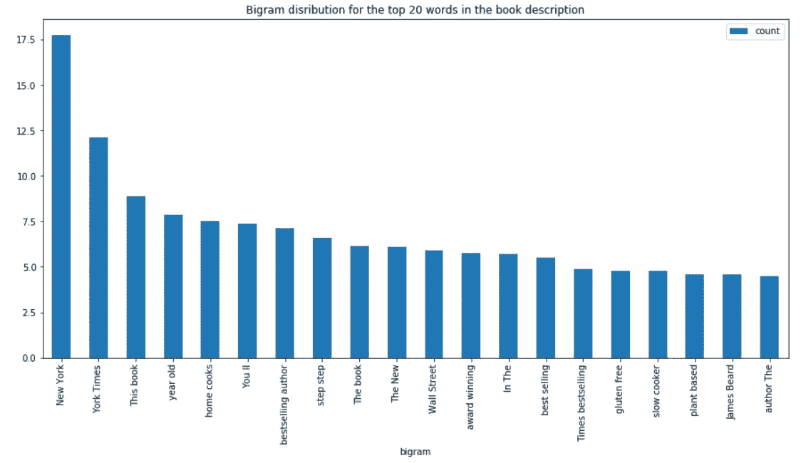

## 图书描述的三元模型分布

```
#Converting text descriptions into vectors using TF-IDF using Trigram
tf = TfidfVectorizer(ngram_range=(3, 3), stop_words='english', lowercase = False)
tfidf_matrix = tf.fit_transform(df['Desc'])
total_words = tfidf_matrix.sum(axis=0) 
#Finding the word frequency
freq = [(word, total_words[0, idx]) for word, idx in tf.vocabulary_.items()]
freq =sorted(freq, key = lambda x: x[1], reverse=True)#converting into dataframe 
trigram = pd.DataFrame(freq)
trigram.rename(columns = {0:'trigram', 1: 'count'}, inplace = True) 
#Taking first 20 records
trigram = trigram.head(20)#Plotting the trigramn distribution
trigram.plot(x ='trigram', y='count', kind = 'bar', title = "Bigram disribution for the top 20 words in the book description", figsize = (15,7), )
```

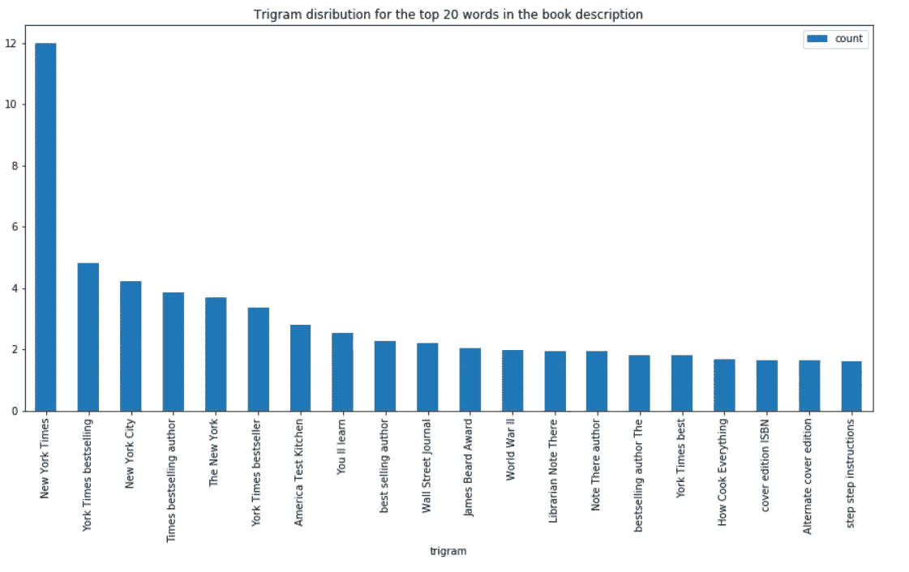

# 文本预处理

清理图书描述。

```
# Function for removing NonAscii characters
def _removeNonAscii(s):
    return "".join(i for i in s if  ord(i)<128)# Function for converting into lower case
def make_lower_case(text):
    return text.lower()# Function for removing stop words
def remove_stop_words(text):
    text = text.split()
    stops = set(stopwords.words("english"))
    text = [w for w in text if not w in stops]
    text = " ".join(text)
    return text# Function for removing punctuation
def remove_punctuation(text):
    tokenizer = RegexpTokenizer(r'\w+')
    text = tokenizer.tokenize(text)
    text = " ".join(text)
    return text
#Function for removing the html tags
def remove_html(text):
    html_pattern = re.compile('<.*?>')
    return html_pattern.sub(r'', text)# Applying all the functions in description and storing as a cleaned_desc
df['cleaned_desc'] = df['Desc'].apply(_removeNonAscii)
df['cleaned_desc'] = df.cleaned_desc.apply(func = make_lower_case)
df['cleaned_desc'] = df.cleaned_desc.apply(func = remove_stop_words)
df['cleaned_desc'] = df.cleaned_desc.apply(func=remove_punctuation)
df['cleaned_desc'] = df.cleaned_desc.apply(func=remove_html)
```

## 推荐引擎

我们将使用书名和描述来构建两个推荐引擎。

1.  使用 TF-IDF 和 bigram 将每本书的标题和描述转换成向量。关于 [TF-IDF](https://en.wikipedia.org/wiki/Tf%E2%80%93idf) 的更多详情
2.  我们正在构建两个推荐引擎，一个带有书名，另一个带有图书描述。该模型基于标题和描述推荐类似的书。
3.  使用余弦相似度计算所有书籍之间的相似度。
4.  定义一个函数，将书名和流派作为输入，并根据书名和描述返回前五本相似的推荐书籍。

# 基于书名的推荐

```
# Function for recommending books based on Book title. It takes book title and genre as an input.def recommend(title, genre):

    # Matching the genre with the dataset and reset the index
    data = df2.loc[df2['genre'] == genre]  
    data.reset_index(level = 0, inplace = True) 

    # Convert the index into series
    indices = pd.Series(data.index, index = data['title'])

   ** #Converting the book title into vectors and used bigram**
    tf = TfidfVectorizer(analyzer='word', ngram_range=(2, 2), min_df = 1, stop_words='english')
    tfidf_matrix = tf.fit_transform(data['title'])

    # Calculating the similarity measures based on Cosine Similarity
    sg = cosine_similarity(tfidf_matrix, tfidf_matrix)

    # Get the index corresponding to original_title

    idx = indices[title]# Get the pairwsie similarity scores 
    sig = list(enumerate(sg[idx]))# Sort the books
    sig = sorted(sig, key=lambda x: x[1], reverse=True)# Scores of the 5 most similar books 
    sig = sig[1:6]# Book indicies
    movie_indices = [i[0] for i in sig]

    # Top 5 book recommendation
    rec = data[['title', 'url']].iloc[movie_indices]

    # It reads the top 5 recommend book url and print the images

    for i in rec['url']:
        response = requests.get(i)
        img = Image.open(BytesIO(response.content))
        plt.figure()
        print(plt.imshow(img))
```

让我们推荐《史蒂夫·乔布斯》这本书和体裁《商业》

```
recommend("Steve Jobs", "Business")
```

## 输出

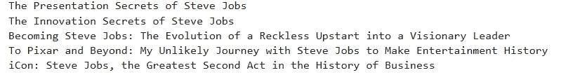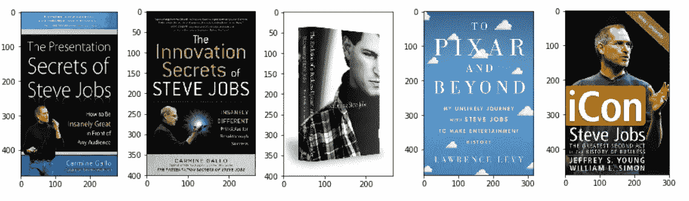

我们已经给了史蒂夫·乔布斯的书作为输入，并且该模型基于书名中存在的相似性来推荐其他史蒂夫·乔布斯的书。

# 基于图书描述的推荐

我们通过将书籍描述转换成向量来使用上述相同的函数。

```
# Function for recommending books based on Book title. It takes book title and genre as an input.def recommend(title, genre):

    global rec
    # Matching the genre with the dataset and reset the index
    data = df2.loc[df2['genre'] == genre]  
    data.reset_index(level = 0, inplace = True) 

    # Convert the index into series
    indices = pd.Series(data.index, index = data['title'])

    **#Converting the book description into vectors and used bigram**
    tf = TfidfVectorizer(analyzer='word', ngram_range=(2, 2), min_df = 1, stop_words='english')
    tfidf_matrix = tf.fit_transform(data['cleaned_desc'])

    # Calculating the similarity measures based on Cosine Similarity
    sg = cosine_similarity(tfidf_matrix, tfidf_matrix)

    # Get the index corresponding to original_title

    idx = indices[title]# Get the pairwsie similarity scores 
    sig = list(enumerate(sg[idx]))# Sort the books
    sig = sorted(sig, key=lambda x: x[1], reverse=True)# Scores of the 5 most similar books 
    sig = sig[1:6]# Book indicies
    movie_indices = [i[0] for i in sig]

    # Top 5 book recommendation
    rec = data[['title', 'url']].iloc[movie_indices]

    # It reads the top 5 recommend book url and print the images

    for i in rec['url']:
        response = requests.get(i)
        img = Image.open(BytesIO(response.content))
        plt.figure()
        print(plt.imshow(img))
```

来推荐一下《哈利波特与阿兹卡班的囚徒》这本书和体裁《非小说》

```
recommend("Harry Potter and the Prisoner of Azkaban", "Non-Fiction")
```

## 输出

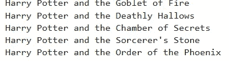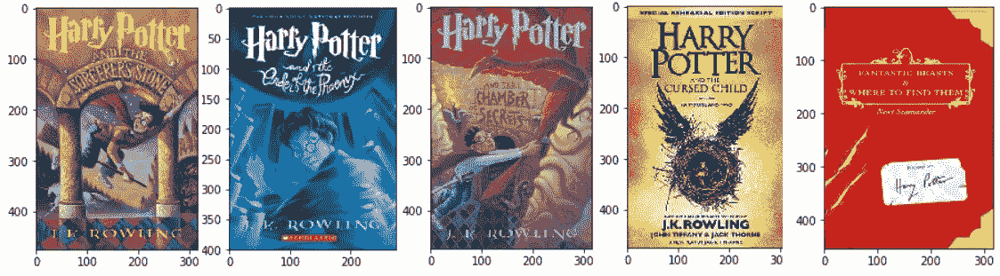

我们提供了“哈利·波特与阿兹卡班的囚徒”和“非小说”作为输入。该模型推荐了与我们的输入相似的其他五本哈利波特书籍。

再推荐一个吧

```
recommend("Norwegian Wood", "Non-Fiction")
```

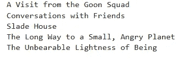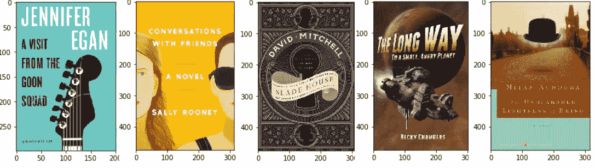

以上模型根据描述推荐五本类似《挪威的森林》的书。

这只是一个简单的基层推荐系统。真实世界的推荐系统更加强大和先进。我们可以通过添加其他元数据(如作者和流派)来进一步改进上述内容。

此外，我们可以使用 word2Vec 实现基于文本的语义推荐。我用过 Word2Vec，建过推荐引擎。请在这里查看。

你可以在我的 [GitHub repo](https://github.com/sdhilip200/Content-Based-Recommendation---Good-Reads-data) 里找到数据。

感谢阅读。如果你有什么要补充的，欢迎随时留言评论！