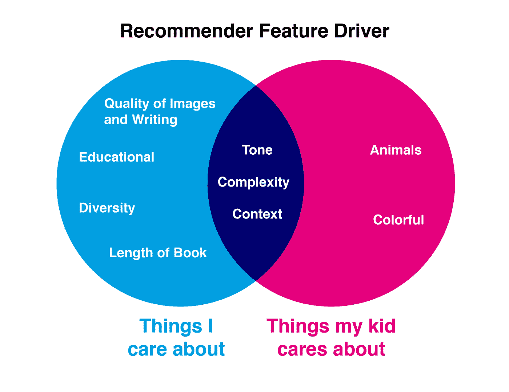
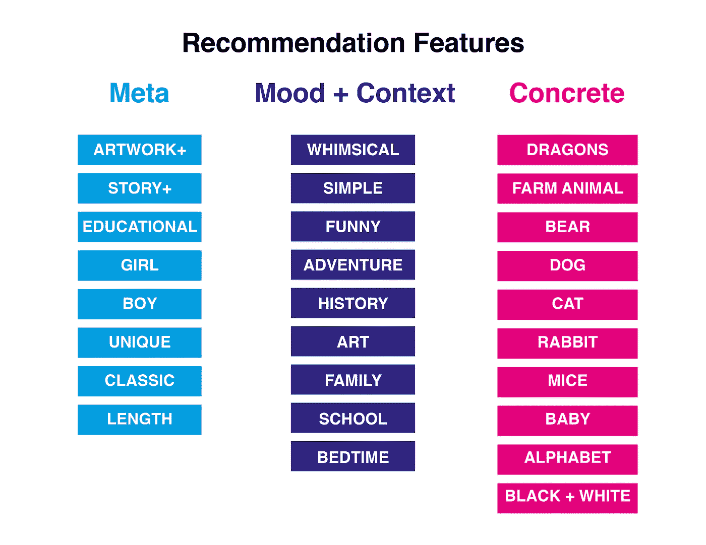
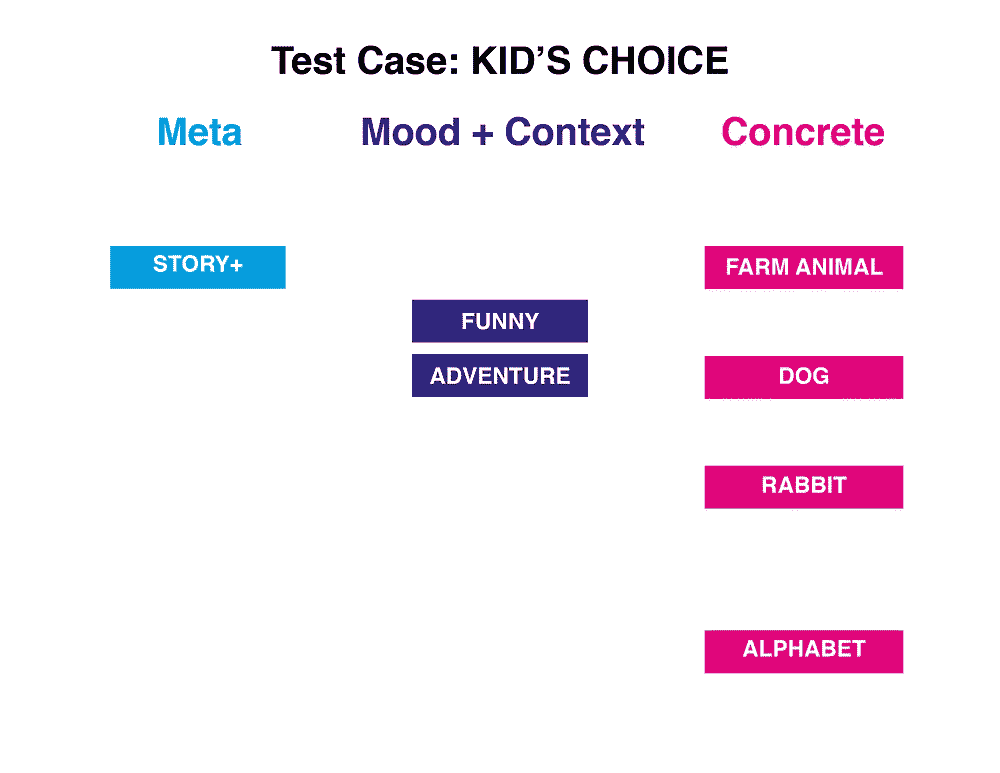
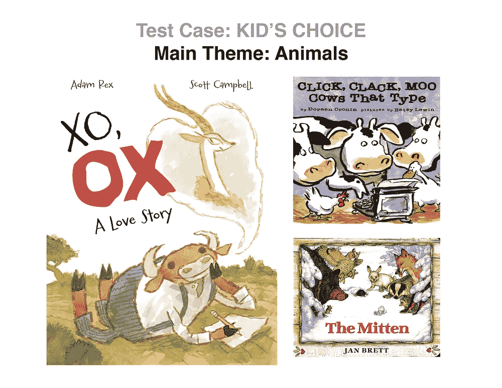
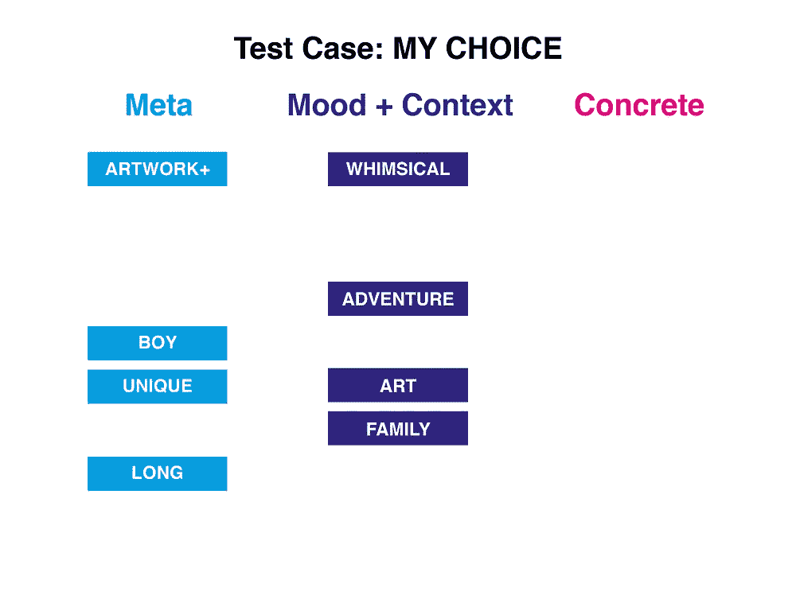
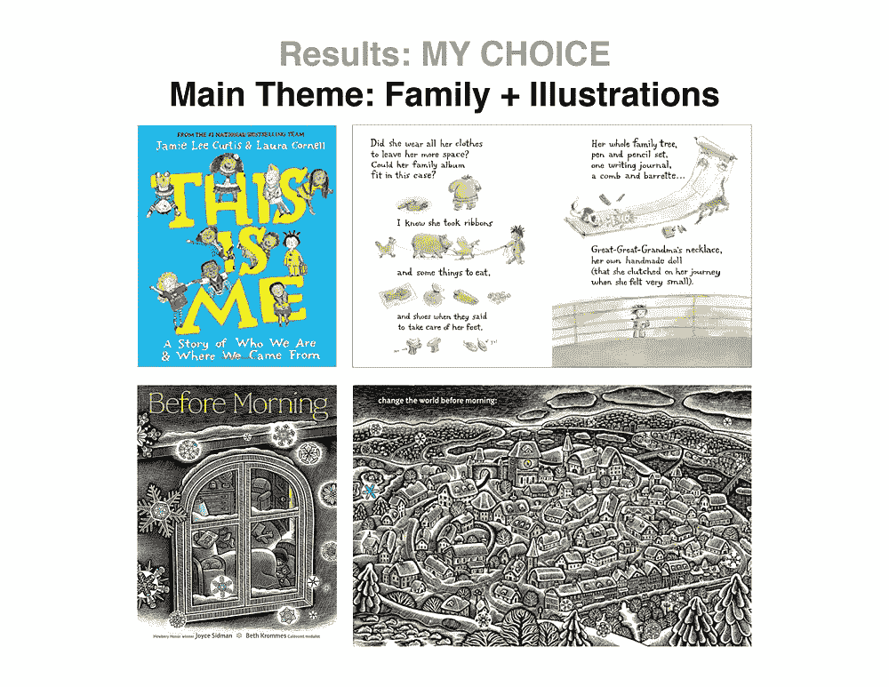
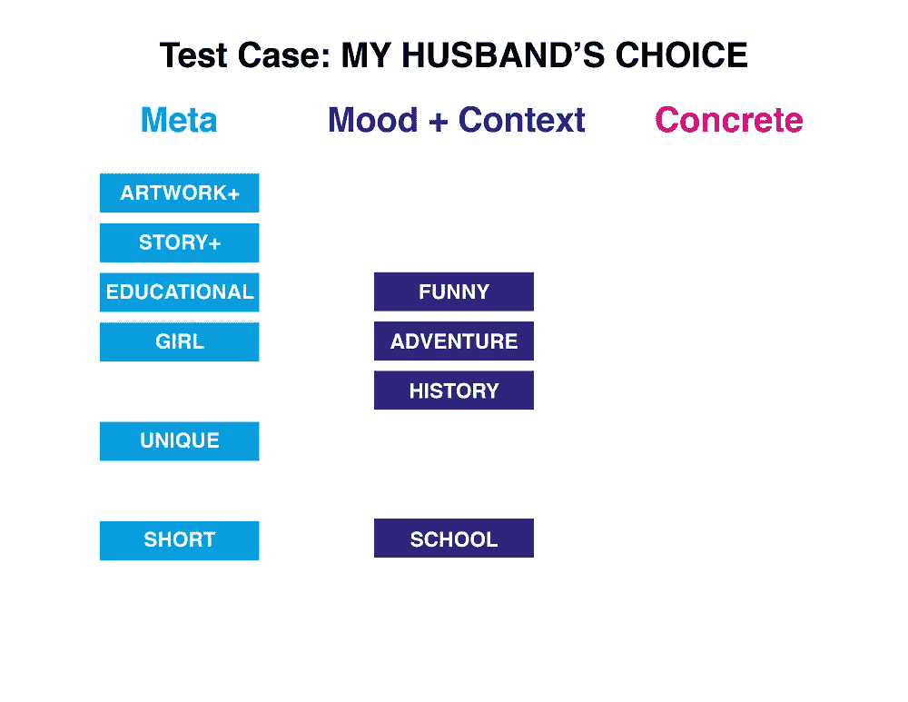
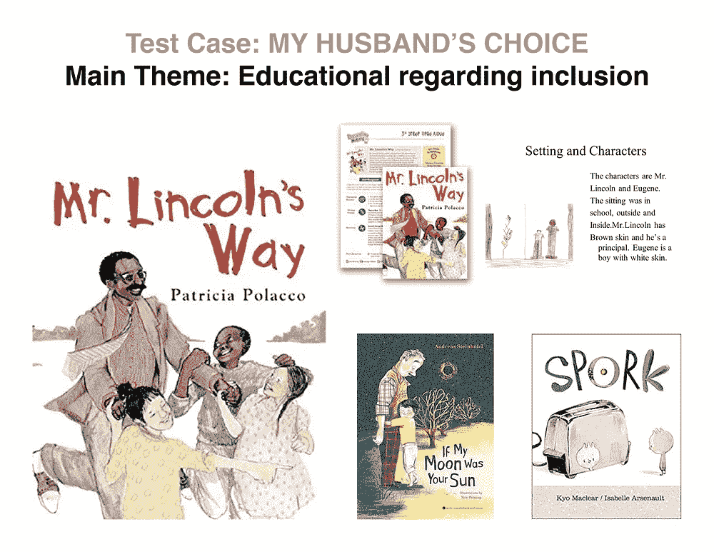

# 故事时代:建立一个面向父母的基于内容的儿童书籍推荐系统

> 原文：<https://towardsdatascience.com/building-a-content-based-childrens-book-recommender-for-parents-680e20013e90?source=collection_archive---------32----------------------->

## 针对睡前故事崩溃的 NLP 解决方案

> 自然语言处理和无监督学习项目。你可以在我的 [*GitHub*](https://github.com/Pamaland1/Content_Based_Childrens_Book_Recommender) *上看看这个项目的文件。*

妈妈和孩子在床上一起阅读，图片来自 shutterstock.com[菲茨克斯](https://www.shutterstock.com/image-photo/close-happy-mixed-race-family-lying-1575811918)

# 动机

我一天中最喜欢的部分是在睡觉前给我的儿子 Storm 读图画书。我也很清楚这对他在智力上的巨大益处，无数像这样的研究证实了这一点。然而，由于这项活动消耗了我大量的空闲时间——阅读了 100 万遍同样的书——除了我孩子的书之外，我还想找到优先考虑我的兴趣的书。

# 目标

为儿童绘本建立一个推荐系统，既考虑家长的兴趣，也考虑孩子的兴趣。

# 方法学

**数据:Goodreads 数据集(一个电子书平台)**

1.  查看数据—插图与故事— 2 个特征
2.  图书数据-图书描述+元数据-21 个要素

**型号:**

1.  查看数据—计数矢量器和标准化
2.  图书数据— **带非负矩阵分解的 TFIDF 矢量器**

**推荐引擎:余弦相似度**

# **度量:测试用例**

我的个人经历框定了我在 NLP 过程中的目标特性:

阿努帕玛·加拉的概念主题映射

使用自然语言处理，我将 NMF 分别应用在书籍描述的形容词和名词上。这些名词提供了很多具体的话题，比如“农场动物”和“黑白”，这些信息会让我儿子更感兴趣。形容词提供了更抽象的术语，如“有趣”或限定术语，如“独特的”，我会更感兴趣。使用 NMF 和一些更简单的统计方法，我能够梳理出几个可以为推荐系统提供信息的主题:

用于选择感兴趣主题的用户界面模型

利用这些特性，我创建了 3 个测试案例，看看我的推荐引擎是否有效。我的测试案例是:我儿子的偏好(孩子的)、我的偏好(妈妈的)和我丈夫的偏好(爸爸的)。我们每个人都有自己的个人兴趣，在我看来，引擎工作得非常好:

# 测试案例 1:孩子

斯托姆的主要兴趣是动物，他喜欢故事情节，是一个真正的爱开玩笑的人，所以我的系统推荐的这三本书，根据它们的封面，似乎很好地涵盖了这些主题——动物、幽默、冒险。

Storm 的主题选择和推荐引擎输出，图片由 Anupama Garla 提供，封面来自[goodreads.com](https://www.goodreads.com/\)

# 测试用例 2:妈妈

在我的脑海中，我倾向于生活在一个更抽象的空间，所以我的主题是关于更大的主题，比如家庭和杰出的艺术品。我也更喜欢长一点的书，这样我就可以确定停止点，而不是我的儿子坚持要我们读完较短的书。乍看之下，这些推荐有着奇特的插图和古怪的标题。然而，它们都不是长书。这与我将我的数据集限制在 500 本最受欢迎的书籍中进行概念验证的事实有关，不幸的是，更长的书没有通过筛选。

妈妈的选题和推荐输出，图片由 Anupama Garla 拍摄，封面来自 goodreads.com

# 测试案例 3:爸爸

我丈夫很担心我儿子的社交技巧以及驾驭学校和生活的能力。他还对短小、独特、充满冒险精神的书籍感兴趣。这些建议当然集中在教育主题上，排名第一的比赛《林肯先生的方式》是一本关于如何应对校园欺凌的书，实际上是许多公共核心课程的一部分。艺术品还可以，但不是第一个建议的重点。第二个标题是关于一个男孩从养老院绑架了他的爷爷，带他去冒险。最后一个是关于一个只想被餐具家族接受的斯博克人，尽管他有点与众不同。

爸爸的选题和推荐输出，图片由 Anupama Garla 拍摄，封面来自 goodreads.com

总之，推荐者抓住了这样一个事实:爸爸想让故事时间有教育意义，而妈妈想看很酷的图画，斯托姆想知道更多关于奶牛的事情。

# 结论

这个推荐系统非常有效。我希望看到它被折叠成一个 flask 应用程序，并在整个 Goodreads 插图书籍数据集上进行训练。这将是我训练营后的任务，因为我相信这个引擎对各地的妈妈和爸爸都有用。

基于内容的推荐系统的一个挑战是，如果你选择相同的主题，你可能会得到相同的响应，所以最终，将这与从用户交互中学习的协作推荐系统结合起来可能是有意义的。或者，拥有大量的主题，每个查询最多选择三个主题，可以产生足够多样的搜索结果。

# **引文**

这个项目使用了 UCSD 为这些论文制作的 Goodreads 数据集。非常感谢这些作者:

孟婷·万，朱利安·麦考利，“[关于单调行为链](https://www.google.com/url?q=https%3A%2F%2Fgithub.com%2FMengtingWan%2Fmengtingwan.github.io%2Fraw%2Fmaster%2Fpaper%2Frecsys18_mwan.pdf&sa=D&sntz=1&usg=AFQjCNGGcNRW1tSZKPWO0yZsr8mj7MkWuw)的项目建议”，*RecSys’18*。[ [bibtex](https://www.google.com/url?q=https%3A%2F%2Fdblp.uni-trier.de%2Frec%2Fbibtex%2Fconf%2Frecsys%2FWanM18&sa=D&sntz=1&usg=AFQjCNEy2HDVC1K59JJWybzGgq3MafQcWQ) ]

孟婷·万，里沙布·米斯拉，恩达帕·纳卡肖勒，朱利安·麦考利，“大规模评论语料库中的[细粒度剧透检测”，载于 *ACL'19* 。 [bibtex](https://www.google.com/url?q=https%3A%2F%2Fdblp.uni-trier.de%2Frec%2Fbibtex%2Fconf%2Facl%2FWanMNM19&sa=D&sntz=1&usg=AFQjCNG5Igm7tWfvFHlCyvCPxIciDzqK4Q) ]