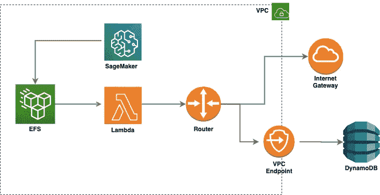
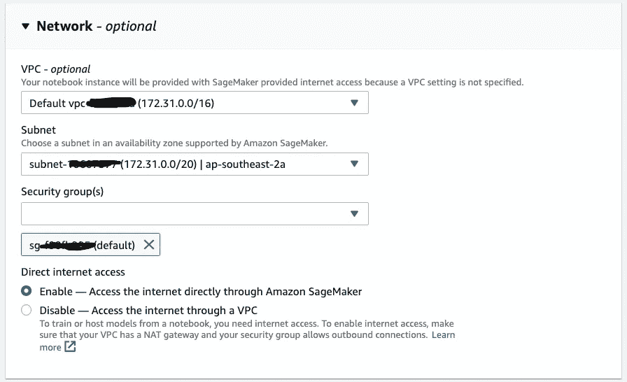
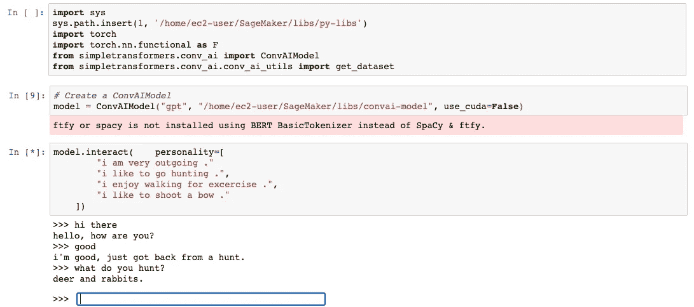
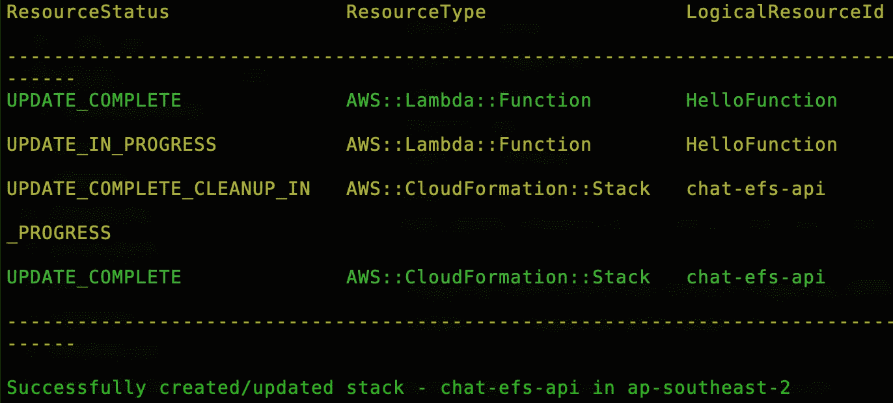
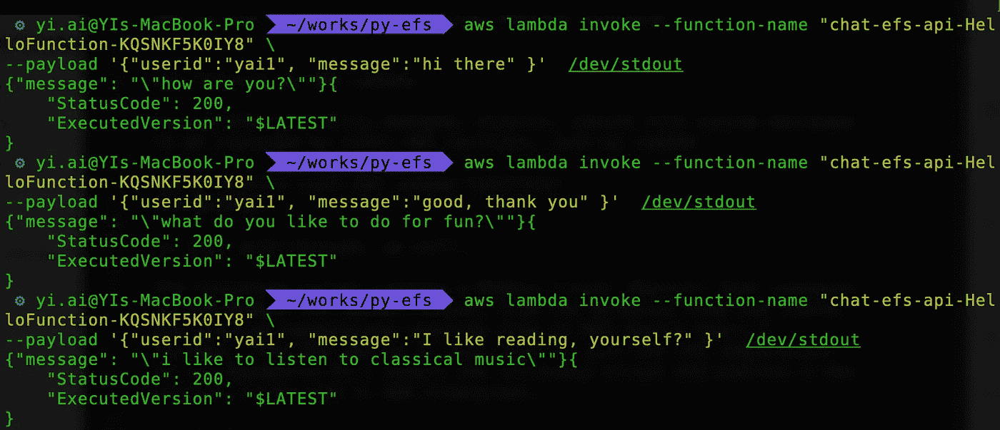
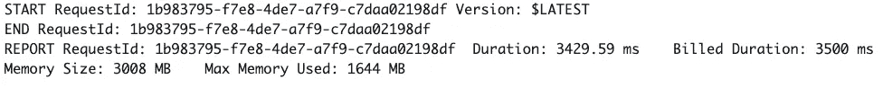

# 用 AWS Lambda 函数和亚马逊 EFS 构建对话式 AI 聊天机器人

> 原文：<https://towardsdatascience.com/building-a-conversational-ai-chatbot-with-aws-lambda-function-and-amazon-efs-615fddb4d55?source=collection_archive---------30----------------------->

## 亚马逊 EFS 在 AWS Lambda 上的无服务器机器学习


[@exxteban](https://unsplash.com/@exxteban) 在 [unsplash](https://unsplash.com/) 上的照片

亚马逊宣布对亚马逊弹性文件系统的 AWS Lambda 支持全面可用。亚马逊 EFS 是一个完全托管的、弹性的、共享的文件系统，旨在供其他 AWS 服务使用。

随着 Amazon EFS for Lambda 的发布，我们现在可以轻松地跨函数调用共享数据。它还开放了新的功能，例如将大型库和机器学习模型直接构建/导入到 Lambda 函数中。让我们来看看如何使用 Lambda 函数和 EFS 构建一个无服务器的对话式人工智能聊天机器人。

在本帖中，我们将:

*   创建一个 Amazon 弹性文件系统
*   部署并运行一个 SageMaker 笔记本实例，并将 EFS 装载到该实例。
*   将 PyTorch 库和 ConvAI 预训练模型下载到 EFS。
*   添加对话历史 DynamoDB 表和网关端点以保存和检索对话历史。
*   部署聊天机器人引擎 Lambda 功能，并为其启用 EFS。

这是架构图:



# 创建 EFS 文件系统

在这个例子中我们将使用 CloudFormation 来创建 EFS 和 EFS 接入点，配置定义如下:

请注意，我们将使用 EFS **通用**性能模式，因为它的延迟低于最大 I/O

# 与亚马逊 SageMaker 合作

我们将在亚马逊 SageMaker 笔记本上安装 EFS，在 EFS 上安装 PyTorch 和 ConvAI 模型。

笔记本实例必须能够访问同一个安全组，并且与 EFS 文件系统位于同一个 VPC 中。



让我们来看看 EFS 山路径`/py-libs`到`/home/ec2-user/SageMaker/libs` 目录:

然后将 PyTorch 和 [simpletransformers](https://github.com/ThilinaRajapakse/simpletransformers) 安装到`lib/py-libs`目录:

```
!sudo pip --no-cache-dir install torch -t libs/py-libs
!sudo pip --no-cache-dir install torchvision -t libs/py-libs
!sudo pip --no-cache-dir install simpletransformers -t libs/py-libs
```

一旦我们安装好所有的包，下载拥抱脸提供的[预训练模型](https://s3.amazonaws.com/models.huggingface.co/transfer-learning-chatbot/gpt_personachat_cache.tar.gz)，然后解压文件到 EFS 的`convai-model`目录。

```
!sudo wget [https://s3.amazonaws.com/models.huggingface.co/transfer-learning-chatbot/gpt_personachat_cache.tar.gz](https://s3.amazonaws.com/models.huggingface.co/transfer-learning-chatbot/gpt_personachat_cache.tar.gz)
!sudo tar -xvf gpt_personachat_cache.tar.gz -C libs/convai-model
!sudo chmod -R g+rw libs/convai-model
```

我们现在准备与预训练的模型对话，只需调用`model.interact()`。

拥抱脸提供的[预训练模型](https://s3.amazonaws.com/models.huggingface.co/transfer-learning-chatbot/gpt_personachat_cache.tar.gz)开箱即用性能良好，在创建聊天机器人时可能需要较少的微调。



我们可以看到 python 包和模型正确地从 EFS 消费，我们能够与预先训练好模型开始对话。

# 创建 AWS DynamoDB 表

创建一个 DialogHistory 表来存储至少带有用户最后一次发言的对话历史。我们可以使用[**样例 CloudFormation 模板**](http:#) 来配置 DynamoDB 表。

请注意，我们必须为 DynamoDB 创建一个[**VPC 端点，即使 Lambda 函数在 VPC 的公共子网内运行。**](https://docs.aws.amazon.com/amazondynamodb/latest/developerguide/vpc-endpoints-dynamodb.html)

# 配置 AWS Lambda 以使用 EFS

我们将使用 AWS **SAM** 来创建 Lambda 函数并挂载 Lambda 函数的 EFS 访问点。

首先，创建一个 Lambda 函数资源，然后为 Lambda 设置 EFS 文件系统。确保 EFS 和 Lambda 在同一个 VPC 中:

## 添加对话引擎:AWS Lambda

在本节中，我们将创建一个 Lambda 函数，用于用户和对话 AI 模型之间的通信。

我们将在`src/api.py`中包含以下源代码:

注意 [simpletransformers](https://github.com/ThilinaRajapakse/simpletransformers) 库允许我们使用`input()`在本地与模型交互。为了构建我们的聊天引擎，我们需要覆盖默认方法`interact`和`conv_ai`中的`sample_sequenc`:

# 部署聊天机器人服务

我们快到了！现在我们必须部署我们的机器人。运行以下命令进行部署:

```
**$**sam deploy --capabilities CAPABILITY_NAMED_IAM --guided
```



从上面的输出中，我们可以看到聊天机器人现在已经部署好了。

现在是时候测试我们的机器人了。转到 AWS 管理控制台中的 CloudFormation 资源列表，找到 lambda 函数名称，并使用以下命令调用 Lambda 函数:

```
**$**aws lambda invoke --function-name "[chat-efs-api-HelloFunction-KQSNKF5K0IY8](https://ap-southeast-2.console.aws.amazon.com/lambda/home?region=ap-southeast-2#/functions/chat-efs-api-HelloFunction-KQSNKF5K0IY8)" out --log-type Tail  \--query 'LogResult' --output text |  base64 -d
```

输出如下所示:



下面是一个对话框示例:

```
>>hi there
how are you?
>>good, thank you
what do you like to do for fun?
>>I like reading, yourself?
i like to listen to classical music
......
```

有用！从上面的截图我们可以看到，聊天机器人根据用户的输入返回响应。

但是，我知道冷启动对响应时间的影响。第一个请求花费了大约 30 秒的时间让**冷启动**完成。为了防止 Lambda 函数冷启动，我们可以使用 [**提供并发**](https://docs.aws.amazon.com/lambda/latest/dg/configuration-concurrency.html) 来保持函数预热:


因此，预热功能的等待时间缩短至约 3 秒:



就是这样！希望你觉得这篇文章有用，这篇文章的源代码可以在我的 [**GitHub repo**](https://github.com/yai333/ConversationalAIChatbot) 中找到。