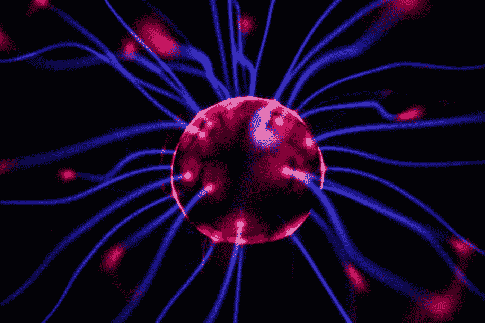

# 建立一个卷积神经网络来识别刮胡子和未刮胡子的人脸

> 原文：<https://towardsdatascience.com/building-a-convolutional-neural-network-to-recognize-shaved-vs-unshaved-faces-cb96ea5bc0f0?source=collection_archive---------40----------------------->

## 使用计算机视觉和 Keras 深度学习 API 构建 CNN 模型的代码指南。



乔希·里纳拍摄的图片

在本教程中，我们将使用由[报废免费库存照片网站](https://medium.com/@jacob.tadesse/web-scraping-stock-images-using-google-selenium-and-python-8b825ba649b9)创建的图像数据集。该图像集包含大约 2000 张被标记为“刮胡子”或“未刮胡子”的个人图像。我们将结合计算机视觉和机器学习，使用卷积神经网络(CNN)对图像进行分类。

本教程结束时，您将能够:

1.  从头开始构建 CNN 模型并使用迁移学习
2.  可视化模型结构、隐藏层和评估指标
3.  保存您的 CNN 模型，以便重复使用和/或部署

# 导入库和加载图像数据帧

要继续编码，请从 Google Drive 下载我的[图像数据集](https://drive.google.com/file/d/15FIs0RUgC_UQ7_aSLlH84B4IX0VYditS/view?usp=sharing)。所有图像数据都存储在 Pandas dataframe 中，包括原始图像数组，以及大小调整为 700x700、300x300、150x150 和 50x50 的图像数组。

我们将使用 pickle 来“解钩”和加载熊猫数据帧。我们使用 Keras 从头开始构建 CNN，并利用 VGG16 预训练模型。我们将使用 Pyplot 来可视化图像数据，并可视化 CNN 隐藏层中的中间激活。

```
import pickle
import pandas as pd
import numpy as np   
from numpy import asarray
from matplotlib import image
from matplotlib import pyplot
from keras.utils import to_categorical
from keras.models import Sequential
from keras.layers import Dense, Conv2D, MaxPooling2D, Flatten, Dropout
from keras.callbacks import EarlyStopping# loading the data frame using pickle
data = pickle.load( open( "data_pickle_final.p", "rb" ) )# creating a list of image arrays to preview
size_list = data.iloc(0)[0][-5:]# iterating through list to view images
for i in size_list:
    pyplot.imshow(i)
    pyplot.show();
```

# 预览数据帧

在这里，我们可以看到保存在图像集中的图像数据。为了确保图像不是堆叠的，我们将在执行训练、测试、评估分割之前打乱图像的顺序。这可以使用内置的 pandas 方法*来实现。样本()*。

```
# preview dataframe information
display(data.info())# preview first 5 rows in dataframe
display(data.head())# shuffle order of images and preview first 5 images
resampled_data = data.sample(frac=1)
resampled_data.head()
```

此时，我们将选择我们将要使用的图像形状。在你自己的项目中，你可能需要根据自己的需要来抓取照片，所以请查看我的文章[使用 Google Selenium 和 Python](https://medium.com/@jacob.tadesse/web-scraping-stock-images-using-google-selenium-and-python-8b825ba649b9) 来抓取股票图片。好的，我们将选择尺寸为 300 x 300 的图像，然后继续前进。

# 创建张量和定义变量

最常见的像素格式是字节图像，其中该数字存储为 8 位整数，给出了从 0 到 255 的可能值范围。通常，0 表示黑色，255 表示白色。介于两者之间的值构成了不同的灰度。在我们的例子中，我们将使用共享红色、绿色和蓝色比例的彩色照片，即:“rbg”；其中 0 表示没有光线，255 表示最大光线。我们将通过将每个值除以该范围中的最大数来归一化这些值，并且因为我们将每个图像存储为数组，所以我们将特征变量重新格式化为神经网络的张量。

```
# Normalizing the image arrays
X = resampled_data.img_data_300
X = X/255# Creating an empty tensor to store image arrays
tensor = np.zeros((X.shape[0],300,300,3))# Iterating through image arrays to update tensor
for idx, i in enumerate(X):
    tensor[idx] = i# Checking the tensor shape
tensor.shape
```

这里我们将定义我们的目标变量。我们将首先把我们的标签转换成神经网络的二进制目标，也称为一键编码。

```
# creating list to store target codes
target = []# iterating through labels to change strings to numbersfor i in resampled_data['Labels']:
  if i == 'shaved':
    target.append(0)
  elif i == 'unshaved':
    target.append(1)
```

我们将把新的二进制目标添加到我们的数据帧中，并将目标变量定义为“y”。根据您下载数据帧的时间，这可能已经包含在标记为“目标”的数据帧中。如果没有，不用担心。就照着这个剧本。

```
# updating dataframe to include target
resampled_data['target'] = target# defining target variable
y = resampled_data.target# checking the shape
y.shape
```

现在我们已经改组了我们的图像数据集，定义了我们的目标和特征变量；现在是我们进行训练-测试-评估分离的时候了。我们将使用 Sklearn 的 ***train_test_split*** 模块来执行此操作。但是执行训练-测试-分割，我们将使用最后 100 个图像创建一个保留集，用于模型评估。

```
# importing train-test-split module from sklearn
from sklearn.model_selection import train_test_split # Performing train-test split for model training
X_train, X_test, y_train, y_test = train_test_split(tensor[:-100], 
                                                    y[:-100], 
                                                    test_size=0.20, 
                                                    random_state=42)# check the size of the train/test split
for i in [X_train, X_test, y_train, y_test]:
    print(len(i))# Defining hold out data for evaluation 
evals_tensors = tensor[-100:]
evals_targets = y[-100:]
```

# 从头开始构建 CNN 模型

卷积神经网络(CNN)是一种专门用于图像的深度学习算法，其中该算法识别图像内的模式，为图像中的不同模式/对象分配重要性，使用权重和偏差来识别输入图像之间的差异和相似性。这些 CNN 基于标记的图像进行训练。CNN 的工作是将图像缩减成一种更容易处理的结构，而不损失权重/偏差，这是获得最佳结果的必要条件。

在这里，我们将建立我们的卷积神经网络层。我们将从添加一个连续层开始；其次是我们的 2D 卷积层，最大池层，密集层，和辍学层。

代码如下:

```
model = Sequential()
model.add(Conv2D(32,(4,4),activation='relu',input_shape=(300,300,3)))
model.add(Conv2D(32,(4,4),activation='relu', padding='same'))
model.add(Conv2D(128,(4,4),activation='relu', padding='same'))
model.add(Conv2D(128,(4,4),activation='relu', padding='same'))
model.add(MaxPooling2D((2, 2)))
model.add(Dropout(.3))
model.add(Conv2D(256, (4,4), activation='relu', padding='same'))
model.add(Conv2D(256, (4,4), activation='relu', padding='same'))
model.add(Conv2D(128, (4,4), activation='relu', padding='same'))
model.add(Conv2D(128, (4,4), activation='relu', padding='same'))
model.add(MaxPooling2D((2, 2)))
model.add(Dropout(.3))
model.add(MaxPooling2D((2, 2)))
model.add(Dense(1024, activation='relu'))
model.add(Dense(512, activation='relu'))
model.add(Dropout(.3))
model.add(Flatten())
model.add(Dense(32, activation='relu'))
model.add(Dense(1, activation='sigmoid'))
model.summary()
```

2D 卷积层使得 CNN 在图像预测方面如此强大。该层使用内核/过滤器(4x4)来检查每个通道的所有像素；从左到右、从上到下、从前到后开始；卷积所有像素(灰度、RGB 等)。该滤波器将使用特征内的像素数据执行点积乘法，以便从输入图像中提取特征，例如边缘。

第一个 Conv2D 层捕捉基本特征，如边缘、颜色、大小等。随着更多的图层添加到网络中，该算法会从输入图像中识别复杂的要素。我们使用 ReLu 或修正线性激活函数来训练我们的深度网络，因为 ReLU 往往比用其他激活函数训练收敛得更快更可靠。

最大池层减小了卷积特征的大小，降低了降维所需的计算能力，提取了主要特征，还抑制了噪声。

我们将对输出图层使用 sigmoid 激活函数，因为它存在于(0 到 1)之间，并且我们希望预测输出为剃齿或未剃齿的概率。

# 编译、拟合和评估模型

现在我们已经建立了 CNN 模型，我们需要编译、拟合和评估这个模型。我们将使用早期停止来帮助我们确定二元交叉熵损失函数的全局最小值。我们将存储每个时期的准确性和损失度量，以便可视化模型随时间的性能。

```
# timing the training
import time
start_time = time.time()# compiling the model
model.compile(loss='binary_crossentropy',
              optimizer='adam',
              metrics=['accuracy'])# setting upearly stopping
es = EarlyStopping(monitor='val_loss', mode='min', verbose=1, patience=5)# fitting the model to train/test data
history = model.fit(X_train, y_train,
                      batch_size=128, epochs=1000, 
                      validation_data=(X_test, y_test),
                      callbacks=[es], verbose=1)# printing training time
print("--- %s seconds ---" % (time.time() - start_time))# evaluating the model
train_loss, train_acc = model.evaluate(X_train, y_train)
test_loss, test_acc = model.evaluate(X_test, y_test)# checking model performance by accuracy metrics
print('Train: %.3f, Test: %.3f' % (train_acc, test_acc))
```

# 评估培训结果

在这里，我们将使用 PyPlot 来可视化我们的模型在训练和测试期间的性能。

```
# plotting the loss during training
plt.plot(history.history['loss'], label='train')
ply.plot(history.history['val_loss'], label='test')
plt.title('Training vs Test Loss')
plt.xlabel('Epoch')
plt.ylabel('Loss')
plt.legend()
plt.show()# plotting the accuracy during training
plt.plot(history.history['accuracy'], label='train')
plt.plot(history.history['val_accuracy'], label='test')
plt.title('Training vs Test Accuracy')
plt.xlabel('Epoch')
plt.ylabel('Accuracy')
plt.legend()
plt.show()
```

现在我们已经有了相当精确的模型，我们将使用它来对我们坚持的评估集进行预测。

# 评估模型预测

模型没有看到这个数据，应该可以做出准确的预测。让我们看看评估目标 vs 预测，也看看评估图像集中的图像。

```
# making predictions using evaluation features
res = model.predict(evals_tensors)# iterating through prediction results, and evaluation features
for i, j, k in zip(res, evals_tensors, evals_targets):
    if i >= .5:
      _ = 'Unshaved'
      print('Prediction:', round(i[0],2), '-', _) # printing test
    else:
      _ = 'Shaved'
      print('Prediction:', round(i[0],2), '-',_) # printing test
    print('Actual:', k)
    pyplot.imshow(j)
    pyplot.show();
```

我们还可以利用 Sklearn 的指标来查看分类报告，并查看将预测与实际结果进行比较的混淆矩阵。我们将在下面创建测试集和评估集。

代码如下:

```
from sklearn.metrics import classification_report, confusion_matrix# making predictions
Y_pred = model.predict(X_test)
Y_pred_train = model.predict(evals_tensors)# creating lists to store predictions
y_preds = []
y_preds_train = []# iterating through results to update Test prediction lists
for i in [round(i[0],0) for i in Y_pred]:
    if i > 0.5:
        y_preds.append(1)
    else:
        y_preds.append(0)

# iterating through results to update Evaluation prediction lists
for i in [round(i[0],0) for i in Y_pred_train]:
    if i > 0.5:
        y_preds_train.append(1)
    else:
        y_preds_train.append(0)
```

下面是打印混淆矩阵和分类报告的代码。

```
# printing the confusion matrix
print('Confusion Matrix - Test Set')
print(confusion_matrix(y_test.values.tolist(), y_preds))
print('Confusion Matrix - Evaluation Set')
print(confusion_matrix(evals_targets.values.tolist(), y_preds_train))# printing the classification report
print('Classification Report - Test Set')
print(classification_report(y_test.values.tolist(), y_preds, target_names=['Shaved','Unshaved']))
print('Classification Report - Evaluation Set')
print(classification_report(evals_targets.values.tolist(), y_preds_train, target_names=['Shaved','Unshaved']))
```

# 绘制模型结构并可视化中间激活

有这么多隐藏层，很难理解模型在引擎盖下做什么。虽然不是模型执行所必需的，但这是可视化模型结构和查看中间激活的好方法。

此代码将把您的模型结构保存为 PDF 文件:

```
# Saving the model structure
import pydot
pydot.find_graphviz = lambda: True
from keras.utils import plot_model
plot_model(model, show_shapes=True, to_file='model_pdf/{}.pdf'.format('Model_Structure'))
```

这段代码将为中间激活层保存一个图像:

```
# Saving intermediate activations
from keras import models
import math# Creating list of layer outputs
layer_outputs = [layer.output for layer in model.layers[:9]]
activation_model = models.Model(inputs=model.input, outputs=layer_outputs)
activations = activation_model.predict(img_tensor)# Extract Layer Names for Labelling
layer_names = []
for layer in activation_model.layers[:9]:
    layer_names.append(layer.name)# Defining number of images per row
images_per_row = 16# iterating through layer names and activations
for layer_name, layer_activation in zip(layer_names, activations): 
    n_features = layer_activation.shape[-1] 
    size = layer_activation.shape[1] 
    n_cols = n_features // images_per_row 
    display_grid = np.zeros((size * n_cols, images_per_row * size))
    for col in range(n_cols): # Tiles each filter into a big horizontal grid
        for row in range(images_per_row):
            channel_image = layer_activation[0,
                                             :, :,
                                             col * images_per_row + row]
            channel_image -= channel_image.mean() # Post-processes the feature to make it visually palatable
            channel_image /= channel_image.std()
            channel_image *= 64
            channel_image += 128
            channel_image = np.clip(channel_image, 0, 255).astype('uint8')
            display_grid[col * size : (col + 1) * size, # Displays the grid
                         row * size : (row + 1) * size] = channel_image
    scale = 1\. / size
    plt.figure(figsize=(scale * display_grid.shape[1],
                        scale * display_grid.shape[0]))
    plt.title(layer_name)
    plt.grid(False)
    plt.imshow(display_grid, aspect='auto', cmap='viridis')
plt.savefig(f'intermediate_activation_visualizations/unshaved/{layer_name}')
```

# 使用迁移学习构建 CNN

这里，我们将利用来自 Kera 预训练模型之一的 imagenet 权重， **VGG16** 。

```
from keras.applications import vgg16
from keras.models import Model
import kerasinput_shape = (300, 300, 3)
vgg = vgg16.VGG16(include_top=False, weights='imagenet', 
                                     input_shape=input_shape)output = vgg.layers[-1].output
output = keras.layers.Flatten()(output)
vgg_model = Model(vgg.input, output)vgg_model.trainable = False
for layer in vgg_model.layers:
    layer.trainable = False

import pandas as pd
pd.set_option('max_colwidth', -1)
layers = [(layer, layer.name, layer.trainable) for layer in vgg_model.layers]
pd.DataFrame(layers, columns=['Layer Type', 'Layer Name', 'Layer Trainable'])vgg.summary()
```

接下来，我们将使用预训练的模型层重新构建我们的模型，并添加类似于上面所做的其他层。

```
from keras.layers import Conv2D, MaxPooling2D, Flatten, Dense, Dropout, InputLayer
from keras.models import Sequential
from keras import optimizersmodel = Sequential()
model.add(vgg_model)
model.add(Dense(512, activation='relu', input_dim=input_shape))
model.add(Dropout(0.3))
model.add(Dense(32, activation='relu'))
model.add(Dense(1, activation='sigmoid'))model.summary()
```

现在，我们将编译、拟合和评估我们的新模型。

```
from keras.callbacks import EarlyStoppingmodel.compile(loss='binary_crossentropy',
              optimizer='adam',
              metrics=['accuracy'])# simple early stopping
es = EarlyStopping(monitor='val_loss', mode='min', verbose=1, patience=10) ## patience=200history = model.fit(X_train, y_train,
                      batch_size=128, epochs=1000, 
                      validation_data=(X_test, y_test),
                      callbacks=[es], verbose=1)train_loss, train_acc = model.evaluate(X_train, y_train)
test_loss, test_acc = model.evaluate(X_test, y_test)print('Train: %.3f, Test: %.3f' % (train_acc, test_acc))
```

现在，我们可以评估来自培训的指标。

```
import matplotlib.pyplot as pltplt.plot(history.history['loss'], label='train')
plt.plot(history.history['val_loss'], label='test')
plt.title('Loss')
plt.legend()
plt.show()plt.plot(history.history['accuracy'], label='train')
plt.plot(history.history['val_accuracy'], label='test')
plt.title('Accuracy')
plt.legend()
plt.show()
```

我们还可以评估混淆矩阵和分类报告的结果，看看我们的模型是否比我们从头构建的模型表现得更好。

```
from sklearn.metrics import classification_report, confusion_matrix#Confution Matrix and Classification Report
Y_pred = model.predict(X_test)
Y_pred_train = model.predict(evals_tensors)y_preds = []
y_preds_train = []
for i in [round(i[0],0) for i in Y_pred]:
    if i > 0.5:
        y_preds.append(1)
    else:
        y_preds.append(0)

for i in [round(i[0],0) for i in Y_pred_train]:
    if i > 0.5:
        y_preds_train.append(1)
    else:
        y_preds_train.append(0)print('Confusion Matrix - Test Set')
print(confusion_matrix(y_test.values.tolist(), y_preds))
print('Confusion Matrix - Evaluation Set')
print(confusion_matrix(evals_targets.values.tolist(), y_preds_train))print('Classification Report - Test Set')
print(classification_report(y_test.values.tolist(), y_preds, target_names=['Shaved','Unshaved']))
print('Classification Report - Evaluation Set')
print(classification_report(evals_targets.values.tolist(), y_preds_train, target_names=['Shaved','Unshaved']))
```

我们现在可以看到，这个模型表现得更加准确。

# 保存最终模型

现在我们有了一个在看不见的图像上表现良好的实体模型，我们可以保存这个模型和权重。这将允许我们部署这个模型，或者甚至与对类似项目感兴趣的其他人共享这个文件。

```
# Saving whole model
model.save('/content/drive/My Drive/Model_Files/Final_Model.h5')# Loading the whole model
from keras.models import load_model
loaded_model = load_model('/content/drive/My Drive/Final_Model.h5')
loaded_model.compile(loss='binary_crossentropy', 
                     optimizer='adam', metrics=['accuracy'])# Testing predictions using loaded model
res2 = loaded_model.predict(evals_tensors)
results2= []
for i in res2:
    results2.append(round(i[0],2))
compare = zip(results2, evals_targets)# View the comparison
for i in compare:
  print(i)
```

由于我们从 pickle 文件开始，如果不将我们的模型保存为 pickle 文件，本教程将是不完整的。要将您的模型保存为 pickle 文件，只需运行以下代码:

```
filename = 'finalized_model.p'
pickle.dump(loaded_model, open(filename, 'wb'))

# some time later...

# load the model from disk
loaded_model = pickle.load(open(filename, 'rb'))
result = loaded_model.score(X_test, Y_test)
```

# 结论

现在我们来复习一下。首先，我们导入我们的库和映像集。然后，我们对数据进行重新采样，定义和缩放我们的特征，并将图像存储在张量中。我们一次性编码了我们的目标变量；然后将我们的数据分成训练/测试/评估子集。我们从零开始建立了一个 CNN 模型，还使用预训练的 VGG16 和迁移学习建立了一个模型；将每个模型拟合到我们的图像集，并使用 adam 优化器编译每个模型，使用 binary_crossentropy 损失函数来提高我们在向前和向后传播期间的准确性度量。

培训完成后，我们能够评估指标，并可视化培训结果、模型结构和中间激活。最后，我们能够将整个模型保存为一个. h5 文件，也可以保存为一个 pickle 文件。我们流程的下一步是部署我们的模型供公众使用。我将使用 [flask 构建一个 python 应用程序](http://jtadesse.pythonanywhere.com/)，并将其托管在 [PythonAnywhere](https://www.pythonanywhere.com/?affiliate_id=0077ae73) 上，请继续关注本系列的下一篇文章。

这里是最终产品:【http://jtadesse.pythonanywhere.com/】T4

你可以在这里找到我的 GitHub 库。谢谢大家！