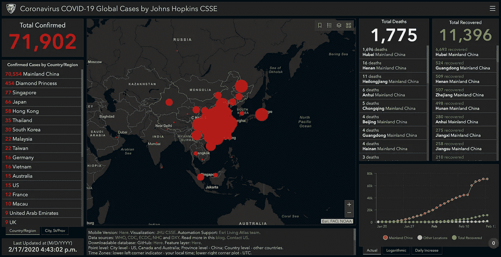
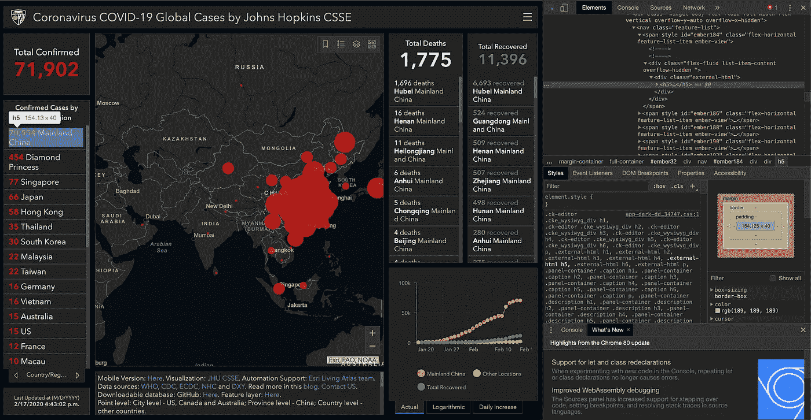
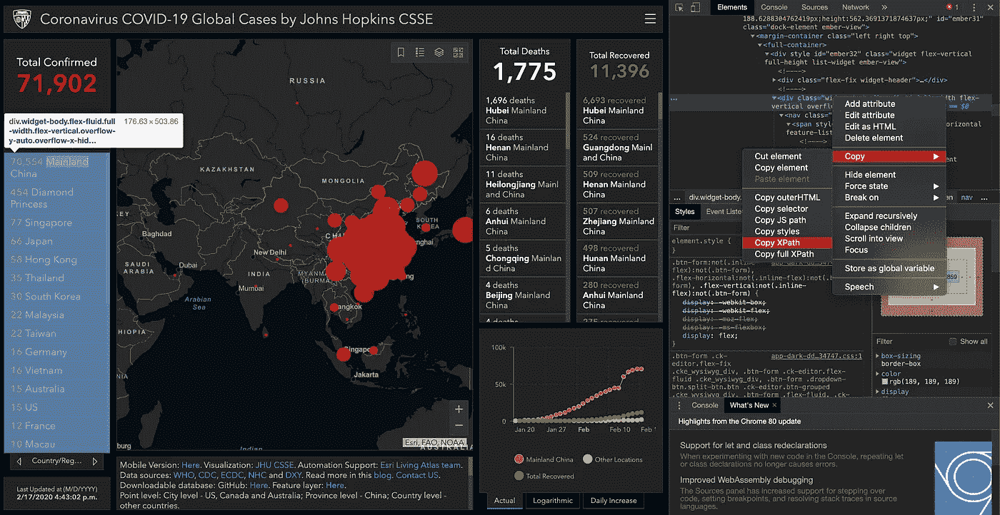
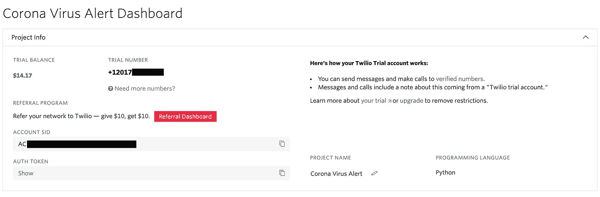

# 构建冠状病毒爆发短信预警系统！

> 原文：<https://towardsdatascience.com/building-a-coronavirus-outbreak-sms-alert-system-d80f4d648eea?source=collection_archive---------22----------------------->

照片由 [@thedotter](https://unsplash.com/@thedotter) 拍摄

## 使用 Python 来控制疫情

由于最近冠状病毒在中国以及亚洲其他国家爆发，世界其他地区的人们越来越担心病毒会继续传播并最终到达他们的国家。截至撰写本文时，mainland China 约有 98%(超过 70，000)的确诊病例，当局正在尽一切努力控制疫情。但是，这并不意味着我们不应该做好准备。

考虑到这一点，我决定写一个 Python 脚本来帮助人们在他们的国家达到一定数量的确诊病例时设置警报触发器。例如，美国目前约有 15 例确诊病例，但例如，如果该数字达到 30 例(或任何其他数字)，则会触发警报，您会收到一条发送到手机的短信。

下面，我将描述如何建立这个由网页抓取器和文本消息 API 组成的系统。

# 收集冠状病毒数据

首先，我们需要一个数据源来检查是否应该触发警报。幸运的是，有很多网站提供实时更新。我选择从网上抓取这个由约翰霍普金斯系统科学与工程中心提供的实时仪表板，因为它看起来是最可靠的。

冠状病毒全球数据仪表板

## 从浏览网站开始

为了找出我需要针对的元素，我从检查网站的源代码开始。这可以通过右击感兴趣的元素并选择 *inspect* 来轻松完成。这将显示 HTML 代码，从中我们可以看到包含每个字段的元素。例如，获取与*确诊病例*相关的所有数据将有助于为每个国家设置触发器

通过检查代码，我们可以很快意识到这个网站使用动态内容，而不是将其作为 HTML 源代码的一部分。因此最好的网络抓取工具是`Selenium`。

## 开始刮！

`Selenium`提供了多种在网站中查找和提取元素的方法，其中之一就是使用函数`find_elements_by_xpath()`。此功能要求您通过网站中包含您感兴趣的信息的部分的`XPath`,它将继续查找其所有元素。例如，我们可以按国家/地区复制名为*确诊病例部分的`XPath`，以提取每个国家的确诊病例数*

下面是提取数据所需的带有`XPath`和`class`名称的代码:

请记住，这只是我们可以提取的一组数据，我们可以应用相同的过程来提取网站中的任何其他部分，如*总恢复数*和*总死亡数。*

# 触发短信提醒！

为此，我们将使用设置非常简单的 [Twilio API](http://www.twilio.com/referral/Ee6Yov) 。虽然 Twilio 不是免费服务，但它为新用户提供 15 美元的免费信用，一条文本大约 1 美分，应该足够我们的脚本运行一段时间了！首先去他们的[网站](http://www.twilio.com/referral/Ee6Yov)创建一个账户。

如果你去[控制台](https://www.twilio.com/console)，你会看到你的`Account SID`和你的`Auth Token`，留着以后用。也点击红色的大按钮“获取我的试用号”，按照步骤，并保存这个稍后。

Twilio 控制台

现在，您需要做的就是使用`pip install Twilio`在您的计算机上安装软件包，并使用以下代码发送文本消息:

# 把所有东西放在一起

既然我们已经知道了如何使用`Selenium` 收集数据，使用`Twilio`发送短信提醒，我们可以将所有代码放在一起构建一个提醒系统:

请记住，最佳实践是将 Twilio `Account SID`等敏感信息保存为环境变量，而不是将其存储为代码的一部分，这就是上面的代码引用`TWILIO_SID`等变量的原因。此外，为了避免运行脚本时出现问题，需要进行大量的错误处理，但是上面的代码应该足够好，可以开始使用了。

# 运行脚本

从这里开始，有多种方法可以在一天中多次运行该脚本，以检查是否触发了任何警报。一种选择是将它本地托管在您的计算机或 Raspberry Pi 之类的设备上，并使用像`cron` (Mac 或 Linux)或`Task Scheduler` (Windows)这样的服务来安排脚本在一天内运行多次。在本文中，我将解释如何做到这一点:

 [## 使用 Python 和 Raspberry Pi 的网络抓取山区天气预报

### 从没有 API 的网站提取数据

towardsdatascience.com](/web-scraping-mountain-weather-forecasts-using-python-and-a-raspberry-pi-f215fdf82c6b) 

另一种选择是通过使用 Heroku 之类的服务将其托管在云上，但这超出了本教程的范围。

> 这个项目的所有代码都可以在这个 [Github 资源库](https://github.com/avourakis/Coronavirus-SMS-Alert)中找到，您可以下载并立即开始运行！

# 未来的改进

这个项目原来很简单，但这主要是因为它没有太多的功能。以下是一些改进它的想法:

*   通过短信定义警报触发器
*   支持其他类型数据的触发器，如“总死亡人数”
*   支持多个短信收件人

我希望这篇文章对你有用。如果你有任何问题或反馈，我很乐意在下面的评论中阅读:)