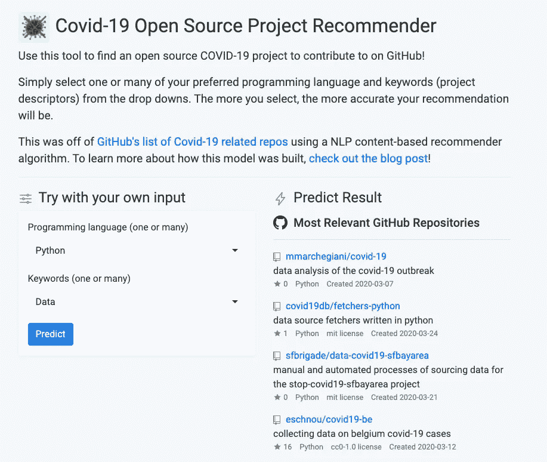
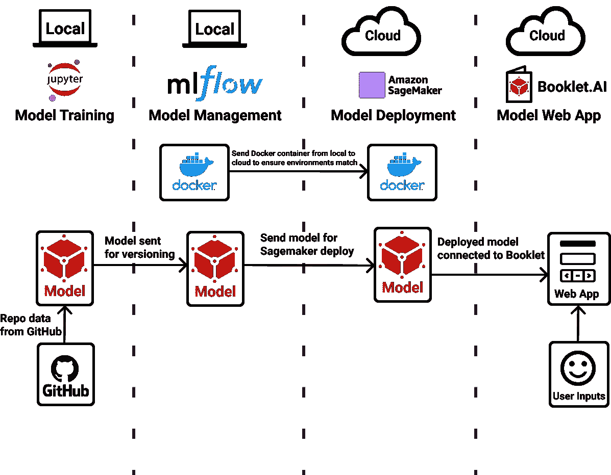
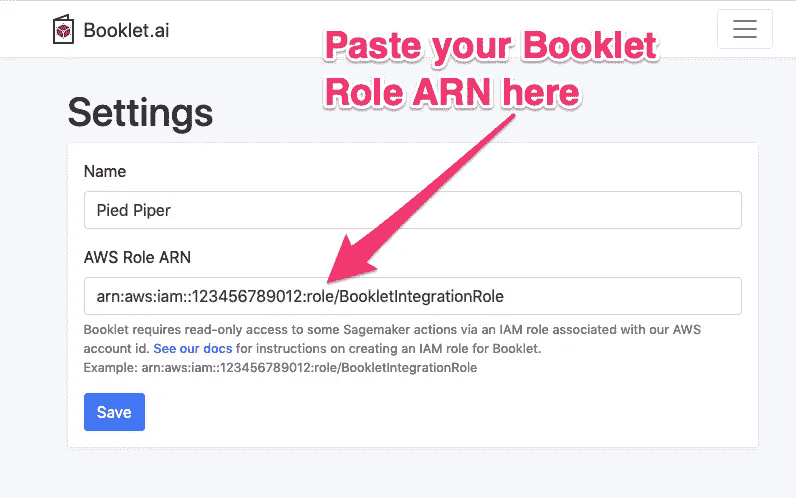
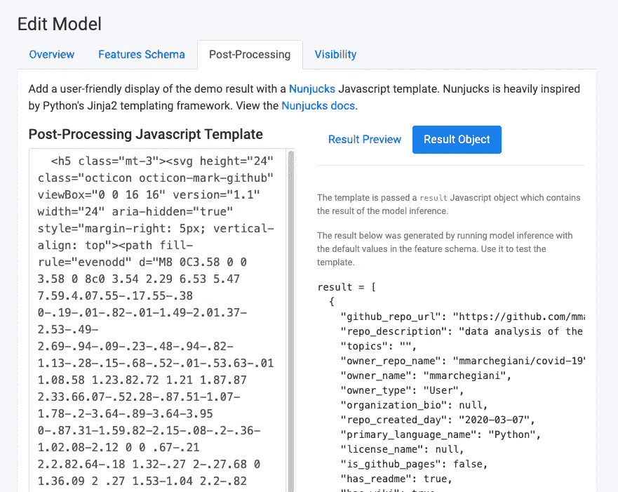
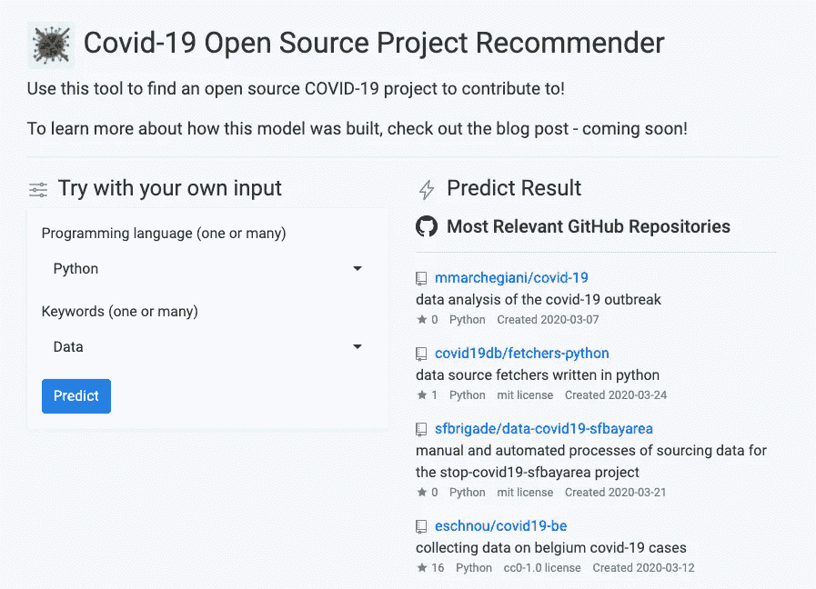
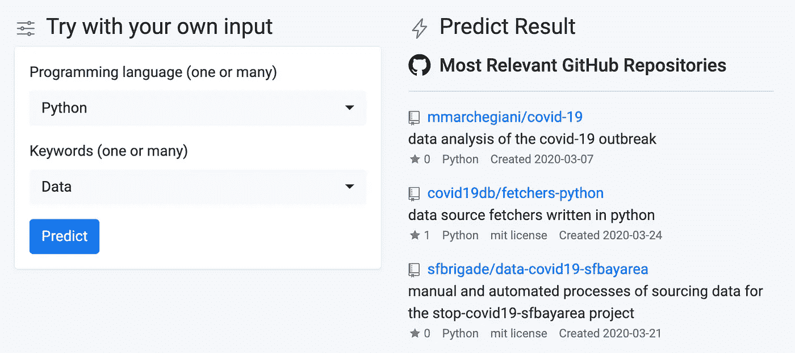

# 建立新冠肺炎项目推荐系统

> 原文：<https://towardsdatascience.com/building-a-covid-19-project-recommendation-system-4607806923b9?source=collection_archive---------16----------------------->

## 如何用 MLflow、Sagemaker、 [Booklet.ai](https://booklet.ai) 创建 GitHub 开源回购推荐系统 web app？

**TL；DR:** 我们建立了一个[新冠肺炎项目推荐系统](https://app.booklet.ai/model/covid19-project-recommender)来帮助人们发现社区中的开源项目。请继续阅读，看看我们是如何建造它的。

在新冠肺炎疫情期间，开源社区做出了巨大贡献，这让我深受鼓舞。GitHub 最近[公布了一个超过 36K(！！)开源回购，人们为社区贡献他们的时间和代码。](https://github.com/github/covid-19-repo-data/tree/master/data)

当我浏览可用项目列表时，我被开发人员、数据科学家和其他技术社区倾注到世界各地项目中的热情所淹没。从跟踪症状的应用程序到对现有数据集的广泛分析，长长的项目列表确实令人振奋。

我发现自己(实际上)正在和朋友们讨论我们如何为这些努力做出贡献。当我们讨论构建一个分析或跟踪应用程序时，我们意识到为已经在进行的新冠肺炎开源项目做贡献会更有影响力。这让我产生了帮助人们尽可能容易地找到这些与他们的技能相关的伟大项目的想法。

考虑到巨大的工作量，找到一个可以参与的项目可能会很有挑战性。有如此广泛的项目，涵盖许多不同的语言和主题。为了使这更容易，我们建立了一个推荐系统。给定一组您感兴趣的语言和关键字，您可以找到一些可能与您的输入相关的项目。你可以尝试一下[新冠肺炎项目推荐系统](https://app.booklet.ai/model/covid19-project-recommender)，或者一起来看看它是如何构建的！你也可以在 GitHub 上访问这个项目的[完整笔记本。](https://github.com/BookletAI/covid19-repo-recommender)



[新冠肺炎项目推荐系统](https://app.booklet.ai/model/covid19-project-recommender)上 [Booklet.ai](https://booklet.ai)

您可能会发现这个演示与我发布的[端到端销售线索评分示例](/a-true-end-to-end-ml-example-lead-scoring-f5b52e9a3c80)有一些相似之处。如果你也看了那篇博文，谢谢你！请随意跳过您已经讲述过的部分。

*免责声明:我是*[*booklet . ai*](https://booklet.ai)*的联合创始人之一，这是一个免费工具，作为本演示的一部分使用。*

# 先决条件

这将是一个技术教程，需要一点编码和数据科学的理解才能通过。为了从中获得最大收益，您至少应该接触一些:

*   Python(我们将一直呆在 Jupyter 笔记本中)
*   自然语言处理(我们将使用一个简单的`CountVectorizer`
*   命令行(是的，它可能很吓人，但我们只是使用一些简单的命令)
*   AWS(我们将帮助您解决这个问题！)

此外，您应该安装一些东西，以确保您可以快速浏览教程:

通过`awscli`访问的 AWS 用户名(我们将在下面介绍！)

带有几个包的某种 Python 3:

*   熊猫`pip install pandas`
*   MLflow `pip install mlflow`
*   SKlearn `pip install scikit-learn`
*   NLTK `pip install nltk`
*   Docker(快速简单安装[此处](https://hub.docker.com/editions/community/docker-ce-desktop-mac/))

# 在我们开始之前…

我们将接触到各种工具和想法。在我们开始之前，重要的是后退一步了解这里发生了什么。我们将使用一些工具:

*   [Jupyter Notebook](https://jupyter.org/) :数据科学家用 Python 编程的常用方法。允许您以笔记本的形式运行 python 脚本，并在线获得结果。
*   MLflow :开源模型管理系统。
*   [Sagemaker](https://aws.amazon.com/sagemaker/) :来自 AWS 的全栈机器学习平台。
*   [Booklet.ai](https://booklet.ai/) :模型 web app 构建器。

下图概述了这些不同工具的使用方法:



作者的作品

我们将在 Jupyter 笔记本中使用 Python 来清理 Github 数据并训练一个模型。接下来，我们将把模型发送到 MLflow 来跟踪模型版本。然后，我们将把 docker 容器和模型发送到 AWS Sagemaker 来部署模型。最后，我们将使用 Booklet 展示该模型的演示。

让我们开始吧！

# Python:训练模型

## 关于数据

我们正在利用来自 Github 上[新冠肺炎回购数据](https://github.com/github/covid-19-repo-data)回购的数据集。它包含 36，000 多个与新冠肺炎相关的开源项目，以及与每个项目相关的元数据。要了解关于数据集的更多信息，请查看[数据字典](https://github.com/github/covid-19-repo-data/blob/master/data/data_dictionary.md)。

## 导入和清理数据

首先，您需要克隆 GitHub repo 以将数据提取到您的机器上:

```
git clone https://github.com/github/covid-19-repo-data.git
```

将最新的数据文件放入工作目录后，您需要使用 pandas 导入 tsv(制表符分隔值):

GitHub 数据集中列出了各种各样的项目，但是我们希望找到那些最有可能受益于额外贡献者的项目。为此，我们将设置几个过滤器:

*   它必须至少有一个合并的 PR
*   它必须有自述文件和描述
*   它必须列出主要语言名称(主要是文本的回复，如文章列表，可能没有列出编程语言)
*   它必须至少有两个不同的贡献者

以下是我们如何将这些过滤器应用于熊猫:

我们计划使用基于文本的方法来推荐项目，利用回购描述、主题和主要语言的组合作为我们的核心[词汇袋](https://en.wikipedia.org/wiki/Bag-of-words_model)。为了简化我们的文本处理，我们将删除标点符号，并仅限于英语回购描述(以后可能会添加更多语言！).为此，我们需要:

*   首先，使用`langdetect`包来检测语言，并且只限于检测到英语的描述。
*   接下来，我们将检查只包含拉丁字符的描述。在此之前，我们需要使用`emoji`包将表情符号转换成字符串(表情符号不是拉丁文吗？).我们将使用这个方法来排除不只有拉丁字符的描述，作为上面的`langdetect`方法的备份。
*   最后，我们将删除回购描述、主题和主要语言中的标点符号，然后将所有这些内容组合成空格分隔的字符串。

为了完成上述任务，我们将设置几个助手函数，这些函数将应用于数据集中的文本:

接下来，我们将使用这些函数来完成清理和过滤:

运行完以上所有这些过滤器后，我们现在有大约 1400 个项目可以推荐。比我们最初的集合小得多，但希望仍然足以帮助用户发现可以贡献的有趣项目。

## 构建和运行矢量器

正如我们所讨论的，我们将基于由描述、主题和主要语言组成的词汇袋来推荐项目。我们需要获取这一大串单词，并将其转换成可用于推荐算法的形式。为此，我们将创建一个矢量器(也称为记号化器),它将我们的字符串转换成一个稀疏向量，指示字符串中存在哪些单词。

为了简单起见，我们将使用 sklearn 的`CountVectorizer`。在运行矢量器之前，有一些重要的输入需要讨论:

[词条释义](https://en.wikipedia.org/wiki/Lemmatisation)是将一个单词的多种形式转化为该单词的一个“词条”的过程。例如，“case”和“cases”都将转换为“case”。这对于减少噪音和创建向量时考虑的绝对字数是很重要的。这里我们使用`nltk`包中的`WordNetLemmatizer()`创建一个`LemmaTokenizer`类:

[停用词](https://en.wikipedia.org/wiki/Stop_words)是在创建向量之前我们将删除的词的列表。这些词不会直接给我们的推荐增加价值，比如“我们”、“the”等。Sklearn 有一个我们可以使用的很好的预置停用词列表。此外，我们将删除在我们的用例中非常常见并且不会区分项目的单词，例如“covid19”或“疫情”。在这里，我们将预先构建的列表与我们专门针对该数据集的手动筛选列表相结合:

现在我们可以构建矢量器，并在我们的项目列表中运行它。这创建了一个大的稀疏矩阵，该矩阵对我们数据集中的每个词袋进行矢量化:

## 构建推荐器

为了推荐项目，我们将接受一组语言和关键字，将其转化为单词包，并使用单词包找到最相似的存储库。首先，让我们检查代码，然后我们可以分解它:

*   首先，我们将输入的文本字段转换成一个单词包。
*   接下来，我们使用与前面相同的矢量器将单词包转换成表示文本的矢量。对我们来说，重要的是与之前相同的转换器，这样向量将表示与其他存储库相同的文本集。
*   然后，我们使用`cosine_similarity`将向量从我们输入的字符串映射到整个存储库列表。这使我们能够理解每个单独回购协议的词袋与我们输入的词袋有多么“相似”。[如果你想阅读更多关于余弦相似性的文章，这里有一篇很棒的文章](https://www.machinelearningplus.com/nlp/cosine-similarity/)！
*   最后，我们选取前 10 个最相似的存储库，并将其作为数据帧返回。

为了将这个推荐函数转换成可以部署的形式(我们将在一分钟内对此进行更多介绍)，我们将利用 MLflow 的`pyfunc`类。我们需要创建一个类，该类包含预测所需的所有输入，然后运行预测并以正确的格式返回结果:

我们现在可以测试我们的新类了。我们可以基于类创建一个对象，使用我们的所有输入，并确保输出按预期填充:

您应该会看到一个字典格式的数据帧——很好！

# MLflow:管理模型

## 什么是 MLflow？

在我们开始设置之前，让我们快速地聊一下 MLflow。官方说法是，MLflow 是“机器学习生命周期的开源平台。”Databricks 开发了这个开源项目，以帮助机器学习构建者更轻松地管理和部署机器学习模型。让我们来分解一下:

**管理模型:**在构建一个 ML 模型时，您可能会经历多次迭代并测试各种模型类型。跟踪关于那些测试的元数据以及模型对象本身是很重要的。如果你在 100 次尝试中的第二次发现了一个很棒的模型，并想回去使用它，该怎么办？MLflow 已经覆盖了你！

**部署模型:**为了使模型可访问，您需要部署模型。这意味着将您的模型作为 API 端点来托管，这样就可以很容易地以标准的方式引用您的模型并对其进行评分。为您部署模型的工具有一长串。MLflow 实际上不是这些工具之一。相反，MLflow 允许将您的托管模型轻松部署到各种不同的工具。它可以在你的本地机器上，微软 Azure，或者 AWS Sagemaker。我们将在本教程中使用 Sagemaker。

## 设置 MLflow

MLflow 跟踪服务器是一个很好的 UI 和 API，它包含了重要的特性。在我们可以使用 MLflow 开始管理和部署模型之前，我们将需要设置它。

确保您安装了 MLflow 软件包(如果没有，请查看先决条件！).从那里，在您的终端中运行以下命令:

```
mlflow ui
```

在这之后，您应该会看到闪亮的新 UI 在 [http://localhost:5000/](http://localhost:5000/) 上运行

如果您在进行此设置时遇到问题，请查看 MLflow tracking server 文档[此处](https://www.mlflow.org/docs/latest/tracking.html#mlflow-tracking-servers)。此外，如果你不想在自己的机器上安装跟踪服务器，Databricks 还提供了一个免费的托管版本[。](https://www.mlflow.org/docs/latest/quickstart.html#logging-to-a-remote-tracking-server)

## 将模型记录到 MLflow

因为我们已经为我们的模型创建了`pyfunc`类，我们可以继续将这个模型对象推送到 MLflow。为此，我们需要首先将 Python 指向我们的跟踪服务器，然后设置一个实验。实验是 MLflow 跟踪服务器内部的模型集合。

在我们将模型对象发送到 MLflow 之前，我们需要设置 Anaconda 环境，当模型在 Sagemaker 上运行时将使用该环境。在这种情况下，我们需要利用默认的 Anaconda 和`conda-forge`。使用`conda-forge`的原因是，我们也可以下载`nltk_data`和`nltk`软件包。通常，您可以在脚本中下载数据，但是在这种情况下，我们需要确保数据存储在包的旁边，以便在部署模型时使用。更多关于`nltk_data`的细节可以在[这里](https://anaconda.org/conda-forge/nltk_data)找到。另外，关于 Anaconda 的更多信息，[这里有一个详细的概述](/get-your-computer-ready-for-machine-learning-how-what-and-why-you-should-use-anaconda-miniconda-d213444f36d6)。

现在，我们可以继续将模型记录到 MLflow。我们使用这个命令发送我们创建的类，以及该类的所有输入。这确保了运行模型所需的一切都打包在一起。

## 测试本地部署

在我们继续部署之前，我们将想要测试在本地部署模型。这允许我们在必须经历实际创建端点的过程(这可能需要一段时间)之前，理解任何可能出现的错误。幸运的是，MLflow 有一个很好的 Sagemaker 本地仿真器:`mlflow sagemaker run-local`命令。我们设置了一个小助手函数，这样您就可以将`run-local`脚本直接复制并粘贴到您的终端中:

一旦您在终端中运行了它(可能需要一分钟)，您就可以测试本地端点以确保它按照预期运行。首先，我们设置一个函数来轻松调用端点，然后我们在 JSON 方向传入我们的数据帧:

您应该会看到与之前测试该类时相同的结果！如果您遇到错误，请到您的终端，您应该看到堆栈跟踪，以便您可以调试。

# Sagemaker:部署模型

## 什么是 Sagemaker？

Sagemaker 是亚马逊网络服务(AWS)创建的一套工具，用于支持机器学习的开发和部署。Sagemaker 中有大量可用的工具(太多了，无法在此列出)，我们将专门使用他们的模型部署工具。在他们的 GitHub repo [这里](https://github.com/awslabs/amazon-sagemaker-examples)有一些伟大的 Sagemaker 例子。

## 设置 Sagemaker

首先，你需要得到许可。AWS 权限从来都不简单，但是我们会尽量保持简单！您需要设置两个不同的设置:您自己的用户和 Sagemaker 的角色。

第一个是用户帐户，这样您就可以在将模型发送到 Sagemaker 时访问 AWS。为此，您需要转到身份和访问管理(IAM)控制台，并设置一个具有管理员权限的用户帐户。如果您的安全团队进行反击，“Sagemaker 完全访问”应该也可以工作！在设置流程的最后，您将获得一个 AWS 访问密钥 ID 和一个 AWS 秘密访问密钥。一定要保存好这些！第一次之后就无法访问了。现在，到你的终端键入`aws configure`。这将提示您输入刚刚收集的 AWS 密钥。完成设置后，您就可以从终端和 Python 访问 AWS 了！[这里](https://docs.aws.amazon.com/sagemaker/latest/dg/gs-account-user.html)是来自 AWS 的更多细节。

第二个是 Sagemaker 的角色(本质上是 AWS 内服务的用户帐户)。要设置这一点，请访问 IAM 的角色部分。您需要将这个角色分配给 Sagemaker，然后选择名为“SagemakerFullAccess”的策略。在这个过程的最后，你会得到这个角色的 ARN 奖！部署时我们需要这个，所以把它放在手边。更多细节来自 AWS [这里](https://docs.aws.amazon.com/sagemaker/latest/dg/access-policy-aws-managed-policies.html)。

最后，我们需要将一个 MLflow docker 容器推入 AWS。假设您正确设置了上面的权限并安装了 docker(参见 docker 设置的先决条件一节)，您将希望在您的终端中运行以下命令:

```
mlflow sagemaker build-and-push-container
```

这将把一个 docker 容器推入 AWS，该容器将在部署期间使用。

# 部署到 Sagemaker

现在我们已经设置好了一切，是时候将我们的模型推送给 Sagemaker 了！

部署功能通常需要 5 到 10 分钟才能完成，并且在完成之前会经常使用此功能检查状态。一旦部署完成，您将能够在 Sagemaker UI 中找到一个列出的模型。

# Booklet.ai:把模型变成网络应用

Woot woot，你的模型展开了！我们的下一步是确保任何人都可以方便地访问这些推荐。我们希望任何人都能够选择首选语言和关键字，然后看到一些推荐的回购。关于如何从这里向前推进，有几个选项:

*   您可以共享代码来直接调用您的模型。这要求用户启动 python 环境，并利用正确配置的凭证在 Sagemaker 中直接调用模型。[下面是教程](/sharing-your-sagemaker-model-eaa6c5d9ecb5)。
*   您还可以创建一个定制的 web 应用程序，使用 Flask 之类的东西创建一个与您的模型交互的界面。[这是那个方法的教程](/create-a-complete-machine-learning-web-application-using-react-and-flask-859340bddb33)。

**在这一点上，我们急于尽快将模型送到用户手中。我们创建了**[**booklet . ai**](https://booklet.ai)**来使构建 web 应用程序的最后一步变得简单快捷。**

## 什么是 [Booklet.ai](https://booklet.ai) ？

[Booklet](https://booklet.ai/) 为您的 ML 模型创建一个 web 应用程序，无需更改任何代码或安装额外的库。以下是 Booklet 工作原理的概述:

1.  授予 Booklet.ai *只读*访问有限数量的 AWS Sagemaker 操作的权限。
2.  在我们的 UI 中选择您希望与 Booklet 集成的 Sagemaker 端点。
3.  Booklet 托管一个响应式 web 应用程序，它接受 HTML 表单输入，格式化数据，调用 Sagemaker 端点，并在 web 应用程序中显示结果。您可以原样返回输出，或者使用 [Nunjucks](https://mozilla.github.io/nunjucks/) 以您喜欢的任何方式格式化您的输出。

## 注册并授权访问 Sagemaker

Booklet 可免费用于您的第一个 ML Web 应用程序。前往[注册页面](https://app.booklet.ai/signup)创建一个账户。

您还需要通过与我们的 AWS 帐户关联的 IAM 角色授予*对有限数量的 Sagemaker 操作的只读*访问权限。以下是步骤:

1.  在 AWS IAM 控制台中创建新角色。
2.  为角色类型选择“另一个 AWS 帐户”。
3.  在帐户 id 字段中输入“256039543343”(这是 Booklet.ai AWS 帐户 ID)。
4.  单击“下一步:权限”按钮。
5.  单击“创建策略”按钮(打开一个新窗口)。
6.  选择 JSON 选项卡。将这个 JSON 复制并粘贴到文本区域。
7.  点击“审查政策”。
8.  将策略命名为“BookletAWSIntegrationPolicy”。
9.  单击“创建策略”并关闭窗口。
10.  返回“创建角色”窗口，刷新策略列表并选择您刚刚创建的策略。
11.  点击“下一步:回顾”。
12.  为角色命名，如“BookletAWSIntegrationRole”。点击“创建角色”。
13.  复制角色 ARN。看起来有点像“arn:AWS:iam::123456789012:role/BookletIntegrationRole”。

随着 AWS 角色的创建和 ARN 的出现，我们就快成功了。在 Booklet.ai 设置中，粘贴 AWS 角色 ARN，点击“保存”按钮:



在 Booklet.ai 中输入 IAM 角色

## 为模型创建 Web 应用程序

点击 Booklet.ai 中的“新建模型”按钮，并选择您想要包装在响应式 web 应用中的 Sagemaker 端点。在此屏幕上，您还可以配置友好的显示型号名称和描述。我们需要设置两个快速配置来准备演示:

**特性模式:**这配置了用户将发送到您的 ML 模型的输入。在这种情况下，我们希望设置两个不同的字段:一个用于编程语言的多选文本字段，一个用于关键字的多选文本字段。您可以在下面看到我们是如何构建的:

**后处理:**配置输出如何显示给用户。Booklet 在这一部分使用了 Nunjucks，一种简单的 Javascript 模板语言。在编辑面板中，您可以参考模型结果的结构(根据特征模式中的默认值填充)，还可以实时查看编辑后的输出更新。



在 [Booklet.ai](https://booklet.ai) 中编辑后处理

对于这个模型，我们希望结果看起来像一个 Github repos 列表，所以我们以这种方式配置了 Nunjucks 模板:

填写完这两项配置后，请点击“更新型号”

## 为模型创建 Web 应用程序

您的 web 应用程序已经可以使用了！



[完成](https://app.booklet.ai/model/covid19-project-recommender)[小册子中的](https://booklet.ai)模型 Web App . ai

目前，您的模型只对小册子中您组织内的人员开放。您还可以通过返回到“设置”并将您的模型设置为“公共”(旁边有一个易于使用的 URL ),使您的模型易于共享，这样任何人都可以访问您的模型。

# 结束语

在本教程中，您已经学习了如何从 Github 中的原始数据集，一直到一个正常工作的 web 应用程序。感谢您的关注！如果你有任何想法，问题，或遇到问题，请在下面留言。提醒一下，这个项目的所有[代码都可以在 GitHub](https://github.com/BookletAI/covid19-repo-recommender) 上找到。

***编者注:*** [*走向数据科学*](http://towardsdatascience.com/) *是一份以研究数据科学和机器学习为主的中型刊物。我们不是健康专家或流行病学家，本文的观点不应被解释为专业建议。想了解更多关于疫情冠状病毒的信息，可以点击* [*这里*](https://www.who.int/emergencies/diseases/novel-coronavirus-2019/situation-reports) *。*



[Booklet.ai](https://booklet.ai)