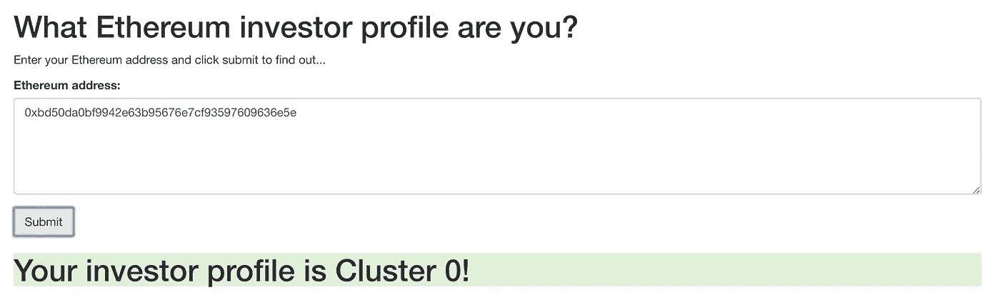
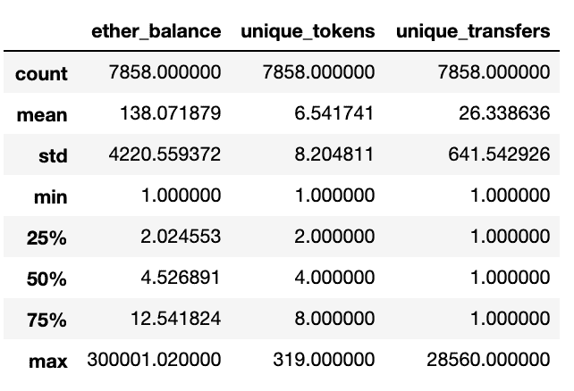
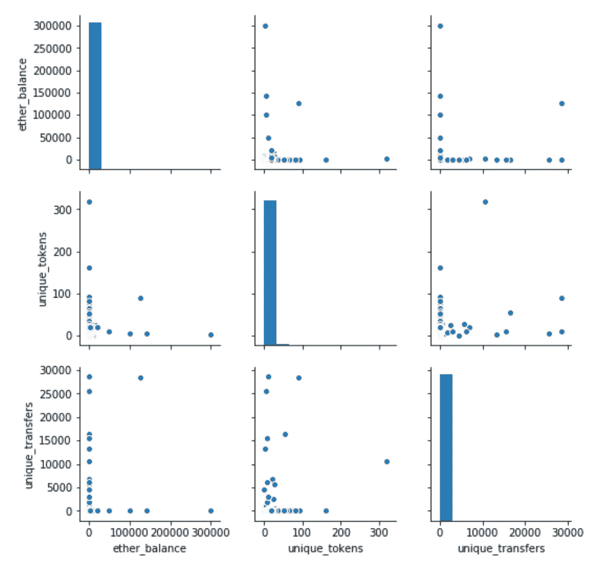
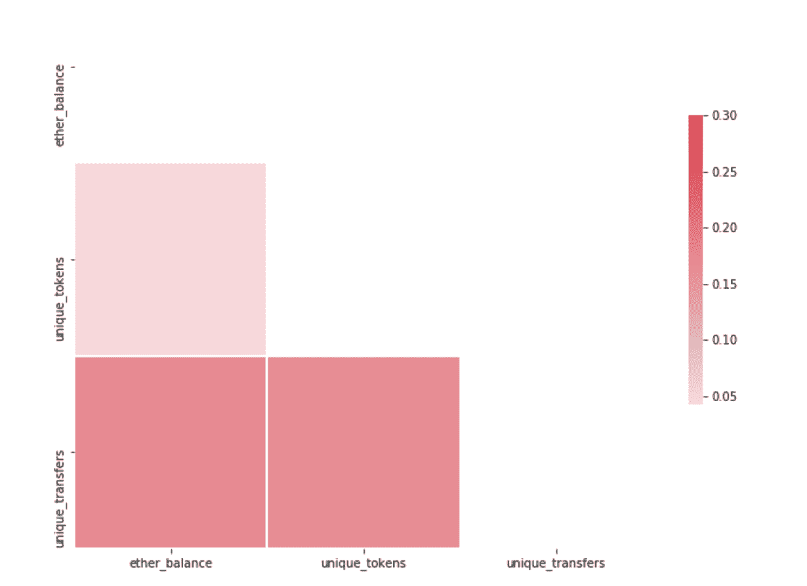
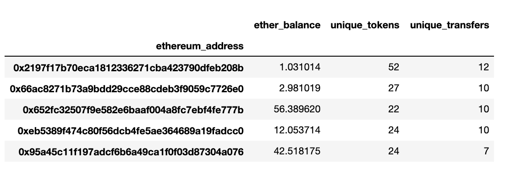
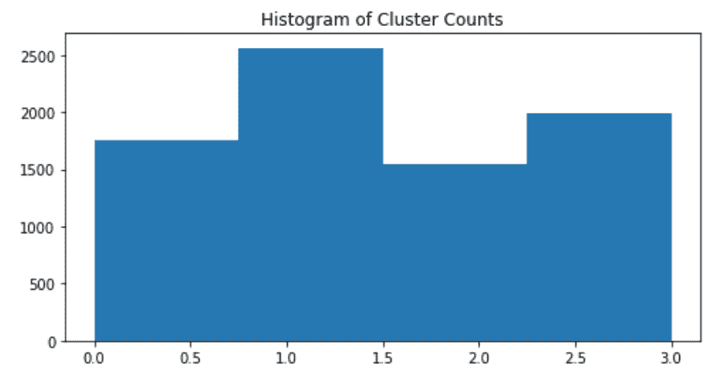
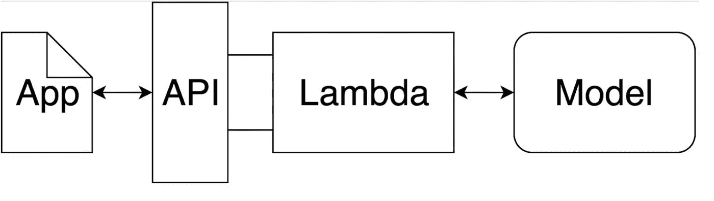

# 构建加密 ML Web 应用程序

> 原文：<https://towardsdatascience.com/building-a-crypto-ml-web-app-5f7dd1442568?source=collection_archive---------34----------------------->

## 用 AWS SageMaker 预测以太坊投资者概况

来源: [Unsplash](https://unsplash.com/)

**TL；博士**

该项目旨在将以太坊数据集、机器学习和云技术连接到一个项目中。结果是一个无人监管的 ML 数据产品，可通过网络用户界面访问。它基于使用提供的以太坊地址及其公开可用的数据动态构建的特征来预测投资者概况(聚类)。

项目代码可在 [Github](https://github.com/josolnik/MLND) 上获得。

将模型预测作为 web 应用程序中的 API 端点

# 定义

## **项目概述**

该项目将区块链数据、机器学习和云管理服务结合到一个最终产品中，即一个 web 应用程序。以太坊数据作为 GCP 公共数据集提供。

该网络应用程序预测在用户界面中输入的以太坊地址的投资者概况(聚类)。这基于从数据源中提取的三个特征:**当前余额、唯一转账和持有的唯一代币**。

在金融术语中，[投资者档案](https://en.wikipedia.org/wiki/Investor_profile)定义了个人在投资决策中的偏好。这方面的例子有风险厌恶/风险容忍、资产类别和单个资产的多样性、成长股或价值股的投资等。在这个项目中，它是指任何一种可以量化并用于区分不同以太坊地址的投资行为。

数据在 BigQuery 上[可用，随时可以使用。挑战在于对数据进行建模，并将其用于 ML 模型。数据没有被标记，这就是为什么问题被公式化为**无监督的机器学习任务**。由于定价数据更容易获得和货币化，大多数加密机器学习项目都专注于预测这一点。](https://cloud.google.com/blog/products/data-analytics/ethereum-bigquery-public-dataset-smart-contract-analytics)

另一方面，该项目侧重于个人地址(投资者)的行为足迹，并根据可用的交易数据对其进行聚类。

AWS 的云服务用于在 web 用户界面中提供模型。AWS SageMaker 用于所有机器学习步骤，并将模型用作预测端点。然后，这作为 Lambda 函数通过部署的 API 端点和 API 网关被触发。此端点用于预测网络用户界面中的以太坊投资者概况。

## **问题陈述**

虽然公共区块链上的数据是开放的，但还没有多少机器学习应用程序(除了价格预测)利用它们。原因之一是底层数据结构基于难以分析的 OLTP 系统(与 OLAP 相反)。

对于在公共区块链上执行的每一笔交易，都有我们可以分析的痕迹。与其他资产类别不同，我们有个人投资者行为的可用数据。该项目的目的是回答以下问题:

> **能否利用 BYOD(自带资料)的原理，仅用提供的地址聚类一个以太坊投资人？**

考虑到问题的复杂性，我没想到会得到必然有见地的结果。目前[有近 1 亿个独特的以太坊地址](https://etherscan.io/chart/address)，这些地址高度多样化。目标是建立一个可行的解决方案。为此，需要做一些假设。

一个核心(过度)简化的假设是，一个地址等于一个投资者。这很难争辩，因为以太坊生态系统中有许多子群，如矿工、交易所和 ICO 钱包。同时，区分这两者超出了本项目的范围，本项目的重点是构建一个概念验证管道。

## 韵律学

对于给定数量的簇，每个模型将所有采样的以太坊地址聚类到单独的簇中。该项目中使用的指标是[剪影得分](https://scikit-learn.org/stable/modules/generated/sklearn.metrics.silhouette_score.html)。使用每个样本的平均聚类内距离和平均最近聚类距离来计算系数。这对于用例来说是理想的，因为我们没有可用的基础真值。

# 分析

## 数据探索

抽取 10000 个以太坊地址的样本。由于其中一些不满足指定查询中的进一步条件，数据框中大约有 8000 个可用。如下表所示，*乙醚平衡*的最小阈值为 1 乙醚。这是一个任意设置的边界，因为许多以太坊地址余额为零。

平均值为 138 以太(截至 2020 年 5 月 15 日，目前约为 25，000 欧元)，这表明当我们查看第 75 百分位值时，分布的偏斜度。虽然第 75 百分位小于 13，但平均值是 138。样品中明显存在一些强异常值，例如最大值为 300000 乙醚平衡值。

*unique_tokens* 功能在以太天平上并不分散。通常值从 2 个唯一令牌到持有的 8 个令牌不等。

*Unique _ transfers*功能变化很大。平均转账次数为 26 次，最大金额为 28560 次。我们可以看到，前 25%的地址产生了大部分传输，因为 75%的地址没有一个传输超过 1 次。

## 探索性可视化

下面是所有构建要素的散点图。正如可视化中清楚显示的那样，在 *eth_balance* 和 *unique_transfers* 功能中都存在幂律分布。两者累积价值的绝大部分是由少数地址产生的。

同时，在不同的特征之间没有太多可见的相关性。

提取特征的散布矩阵

下面是所有可用功能的关联热图。如上所述，不同特征之间几乎没有相关性。这是一个积极的信号，因为我们想要探索具有不同特性的特性空间的不同区域。如果有很强的相关性，我们可以用不同的特征来解释相同的现象。

## 算法和技术

用于预测聚类的技术都是无监督的机器学习算法。选择的是 K-means，高斯混合模型和层次聚类。

与 K-means 一样，聚类之间的边界总是线性的，其他两种算法用于处理更复杂的边界。此外，通过测量聚类分配的概率或不确定性来进一步扩展分析的可能性。分析中没有这样做，但这是一个可能的扩展。

## 基准

该项目的基准模型是 K-means 算法的轮廓得分。之后，使用更复杂的算法来比较性能。根据经验，0.5 的轮廓分数被定义为具有合理性能的解决方案的阈值。

# 方法学

## 数据预处理

提取了三个特征:

*   当前以太币余额
*   历史上持有的独特代币
*   以太坊地址的唯一传输

**实现**

项目中使用了相当多的 Python 模块。同时，这些是实现的核心。 [Pandas_gbq](https://pandas-gbq.readthedocs.io/en/latest/) 库用于查询 BigQuery 以太坊数据源。 [Google-cloud-bigquery](https://googleapis.dev/python/bigquery/latest/index.html) 用于认证 GCP 服务账户。 [Scikit-learn](https://scikit-learn.org/stable/) 被用作所有型号的工具。

项目中使用的 AWS 服务:

*   S3，用于存储训练数据，用 transformer 对象进行预处理，以及 GCP 凭证
*   SageMaker 利用笔记本实例，将项目端到端地连接起来
*   Lambda 函数来触发预测脚本
*   API 网关，用于创建在用户与之交互的 web UI 中使用的 API
*   CloudWatch 记录和调试在构建解决方案的过程中可能遇到的问题

使用了来自以太坊公共数据源的两个表:

*   ` big query-public-data . crypto _ ether eum . balances '
*   ` big query-public-data . ether eum _ block chain . token _ transfers '

[令人惊叹的 Bigquery 视图](https://github.com/blockchain-etl/awesome-bigquery-views) Github 页面用于构建 SQL 查询并更好地理解以太坊数据模型。

下面我们可以看到一些不同以太坊地址的构造特征的例子。

以太坊地址特征示例

之后，使用 Sklearn 的管道功能对特征进行预处理。我们对它们进行规范化，以确保这些特征有助于输入到模型中。这通过使用功率变换、标准缩放和 PCA 变换来完成。PCA 变换在这里可能是多余的，因为只有三个特征被映射到三个分量，但是如果考虑到样本大小，特征集被扩展并且维数需要被减少，则 PCA 变换可能是有用的。

使用最终的特征集，所有三种聚类算法备选方案都被训练:K-均值模型、GMM 模型和分层聚类模型。

下图显示了 4 个集群中每个集群的实例数量。

聚类分布

所选择的集群数量是 4。它是基于不同值的反复试验而选择的。由于替代算法的性能没有显著提高轮廓系数，因此在部署的模型中使用的解决方案中使用了 K-means。

在使用训练脚本进行训练之后，被训练的模型的元数据与预测脚本相结合，以预测各个以太坊地址的聚类值。

预测脚本对所提供的以太坊地址的特征值进行实时计算。它查询以太坊数据源并返回规范化的特征值。这些然后被用作训练模型的输入，该模型返回预测的聚类值。

资料来源: [Udacity MLND](https://www.udacity.com/course/machine-learning-engineer-nanodegree--nd009t)

最终的解决方案是通过 API 网关作为 Lambda 函数触发的预测端点。Lambda 函数是基于无服务器架构的云函数。它通过 API 网关部署为一个 API，可以在 web 应用程序的用户界面中使用。

每当用户输入以太坊地址并按下提交按钮时，预测的聚类值就会显示在用户界面上。

# 结果

## **模型评估和验证**

最终结果是一个 web 应用程序，它根据用户提供的以太坊地址返回投资者资料。用户不需要提供任何个人数据，因为所有需要的数据都可以从公开的以太坊数据源中提取。

基于轮廓分数来评估模型。由于目前存在超过 1 亿个以太坊地址，如果不制定一些明确的规则，例如过滤掉非平凡余额，就很难对地址进行可靠的采样。

使用选择的度量标准对模型进行经验评估。K-means 的剪影评分是 0.38。因为没有可用的基本事实值，所以没有办法以可扩展的方式客观地测试这一点。另一方面，所选择的度量很好地量化了不同的聚类在特征空间中是如何被区分的。

最终的解决方案在一个 web 应用程序中进行测试，在该应用程序中为一个样本以太坊地址提取预测的聚类值。

考虑到性能，显然提取的数据没有足够的差异来创建可解释的聚类。当查看不同的集群时，也不可能找到有意义的集群命名。

## 正当理由；辩解

剪影系数的 0.5 阈值没有达到，这意味着考虑到这一指标，我们无法描述模型以充分掌握基础数据。同时，该项目的主要目标是构建一个最小的可行的解决方案，然后可以对其进行改进。

性能的最大瓶颈是输入到模型中的特性。有了对底层数据模型的更好理解，我们就可以构建更好的特性集。

此外，预处理也可以改进。除此之外，聚类的数量是通过反复试验选择的，在所有算法中具有相同的值。这可以通过使用一些更复杂的分析(轮廓分析)来加速。

# 结论

这个项目展示了如何相对快速地建立一个机器学习管道，并在 web UI 中以数据产品的形式提供它。

考虑到数据科学和加密行业的成熟，我们将慢慢看到一种转变，以一种以前不可能的方式将这些技术结合在一起将变得更加普遍。

借助云托管服务，大量复杂性被抽象出来，这有助于通常未接受过软件工程和开发运维/管理运维培训的数据科学家。除此之外，高级 API 可以帮助工程师构建以前只有专业数据专家才能使用的数据产品。随着这些领域的进步，我们可以看到大量的相互学习，这将使一个新的软件产品范例成为可能。

# 进一步研究

其他一些致力于加密数据解决方案的项目:

*   [集群以太坊地址](https://github.com/willprice221/ethereum_clustering)
*   [加密价格预测](https://github.com/ShrutiAppiah/crypto-forecasting-with-neuralnetworks)
*   [查询以太坊数据 101](https://www.kaggle.com/mrisdal/visualizing-average-ether-costs-over-time)
*   [代币推荐器](https://github.com/blockchain-etl/token-recommender)
*   [加密货币的机器学习](https://medium.com/intotheblock/machine-learning-for-cryptocurrencies-challenges-and-opportunities-slide-deck-video-and-ideas-9fd281adbe1c)