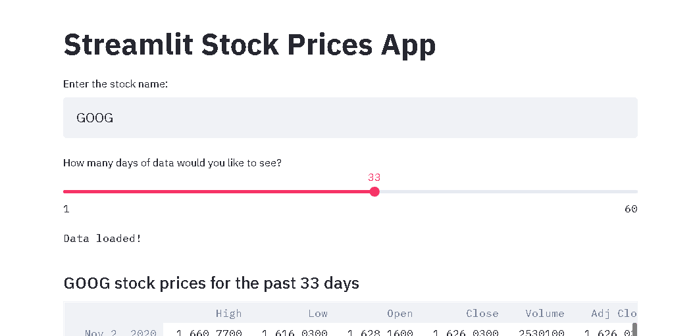
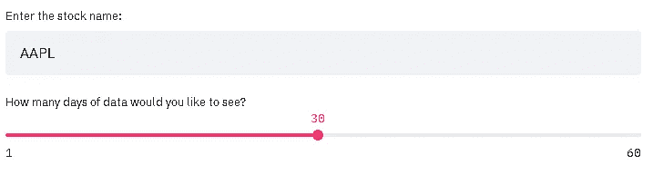
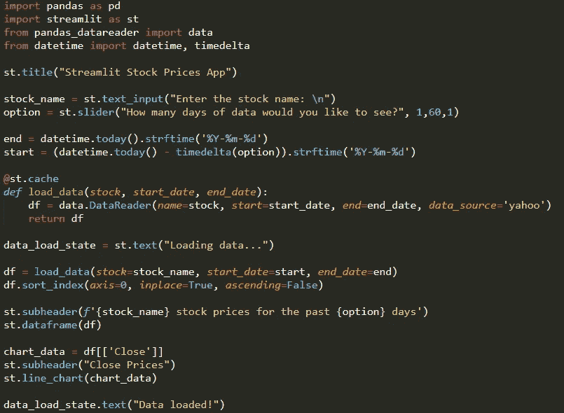
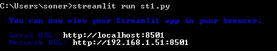
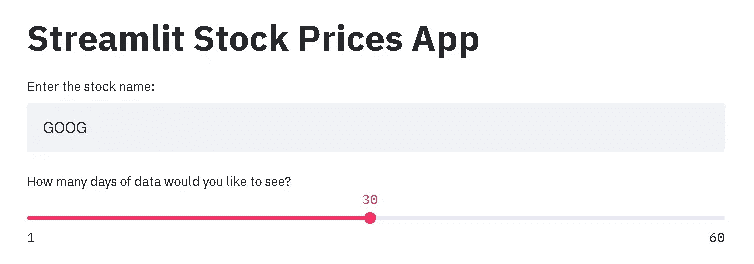

# 使用 Streamlit 快速构建数据应用程序

> 原文：<https://towardsdatascience.com/building-a-data-app-with-streamlit-in-no-time-c5942c48abd?source=collection_archive---------36----------------------->

## 创建股票价格应用程序的实用指南



Streamlit 数据应用程序(作者 GIF)

***注来自《走向数据科学》的编辑:*** *虽然我们允许独立作者根据我们的* [*规则和指导方针*](/questions-96667b06af5) *发表文章，但我们不认可每个作者的贡献。你不应该在没有寻求专业建议的情况下依赖一个作者的作品。详见我们的* [*读者术语*](/readers-terms-b5d780a700a4) *。*

当我开始我的数据科学之旅时，我对部署模型或创建 web 应用程序一无所知。我的数据科学世界被 jupyter 笔记本所束缚。

过了一段时间，我清楚地意识到我需要超越笔记本。无论我对数据做了什么，它都需要以某种方式转化为产品，以便其他人可以测试或使用它。从那时起，我开始学习部署模型和创建数据应用程序。

即使你创造了一个最先进的模型，当你坐在 jupyter 笔记本上时，它也不会创造任何价值。你可以创建一个出色的数据应用程序，但只有当其他人使用它时，它才有价值。

因此，创建产品并维护它们是数据科学领域中非常关键的步骤。

Streamlit 使将数据脚本转换成 web 应用程序变得相当容易。你不必有前端经验。你需要的只是 Python。

在这篇文章中，我们将创建一个简单的股票价格数据应用程序。它将提取并展示基于一些用户输入的股票价格。

我们将使用文本编辑器来编写脚本(我使用 sublime)。确保您的计算机上安装了 Python 3.6 或更高版本。

我们需要的依赖项可以通过 pip 从终端安装:

```
pip install streamlit
pip install pandas
pip install pandas-datareader
pip install datetime
```

让我们开始构建我们的应用程序。

第一步是导入依赖关系:

```
import pandas as pd
import streamlit as st
from pandas_datareader import data
from datetime import datetime, timedelta
```

我们可以为我们的应用程序显示一个标题:

```
st.title("Streamlit Stock Prices App")
```

下一步是检索数据。我们将使用 pandas-datareader 模块来获取股票价格数据。它需要三个输入，即股票名称、开始日期和结束日期。

我们将要求用户输入这些参数。Streamlit 提供了许多不同的方法来收集用户输入。

我们将使用 text_input 小部件向用户询问股票名称:

```
stock_name = st.text_input("Enter the stock name: \n")
```

对于开始和结束日期，我们将询问用户他们希望使用 slider 小部件查看多少天的数据。

```
option = st.slider("How many days of data would you like to see?",
      1,60,1)
```

数字参数是开始、结束和步长。

这些部件将出现在应用程序中，如下所示:



(图片由作者提供)

我们将使用 datetime 模块根据用户输入创建开始日期和结束日期。

```
end = datetime.today().strftime('%Y-%m-%d')
start = (datetime.today() - timedelta(option)).strftime('%Y-%m-%d')
```

我们把今天作为结束日期。通过回溯用户给定的天数来计算开始日期。例如，如果期权是 20 天，数据将显示过去 20 天的股票价格。

下一步是定义一个基于这些输入收集数据的函数。

```
def load_data(stock, start_date, end_date):
    df = data.DataReader(name=stock,
                         start=start_date,
                         end=end_date,
                         data_source='yahoo')
    return df
```

load_data 函数将创建一个 pandas 数据框架，其中包含基于给定输入的股票价格。

在我们调用这个函数之前，我们将显示一个描述操作状态的文本。

```
data_load_state = st.text("Loading data...")
```

当应用程序处理数据时，用户会看到“正在加载数据…”。

下一步是调用函数并创建一个熊猫数据帧。

```
df = load_data(stock=stock_name, start_date=start, end_date=end)
df.sort_index(axis=0, inplace=True, ascending=False)
```

我们现在将数据存储在数据帧中。我们有许多向用户显示数据的选项。Streamlit 提供了大量图表。例如，显示价格随时间变化的折线图会很有用。

我们不局限于 Streamlit 提供的图表。我们甚至可以运行机器学习模型来预测接下来的日子。

为简单起见，我将显示数据帧和折线图:

```
st.subheader(f'{stock_name} stock prices for the past {option} days')
st.dataframe(df) chart_data = df[['Close']]
st.subheader("Close Prices")
st.line_chart(chart_data)
```

名字让它看起来很明显。我们使用 st.dataframe()来显示数据帧，使用 st.line_chart()来创建折线图。st.subheader()允许为显示的对象添加标题。

最后一步是在应用程序处理数据时更改显示文本的状态。您可能还记得，正文是“加载数据…”。下面的代码会将其更改为“数据已加载！”。

```
data_load_state.text("Data loaded!")
```

下面是整个脚本的截图。



(图片由作者提供)

您可能已经注意到，我们在函数定义之前使用了“@st.cache”。它所做的是运行函数并将结果存储在本地缓存中。因此，如果使用完全相同的参数再次调用该函数，streamlit 将从本地缓存中读取输出，而不是再次运行该函数。

我们的剧本现在完成了。我们将把它作为 python 文件保存在当前工作目录中，然后使用命令行来运行脚本。命令是:

```
streamlit run "file_name"
```



(图片由作者提供)

当 streamlit 执行脚本时，浏览器中将会打开一个新的选项卡。



(图片由作者提供)

我们的数据应用程序现在已经完成。请注意，它目前正在您的本地计算机上运行。因此，只有你可以试验这个应用程序。

在下一篇文章的[中，我将讲述如何在 AWS EC2 实例上运行应用程序。之后，你就可以和你的朋友分享你的应用了。](https://sonery.medium.com/deploying-a-data-app-on-aws-for-free-f62e121c049e)

# **结论**

我们已经创建了一个简单的应用程序，做一个简单的任务。然而，创建复杂应用程序的过程非常相似。

使用 streamlit 最大的好处就是一切都是用 Python 完成的。大多数(如果不是全部)数据科学家都熟悉 Python，因此他们适应 Streamlit 并不困难。

如同任何其他科目一样，熟能生巧。我建议先做简单的应用程序。然后，您可以稳步增加项目的复杂性。

感谢您的阅读。如果您有任何反馈，请告诉我。