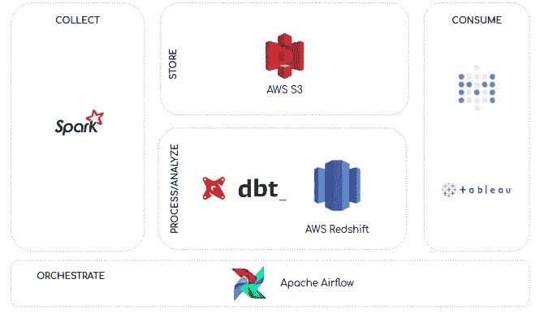

# 构建数据仓库:基本架构原则

> 原文：<https://towardsdatascience.com/building-a-data-warehouse-basic-architectural-principles-66bd7059ffd0?source=collection_archive---------6----------------------->

## [什么是数据仓库:基本架构](/what-is-a-data-warehouse-basic-architecture-ea2cd12c9bb0)

## 一种简化数据仓库的方法

由[谢尔盖·佐尔金](https://unsplash.com/@szolkin?utm_source=medium&utm_medium=referral)在 [Unsplash](https://unsplash.com?utm_source=medium&utm_medium=referral) 上拍摄的照片

数据仓库理论有很多有用的资源。然而，如此大量的资源有时会让人不知所措——或者至少在我们开始构建数据仓库时是这样。

最初，当我们开始塑造我们的数据仓库架构时，我们问的第一个问题是:*什么是数据仓库的正确架构？*然后，经过一番研究，我们意识到*没有对或错的架构。这总是取决于你的需求。*

尽管如此，在开始构建数据仓库时，您应该记住一些业内公认的有用的架构原则。特别是，在构建我们的数据仓库架构时，三个基本原则对我们帮助很大:

*   **构建解耦系统**、*即*，当涉及到数据仓库时，不要试图将所有流程放在一起。一种尺寸不适合所有人。因此，理解过程的本质，并为正确的工作使用正确的工具。
*   **实施功能性数据管道**、*即*来自管道的数据应易于重现——*例如*，如果您想要重新运行一个流程，您应确保它将始终产生相同的结果。这可以通过实施[功能数据工程范例](https://medium.com/@maximebeauchemin/functional-data-engineering-a-modern-paradigm-for-batch-data-processing-2327ec32c42a)来实现。
*   **实现一个不可变的暂存区**，*即*，数据应该存储在一个不可变的暂存区。从那里，数据应该被转换并加载到您的数据仓库中。

在我们开始遵循这些原则之后，数据仓库过程变得简单了一些。因此，在这篇文章中，我们想与你分享一些关于这种架构原则的事情，以及它们如何帮助我们建立数据仓库的架构。此外，我们希望与您分享我们在 AWS 中构建数据仓库的首次尝试。

 [## 什么是数据仓库:基本架构

### 数据仓库主要概念介绍

towardsdatascience.com](/what-is-a-data-warehouse-basic-architecture-ea2cd12c9bb0) 

# 第一个原则:构建解耦系统

该原则遵循[关注点分离原则](https://en.wikipedia.org/wiki/Separation_of_concerns)。它基于这样一个假设，即每个系统都应该以这样一种方式处理一个问题，即这个问题应该被系统本身封装起来。

具体来说，数据仓库可以分为四个关注点，可以认为是数据管道的一部分:*收集、存储、处理/分析和消费—* 查看 Siva Raghupathy 的[演讲](https://www.youtube.com/watch?v=a3713oGB6Zk)了解更多信息*。* **因此，作为我们数据管道一部分的每个系统都应该封装这四个关注点之一的职责**。

Siva Raghupathy 在[幻灯片上的插图](https://www.slideshare.net/AmazonWebServices/abd201big-data-architectural-patterns-and-best-practices-on-aws/9)

# 第二个原则:实现功能性数据管道

这个原则基于[函数式数据工程范例](https://medium.com/@maximebeauchemin/functional-data-engineering-a-modern-paradigm-for-batch-data-processing-2327ec32c42a)，这是一个将函数式编程范例引入数据工程学科的尝试。

实现功能数据管道的基础是在 ***纯任务*之上定义数据流程。**根据 [Maxime Beauchemin](https://medium.com/u/9f4d525c99e2?source=post_page-----61d3bae486b0----------------------) :

> “一个纯任务应该是[确定性的](https://en.wikipedia.org/wiki/Deterministic_algorithm)和[幂等的](https://en.wikipedia.org/wiki/Idempotence)，这意味着它每次运行或重新运行都会产生相同的结果”

因此，任何提取、转换或加载过程都应该遵循纯任务的标准——查看这篇[帖子](/implementing-the-functional-data-engineering-paradigm-in-data-load-processes-by-using-airflow-61d3bae486b0)了解更多信息。

# 第三个原则:实现不可变的临时区域

这一原则基于在数据管道上实现一个临时区域，理想情况下，数据应该以其原始形式存储，或者接近其原始形式。

我们希望使我们的资源不变，这样就可以确保数据的再现性。根据 Maxime Beauchemin 的说法，不可变暂存区原则是再现性的关键，因为从理论上来说，**它确保了从零开始重新计算整个数据仓库的状态是可能的。**

# 个案研究

数据管道架构是基于 Siva Raghupathy 提出的关注点划分而设计的:*收集*、*存储*、*处理/分析*，以及*消费。*构建解耦数据管道的问题在于，编排*和*可能会很复杂，因此，通过这种方式，我们添加了这一流程，作为设置数据管道架构时需要牢记的额外关注点。

在下一张图中，我们展示了这五个问题如何塑造我们的数据管道架构。

AWS 中的数据仓库体系结构——作者的实现

数据管道架构以这种方式解决了上述问题:

*   **收集:**使用 [Apache Spark](https://spark.apache.org/) 从本地数据库中提取数据。然后，它被加载到 [AWS S3](https://aws.amazon.com/s3/) 。
*   存储:数据以原始形式存储在 S3。它作为数据仓库的一个不可变的暂存区。
*   **处理/分析:**使用 [DBT](https://docs.getdbt.com/) 转换数据并插入 [AWS 红移](https://aws.amazon.com/redshift/)。请记住，DBT 只是作为在数据仓库内部执行转换的工具。一种解决方法是通过红移光谱外部表访问 AWS S3 数据，这样就可以使用 DBT 在红移中转换和具体化这些数据。
*   **消费:**用户通过不同的 BI 工具消费数据，如[元数据库](https://www.metabase.com/)和[表格](https://www.tableau.com/)。
*   **编排:**数据流程由气流编排。它允许解决人们在编制解耦系统时可能遇到的大多数问题。

最后，在整个数据管道中实施功能数据工程范例。我们确保所有数据流程(如、数据加载和数据转换)都是在纯任务的基础上定义的。因此，通过这种方式，我们确保了它们的确定性和幂等性——查看这篇[帖子](/implementing-the-functional-data-engineering-paradigm-in-data-load-processes-by-using-airflow-61d3bae486b0)了解更多信息。

# 结论

我们的目标是这篇文章中的信息可以让你简化数据仓库的过程。

特别是，我们相信这些*基本架构原则*可以帮助人们开始他们的过程。然而，请记住这篇文章中的信息是对整个数据仓库理论的一部分的简化。

如果你想深入了解数据仓库的理论，别忘了查看 Ralph Kimball 的数据仓库工具包。这本书是最受认可的关于数据仓库的书籍之一。

此外，您可以在这里找到一些参考资料，帮助理解一些超出本文范围的内容:

*   [什么是数据仓库:基本架构](/what-is-a-data-warehouse-basic-architecture-ea2cd12c9bb0)
*   [云数据管理](https://dataschool.com/data-governance/)
*   [数据仓库管道:基本概念&路线图](/building-a-data-warehouse-pipeline-basic-concepts-roadmap-d14032890ab6)
*   [Abd 201-AWS 上的大数据架构模式和最佳实践](https://www.slideshare.net/AmazonWebServices/abd201big-data-architectural-patterns-and-best-practices-on-aws?qid=50b8b8c9-ebf7-4c12-9c5c-acde09a1547f&v=&b=&from_search=1)
*   [在 AWS 上构建数据湖和分析；模式和最佳实践— BDA305 —芝加哥 AWS 峰会](https://es.slideshare.net/AmazonWebServices/building-data-lakes-and-analytics-on-aws-patterns-and-best-practices-bda305-chicago-aws-summit)
*   [功能数据工程——批量数据处理的现代范例](https://medium.com/@maximebeauchemin/functional-data-engineering-a-modern-paradigm-for-batch-data-processing-2327ec32c42a)
*   [通过使用气流在数据加载过程中实施功能性数据工程范例](/implementing-the-functional-data-engineering-paradigm-in-data-load-processes-by-using-airflow-61d3bae486b0)
*   [用气流概括数据加载过程](/generalizing-data-load-processes-with-airflow-a4931788a61f)
*   [构建一个不需要更新的现代批量数据仓库](/building-a-modern-batch-data-warehouse-without-updates-7819bfa3c1ee)

我们希望这些信息对你有用。

感谢阅读到最后。

下期帖子再见！

*如果你想随时更新我的作品，* ***请加入我的*** [***简讯***](https://metadatacommunity.substack.com/) ***！偶尔，我会和我的读者分享一些东西。如果你加入我会很感激:)***

 [## 对数据仓库感兴趣？

### 我已经写了几篇关于它的文章。这就是如何阅读它们！

ajhenaor.medium.com](https://ajhenaor.medium.com/interested-in-data-warehousing-424b49ec97e4)