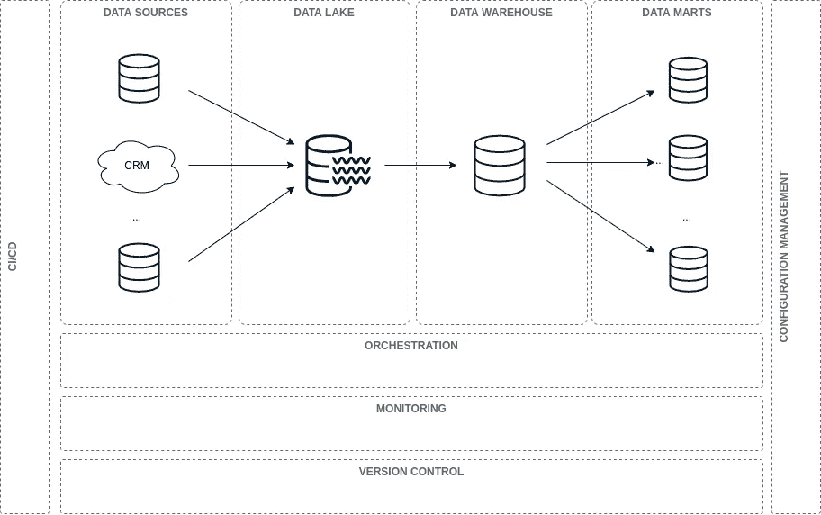

# 数据仓库管道:基本概念和路线图

> 原文：<https://towardsdatascience.com/building-a-data-warehouse-pipeline-basic-concepts-roadmap-d14032890ab6?source=collection_archive---------9----------------------->

## [什么是数据仓库:基本架构](/what-is-a-data-warehouse-basic-architecture-ea2cd12c9bb0)

## 提高数据管道可操作性和性能的五个过程

由[马克-奥利维尔·乔多因](https://unsplash.com/@marcojodoin?utm_source=medium&utm_medium=referral)在 [Unsplash](https://unsplash.com?utm_source=medium&utm_medium=referral) 上拍摄的照片

构建数据仓库管道有时会很复杂。如果你是从这个世界开始，你很快就会意识到做这件事没有对错之分。这总是取决于你的需求。

然而，在构建数据管道以提高其可操作性和性能时，有几个基本的过程应该到位。

在本帖中，我们打算与**分享一个路线图，它可以在构建数据仓库管道时作为指南**。

该路线图旨在帮助人们在通过一系列流程构建数据仓库管道时实现数据运营理念。

> **TL；DR —** 在路线图部分，我们将讨论为提高数据管道的可操作性和性能而应实施的五个流程——流程编排、监控、版本控制、CI/CD 和配置管理。
> 
> 如果您已经熟悉一些数据仓库术语，例如数据湖、数据仓库、批处理、流、ETL、ELT 等等，请直接跳到路线图部分。

# 基本概念

数据仓库世界的一个很好的起点是数据学校的书。

在本书中，他们介绍了数据复杂化的四个阶段。这些阶段是数据行业多年来一直遵循的数据管道架构模式。

## 基础建筑

数据仓库管道的基本架构可以分为四个部分:****数据源、数据湖、数据仓库、*和*数据集市**** *。*

**

*数据仓库管道架构——作者基于[数据完善的 4 个阶段](https://dataschool.com/data-governance/introduction-to-modern-data-governance/)的说明*

*根据数据学校，这些部分可以定义如下:*

*   ***数据来源:**来自业务运营的数据。这些数据来自生产数据库、CRM、API 等等。*
*   ***数据湖:***数据湖是在一个位置存储多个原始数据源的存储库*数据有多种格式。通常，在数据管道的这个阶段，数据可能通常是非结构化的，并且有点混乱。*
*   ***数据仓库:** " *数据仓库(通常也称为单一真实来源)是您的数据的干净、有组织的单一表示。有时它是完全不同的数据源，但越来越多的是虚拟结构化的，就像现有湖面上的视图模式。*”*
*   ***数据集市:** *“数据集市是数据仓库中经过过滤(有时是聚合)的子部分，使特定的组更容易查询数据。它提供了一个较小的模式，只包含该组的相关表。**

*这四个部分共同代表了数据管道的基本架构。数据从数据源向下移动到数据仓库。这可以通过*批处理*或*流*处理来完成。*

## *批处理与流*

*批处理基于批量加载数据。这意味着，您的数据每天、每小时等加载一次。*

*流处理基于在数据到达时加载数据。这通常使用[发布/订阅](https://en.wikipedia.org/wiki/Publish%E2%80%93subscribe_pattern)系统来完成。因此，通过这种方式，您可以几乎实时地将数据加载到数据仓库*中。**

*这两种类型的处理并不相互排斥。它们可能共存于一个数据管道中——更多信息请参见 [Lambda 和 Kappa 架构](/a-brief-introduction-to-two-data-processing-architectures-lambda-and-kappa-for-big-data-4f35c28005bb)。特别是，我们将在本文中重点讨论**批处理方法**。*

## *ETL 与 ELT 流程*

*批处理意味着将数据从 A 点移动到 b 点。允许执行此类任务的流程被称为 **ETL** 流程——提取、加载和转换。*

*这些过程基于从源中提取数据、转换数据并将其加载到数据湖或数据仓库中。*

*虽然，近年来，另一种方法已经被引入:ELT 方法。*

*数据学派认为这两种方法的区别在于:*

> ****ETL*** *是遗留方式，数据的转换发生在去湖边的路上。**
> 
> ****ELT*** *是现代的方法，其中转换步骤保存到数据放入湖中之后。当从数据湖转移到数据仓库时，转换真的发生了。**
> 
> *ETL 是在没有数据湖的时候开发的；正在转换的数据的暂存区充当了一个虚拟数据湖。现在存储和计算相对便宜，我们可以有一个实际的数据湖和一个建立在其上的虚拟数据仓库。*

***ELT** 方法优于 **ETL** 方法，因为它促进了最佳实践，使数据仓库过程变得更加简单— *例如，*高度可重复的过程，数据管道架构的简化，等等。*

# *数据管道路线图*

*我们建议您实施五个流程来提高数据管道的可操作性和性能。*

*这些流程是*编排*、*监控*、*版本控制*、 *CI/CD* 和*配置管理。**

*此类流程是基于[数据运营理念](https://medium.com/data-ops/what-is-dataops-ten-most-common-questions-ffc09c09c921)定义的，该理念“*是技术实践、工作流、文化规范和架构模式*的集合”，能够减少数据管道中的[技术债务](https://medium.com/data-ops/a-great-model-is-not-enough-deploying-ai-without-technical-debt-70e3d5fecfd3)——以及其他事项。*

**

*数据管道路线图——作者基于[数据完善的 4 个阶段](https://dataschool.com/data-governance/introduction-to-modern-data-governance/)的说明*

## *管弦乐编曲*

*在生活中的某个时刻，我们都编写过用于编排数据流程的 CRON 作业。*

*当数据处于正确的位置并且在预期的时间到达时，一切都会顺利进行。但是，有一个问题。事情总会在某个时候出错。当它发生时，一切都是混乱的。*

*采用更好的实践来处理数据编排是必要的——例如，重试策略、[数据编排流程一般化](/generalizing-data-load-processes-with-airflow-a4931788a61f)、流程自动化、任务依赖性管理等等。*

*随着管道的增长，流程的复杂性也在增加。CRON jobs 无法协调整个数据管道。这就是[工作流程管理系统](https://en.wikipedia.org/wiki/Workflow_management_system) (WMS)介入的地方。它们是面向系统的[，以支持稳健的操作](https://medium.com/tech-quizlet/going-with-the-flow-how-quizlet-uses-apache-airflow-to-execute-complex-data-processing-pipelines-1ca546f8cc68)，允许编排您的数据管道。*

*数据行业用的 WMS 有[阿帕奇气流](https://airflow.apache.org/)[阿帕奇路易吉](https://github.com/spotify/luigi)[阿兹卡班](https://azkaban.github.io/)。*

## *监视*

*您是否遇到过这样的情况:所有仪表板都坏了，业务用户来找您修复它们？或者你不知道你的 DW 坏了？这就是为什么您应该始终监控您的数据管道！*

*监控应该是一个主动的过程，而不仅仅是被动的过程。因此，如果您的仪表板或数据仓库出现故障，您应该在业务用户关注您之前就知道。*

*为此，您应该建立监控系统。它们持续运行，让您实时了解数据管道的健康状况。*

*用于监控的工具有 [Grafana](https://grafana.com/) 、 [Datadog](https://www.datadoghq.com/) 和 [Prometheus](https://prometheus.io/) 。*

## *CI/CD*

*更新数据管道中的变更是否涉及大量手动且容易出错的过程，以将它们部署到生产环境中？如果是这样，CI/CD 是您的解决方案。*

*CI/CD 代表*持续集成*和*持续部署*。CI 的目标是"*建立一种一致的、自动化的方法来构建、打包和测试应用程序*"。另一方面，CD " *从连续积分结束的地方开始。CD 自动向选定的基础架构环境交付应用程序。*”—更多信息[此处](https://www.infoworld.com/article/3271126/what-is-cicd-continuous-integration-and-continuous-delivery-explained.html)。*

*CI/CD 允许您以自动化的方式将更改推送到您的数据管道。此外，它将减少手动和容易出错的工作。*

*用于 CI/CD 的一些工具有[詹金斯](https://www.jenkins.io/)、 [GitlabCI](https://about.gitlab.com/stages-devops-lifecycle/continuous-integration/) 、 [Codeship](https://codeship.com/) 和[特拉维斯](https://travis-ci.org/)。*

## *结构管理*

*所以…想象一下你的数据管道基础设施因为任何原因而崩溃。例如，您需要再次部署整个编排管道基础设施。你是怎么做到的？*

*这就是配置管理发挥作用的地方。[配置管理](https://www.netapp.com/us/info/what-is-configuration-management.aspx) " *处理任何给定基础设施或软件系统在任何给定时间的状态。*“它将类似[基础设施的实践作为代码](https://en.wikipedia.org/wiki/Infrastructure_as_code)。此外，它还处理基础设施的整体配置—更多信息[请点击此处](https://medium.com/formcept/configuration-management-and-continuous-deployment-cd0892dce998)。*

*用于配置管理的工具有 [Ansible](https://www.ansible.com/) 、 [Puppet](https://puppet.com/) 和 [Terraform](https://www.terraform.io/) 。*

## *版本控制*

*最后，软件行业中最著名的过程之一:版本控制。当版本控制实践不到位时，我们都会遇到问题。*

*版本控制管理工件中的变更。这是一个[跟踪代码变更、迭代开发和团队协作的基本过程](https://www.perforce.com/blog/vcs/what-is-version-control)。*

*一些用于版本控制的工具有 [Github](https://github.com/) 、 [GitLab](https://about.gitlab.com/) 、 [Docker Hub](https://hub.docker.com/) 和 [DVC](https://dvc.org/) 。*

# *结论*

*在本帖中，我们推荐了五个流程，您应该实施这些流程来提高数据管道的可操作性和性能。*

*在实现数据管道时，这些过程通常会被忽略。我们希望这些信息能让您了解它们。*

*更重要的是，我们希望这份路线图能让您将数据管道提升到另一个可操作性水平！*

*我们希望你觉得有用。*

*直到下一次我的朋友们，*

*感谢阅读。*

**如果您想随时更新我的作品，* ***请加入我的*** [***简讯***](https://metadatacommunity.substack.com/) ***！偶尔，我会和我的读者分享一些东西。如果你加入我会很感激的:)****

* [## 对数据仓库感兴趣？

### 我已经写了几篇关于它的文章。这就是如何阅读它们！

ajhenaor.medium.com](https://ajhenaor.medium.com/interested-in-data-warehousing-424b49ec97e4)*