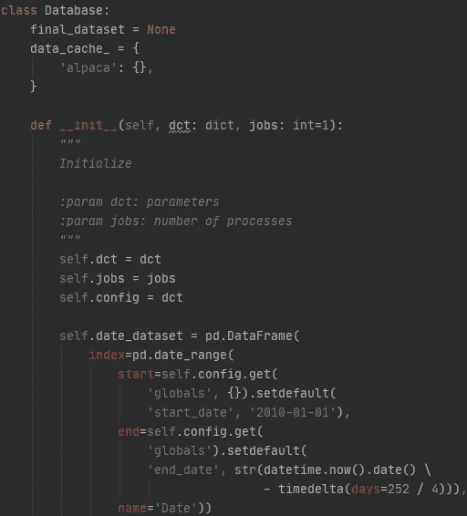
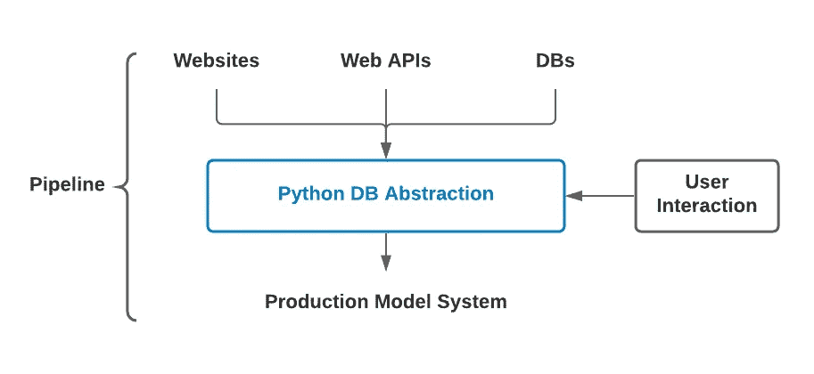
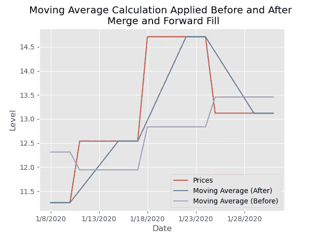

# 构建数据库—没有数据库

> 原文：<https://towardsdatascience.com/building-a-database-without-a-database-41fcbf586dd6?source=collection_archive---------28----------------------->

## 构建 pythonic 数据库类来获取、清理、转换、合并和标记数据——所有这些都不需要数据库

机器学习实践者和数据工程师都很清楚数据来源、收集、清理、转换、合并和标记的可重复性。这些活动的目的是为简化、探索性分析或建模准备数据。例如， [scikit-learn](https://scikit-learn.org/) 通过它们的 [Pipeline](https://scikit-learn.org/stable/modules/compose.html) 类在抽象数据管道方面做得非常出色。尽管如此，从多个来源提取数据的问题仍然存在，因为没有多少简单的抽象使数据争论者的生活更容易。



Python 数据库类|📸由[我](https://www.linkedin.com/in/dylancunningham/)

**问题陈述:**不同的数据是不同的，合并起来很麻烦。

**解决方案:**开发一个 pythonic 数据库抽象，以一种易于使用、健壮且生产就绪的方式合并您的数据。

## 目录

1.  抽象
2.  数据库—没有数据库—抽象
3.  介绍 Python 数据库抽象
4.  如何

## 关键概念

抽象使得编程生活更容易管理。一个数据库——没有数据库——抽象将使您的数据争论生活更加舒适，并且将是您的生产管道的一个健壮的补充。

# 1.抽象

为了不重复网上的文章，我将不解释抽象，但这里有两个参考:

*   [关键概念:抽象](https://medium.com/@mattburgess/critical-concept-abstraction-ba9e9c0f225e)(通过媒介)
*   "[面向初学者的 OOP 概念:什么是抽象？](https://stackify.com/oop-concept-abstraction/)(通过 Stackify)

> 抽象被定义为位于更复杂的事物之上，并使其对用户更简单的事物。—马特·伯吉斯在《批判的概念:抽象》中

# 2.数据库—没有数据库—抽象

没有数据库的数据库抽象(我称之为数据库抽象；不要与 SQL 数据库混淆)至少有四个用途:

*   您只需要编写一次数据争论代码
*   生产一个 ML 模型是非常容易的
*   您不需要数据存储
*   争论操作的顺序被保留并且是灵活的。



Python 数据库抽象图|📸由[我](https://www.linkedin.com/in/dylancunningham/)

## **你只需要写一次数据角力代码。**

如果有足够的远见，数据库抽象将抽象出重复进行所有争论操作的需要。挑战是使抽象足够好，以允许用户以健壮和易于使用的方式灵活地应用他们喜欢的任何操作。

下面是众所周知的数据争论操作的一个不全面的列表:查询、排序、转换、填充空值和合并。为每一个实验和/或每一个生产模型编写代码来完成这些操作(甚至更多)是很难的。

## 生产一个 ML 模型是非常容易的。

ML 管道的最终目标是做出预测(例如，对于大多数 ML 任务)。数据科学家面临的一个问题是可重复性。当数据科学家处于试验阶段时，他们会应用各种各样的争论操作来测试哪个是最佳的。将最佳操作转移到生产场景并不总是容易的。

数据库抽象将允许科学家以可重复的方式轻松地从实验阶段过渡到生产阶段，然后再返回。

## **你不需要数据存储。**

数据库抽象不需要本地或基于云的数据存储，但是您可能希望授予用户这种能力。在我的例子中，我不想管理数据库。我只是构建与 web APIs、网页等交互的功能。

> 他们的数据库是我的数据库，但他们的数据库问题不是我的问题。

注意:这种抽象的一个限制是查询速度。如果您管理自己的数据库，您可能会提高查询的性能。

## **角力作战的秩序被保留了下来，而且很灵活。**

这个目的很重要，也是一个考虑不周的问题。把操作的顺序留给用户自己去理解和记忆是一个过分的要求。解决方案是构建一次——将操作的逻辑和顺序记录下来并构建一次——然后就不必再构建一次了。

操作顺序失败示例:下面的折线图显示，如果您对已经向前填充的价格序列计算移动平均，那么您的结果将会滞后。滞后的信息是不理想的。对于这些争论不休的任务，正确的操作顺序是在跨日期展开系列之前计算移动平均值，合并到主数据集，然后向前填充。



📸由[我](https://www.linkedin.com/in/dylancunningham/)

# 3.介绍 Python 数据库抽象

下面的数据库抽象是以生产就绪的方式合并、转换和合并数据的强大而健壮的方法。它是生产管道的第一步(见上图)。事实上，您可能会以某种方式创新和合并 scikit-learn 管道功能。一种可能是创建一个名为 MyPipeline 的新类，确保继承您的数据库类。然后，您的服务、lambda 或脚本可以使用您需要的所有功能来调用 MyPipeline。

你会注意到我没有为你做所有的工作。这种抽象 25%集中在金融领域。唯一的数据源是[羊驼](https://alpaca.markets/)(我只展示我的类如何与羊驼交互，因为他们的 API 很简单，我的目的是教你如何钓鱼，而不是给你一个装满鱼的数据库)。你可能想要/需要更多的数据来源。此外，我的代码假设被争论的数据是时间序列数据。其余 75%的代码通常已经准备好供您复制、粘贴和开箱即用。我建议您根据自己的需要修改这段代码。

# 4.如何

在我们进入所有代码之前，我想向您展示一个用户或系统如何与这个数据库类交互。

```
dct = # shown later

database = Database(dct).build()
```

简单吧？

> *请注意，我将带您回顾数据库课程。例如，在我解释*构建*方法之前，我解释一下*特性*和*目标*方法，当*构建*方法使用*特性*和*目标*方法时。*

## 初始化

***首先*** ，我们创建自己的类对象，并为用户提供一种与我们的抽象轻松交互的方式:通过 *__init__* 方法。

```
class Database:
    final_dataset = None
    data_cache_ = {
        'alpaca': {},
    }

    def __init__(self, dct: dict, jobs: int=1):
        *"""
        Initialize

        :param dct: user parameters
        :param jobs: number of processes
        """* self.dct = dct
        self.jobs = jobs
        self.config = dct

        self.date_dataset = pd.DataFrame(
            index=pd.date_range(
                start=self.config.get(
                    'globals', {}).setdefault(
                    'start_date', '2010-01-01'),
                end=self.config.get(
                    'globals').setdefault(
                    'end_date', str(datetime.now().date() \
                                    - timedelta(days=252 / 4))),
                name='Date'))

    def cache_data(self, source: str, key: str, json_data: dict):
        *"""
        Cache unique raw data

        :param source: data source (e.g., alpaca)
        :param key: unique identifier of raw data
        :param json_data: response from data request
        """* _ = self.data_cache_.get(source).setdefault(key, json_data)
```

这里，我们希望用户传入一个字典(如果需要，您可以构建自己的类，允许用户以字符串形式指定存储 json 文件的文件路径),指定所需数据的位置、如何获取数据、应用什么转换、用什么命名数据等。这是用户需要的一切。

在我们了解用户词典的外观之前，这里有一些后续要点:

1.  数据缓存:由于我们不依赖于数据存储，如果我们要查询数据并对相同的数据应用不同的操作，那么我们希望缓存原始数据，这样我们就不会多次查询相同的数据。缓存原始数据将加快你的工作。
2.  多处理引擎:用户可以指定运行作业的作业或进程的数量。你所需要的是一个多重处理引擎。(如果你想了解更多关于如何设置你的引擎的知识，我将很快写一篇关于马科斯·洛佩兹·德·普拉多在他的一本书中谈到的引擎的文章，[这里](https://www.amazon.com/Advances-Financial-Machine-Learning-Marcos/dp/1119482089)。)
3.  样本外(OOS)数据:我写这个类的方式有一些细微差别。例如，我用金融机器学习的视角写了这个类。在金融机器学习中，我们的数据一般是时间/价格序列数据。所以，我把最后的 252/4=63 天留作纸上交易。该论文数据集被认为是样本外的。(最后，我得到了训练、验证、测试和 OOS 数据集。)

## 用户交互

***第二个*** ，这个类提供了足够有用的结构，而且也很灵活。在我的例子中，用户交互非常冗长。我希望用户交互清晰无误。我还希望用户能够轻松地抬起和移动。为此，数据库类需要一个包含不同级别的*键:值*对的字典，如下所示。

第一级键是*全局*、*目标*和*特征*。Globals 用于指定整个数据集级别的参数。Target 用于指定应该为目标使用什么数据，以及应该应用什么标记技术(即转换)。特征用于指定哪些数据应该用作建模的特征。

第二层的*键:值*对需要关于数据源、参数(kwargs)、从源返回的数据的名称、要删除的特性(不需要，取决于源输出)以及数据类型的信息。

第三层的 *key: value* 对允许对底层数据进行转换。这些变换以一种易于理解的方式逐一应用于每个单独的特征。

```
dct = {
    "globals": {
        "start_date": "2010-01-01"
    },
    "target": {
        "source": "alpaca",
        "kwargs": {
            "timeframe": "day",
            "symbols": "AAPL",
            "limit": "0",
            "start": "2000-01-01"},
        "clean": {
            "names": [
                "open",
                "high",
                "low",
                "target",
                "volume"
            ],
            "drop": [
                "open",
                "high",
                "low",
                "volume"
            ],
            "types": [
                "float"
            ]
        },
        "transformations": [
            {
                "function": "trend_scanning_label",
                "kwargs": {
                    "name": "target"
                }
            }
        ]
    },
    "features": [
        {
            "source": "alpaca",
            "kwargs": {
                "timeframe": "day",
                "symbols": "AAPL",
                "limit": "0",
                "start": "2000-01-01"
            },
            "clean": {
                "names": [
                    "open",
                    "high",
                    "low",
                    "close",
                    "volume"
                ],
                "drop": [
                    "open",
                    "high",
                    "low",
                    "volume"
                ],
                "types": [
                    "float"
                ],
            },
            "transformations": [
                {
                    "function": "rsi",
                    "kwargs": {
                        "days": 14
                    }
                }
            ]
        }
    ]
}
```

## 要求

***第三个*** ，below 方法请求数据，不考虑 API。这个方法将 url、headers 和 kwargs 作为参数。数据以字典的形式返回，稍后进行处理。

```
@staticmethod
def request_data(base_url: str, headers: dict=None, **kwargs):
    *"""
    Request data through web api

    :param base_url: data source base url
    :param headers: headers to pass through requests
    :param kwargs: params to pass through requests
    """* if headers is None:
        response = requests.get(base_url, params=kwargs)
    else:
        response = requests.get(
            base_url, params=kwargs, headers=headers)
    return response.json()
```

## 净化

***第四个*** ，下面的方法根据上面用户字典中的 clean 键清洗数据集。传递给该方法的数据将是来自 request_data 方法(如上)的结果，作为 pandas 数据帧。之所以有参数 date_int_s，是因为有些日期时间数据有秒，有时没有(默认值设置为 False)。

特征被命名。列被删除。数据类型已设置。索引已排序。

```
@staticmethod
def _clean_dataset(
        dataset: pd.DataFrame, dct: dict, date_int_s: bool=False):
    *"""
    Clean dataset

    :param dataset: dataframe needing cleaned
    :param dct: clean dict with names, drop, and types keys
    :param date_int_s: make True if date is an integer with seconds
    """* dataset.columns = ['DateTime'] + dct.get('clean').get('names')
    dataset.drop(
        dct.get('clean').get('drop', []), axis=1, inplace=True)
    if date_int_s:
        dataset = dataset.assign(
            DateTime=pd.to_datetime(
                dataset.DateTime, unit='s').dt.date)
    else:
        dataset = dataset.assign(
            DateTime=pd.to_datetime(dataset.DateTime).dt.date)
    dataset.set_index('DateTime', inplace=True)
    names = [name for name in dct.get('clean').get(
        'names') if name not in dct.get('clean').get('drop', [])]
    dataset = dataset.astype({
        name: dtype for name, dtype in zip(names, dct.get(
            'clean').get('types'))})
    return dataset.sort_index(ascending=True)
```

## 数据源

***第五个*** ，我们需要数据来源。在这个例子中，我使用了一个源，Alpaca，但是，正如我前面提到的，你的源方法可以是任何种类的:Web APIs，网页，S3，SQL Server，CSV，你能想到的。

让我们不要触及这些方法的所有细节，但这里有一些要点:

1.  多重处理:我们创建一个函数来与多重处理引擎交互。
2.  第三方软件包:我不喜欢依赖第三方软件包，除非它们非常有用。numpy 、[熊猫](https://pandas.pydata.org/)和 [scikit-learn](https://scikit-learn.org/stable/) 是非常有用的第三方软件包的例子。有针对羊驼的 API 的包，但是他们的 web API 足够简单。
3.  步骤:使成为查询和缓存的唯一标识符，设置头和 kwargs，从数据请求中查询并获取字典，缓存以备将来使用，使用多重处理在数据帧中快速创建数据行，然后清理数据帧。

```
@staticmethod
def _mp_alpaca(molecule):
    out = []
    for tickerset in molecule:
        for bar in tickerset[list(tickerset.keys())[0]]:
            out.append([bar.get('t'), bar.get('o'), bar.get('h'),
                        bar.get('l'), bar.get('c'), bar.get('v')])
    return out

def alpaca(self, dct: dict):
    *"""
    Get data using Alpaca's web api

    :param dct: dict of config source info
    """* key = str(sorted([(key, value) for key, value in dct.get(
        'kwargs').items()]))
    headers = {
        'APCA-API-KEY-ID': os.environ['APCA_API_KEY_ID'],
        'APCA-API-SECRET-KEY': os.environ['APCA_API_SECRET_KEY']
    }
    timeframe = dct.get('kwargs').get('timeframe')
    kwargs = {key: value for key, value in dct.get(
        'kwargs').items() if key != 'timeframe'}

    if self.data_cache_.get('alpaca').get(key, False):
        json_data = self.data_cache_.get('alpaca').get(key)
    else:
        base_url = 'https://data.alpaca.markets'
        json_data = self.request_data(
            base_url=F'{base_url}/v1/bars/{timeframe}',
            headers=headers, **kwargs)
        self.cache_data(
            source='alpaca', key=key, json_data=json_data)

    tickersets = [{ticker: barsets}
                  for ticker, barsets in json_data.items()]
    out = mp_pandas_obj(
        func=self._mp_alpaca, pd_obj=('molecule', tickersets),
        num_threads=1)
    dataset = pd.DataFrame.from_records(sum(out, []))
    dataset = self._clean_dataset(
        dataset=dataset, dct=dct, date_int_s=True)
    return dataset
```

注意:确保您的环境变量中有 APCA API 密钥 ID 和 APCA API 密钥。您可以从您的帐户中获取它们。

## 转换

***第六个*** ，我们需要一个方法来转换我们来源的数据；我们希望以某种方式构建它，以便从用户那里抽象出代码和争论任务的序列，使它灵活，并使它健壮。

下面的转换方法采用一个数据帧和一个要应用的转换列表。输出是一个转换后的要素，该要素被合并并正向填充到日期日期集中。如上所述，这个顺序是关键。稍后，您将看到这个新转换的特性是如何合并到我们的目标系列中的。

```
def transform(
        self, dataset: pd.DataFrame, transformation_lst: list):
    *"""
    Apply transformations to dataset

    :param dataset: dataframe needing transformed
    :param transformation_lst: list of dicts of transformations
    """* for transformation_dct in transformation_lst:
        if '.' in transformation_dct.get('function'):
            function = globals()[transformation_dct.get(
                'function').split('.')[0]]
            for notation_part in transformation_dct.get(
                    'function').split('.')[1:]:
                function = getattr(function, notation_part)
        else:
            function = globals()[
                transformation_dct.get('function')]
        if transformation_dct.get('kwargs', False):
            if transformation_dct.get('kwargs').get(
                    'other', False) and \
                    isinstance(transformation_dct.get('kwargs').get(
                        'other', 1), dict):
                sub_query_dct = transformation_dct.get(
                    'kwargs').get('other')
                dataset0 = self._get_data(dct=sub_query_dct)
                if sub_query_dct.get('transformations', False):
                    dataset0 = self.transform(
                        dataset=dataset0,
                        transformation_lst=sub_query_dct.get(
                            'transformations'))
                    dataset0 = self.date_dataset.copy().merge(
                        dataset0, how='left', left_index=True,
                        right_index=True).ffill()
                else:
                    dataset0 = self.date_dataset.copy().merge(
                        dataset0, how='left', left_index=True,
                        right_index=True).ffill()
                dataset = self.date_dataset.copy().merge(
                    dataset, how='left', left_index=True,
                    right_index=True).ffill()
                dataset = function(dataset, dataset0)
                continue
            else:
                dataset = function(
                    dataset, **transformation_dct.get('kwargs'))
        else:
            dataset = function(dataset)
        dataset = self.date_dataset.copy().merge(
            dataset, how='left', left_index=True, right_index=True)
    return dataset
```

## 目标

**第七个**，下面的函数采用第一级的*键:值*对，称为目标，请求数据并转换它，或者简单地将数据合并到一个日期数据集。

```
def target(self, transform: bool=True):
    *"""
    Make target dataset* *:param transform: False if using self.target standalone
    """* target_dct = self.config.get('target')
    dataset = getattr(self, target_dct.get('source'))(target_dct)
    if transform and target_dct.get('transformations', False):
        dataset = self.transform(
            dataset=dataset, 
            transformation_lst=target_dct.get('transformations'))
    else:
        dataset = self.date_dataset.copy().merge(
            dataset, how='left', left_index=True, right_index=True)
    return dataset
```

## 检索数据

**第八个**，我们需要一个检索数据的函数。

```
def _get_data(self, dct: dict):
    function = getattr(self, dct.get('source'))
    dataset = function(dct)
    return dataset
```

## 特征

**第九个**，我们需要一种快速获取特性并转换它们的方法:下面的方法。

类似于我们如何创建一个与我们的多处理引擎交互的方法，我们创建一个用于多处理特征的检索和转换的方法。一旦完成，最终的结果是一个数据集，将所有正确的争论和转换技术应用-在他们适当的顺序。

```
def _mp_features(self, molecule):
    out = []
    for feature_dct in molecule:
        dataset = self._get_data(dct=feature_dct)
        if feature_dct.get('transformations', False):
            dataset = self.transform(
                dataset=dataset,
                transformation_lst=feature_dct.get(
                    'transformations'))
        else:
            dataset = self.date_dataset.copy().merge(
                dataset, how='left', left_index=True, 
                right_index=True)
        out.append(dataset)
    return out@property
def features(self):
    *"""
    Makes features dataset
    """* if self.config.get('features', False):
        features_lst = self.config.get('features')
        try:
            out = mp_pandas_obj(
                func=self._mp_features,
                pd_obj=('molecule', features_lst),
                num_threads=self.jobs)
        except AssertionError:
            out = mp_pandas_obj(
                func=self._mp_features,
                pd_obj=('molecule', features_lst), num_threads=1)
        dataset = pd.concat(sum(out, []), axis=1)
        dataset = self.date_dataset.copy().merge(
            dataset, how='left', left_index=True, right_index=True)
    else:
        raise Exception('you need features in your dct file')
    return dataset
```

## 建设

第十个，最后我们来看最重要的方法:让它们都活起来的方法。这是用户调用来启动构建过程的方法。

该方法简单地创建了 final_dataset，该数据集包括转换后的目标和转换后的特征。如果用户在其字典中没有指定目标，则只有变换后的要素将构成 final_dataset。

```
def build(self):
    *"""
    Build dataset
    """* if self.config.get('target', False) and self.config.get(
            'target', False):
        self.final_dataset = self.target.copy(), how='left',
            left_index=True, right_index=True).merge(
            self.features.copy(), how='left', left_index=True,
            right_index=True)
        self.final_dataset = self.final_dataset.ffill().loc[
            self.investment.dropna().index]
    # only make features dataset
    else:
        self.final_dataset = self.features.ffill()
    return self
```

## 结论

在本文中，我们讨论并证明了争论任务有一个适当的操作顺序。我们构建了一个类来抽象用户自己应用这些操作的需求；我们以一种新颖的方式做到了这一点。

我希望你喜欢，我会喜欢你的反馈/挑战。

## 后续步骤

1.  错误处理:如果你想加强用户通过你的抽象所传递的字典的结构，那么你将想增加好的错误处理和可解释的错误消息来帮助你的用户。有许多错误处理将使用户的生活更容易。
2.  你应该有一个[抽象](https://docs.python.org/3/library/abc.html)类来执行某些方法。我认为这个数据库类是一个“基类”，因为其他抽象可以很容易地继承这个类。例如，在本文中，我简要解释了一种将数据库类的功能扩展到 MyPipeline 类的方法。

## 把所有的放在一起

## 参考

[1] M. Lopez de Prado，金融机器学习的进展(2018)，威利