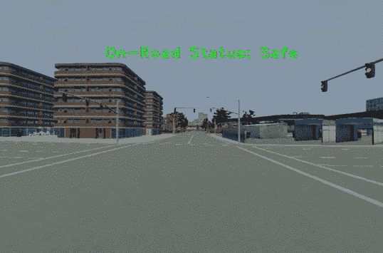
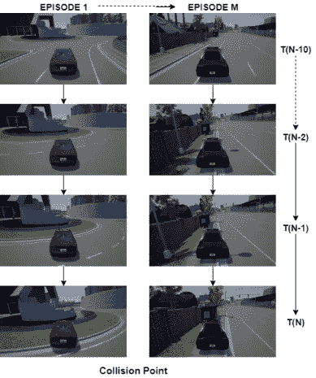
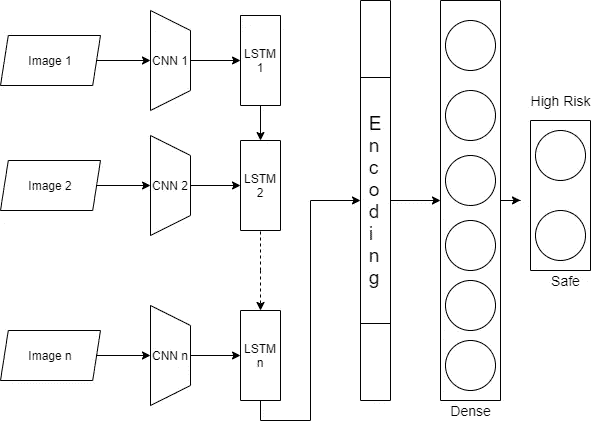
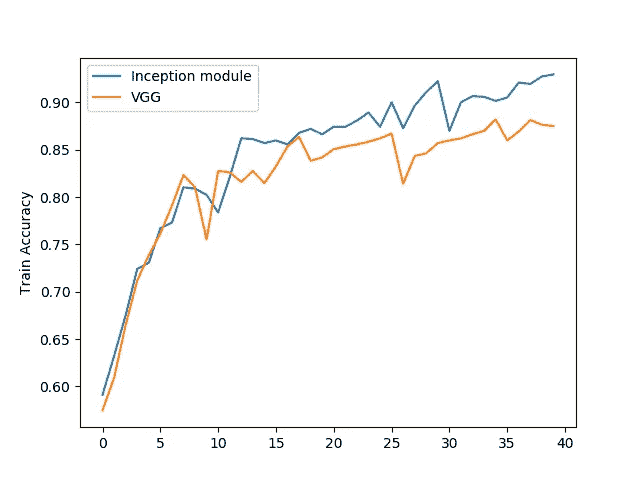
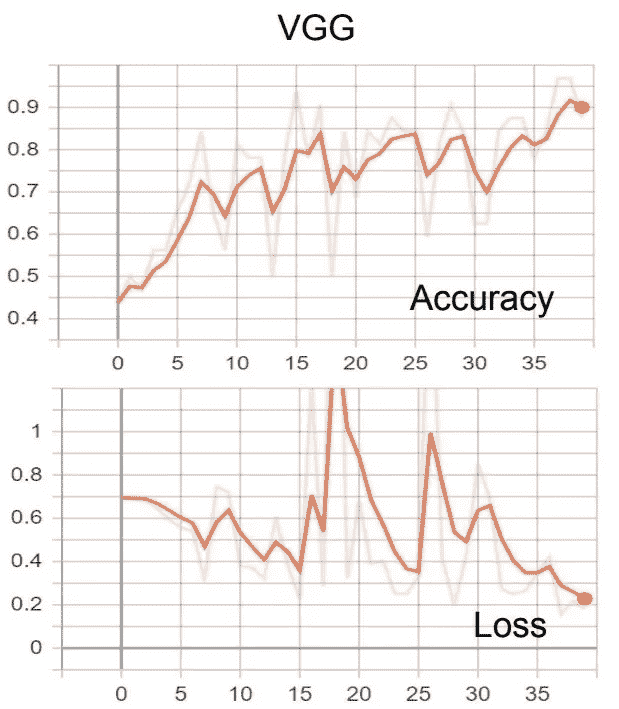
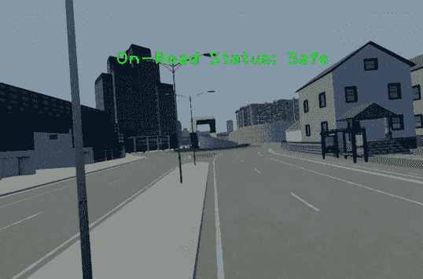
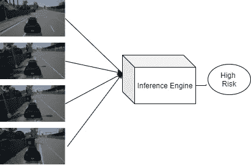

# 建立一个深度学习模型来判断你是否有风险。

> 原文：<https://towardsdatascience.com/building-a-deep-learning-model-to-judge-if-you-are-at-risk-1c96f90d666c?source=collection_archive---------38----------------------->

## 使用 CNN + LSTMs 和 Carla 预测车辆碰撞前的瞬间！

# 关于

作者照片

该项目将 CNN 和 LSTMs 结合起来，在碰撞发生前利用一系列图像预测车辆是否处于碰撞过程中。CNN 有利于图像理解，但是如果图像之间没有序列关系，我们就会错过很多时间信息来预测一系列事件如何导致事件。

## 注意:

这篇文章假设你对 CNN 和 LSTMs 有基本的了解。你不必读完整本书，这个故事更多的是解释在构建项目中所面临的挑战、各种实验和优化。所以，你可以选择你想读的东西。把它当作解决你面临的问题的起点或指南。并非所有的知识都有用。

***给我看看代码帮*** 去[这里](https://github.com/perseus784/Vehicle_Collision_Prediction_Using_CNN-LSTMs)。

# 环境

需要一个坚实的模拟环境来收集数据。 **Carla** 是一款可以提供环境等级控制的驾驶模拟软件。由于我们需要重放事故点的记忆，卡拉可以选择在违规或事故发生时发出危险信号。它也让我们使用不同种类的代理，从新手到专家。这使得卡拉成为收集数据的好选择。此外，我们还可以获得关于车辆、气候、街道物体、交通水平、速度等信息，这些信息在复杂系统中至关重要。

该项目完全建立在 Python 和 TensorFlow Keras 之上。

该项目可分为三个阶段:**收集数据，创建适当的网络和培训。**

# 1 数据收集

## 1.1 卡拉挑战

Carla 是一个图形密集型软件，令人惊讶的是，Carla 没有无头模式(在 windows 中),因此运行系统在某个时间点后变得非常慢，并且经常崩溃。

*   通过更改配置文件，Carla 的图形设置被更改为可能的最低分辨率。
*   帧数减少到 12 帧/秒，减少了机器的负载，这有助于程序收集完整的数据而不会崩溃。

## 1.2 自定义脚本

Carla 有 Python APIs，可以帮助你创建自定义代理供你四处驾驶。他们也有专业的代理人可以在地图上完美地行驶。

*   首先，我们有一个天真的代理人，他开着车在城市里转，每 4 帧拍一次照片。我们使用一个天真的代理，以便我们可以捕捉更多的事故和违规行为。
*   一旦发生事故或导致违规，CARLA 会发出危险信号，从事故发生的时间点开始，我们可以拍摄该事件过去的 15 个图像。所以，如果我们看这一系列的照片，随着时间的推移，每一张照片都让我们离事故更近了。
*   收集统一驾驶的数据很容易，我们只需使用 Carla 提供的自动驾驶 API 来驾驶，并使用相同的捕捉率来拍摄照片，以保持一致性。
*   当发生碰撞时，程序只执行最后 15 步，并自动删除该集之前的所有图像，以避免数据溢出。

## 1.3 数据处理:

收集的数据具有独特的结构，很难处理。收集的数据总量约为 40GB，很难移动数据或将数据加载到内存中，这不仅是因为数据的大小，还因为文件的数量(210，000)。此外，每个样本在事件发生前都有 15 个时间步长的图像，每个样本的图像分辨率都是 420×280 像素。

作者照片

*   Numpy 二进制格式与作为有效存储的数据类型的 *int* 一起使用。
*   将所需的时间步数从 *15 减少到 8* ，将分辨率减少到 *210 X 140。*
*   这些图像被分批存储，每个文件 8 集，以减少文件数量和加快阅读时间。
*   这些措施的结合将总体数据大小降至 8 GB，并加快了物流速度。

总共收集了 7000(集)×2(类)= 14000 个样本，每个样本包含大约 8 个用于训练网络的图像。由于环境的性质，没有应用数据扩充。这些样本是在卡拉的不同城镇和不同环境条件下收集的，以使其在不同条件下都具有鲁棒性。

# 2 模型架构

作者照片

众所周知，在处理序列或时间序列形式的问题时，随机神经网络效果最好，而 RNN 单位由于显而易见的原因被线性时间序列模型所取代。现在以时间序列的格式对给定的信息进行编码，但这仅适用于简单的数据，如数字序列。我们需要一种复杂的嵌入方法来理解复杂的数据形式。

*   对于图像，我们可以使用卷积神经网络。细胞神经网络被证明是提取空间信息的最佳方法。我们将使用一些标准的 CNN 架构来从图像中提取特征。因此，对于系列中的每个图像，我们将获得一个固定大小的特征向量，该向量可以传递到它们各自的 LSTM 时间步长单元中。
*   但是我们不需要这么多 CNN 来学习图像。三维细胞神经网络适合这类数据，它比时间相关性更适合探索和学习空间相关性。
*   因此，我们可以使用时间分布式包装器，包装我们的 CNN 层，以跨时间步长传播它。与 3D CNNs 相比，这在提取时间相关性方面要好得多，因为它仅使用单个 CNN 来学习跨时间步长的图像特征。
*   一旦这些特征以嵌入向量的形式被提取，所有这些特征在它们的时间步中被传递到它们各自的 LSTM 单元中。
*   现在，这些嵌入被带入编码器，然后传递给完全连接的层，这些层又学习分类任务。
*   图中显示了最初提出的网络，对于卷积模块，使用全 VGG 网络来获得图像嵌入。CNN 网络在时间上是分布式的，以执行每个时间步长的卷积。尽管这个网络最初看起来在逻辑上是正确的，但它经历了许多修正才达到了所示的结果。

## 2.1 培训问题

*   即使网络相对不小，训练也导致了存储器耗尽错误，因为网络在时间上是分布式的，这导致了运行时间耗尽的问题。
*   有时，训练将运行一定量的时间，并在达到上限后停止，这是由于 CNN 每层中发生的数据大小和时间分布操作。
*   因此，批量大小被减小，并且在大量实验之后，一些网络参数如滤波器大小和嵌入大小被小心地调整。

## 2.2 过度拟合

*   过度拟合一直是深度学习的致命弱点。最初，我对数据拟合过度并不感到惊讶。网络立即对给定的数据进行了超拟合，即使在 epoch1 中，准确率也是 100%。显然，测试数据中的结果非常糟糕
*   因此，我继续进行标准的过度拟合程序，如检查数据、偏差、添加批次标准化等。
*   但事实证明，这个问题对于这种网络架构来说是非常独特的。**网络过载，因为对于每个全局网络步长更新，网络的 CNN 部分更新 8 次**(时间步长数)。
*   这意味着网络的 CNN 部分正在学习太多关于图像的信息，而它下面的 LSTM 层却跟不上。
*   这个问题的解决方案是缩小 VGG 网络的规模。CNN 网络几乎减少到原始网络的一半，并且在对各种滤波器数量和组合进行重复实验之后，仔细选择滤波器。
*   此外，通过添加两个完全连接的层和漏接层而不是提议的一个层，显著提高了性能，准确率为 65–71%。

## 2.3 学习复杂时间函数

*   增加 LSTM 层中 LSTM 单元的数量会稍微提高性能，之后增加单元的数量不会产生任何影响。
*   但是在网络中添加 LSTM 层有助于提高网络的性能，这实际上使网络能够学习更复杂的时间函数，网络的准确率提高到了 86%。

## 2.4 一个更好的 CNN

*   到目前为止，VGG 层在网络中运行良好，但是可以通过添加更智能的层而不是简单的 VGG 层来提高网络的性能。

作者照片

*   为了实现这个想法，两个具有精心选择的过滤器数量的初始模块被用来代替 VGG 层。
*   值得注意的是，没有选择 ResNet 模块，因为问题不是健忘的网络，而是我们需要一个更好的特征提取器。
*   此外，需要对完全连接的层进行修改，以防止过度拟合，这令人惊讶地工作得很好，使网络的最终训练精度达到 93%。

# 3 培训

训练过程类似于分类任务，我们可以使用 softmax 交叉熵来查找损失，并使用 Adam optimizer 将其最小化。

*   与传统的(批量、通道、宽度、高度)相比，输入的维度是(批量、时间、通道、宽度、高度)。总的来说，LSTMs 比 CNN 花费更多的时间来训练，因为我们训练两者，我们可以预期训练对于分类任务来说是相当耗时的。
*   这是一个相当大的网络，大约有 1400 万个参数，它需要一个好的 GPU 进行训练，否则就会出现内存耗尽错误。幸运的是，我使用了 GTX 1080 Ti 机器，在 3 小时内完成了训练。培训和测试指标如图所示:

作者照片

*   该图显示了准确性随时间的提高，并且还可以注意到，具有初始模块的网络比基于 VGG 的 CNN 表现好很多。
*   基于 VGG 的网络已经在其损失中振荡，甚至准确度也相当低。另一方面，如图所示，具有初始模块的网络表现更好，并且具有相对稳定的收敛。
*   对于 VGG，批量大小是 16，而对于基于 inception 的批量大小是 8(由于内存耗尽)。如果我们对初始模型也使用更高的批量，那么度量会更加平滑。

作者照片

# 结果

作者照片

向该系统提供视频馈送，并且获得给定图像系列的安全级别。因此，每时每刻都会升起一面安全旗帜。

一辆汽车在各种卡拉环境中行驶的多个视频剪辑被提供给网络，它表现得非常好。

## 推论 1

*   预测依赖于车辆的速度，当实际的人驾驶汽车时，速度动态变化，而火车样本是通过恒速驾驶收集的。
*   当车辆快速行驶时，通过减少事故发生前的时间，这对于预测未来有影响，并且如果车辆缓慢行驶，这可以提前很好地预测。

## 推论 2

*   这里要注意的一件重要事情是，网络实际上学会了知道一个环境何时是安全的或有风险的。这可以清楚地看到，当车辆从碰撞、未遂事故中后退时，网络的状态从危险变为安全。
*   这种特殊情况从未出现在训练样本中，这确实意味着网络以一种有意义的方式学习了安全和危险的环境，而不仅仅是记忆碰撞模式。

# 使用

作者照片

*   该项目的核心是提取时空信息，并利用它来更好地理解我们的环境，用于风险预测、上下文和场景理解、行为识别和预测等。
*   该项目不仅可以用于自动驾驶汽车的决策系统，还可以用于手动汽车的应急协议系统，以防止极端事件。
*   该网络可以集成为汽车的一部分，汽车可以调用安全协议，例如应用刹车、打开安全气囊、部署安全预防措施，甚至可以调用位置紧急服务。在碰撞发生前几秒钟预测碰撞对于人类来说可能没有足够长的时间来做出反应，但对于机器来说，这确实是一段很长的时间。
*   这也可以用作强化学习任务的奖励生成系统。
*   这个项目虽然非常具体，但只能应用于特定的领域，在我看来，这个项目的目标是让神经网络像我们人类一样理解带有时间元素的场景。

# 课程

*   总是看你是否真的需要数据的全部复杂性，我们降低分辨率和时间步骤的数量来简化问题。
*   如果你正在使用模拟软件，检查你是否减少了所需的计算能力，自动化，加快了速度。
*   从你的想法开始，进行实验，失败，然后通过标准的社区实践来修改你的网络。随着时间的推移，这有助于你建立直觉，你可以看到自己转动网络的正确旋钮，离开随机实验。
*   每个问题都是不同的和独特的。所以，即使问题看起来很熟悉并且已经解决了，也要坚持做上面的步骤。
*   过度拟合可能有不同的原因。检查您的问题、模型和数据的性质，以开发洞察力。对于我们的问题，这是与网络的性质。
*   摆弄超参数，但是记住，这种调整不能超越对问题本质的错误假设。有时这只是我们一方的错误假设。
*   稍微了解一下每一层对整个网络的贡献，这有助于调试，例如添加一个 LSTM 层，而不是添加更多的单元。
*   如果可能的话，尝试一种不同的方法，看看是否能让你的模型变得更好。我们尝试用初始模块做实验，给了我们惊人的结果。
*   进行推理并检查网络是否实际学习了预期的目标函数是非常重要的。如果它没有很好地学习任务，数字没有任何意义。
*   看到更大的图片。您可能无法在某个地方直接或立即使用该项目。但是你从尝试一个未知的项目中获得的知识在你未来的支出中是非常有价值的。
*   我们都在一起，注意安全。

*YouTube 链接:*[*https://www.youtube.com/watch?v=5E20U7b_4zQ*](https://www.youtube.com/watch?v=5E20U7b_4zQ)

代码、外部链接和引用都在这个 [GitHub repo](https://github.com/perseus784/Vehicle_Collision_Prediction_Using_CNN-LSTMs) 里。

如果你觉得有用，请启动 GitHub repo。

我的其他作品，

 [## 我如何从零开始使用 Tensorflow 构建卷积图像分类器。

### (不使用狗 Vs 猫，从从谷歌获取图像到保存我们训练好的模型以便重用。)

medium.com](https://medium.com/@ipaar3/how-i-built-a-convolutional-image-classifier-using-tensorflow-from-scratch-f852c34e1c95)  [## 通俗地说就是强化学习。

### (包含令人敬畏的图形图像)。

medium.com](https://medium.com/@ipaar3/saturnmind-94586f0d0158)