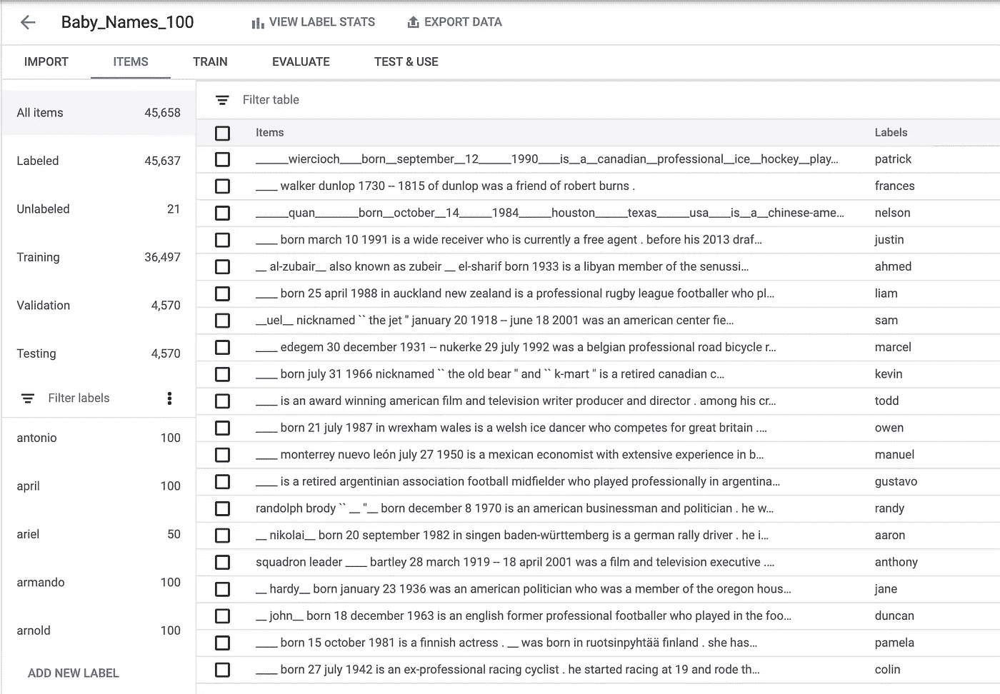
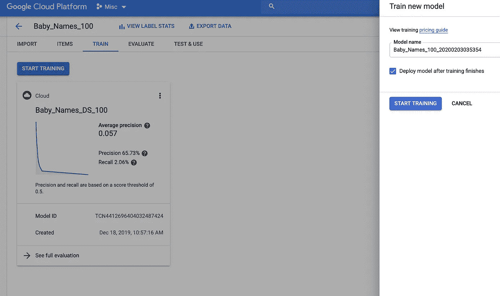
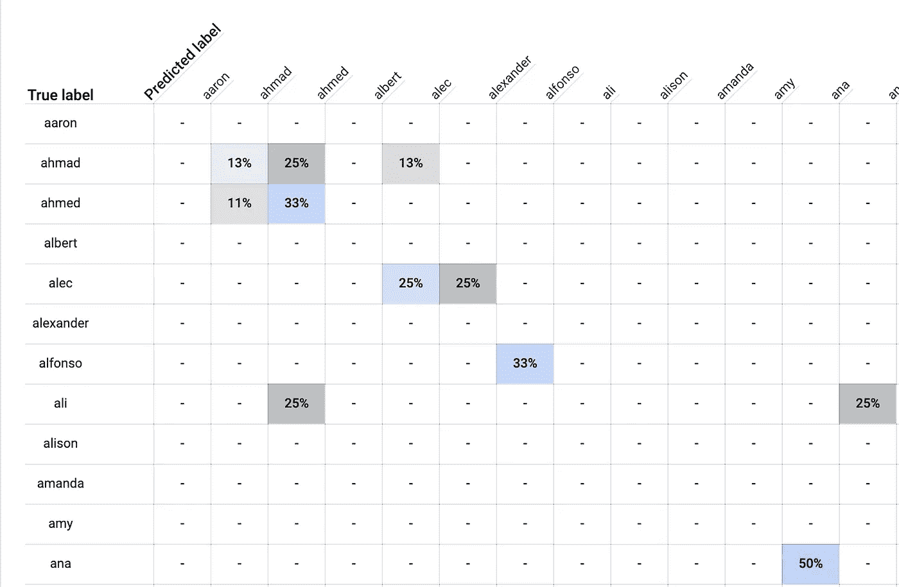

# 构建深度学习驱动的(婴儿)名称生成器

> 原文：<https://towardsdatascience.com/building-a-deep-learning-powered-baby-name-generator-5d91a14ddc3b?source=collection_archive---------21----------------------->


## 维基百科传记和深度神经网络能告诉我们名字里有什么吗？

当我年轻的时候，我总是讨厌被叫做戴尔。这主要是因为我对戴尔的最初印象是由《T2》中的《山丘之王》和《T3》中的戴尔·格里布以及纳斯卡车手小戴尔·恩哈特塑造的。


戴尔·格里布图像[信用](http://costumewall.com)，戴尔·恩哈特 Jr 图像[信用](https://en.wikipedia.org/wiki/File:DaleJrRVA2018.png)

这两个山谷都不符合我渴望的自我形象。相反，我想被命名为美少女战士。

我不喜欢我的名字是“雌雄同体”——每出生一只雌斑羚，就会有 14 只雄斑羚出生。当我问我父母这件事时，他们的理由是:

A.名字雌雄同体的女性可能更成功。

B.他们的时髦朋友刚刚给他们的女儿取名为戴尔，真是太可爱了！

值得称赞的是，作为一个成年人，我确实觉得在我的简历上，在 Github 上，在我的电子邮件签名中，甚至在 Medium 上假装是一个男人(或者不直接否认)让我受益匪浅。

但是撇开性别歧视不谈，如果真的有提名决定论(即人们倾向于选择符合自己名字的工作或生活方式)呢？如果你的名字*对你的生活有影响，那么*为一个完整的人选择一个名字是多么大的责任。我不想把这个责任留给品味、机遇或趋势。当然不是——我会转向深度学习。*)。*

在这篇文章中，我将向您展示我如何使用机器学习来构建一个婴儿名字生成器(或者更准确地说是预测器)，它获取(未来)人类的描述并返回一个名字，例如:

我的孩子将在新泽西出生。她将成为谷歌的一名软件开发人员，喜欢骑自行车和喝咖啡。

给定一份简历，该模型将返回一组姓名，按概率排序:

```
Name: linda Score: 0.04895663261413574
Name: kathleen Score: 0.0423438735306263
Name: suzanne Score: 0.03537878766655922
Name: catherine Score: 0.030525485053658485
...
```

所以理论上我应该是琳达，但在这一点上，我真的很喜欢戴尔。

如果你想亲自试用这款产品，请看这里。现在你绝对不应该把太多的重量放在这些预测上，因为 a .它们是有偏见的，b .它们就像星座一样科学。但是，让第一个婴儿由人工智能命名不是很酷吗？

# 数据集

虽然我想创建一个名称生成器，但我最终构建的是一个名称预测器。我想我会找到一堆人的描述(传记)，屏蔽掉他们的名字，并建立一个模型来预测这些(屏蔽掉的)名字应该是什么。

幸运的是，我在 Github 的一个名为[的维基百科传记数据集](https://github.com/DavidGrangier/wikipedia-biography-dataset)中找到了这样的数据集[。该数据集包含来自维基百科的 728，321 个传记的第一段，以及各种元数据。](https://github.com/DavidGrangier/wikipedia-biography-dataset)

自然，当谈到谁在维基百科上获得传记时，会有一种选择偏见(根据[百合](https://www.thelily.com/wikipedia-has-15-million-biographies-in-english-only-17-percent-are-about-women/)，维基百科上只有 15%的传记是女性，我假设非白人也可以这么说)。此外，维基百科上有传记的人的名字会倾向于偏老，因为过去 500 年出生的名人比过去 30 年多得多。

考虑到这一点，并且因为我想让我的名字生成器产生当今流行的名字，我下载了人口普查中最受欢迎的婴儿名字，并减少了我的维基百科数据集，只包括人口普查中流行名字的人。我也只考虑那些我至少有 50 本传记的名字。这给我留下了 764 个名字，大多数是男性。

在我的数据集中，最流行的名字是“约翰”，相当于 10092 个维基百科简历(令人震惊！)，接下来是威廉，大卫，詹姆斯，乔治，以及其他圣经中的男性名字。最不受欢迎的名字(我仍然有 50 个例子)是克拉克、洛根、塞德里克和其他一些名字，每个都有 50 个。为了解释这种巨大的偏差，我再次缩减了数据集的采样，为每个名字随机选择了 100 个传记。

# 训练模型

一旦我有了数据样本，我决定训练一个模型，给定维基百科传记第一段的文本，该模型将预测该传记所涉及的人的名字。

如果你已经有一段时间没有读过维基百科的传记了，他们通常会这样开头:

> 戴尔·阿尔文·格里布是[福克斯](https://en.wikipedia.org/wiki/Fox_Broadcasting_Company)动画系列[山中之王](https://en.wikipedia.org/wiki/King_of_the_Hill)、[【2】](https://en.wikipedia.org/wiki/Dale_Gribble#cite_note-off_siteref-2)中的一个[虚构人物](https://en.wikipedia.org/wiki/Fictional_character)，由[约翰尼·哈德威克](https://en.wikipedia.org/wiki/Johnny_Hardwick)、[斯蒂芬·鲁特](https://en.wikipedia.org/wiki/Stephen_Root)为[比尔](https://en.wikipedia.org/wiki/Bill_Dauterive_(King_of_the_Hill))配音，演员[丹尼尔·斯特恩](https://en.wikipedia.org/wiki/Daniel_Stern_(actor))最初都曾试演过这个角色。他是革命性的【口袋沙】[防御机制](https://en.wikipedia.org/wiki/Defense_mechanism)的创造者，一个[灭虫者](https://en.wikipedia.org/wiki/Pest_control)，[赏金猎人](https://en.wikipedia.org/wiki/Bounty_hunter)，Daletech 的拥有者[烟鬼](https://en.wikipedia.org/wiki/Chain_smoker)，[枪械](https://en.wikipedia.org/wiki/Firearm)狂热者[偏执者](https://en.wikipedia.org/wiki/Paranoid)，几乎所有[阴谋论](https://en.wikipedia.org/wiki/Conspiracy_theory)，[都市传说](https://en.wikipedia.org/wiki/Urban_legends)的信徒。

因为我不希望我的模型能够“欺骗”，所以我用一个空行替换了这个人的名字和姓氏的所有实例:“___”。所以上面的简历变成了:

*___ Alvin ___ 是福克斯动画系列中的一个虚构角色……*

这是我的模型的输入数据，它对应的输出标签是“Dale”

一旦我准备好我的数据集，我就开始建立一个深度学习语言模型。我有很多不同的方法可以做到这一点(这里有一个例子在 [Tensorflow](https://www.tensorflow.org/hub/tutorials/text_classification_with_tf_hub) 中)，但我选择使用 [AutoML 自然语言](https://cloud.google.com/natural-language/automl/docs/)，这是一种无代码的方式来建立分析文本的深度神经网络。

我将我的数据集上传到 AutoML 中，它自动将其分成 36，497 个训练示例、4，570 个验证示例和 4，570 个测试示例:



尽管我试图删除名和姓，但还是有几个中间名溜了进来！

为了训练一个模型，我导航到“训练”选项卡并点击“开始训练”大约四个小时后，训练结束了。



## **评估名称生成器**

那么名称生成器模型表现如何呢？

如果你以前建立过模型，你会知道评估质量的常用指标通常是精度和召回率(如果你不熟悉这些术语或者需要复习，请查看我的同事 Zack Akil 为了解释它们而制作的这个漂亮的交互式演示[演示](https://zackakil.github.io/precision-recall-playground/)！).在这种情况下，我的模型的准确率为 65.7%，召回率为 2%。

但是在我们的名称生成器模型的情况下，这些指标并不能真正说明问题。因为数据非常嘈杂——根据一个人的生活故事，他或她的名字应该是什么，并没有“正确的答案”。名字在很大程度上是任意的，这意味着没有模型能够做出真正优秀的预测。

我的目标不是建立一个能 100%准确预测一个人名字的模型。我只是想建立一个模型来理解关于名字和它们如何工作的一些事情。

深入了解模型所学内容的一种方法是查看一个名为[混淆矩阵](https://www.geeksforgeeks.org/confusion-matrix-machine-learning/)的表格，该表格显示了模型所犯的错误类型。这是调试或进行快速健全检查的有用方法。

在“评估”选项卡中，AutoML 提供了一个混淆矩阵。这是它的一个小角落(因为我在数据集中有太多的名字而被删掉了):



在该表中，行标题为**真标签**，列标题为**预测标签**。行表示一个人的名字*应该是*的名字，列表示模型*预测的*这个人的名字。

举个例子，看一下标有“ahmad”的第*行*你会看到一个标有“13%”的浅蓝色方框。这意味着，在我们的数据集中，所有名字为 ahmad 的人的简历中，有 13%被模型标记为“Ahmad”。同时，向右看一个框，25%的名字为“ahmad”的人的个人简介被错误地标注为“ahmed”另有 13%名叫艾哈迈德的人被错误地标注为“亚历克”

虽然这些从技术上来说是不正确的标签，但它们告诉我，这位模特可能已经学会了*关于命名的一些东西*，因为“艾哈迈德”和“艾哈迈德”非常接近叫亚历克的人也一样。该模型有 25%的时间将 alecs 标记为“alexander ”,但在我看来，“Alec”和“alexander”是非常接近的名字。

## 运行健全性检查

接下来，我决定看看我的模型是否理解关于命名的基本统计规则。例如，如果我将某人描述为“她”，模型会预测女性名字，而不是男性名字“他”吗？

对于“她喜欢吃”这个句子，预测最多的名字是“弗朗西斯”、“多萝西和“尼娜”，接下来是一些其他女性的名字。似乎是个好兆头。

对于“他喜欢吃”这个句子，最热门的名字是“吉尔伯特”、“尤金”和“埃尔默”。所以看起来这个模型理解一些性别的概念。

接下来，我想测试它是否能够理解地理如何影响名字。以下是我测试的一些句子和模型的预测:

“他出生在新泽西”——吉尔伯特

“她出生在新泽西”——弗朗西斯

"他出生在墨西哥。"—阿曼多

“她出生在墨西哥”——艾琳

"他出生在法国。"—吉尔伯特

"她出生在法国。"—伊迪丝

“他出生在日本”——吉尔伯特

“她出生在日本”——弗朗西斯

我对这位模特理解当地流行名字的能力没有什么印象。该模型似乎特别不善于理解亚洲国家流行的名字，在这些情况下往往只返回相同的一小组名字(如 Gilbert、Frances)。这告诉我，我的训练数据集中没有足够的全球多样性。

## 模型偏差

最后，我想我要测试最后一件事。如果你读过关于[模特公平](https://developers.google.com/machine-learning/fairness-overview)的书，你可能听说过很容易意外地建立一个有偏见的、种族主义的、性别歧视的、年龄歧视的等等。模型，尤其是当您的训练数据集不能反映您要为其构建模型的人群时。我之前提到过谁在维基百科上有传记是有偏差的，所以我已经预料到我的数据集中男性多于女性。

我还预计，这个模型反映了它被训练的数据，会学习性别偏见——计算机程序员是男性，护士是女性。让我们看看我是不是对的:

"他们将成为一名电脑程序员。"—约瑟夫

“他们将成为一名护士。”—弗朗西斯

“他们将成为一名医生。”—艾伯特

"他们将成为宇航员。"—雷蒙德

“他们会成为小说家。”—罗伯特

“他们将为人父母。”—何塞

“他们会成为一个典范。”—贝蒂

嗯，似乎模特*在职业方面确实学习了传统的性别角色，唯一的惊喜(至少对我来说)是“父母”被预测有一个男性名字(“何塞”)而不是女性。*

所以很明显，这个模型已经了解了*一些关于人们命名方式的东西，但并不完全是我所希望的。在为我未来的后代选择名字时，我想我又回到起点了……小戴尔？*

1.  可能没有，这和占星术一样科学。但想想还是很有趣！