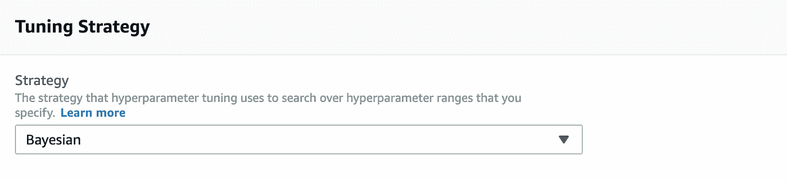

# 使用 Amazon Sagemaker 构建一个可部署的吉拉 Bug 分类引擎

> 原文：<https://towardsdatascience.com/building-a-deployable-jira-bug-classification-engine-using-amazon-sagemaker-827fda8d0460?source=collection_archive---------39----------------------->

## 循序渐进的方法


菲洛利花园的大门(鸣谢:作者自己的收藏)

*作者注:我选择这张图片是因为本文中记录的练习最终会在 AWS 上创建一个 API 网关，用于对构建在 Amazon Sagemaker 工具链之上的吉拉门票进行分类的预测模型。*

# 介绍

在之前的[文章](https://levelup.gitconnected.com/building-a-deployable-jira-bug-classification-engine-using-tensorflow-745667c72607)中，我记录了我使用 Tensorflow(特别是使用 1D CNN 和嵌入式层)构建吉拉 bug 分类引擎并将其部署为 Docker 容器的步骤。在这篇文章中，我记录了我使用 Amazon Sagemaker 工具链，特别是 BlazingText 内置文本分类算法来做同样事情的步骤。

和上一篇文章一样，这个小项目是作为一门 [AICamp](https://learn.xnextcon.com/) 课程的一部分完成的，这次是 AWS 课程中的*全栈深度学习。*

由于我已经完成了从[1]中找到的开源存储库中提取数据集的初始工作，所以我能够将处理过的 CSV 用于这个项目。

我从事这个项目的个人目标是:

1.  体验一下在 AWS 的 GPU 实例上运行培训。
2.  比较之前 1D CNN 方法的结果
3.  了解如何使用 AWS 工具链部署预测模型。
4.  体验一下 Sagemaker 的 Baysian 超参数调优工具。

和上一篇文章一样，您可以在 Gitlab 中找到笔记本和数据文件:

> [https://gitlab.com/foohm71/octopus2](https://gitlab.com/foohm71/octopus2)

我为这个项目创建了一个名为`BlazingText/supervised`的独立文件夹(如果你想知道`BlazingText`文件夹中的`word2vec`文件夹是什么，这是以后一篇文章的主题)。

# 什么是 BlazingText？

在我之前的文章中，我提到了使用 DNNs 进行文本分类的几种选择，而`word2vec`是其中之一。使用带有单词嵌入层的 1D CNN 是那篇文章中探讨的另一种方法。

## word2vec

我不打算过多地谈论`word2vec`，因为我无法对这个话题做出公正的评价，但可以说，`word2vec`是 DNN 创造单词嵌入的一种方法。

如果你想了解更多关于`word2vec`的内容，我强烈推荐你看《Word2Vec 解说！YouTube 上的 Python 程序员。本质上，`word2vec`是一个 DNN，它给定一串文本，将单词映射到一个 N 维向量空间。这背后的想法是，彼此“更接近”的单词“属于”彼此。通常这是基于它们在它被训练的文本串的句子中彼此之间的距离。然后，我们可以使用这种“接近度”来训练分类算法。

## BlazingText

BlazingText 是亚马逊对 DNN 的`word2vec`的实现，它用于创建一个单词嵌入，然后使用另一个带有嵌入的 DNN 在其基础上构建一个文本分类器。为了更好地理解这一点，我强烈推荐观看亚马逊关于这一主题的[视频](https://youtu.be/G2tX0YpNHfc)。

# 亚马逊 AWS 和 Sagemaker

我们使用几个 AWS 工具来构建和部署模型，它们是:

1.  S3——见[https://AWS . Amazon . com/getting-started/hands-on/backup-files-to-Amazon-S3/](https://aws.amazon.com/getting-started/hands-on/backup-files-to-amazon-s3/)
2.  sage maker—[https://AWS . Amazon . com/getting-started/hands-on/build-train-deploy-machine-learning-model-sage maker/](https://aws.amazon.com/getting-started/hands-on/build-train-deploy-machine-learning-model-sagemaker/)
3.  lambda—[https://AWS . Amazon . com/getting-started/hands-on/run-server less-code/](https://aws.amazon.com/getting-started/hands-on/run-serverless-code/)
4.  API 网关—[https://docs . AWS . Amazon . com/cloud 9/latest/user-guide/tutorial-lambda . html](https://docs.aws.amazon.com/cloud9/latest/user-guide/tutorial-lambda.html)

> 作者注:如果你有兴趣学习如何使用 AWS Sagemaker 栈来构建一个可部署的 ML 或 DNN 引擎，我强烈推荐参加简介中提到的 [AICamp](https://learn.xnextcon.com/) 课程。特别是如果(a)你有 ML 的经验，但是没有 AWS 的经验，或者(b)你有 AWS 的经验，但是没有那么多 ML 或 DNNs 的经验。这门课程试图在两者之间架起一座桥梁，开始时有很多手把手的练习。对我个人来说，我属于(a)组，我能够接触到 BlazingText，即使它不在课程中。

*注意:我在 Google Colab 上运行我的一些笔记本，因为在 Sagemaker notebook instance 上运行它们需要花钱。这是使用 AWS 要注意的一件事——你必须经常检查你的花费，因为你可能会让一些未使用的服务运行，这可能会增加账单。*

# 数据准备

第一步是以 BlazingText 使用的形式准备培训和验证数据。在 BlazingText [文档](https://docs.aws.amazon.com/sagemaker/latest/dg/blazingtext.html)中，它描述了两种格式:(a)行分隔和(b) JSON。为此，我们将使用(a)。

在这个练习中，我也使用了`JIRA_OPEN_DATA_LARGESET_PROCESSED.csv`，因为我想用这个结果与前一篇文章中描述的 1D CNN 进行比较。

为了将 csv 转换成 BlazingText 的格式，我使用了在**blazingtextdatapretraineval . ipynb**中找到的代码(在 gitlab repo 中，在`BlazingText/supervised`子文件夹中)。这是一个谷歌 Colab 笔记本)

```
# mapping dictionary to map the priorities to labels
labels = {“Optional”: “__label__1”,
          “Trivial”: “__label__2”,
          “Minor”: “__label__3”,
          “Major”: “__label__4”,
          “Critical”: “__label__5”,
          “Blocker”: “__label__6”}# write lst file function
def write_lst_data_to_file(path, Xdata, Ydata):
   with open(path, ‘wb’) as fp:
   num_rows = Xdata.shape[0]
   for i in range(1,num_rows):
   output = labels[Ydata.iloc[i]] + “ “ + Xdata.iloc[i]
   fp.write(output.encode(“utf-8”))
   fp.write(“\n”.encode(‘utf-8’))
```

由于数据可以读入熊猫数据帧，我只是使用 *scikit-learn* 的标准 *train-test-split* 函数来分割它们(30%测试)，然后使用这个函数将它们写入两个文件:`jira_largeset_train.lst`和`jira_largeset_test.lst`。两个文件都在 gitlab 报告里。

*注意:在笔记本****blazingtextdatapretraineval . ipynb****中，我还包含了一个标签图来显示数据是如何不平衡的。*

结果文件如下所示:

```
__label__3 Form Item’s asterix is not getting placed vertically ... 
__label__4 New beans.xml wizard should warn if the file already ... 
__label__6 focusAlpha not working This bug was imported from ...
```

接下来，你必须上传这两个文件到一个 S3 桶。

# 创建基本模型

下一步是建立一个基本模型。有两种方法可以做到这一点:

1.  使用 Sagemaker 用户界面
2.  在 Sagemaker Jupyter 实例上使用 Jupyter 笔记本

我们将首先在这里讨论(1)，并将在“评估模型”一节中介绍(2)。

第一步是点击 Sagemaker 页面上的“培训工作”


接下来点击“创建培训工作”


给你的工作起个名字。至于 IAM 角色，您必须使用一个现有的角色或者创建一个新的角色来执行 Sagemaker 任务。它应该能接触到你的 S3 水桶。此外，S3 和你的 Sagemaker 实例应该居住在同一个地区，如`us-east-1`

选择“BlazingText”和“File”输入模式。


选择资源配置。我选择了一个`ml.c5.4xlarge`和 100Gb 的存储(这可能是大材小用)。


对于超参数，我使用了以下非默认参数:

```
mode: supervised
epochs: 15
early_stopping: true
```


对于“输入数据配置”，您需要添加培训和验证渠道的 S3 位置。


您将需要创建另一个名为“validation”的通道，并用测试数据集的 S3 位置填充它。

接下来，您需要配置输出的位置。为输出路径添加有效的 S3 位置。


最后点击“创建培训工作”。这将带您进入“培训工作”主页面。你的工作需要一些时间来运行。


您现在一定想知道如何检查训练和验证的准确性。这需要使用 Cloudwatch。转到培训作业，单击它并导航到“监控”。点击“查看日志”链接，您将能够查看训练运行的日志。

培训完成后，您还可以单击“查看算法指标”链接来检查培训和验证的准确性。

对于我的运行，我得到了 0.69 的训练精度和 0.572 的验证精度，这比 1D CNN 略好。

# 超参数调谐

Amazon Sagemaker 提供了一个非常直观的 UI 工具，用于为其内置算法执行超参数调优。我在过去使用过 *scikit-learn* 来构建一个简单的 *random* 和 *grid-search* 调优，用于基于【2】的随机森林分类器(参见 Octopus2 gitlab repo 中的 **ModelAnalysis.ipynb** )。这是新的，因为 Sagemaker 工具提供了内置的贝叶斯调整算法，所以我很高兴尝试一下。

第一步是点击 Sagemaker 页面中的“超参数调整作业”


接下来单击“创建超参数调整作业”按钮


接下来给你的工作起个名字，并开启提前停止


为调整策略选择“贝叶斯”



点击“下一步”。然后点击“添加培训工作定义”


给你的培训作业定义一个名称，并填写“算法选项”，就像你在“创建培训作业”ie 中所做的那样。选择 BlazingText 等。接下来在“客观指标”框中选择`validation:accuracy`(参见下面的截图):


对于“超参数配置”，我遵循了[https://docs . AWS . Amazon . com/sagemaker/latest/DG/blazingtext-tuning . html](https://docs.aws.amazon.com/sagemaker/latest/dg/blazingtext-tuning.html)中的指导。需要注意的一点是，如果没有变体，需要将类型设置为“Static”。然后点击“下一步”。


下一页要求您填写培训和验证渠道、检查点和输出 S3 位置。这与“创建基本模型”中的相同。

接下来，在“资源配置”中，我使用了一个 100Gb 的`ml.c5.4xlarge`,我将每次运行的停止条件设置为最长 30 分钟(应该会少得多)。

对于资源限制，这取决于您配置的支出限制。对我来说，我必须将最大并行培训作业数设置为 8，将最大培训作业数设置为 100。

最后点击“创建超参数调整作业”。


这将启动运行超参数调整过程的整个过程，需要一些时间。完成后，您将看到如下内容:


单击作业，您将看到您的结果:


您还可以通过点击“培训工作”选项卡来检查所有培训工作。

# 评估模型

正如我在开始时提到的，还有另一种方法来构建模型，那就是使用 Sagemaker notebook 实例。首先，您需要创建一个实例。要做到这一点，请遵循这里的指示。

*注意:运行 Sagemaker 笔记本实例需要付费。为了省钱，一定要把它们关掉(不是删除！)不用的时候。您可以随时重新启动它们，所有存储的文件保持不变。*

在本节中，我将介绍主 gitlab repo 的`BlazingText/supervised`文件夹中的**blazingtext _ text _ classification _ jira . ipynb**笔记本的内容。

这款笔记本由 AWS 提供的示例[笔记本](https://github.com/awslabs/amazon-sagemaker-examples/blob/master/introduction_to_amazon_algorithms/blazingtext_text_classification_dbpedia/blazingtext_text_classification_dbpedia.ipynb)改装而成。

第一步是连接数据源和输出位置:


和


然后为培训作业设置容器


设置培训参数


然后训练！(这当然需要一段时间)


接下来，创建 Sagemaker 端点


*注意:如果不使用，请确保删除端点，否则您将为保持其运行而付费。您可以随时通过稍后在笔记本上运行该命令来重新启动它，Sagemaker 知道选择最后一个经过训练的模型。要删除端点，命令在笔记本底部:*


下一部分将向您展示如何对模型端点执行预测:


响应是一个带有概率和预测标签的 JSON


## 模型评估

我喜欢使用 AWS Sagemaker 和 AWS 工具链创建、训练和部署(您将在下一节中看到)模型的便利性，但是我对缺少评估模型的工具感到非常恼火。因此，我不得不从头开始构建这一部分。

我想做的是使用验证数据集，并通过预测算法运行它，创建一个*混淆矩阵*，并计算标准指标，如*精度*、*召回*和*准确度*。为此，我必须创建一个零矩阵并填充它


我能够从 https://[www.python-course.eu/confusion_matrix.php](http://www.python-course.eu/confusion_matrix.php)找到一些计算精度/召回指标的代码，并且能够生成这些指标:


然后我用混淆矩阵用`matplotlib`创建了一个热图。


接下来，我想看看这个模型在一个完全不同的数据集下是如何支撑的。在 Octopus2 中，我已经创建了`JIRA_OPEN_DATA_ZOOKEEPER.csv`数据集，所以我使用相同的代码对其进行预测，并计算了指标和混淆矩阵。


*注意:看起来像是被零除了，因为数据集没有包括一些标签，所以我选择忽略它们，因为它给了我我正在寻找的信息。该算法在全新数据集上的表现如何。*

虽然整体精度不好(低于 50%)，但精度还不错。接下来我想检查混淆矩阵:


您将会注意到，它看起来与使用验证数据集的那个非常相似。

肯定还有更多工作可以做，以改善这一模式。好消息是现在有了一个评估任何新模型的机制。

# 部署模型

本节简要介绍了以下步骤:

1.  使用在“创建基本模型”或“超参数调整作业”中创建的培训作业，创建一个模型
2.  使用该模型创建 Sagemaker 端点
3.  创建 Amazon Lambda 来处理传入的预测请求
4.  创建 API 网关以公开 HTTP POST API

## 创建模型和 Sagemaker 端点

首先选择一个训练作业:这可以是第一个训练作业，也可以是超参数调整作业中的一个训练作业。然后在那里，点击“创建模型”按钮。


给模型起个名字，选择合适的 IAM 角色。我使用默认的“容器定义”和“网络”。然后我点击了“创建模型”按钮。

接下来，您将是您创建的模型列表。选择您的新模型，然后单击“创建端点”。


加上一个名字和通常的东西。选择“创建新的端点配置”。单击“创建端点配置”。


然后点击“创建端点”。


*注意:即使没有流量，Sagemaker 终端也要花钱。请确保在用完之后删除它们。*

## 创建 Lambda

导航到亚马逊 Lambda。点击“创建功能”。


选择“从头开始创作”。给函数起个名字，选择一个运行时(我用的是 Python 3.6)。点击“创建功能”。

下一页是你构建和测试 Lambda 的地方。在“功能代码”部分，我使用了以下代码:

```
import json
import os
import boto3ENDPOINT_NAME = os.environ['ENDPOINT_NAME']sgm_runtime = boto3.client('runtime.sagemaker')reverse_label_map = {"__label__1": "Optional",
                     "__label__2": "Trivial",
                     "__label__3": "Minor",
                     "__label__4": "Major",
                     "__label__5": "Critical",
                     "__label__6": "Blocker"}def format_payload(data):
   list = []
   list.append(data)
   payload = {"instances": list}
   return json.dumps(payload)def lambda_handler(event, context):
   data = event['body']
   payload = format_payload(data)
   response = 
      sgm_runtime.invoke_endpoint(EndpointName=ENDPOINT_NAME,  
                                  ContentType='application/json',
                                  Body=payload) prediction = json.loads(response['Body'].read().decode())
   prediction_label = prediction[0]['label'][0]
   mapped_prediction = reverse_label_map[prediction_label] return {
      'statusCode': 200,
      'body': mapped_prediction}
```

本质上，它得到的有效载荷是这样的

```
{ "body": "some text to classify"}
```

并在表单中创建一个有效负载

```
{ "instances": ["some text to classify"]}
```

并将其发送到预测引擎。我们已经在前一节“评估模型”中看到了这个表单。一旦获得响应，它就提取响应有效载荷的`label`部分，并执行从`__label__X`到实际 bug 优先级的转换。

接下来您需要做的是通过填写“功能代码”部分下面的表单来设置环境变量`ENDPOINT_NAME`。输入您在上一节中创建的端点名称。


有一个测试工具，您可以在其中传递测试负载来测试 Lambda。我建议你用它来检查它的工作情况。这是不言自明的，网上有相关文档。

## 创建 API 网关

导航到亚马逊 API 网关。选择以构建 REST API。


填写相同的和通常的东西，然后点击“创建 API”。完成后，按照[https://docs . AWS . Amazon . com/API gateway/latest/developer guide/API-gateway-Create-API-as-simple-proxy-for-lambda . html](https://docs.aws.amazon.com/apigateway/latest/developerguide/api-gateway-create-api-as-simple-proxy-for-lambda.html)的“创建 Hello World API”一节中的步骤操作。当然，请确保使用您的 Lambda 函数，而不是那里提供的函数。

一旦完成，您将获得您的方法的 API 网关 URL，并且您将能够将您的 API 与有效负载结合起来。

# 参考

[1]吉拉社会知识库，马可·奥图等著[https://github.com/marcoortu/jira-social-repository](https://github.com/marcoortu/jira-social-repository)

[2]Hyperparameter Tuning the Random Forest in Python，Will Koehrsen，2018 年 1 月[https://towardsdatascience . com/Hyperparameter-Tuning-the-Random-Forest-in-Python-using-scikit-learn-28 D2 aa 77 DD 74](/hyperparameter-tuning-the-random-forest-in-python-using-scikit-learn-28d2aa77dd74)

[3]“word 2 vec 解释！”，Python 程序员(YouTube)[https://youtu.be/yFFp9RYpOb0](https://youtu.be/yFFp9RYpOb0)

[4]“亚马逊 SageMaker 内置算法网络研讨会系列:炽热的文字”，亚马逊，[https://youtu.be/G2tX0YpNHfc](https://youtu.be/G2tX0YpNHfc)