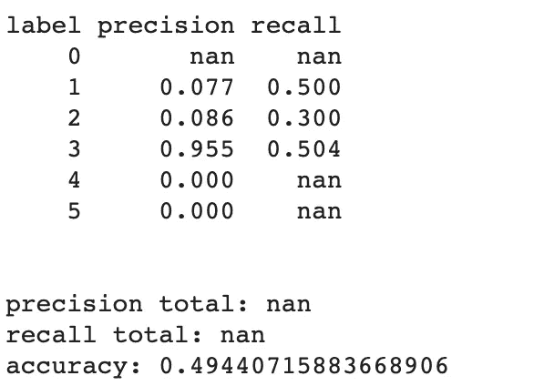

# 使用 Google AutoML 构建可部署的吉拉 Bug 分类引擎

> 原文：<https://towardsdatascience.com/building-a-deployable-jira-bug-classification-engine-using-google-automl-a0497ad8c475?source=collection_archive---------53----------------------->

## 循序渐进的方法


从吉萨看到的金字塔(鸣谢:作者自己的收藏)

*作者注:我选择这张图片是因为这个练习的一个要点是 AutoML 在引擎盖下是多么复杂，但谷歌在让事情变得简单方面做得非常好。各种 AutoML 工具与其他 GCP 工具(如云存储、应用引擎等)共存，就像金字塔与吉萨市的其他部分共存一样。*

# 介绍

在本系列的第一篇[文章](https://levelup.gitconnected.com/building-a-deployable-jira-bug-classification-engine-using-tensorflow-745667c72607)中，我详细介绍了如何使用 Tensorflow 构建一个吉拉 bug 分类引擎。在后续的[文章](/building-a-deployable-jira-bug-classification-engine-using-amazon-sagemaker-827fda8d0460)中，我描述了使用 Amazon 的 BlazingText 构建和部署类似引擎的一步一步的方法。在本文中，我详细介绍了使用 Google 的 AutoML 完成同样工作的步骤。

和上一篇文章一样，我将使用[1]中的数据集。

我这样做的个人目标如下:

1.  感受一下使用 Google 的 AutoML 引擎，尤其是“自然语言”工具集
2.  对 AutoML 和 BlazingText 之间的分类结果进行比较
3.  对部署分类引擎的步骤进行比较

和上一篇文章一样，您可以在 Gitlab 中找到笔记本和数据文件:

> [https://gitlab.com/foohm71/octopus2](https://gitlab.com/foohm71/octopus2)

我已经创建了一个文件夹`AutoML/textClassification`来存储这个项目中的文件。

由于构建这个分类引擎的大多数步骤都是通过 UI 完成的，所以我把所有步骤都放在了 Gitlab repo 中的 Google Colab 笔记本`GCPAutoMLDataPrepTrainEval.ipynb`中。

# 什么是 AutoML？

我可能不会在这里详细解释什么是 AutoML，所以我会让你看一个视频(见[2])。

一言以蔽之:还记得你用 Scikit-learn 或者 Tensorflow 做机器学习的时候吗？你要做的是尝试几种不同的模型和超参数集。这整个过程可以自动化，这是 AutoML 所做的。

因此，在这种情况下，您需要做的是(类似于 BlazingText)，您需要将训练数据集格式化为特定算法类(在这种情况下为文本分类)将接受的格式，然后让 AutoML 完成其余工作。

# 谷歌云和云自然语言

这个项目使用了几个 GCP(谷歌云平台)工具:

1.  谷歌云存储
2.  云自然语言
3.  谷歌应用引擎

> 作者注:如果你有兴趣在 GCP 上学习机器学习，我强烈推荐 Coursera 的[数据工程，大数据，以及 GCP 专业化](https://www.coursera.org/specializations/gcp-data-machine-learning)在线课程上的机器学习。它是自定进度的，并且有许多免费的实验室。还有一个关于 GCP 基础知识的 YouTube 系列，你可以在这里找到【3】。

GCP 最棒的一点是，当你刚起步时，他们会给你 300 美元的免费服务。因此，如果你只是想尝试一下，这是一个很大的激励。要了解更多信息，请参见 https://cloud.google.com/free 的。

## 走向云自然语言

对于那些熟悉 GCP 的人来说，这是显而易见的:只需导航到 GCP 控制台，在侧边菜单的“人工智能”下查找“自然语言”。

对于刚到 GCP 的人，您需要:

1.  在浏览器上访问“http://console . cloud . Google . com”。
2.  使用服务帐户创建一个新项目(稍后您需要服务帐户来进行预测)参见此处的说明。
3.  如果你点击侧边菜单，你将能够导航到“人工智能”部分下的“自然语言”。

当你到达“自然语言”时，你会看到:


单击“自动文本和文档分类”部分的“开始”链接。您将看到的页面是“数据集”页面。

# 数据准备

在我点击“新数据集”链接，选择“多标签分类”后，我花了一段时间才弄清楚格式化训练数据的方式是什么。并尝试导入 CSV 文件。原来系统需要另一种格式的数据。

这是我通过点击工具提示(即那个“？”)选择“从电脑上传 zip 文件”后。这是这样说的:


我决定使用第一种方法。以下是我用来将我的 CSV 转换成这种格式的代码(您也可以在笔记本中找到):

# 导入数据

下一步是下载 documents.zip 并上传到 AutoML 进行处理。这可能需要一些时间，但好事情是，一旦完成，他们会给你发一封电子邮件。

处理完成后，当您单击“项目”选项卡时，您会看到如下内容:


最棒的是，你可以点击“查看标签统计”来查看标签的分布等，你也可以查看数据。我个人非常喜欢这个工具。


# 培养

要开始培训，只需点击“培训”选项卡，然后点击“开始培训”。这将需要几个小时来运行，因为它正在搜索最佳算法和超参数。任务完成后，您会收到一封电子邮件。


## 评估模型培训

培训完成后，您会看到类似这样的内容:


点击“查看完整评估”,您会看到如下内容:


您可以选择左侧的每个标签来查看精度和召回指标。我非常喜欢的一点是，它们实际上会列出真阳性、假阴性和假阳性，供您进行某种分析。


# 部署模型

这再直接不过了。单击“测试和使用”选项卡，然后单击“部署模型”。


*作者注:完成后一定要删除模型，因为如果你继续运行它，你会被收费。*

## 测试模型

一旦模型展开，你可以带着你的模型兜一圈(双关语)。有很多方法可以做到这一点，云自然语言提供了一些方法。

第一种方法是输入一些文本，让模型预测:


下面提供了下一个锅炉板代码(sh 和 python)。你可以在你自己的机器上做或者打开一个谷歌云外壳。


# 将模型公开为 API

为此我使用了谷歌应用引擎。这是相当直接的。

## 创建 AppEngine 应用程序

首先导航到谷歌控制台上的应用引擎。然后寻找快速入门指南。在“标准环境演练”中选择 Python，并按照步骤在 Cloud Shell 中克隆样本代码。

在“appengine”文件夹下，您会看到以下 4 个文件:

1.  app.yaml
2.  main.py
3.  requirements.txt
4.  测试. sh

接下来，我使用测试 Python 代码将其与示例 AppEngine 代码合并:

需要注意一些事情:

*   型号名称将因您而异
*   服务帐户信用也将不同

您可以通过运行以下命令在本地(或在 google cloud shell 上)对此进行测试:

*   `python3 main.py`
*   `sh test.sh`

您应该会看到这样的内容:

```
{
  "prediction": "Major",
  "score": 0.7177224159240723,
  "statusCode": 200
}
```

## 部署应用程序

首先你需要创建应用程序(我在谷歌云壳上做了这个):

```
gcloud app create
```

接下来部署应用程序:

```
gcloud app deploy app.yaml \
    --project <project id>
```

## 测试部署

部署应用程序后，您将在屏幕上看到应用程序引擎应用程序 URL。然后你可以使用`curl`来测试它:

```
curl -X POST -H "Content-Type: application/json" 
  -d '{"title": "TestSizeBasedThrottler fails occasionally",       
       "description": "Every now and then TestSizeBasedThrottler fails reaching the test internal timeouts.I think the timeouts (200ms) are too short for the Jenkins machines.On my (reasonably fast) machine I get timeout reliably when I set the timeout to 50ms, and occasionally at 100ms."}' 
   "https://octopus-282815.uc.r.appspot.com/predict"
```

# 评估模型

本练习的目标之一是评估 AutoML 生成的模型与前一篇文章中的 BlazingText 相比如何。因为我已经为 BlazingText 创建了测试数据集，所以我只需要再次使用它。

## 使用测试数据集

以下是我使用的代码

输出:


这接近 BlazingText 的结果。

## 使用另一个数据集

正如在 BlazingText 文章中一样，我也使用了`Zookeeper`数据集来评估模型。

这是我得到的:



*(nan 是由于被零除，因为一些标签不存在于该数据集中)*


这也类似于使用 BlazingText 获得的结果。

# 结论

总的来说，这是我使用 GCP 的 AutoML 自然语言分类器后的印象。

1.  该算法的性能与 BlazingText 相似。
2.  起初，关于如何格式化训练数据的文档有点难以找到。
3.  我真的很喜欢摄取后数据的呈现方式，因为它给了我一些分析数据的方法，而无需编写任何代码。
4.  我真的很喜欢训练后评估模型的工具，尤其是显示真阳性、假阳性等的表格
5.  使用 App Engine 构建一个无服务器的 API 接口相当容易。对于 BlazingText，我使用的是 AICamp 课程提供的基本模板。
6.  我真的很喜欢这个事实，有云壳做 CLI 的东西。对于 BlazingText，我不得不使用 Sagemaker 的 Jupyter 笔记本中的一个 shell 来完成一些工作。

# 参考

[1]吉拉社会知识库，马可·奥图等著[https://github.com/marcoortu/jira-social-repository](https://github.com/marcoortu/jira-social-repository)

[2]针对 Keras 和 TensorFlow (14.1)、杰夫·希顿、[https://youtu.be/TFUysIR5AB0](https://youtu.be/TFUysIR5AB0)的自动机器学习(AutoML)

[3]欢迎来到谷歌云平台:https://youtu.be/4D3X6Xl5c_Y、谷歌云平台、[GCP 精要](https://youtu.be/4D3X6Xl5c_Y)