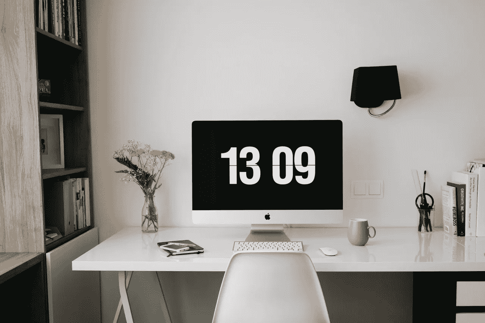
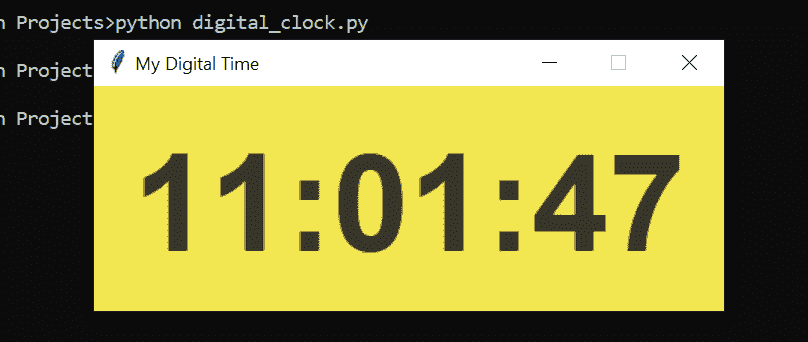

# 使用 Python 构建数字时钟

> 原文：<https://towardsdatascience.com/building-a-digital-clock-using-python-349b691c5cd7?source=collection_archive---------9----------------------->

## 如何使用 Tkinter 包创建简单的 python 应用程序



照片由[像素](https://www.pexels.com/photo/apartment-architecture-business-chair-265129/?utm_content=attributionCopyText&utm_medium=referral&utm_source=pexels)的[皮克斯拜](https://www.pexels.com/@pixabay?utm_content=attributionCopyText&utm_medium=referral&utm_source=pexels)拍摄

在这篇文章中，我将向你展示如何使用 python 来构建和设计你的数字时钟窗口。这是一个简单的 Tkinter 入门项目，Tkinter 是 Python 自带的一个内置包。Tkinter 基本上是一个图形用户界面包。它有很好的特性，可以用来创建简单的应用程序。今天我们将用它来创造我们的数字时钟。

建造你自己的数字钟的最大好处是你可以随心所欲地定制它。从文本字体到背景颜色，所有的功能都可以定制。如果你准备好了，让我们开始吧！

## 目录

*   ***巨蟒***
*   ***导入库***
*   ***设计应用程序窗口***
*   ***数字钟功能***
*   ***运行应用***

# 计算机编程语言

Python 是一种通用编程语言，在分析数据方面越来越受欢迎。Python 还能让您快速工作，更有效地集成系统。世界各地的公司都在利用 Python 从他们的数据中收集知识。官方 Python 页面如果你想[了解更多](https://www.python.org/about/)。

# 导入库

在这个项目中，我们将使用两个库。而且这两个都是 Python 自带的，也就是说我们不用安装。这种类型的库被称为 Python 内置包。

我们将使用的主要软件包是 Tkinter。你可以从官方文档页面这里[了解更多关于 Tkinter 的信息。](https://docs.python.org/3/library/tkinter.html)

因此对于这一步，我们需要做的就是将它们导入到我们的程序中:

```
from tkinter import Label, Tk 
import time
```

# 设计应用程序窗口

在这一步，我们将首先使用 Tkinter 包定义窗口面板。之后，我们将定义我们想要用于数字时钟的文本设计。

## 定义窗口

如前所述，我们将使用 Tkinter 包。Tkinter 可以定义为 Tk。并且定义好之后，我们会对其进行定制。

```
app_window = Tk() 
app_window.title("My Digital Time") 
app_window.geometry("350x150") 
app_window.resizable(0,0)
```

**理解代码:**

*   定义 Tkinter 函数。
*   给我们的应用程序窗口添加一个标题。
*   定义我们的视频的大小，例如在我的例子中，它是 350 像素宽到 150 像素高。
*   该窗口不可调整大小，因为文本值不是响应式设计。我们不希望我们的设计在窗口大小改变时看起来很奇怪。

完美，我们的申请窗口准备好了！现在，让我们开始设计时钟。

## 标签设计

程序中最酷的一步是这个。因为你可以把自己的喜好放进设计里。这一步会让你的作品与众不同。如果你热爱设计，是时候展示你的技能了。

我们将定制四个元素:

*   数字的字体。
*   我们的数字时钟的背景颜色。
*   数字的颜色，确保它不是你背景的颜色。😉
*   文本的边框宽度。

以下是我在设计中使用的价值观:

```
text_font= ("Boulder", 68, 'bold')
background = "#f2e750"
foreground= "#363529"
border_width = 25
```

对于颜色，可以随意使用 RGB 值或十六进制值。在我的例子中，我使用了颜色的十六进制值。我使用谷歌浏览器上的颜色选择器。在谷歌搜索上搜索“拾色器”就可以了。你会看到的。

现在，让我们结合元素并定义我们的标签。标签函数是将显示我们的时间的文本。

```
label = Label(app_window, font=text_font, bg=background, fg=foreground, bd=border_width) label.grid(row=0, column=1)
```

如果你想了解更多关于标签函数的属性，这里的[是我找到的一个不错的页面。](http://effbot.org/tkinterbook/label.htm)

# 数字时钟功能

如果我们正在做一个应用程序项目，函数是让事情运转的最好方法。函数也很棒，因为它们使程序更加结构化，更容易理解。好吧，让我们定义我们的数字钟功能:

```
def digital_clock(): 
   time_live = time.strftime("%H:%M:%S")
   label.config(text=time_live) 
   label.after(200, digital_clock)
```

**理解代码:**

*   在第一行中，我们使用时间包获得了实时性。我们也在定义我们想要的格式。由于我们正在设计一个数字时钟，“小时，分钟，秒”将是一个很好的格式。
*   在第二行中，我们只是将实时分配给标签方法。这样，数字时间将被更新。
*   最后，我们再次调用该函数，以便数字时钟显示实时时间。这样每隔 200 毫秒时间就会更新一次。在编程中，这被称为递归循环。在函数内部调用同一个函数。感觉像是创意，是不是很酷？

# 运行应用程序

太好了！你做到了这一步，这是我们申请项目的最后一步。如你所知，除非你调用它们，否则函数不会运行。为了触发应用程序，我们将调用函数。让我们运行应用程序:

```
digital_clock()
app_window.mainloop()
```

## 结果

```
python digital_clock.py
```



作者照片

干得好！您已经只用 python 创建了一个简单的数字时钟应用程序。Python 是一种非常强大的语言，我们可以用 python 创造无限的东西。这是关于思考一个想法，并使其工作。希望你喜欢读我的文章。从事像这样的动手编程项目是提高编码技能的最好方式。

我很高兴你今天学到了新东西。如果您在执行代码时有任何问题，请随时[联系我](https://sonsuzdesign.blog/)。😊

> 关注我的[博客](https://medium.com/@lifexplorer)和 [youtube](https://www.youtube.com/behicguven) 频道，保持灵感。谢谢你，

## 更多 Python 文章:

[](/building-a-face-recognizer-in-python-7fd6630c6340) [## 用 Python 构建人脸识别器

### 使用 OpenCv 库进行实时人脸识别的分步指南

towardsdatascience.com](/building-a-face-recognizer-in-python-7fd6630c6340) [](/building-a-movie-recommender-using-python-277959b07dae) [## 使用 Python 构建电影推荐器

### 使用 scikit-learn 的简单实用的机器学习项目

towardsdatascience.com](/building-a-movie-recommender-using-python-277959b07dae)