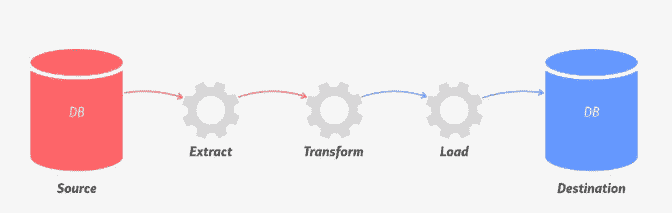
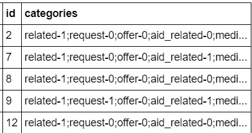
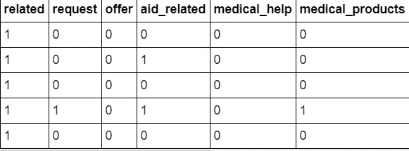
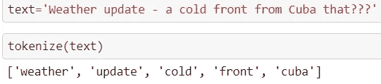
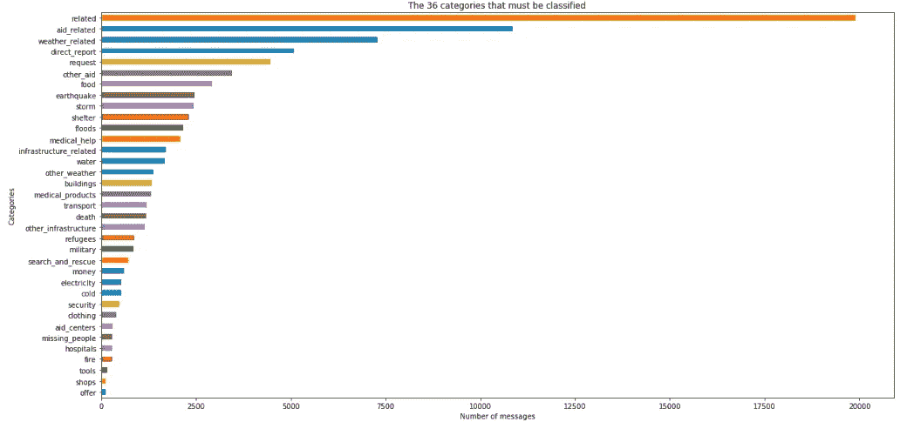

# 构建灾难响应网络应用程序

> 原文：<https://towardsdatascience.com/building-a-disaster-response-web-application-4066e6f90072?source=collection_archive---------50----------------------->

## 在现实生活中使用机器学习模型来对抗灾难

# 当前问题

2019 年全球共发生 [409](https://www.statista.com/statistics/510959/number-of-natural-disasters-events-globally/) 起自然灾害。具有讽刺意味的是，由于 Covid19，我们现在正处于全球疫情的中心。在灾难期间或灾难发生后，数百万人直接或通过社交媒体进行交流，以获得政府或救灾和恢复服务的帮助。如果受影响的人在推特上发布消息，甚至向帮助热线服务发送消息，那么该消息很可能会在收到的数千条消息中丢失。有时，这是因为很多人只是在发微博，很少有人需要帮助，组织没有足够的时间来手动过滤掉这么多信息。

因此，在这个项目中，我们将构建一个灾难响应 web 应用程序，该应用程序将消息分类为不同的类别，如医疗用品、食物或阻塞道路，并将它们发送到正确的组织以提供快速恢复！


[图片来源](https://images.unsplash.com/photo-1475776408506-9a5371e7a068?ixlib=rb-1.2.1&ixid=eyJhcHBfaWQiOjEyMDd9&auto=format&fit=crop&w=500&q=60)

# 数据概述

我们将分析灾难事件中发送的真实信息。数据由[数字 8](https://appen.com/)收集，由 [Udacity](https://classroom.udacity.com/courses/ud257) 提供，非常感谢他们。我们来看数据描述:

1.  **messages.csv:** 包含 id、发送的消息和类型，即方法(直接，推文..)消息已发送。
2.  **categories.csv:** 包含 id 和类别(相关、报价、医疗援助..)该消息属于。

# ETL 管道

因此，在这一部分中，我们将在公共 id 列上合并两个数据集, **messages.csv 和 categories.csv** 。id **categories.csv** 中的类别列是字符串格式，因此我们需要为每个类别创建列。然后，我们将删除重复项，并将转换后的数据加载到使用 SQLAlchemy 库托管的数据库中。



类别的形式如下:



类别. csv

转型后:



最后，我们将转换后的数据加载到数据库: **disaster.db**

签出整个 ETL 管道[**这里**](https://github.com/harshdarji23/Disaster-Response-WebApplication/blob/master/Jupyter%20Notebooks/ETL%20Pipeline%20Preparation.ipynb)

```
engine = create_engine('sqlite:///disaster.db')
df.to_sql('disaster_response', engine, index=**False**)
```

# ML 管道

这里，我们将从 disaster.db 数据库加载数据集。我们的主要任务是将消息转换成令牌，以便它们可以被解释。因此，我们创建了一个函数，它将删除标点符号，[标记](https://www.nltk.org/api/nltk.tokenize.html)单词，删除停用单词，并执行[词汇化](https://www.geeksforgeeks.org/python-lemmatization-with-nltk/)。

```
url_regex = 'http[s]?://(?:[a-zA-Z]|[0-9]|[$-_@.&+]|[!*\(\),]|(?:%[0-9a-fA-F][0-9a-fA-F]))+'**def** tokenize(text):
    *# Detect URLs*
    detected_urls = re.findall(url_regex, text)
    **for** url **in** detected_urls:
        text = text.replace(url, 'urlplaceholder')

    *# Normalize and tokenize and remove punctuation*
    tokens = nltk.word_tokenize(re.sub(r"[^a-zA-Z0-9]", " ", text.lower()))

    *# Remove stopwords*
    tokens = [t **for** t **in** tokens **if** t **not** **in** stopwords.words('english')] *# Lemmatize*
    lemmatizer=WordNetLemmatizer()
    tokens = [lemmatizer.lemmatize(t) **for** t **in** tokens]

    **return** tokens
```

这就是我们的函数要做的:



**输出**

这些词是有意义的，但是它们不能被 ML 模型理解。因此，我们将使用[计数矢量器](https://www.youtube.com/watch?v=RZYjsw6P4nI)和 [tfidf](https://www.youtube.com/watch?v=WN18JksF9Cg) 转换器将令牌转换为特征(整数)，并使用简单的随机森林分类器来拟合训练数据。

```
pipeline = Pipeline([
    ('vect', CountVectorizer(tokenizer = tokenize))
    , ('tfidf', TfidfTransformer())
    , ('clf', MultiOutputClassifier(RandomForestClassifier()))])pipeline.fit(X_train, Y_train)
```

为了评估我们的模型，我们将使用 [F-1 评分](https://medium.com/analytics-vidhya/accuracy-vs-f1-score-6258237beca2)，因为假阴性和假阳性对我们来说都很重要，也就是说，如果我们无法预测正确的邮件类别，那么我们就无法提供正确的帮助，如果我们错误地预测了邮件的类别，那么我们就是在浪费时间。

[随机森林分类器](/understanding-random-forest-58381e0602d2)给我们的 F-1 分数为 **0.44。**得分低的主要原因是类别高度不平衡。这些类别的分布如下:



分配

让我们使用一些不同的 ML 模型和超参数调整来改进模型。因此，在进行 GridSearchCV 以找到随机森林模型的最佳参数后，我们能够将 F-1 分数增加到 **0.51。**接下来，我们训练 [AdaBoost](https://scikit-learn.org/stable/modules/generated/sklearn.ensemble.AdaBoostClassifier.html) 分类器，我们能够将 F-1 分数提高到 **0.59**

```
*#https://medium.com/swlh/the-hyperparameter-cheat-sheet-770f1fed32ff*
pipeline_ada = Pipeline([
    ('vect', CountVectorizer(tokenizer=tokenize)),
    ('tfidf', TfidfTransformer()),
    ('clf', MultiOutputClassifier(
        AdaBoostClassifier(base_estimator=DecisionTreeClassifier(max_depth=1, class_weight='balanced'))
    ))
])parameters_ada = {
    'clf__estimator__learning_rate': [0.1, 0.3],
    'clf__estimator__n_estimators': [100, 200]
}cv_ada = GridSearchCV(estimator=pipeline_ada, param_grid=parameters_ada, cv=3, scoring='f1_weighted', verbose=3)
```

我们将这个模型保存为 pickle 文件，这样我们就不需要再次训练它。代码可用[此处](https://github.com/harshdarji23/Disaster-Response-WebApplication/blob/master/Jupyter%20Notebooks/ML%20Pipeline%20Preparation.ipynb)

```
pickle.dump(cv_ada, open('disaster_ada_model.sav', 'wb'))
```

# 烧瓶应用

我们将创建一个**train _ classifier . py**来创建转换、加载、构建和保存模型的函数。基本上，我们将使用 ETL 管道和 ML 管道。我们将创建一个名为 app 的文件夹，其中包含一个 master.html 文件，该文件将作为前端，run.py 将在后端运行以执行计算。代码可以在[这里](https://github.com/harshdarji23/Disaster-Response-WebApplication/tree/master/workspace/app)和[这里](https://github.com/harshdarji23/Disaster-Response-WebApplication/tree/master/workspace/app/templates)找到。以下是演示:[https://Twitter . com/harshdarji _ 23/status/1256761506949222407？s=20](https://twitter.com/harshdarji_23/status/1256761506949222407?s=20)

# 结论

构建一个全栈多输出的 ML web 应用，将灾害发生时发送的消息进行不同的分类，提供不同救灾组织的快速援助。您可以按照此处的说明[在自己的电脑上运行该应用程序。](https://github.com/harshdarji23/Disaster-Response-WebApplication)

*感谢您的阅读！*