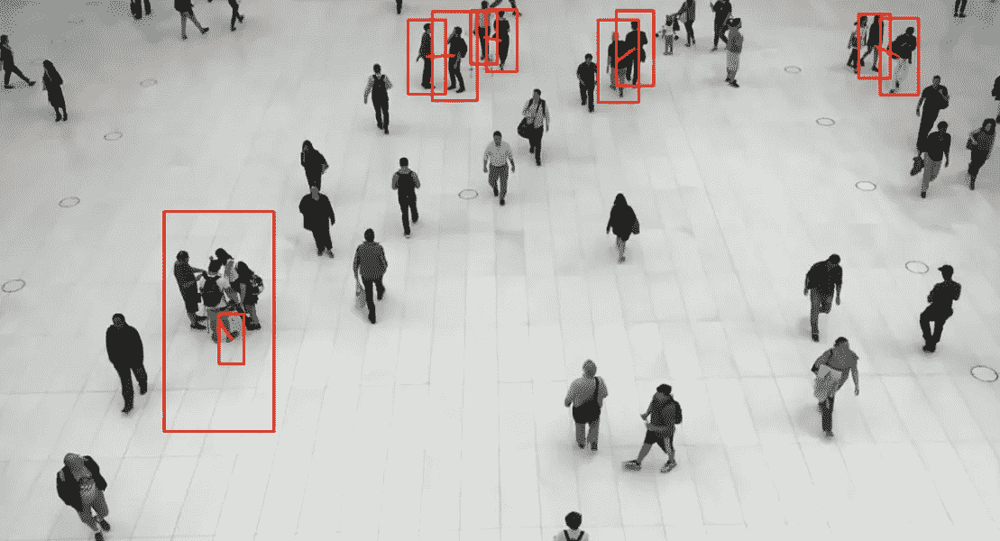
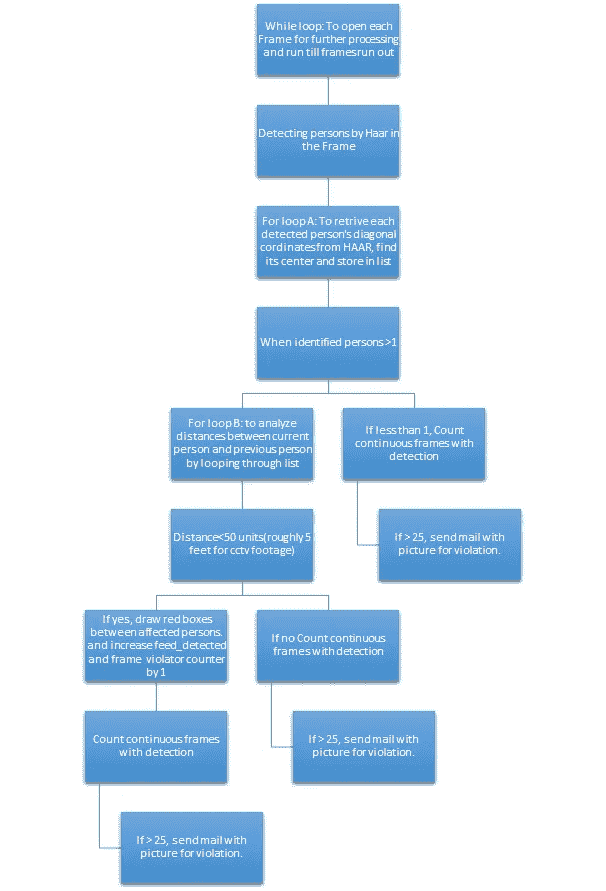
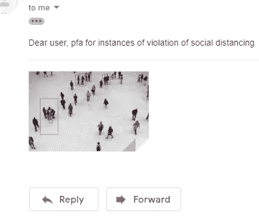

# 为后锁定时代构建距离违例检测器(D.V.D)

> 原文：<https://towardsdatascience.com/building-a-distance-violation-detector-d-v-d-for-a-post-lockdown-era-5b9894f5a6b1?source=collection_archive---------29----------------------->

## 人工智能驱动的解决物理距离“问题”的方法



随着各国开始有放松封锁规范的想法，最终外出的人之间保持 5 英尺或以上的物理距离可能在阻止新冠肺炎传播方面发挥关键作用。

我第一次接触到这个想法是在加利福尼亚州旧金山的一家计算机软件公司。该程序通过闭路电视监控录像实时监控和跟踪人群，寻找相互之间距离小于 5-6 英尺的人群。在这些团体上画一个红框，以告知监督当局。

一个人不断监控安全摄像头以识别红色块的违规行为听起来可能像是浪费宝贵的人力资源。因此，我在程序中集成了一个邮件功能，一旦发现违规行为，它会立即通知当局。违规的定义可根据地方当局设定的标准来设定，这些标准可能从两人一起步行到超过 20 人的聚会不等。下面是代码和解释。已经在 Google Collab 上用 GPU 运行时编译过了。

```
import time
import smtplib
from email.mime.multipart import MIMEMultipart
from email.mime.text import MIMEText
from email.mime.base import MIMEBase
from email import encoders
from google.colab.patches import cv2_imshow
from google.colab import drive
import pandas as pd
import cv2
import math
import numpy as np
drive.mount(“/GD”)
```

我决定使用一个非常简单的分类器，即哈尔级联分类器，用于全身检测，这是由(Paul Viola，2001)开发的预训练分类器。如果你想了解更多关于这个分类器上的检测模块的信息，你可以在[这里](https://docs.opencv.org/3.4/db/d28/tutorial_cascade_classifier.html)阅读。这可以在 OpenCV 库中找到。最近的发展已经产生了更好和更快的分类器，比如更快的 R-CNN 和 YOLO，我将尝试在未来的版本中使用它们来改进这个模型。

```
person_clf = cv2.CascadeClassifier(‘/GD/MyDrive/dataset/haarcascade_fullbody.xml')
# Initiate video capture for video file
cap = cv2.VideoCapture(‘/GD/My Drive/dataset/mall_walking.avi’)
writer = None
OUTPUT=’/GD/My Drive/dataset/output_’+str(YOUROUTPUTFILENAMEHERE)
```

这里，分类器的一个实例已经加载到 person_clf 中，并且已经设置了带有违规标记的已分析视频的输出目录。 **cv2。VideoCapture 用于加载我们的测试视频，是 cv2 对象的一个预构建的可调用函数。**

```
def center(c):
  x_start=d[‘box’+str(c)+’x’]
  y_start=d[‘box’+str(c)+’y’]
  x_end=d[‘box’+str(c)+’x+w’]
  y_end=d[‘box’+str(c)+’y+h’]
  Point=int((x_start+x_end)/2), int((y_start+y_end)/2)
  return Point
def mailer(pic,mail):
  path=”/GD/My Drive/dataset/”+pic
  from = “[YOURMAILHERE]”
  to = "[TARGETMAILHERE]"
  message = MIMEMultipart()
  message[‘From’] = from
  message[‘To’] = to
  message[‘Subject’] = “Violation notification”
  body = “Dear user, pfa for instances of violation of social    distancing”
  msg.attach(MIMEText(body, ‘plain’))
  filename = pic
  attachment = open(path, “rb”)
  p = MIMEBase(‘application’, ‘octet-stream’)
  p.set_payload((attachment).read())
  # encode into base64
  encoders.encode_base64(p)
  p.add_header(‘Content-Disposition’, “attachment; filename= %s” %  filename)
  msg.attach(p)
  s = smtplib.SMTP(‘smtp.gmail.com’, 587)
  s.starttls()
  s.login(from, “YOURPASSWORDHERE”)
  text = msg.as_string()
  s.sendmail(from, to, text)
  s.quit()
```

在做类似的工作时，为你的项目构建函数是帮助迁移学习的好方法。因此，我在这里创建了两个基本函数，一个用于查找两点之间的中心，另一个用于向目标发送带有附件的邮件。我将在下面详细解释中心函数。mailer 函数获取 pic 的名称，该名称存储在我的 Google drive 中，具有违例时刻，并将它附加到带有消息正文的邮件中，并发送给目标。我发现这篇文章[这里](https://www.geeksforgeeks.org/send-mail-attachment-gmail-account-using-python/)真的信息量很大，我用它来结合这一点。

现在转到主函数。为了理解主代码，我们必须首先理解不同类型的循环运行的层次结构以及它们所做的工作。



# 代码解释

```
i=1
contn_frame_with_detection=0
skipped_frames=0
while cap.isOpened(): 
```

我们调用存储输入视频的 cap 实例并打开它，这样我们就可以一次处理一帧。这是我们的第一个 while 循环，因此所有的代码都在里面。我们还启动了 3 个计数器。“I”保持正在处理的帧的计数，“contn_frame_with_detection”保持已经检测到违规的连续帧的数量，“skipped_frames”保持没有发现违规的检测帧之间的帧的计数。跳过帧的概念将在后面讨论。

```
frame_violator=0
l=[]
d={}
person_id=0
ret,frame = cap.read()
if not ret:
  break
```

这里，另一个计数器‘frame _ violator’被启动，以计数在每个帧中检测到违规的次数。如果他们只需要检测大型集会而忽略 2、3 个人一起行走，一些管理机构可能喜欢将它保持为高。预期在第一帧中检测到第一个人，person_id 被设置为 1。**‘cap . read()’帮助我们读取帧并存储以供进一步处理。**它还被指示在帧结束时中断。

```
frame = cv2.resize(frame, None,fx=0.95, fy=0.95, interpolation = cv2.INTER_LANCZOS4)
gray = cv2.cvtColor(frame, cv2.COLOR_BGR2GRAY)
persons = person_clf.detectMultiScale(gray, 1.02, 5)
```

我们首先需要用 cv2.resize()将帧的大小调整到 60%左右，这样计算就可以实时进行，而不会影响速度。如果你有比谷歌 Collab Gpu 更快的处理器，你可以让它更高。cv2。INTER_LANCZOS4 通常被认为是最好的插值方法，但是根据图像的上采样或下采样，也可以使用其他方法，如 INTER_LINEAR、INTER_AREA。COLOR_BGR2GRAY 方法用于将具有 3 个通道的 BGR 图像(OpenCV 就是这样读取图像的)转换为只有 1 个通道的灰度图像。可以看出，在使卷积层均匀的同时，灰度级的计算要低得多，并且不会丢失太多信息，因此更易于机器处理。因此，我们使用 cv2 的 detectMutiScale 方法从灰度图像中检测给定帧中的人。需要注意的是，这返回了一个矩形对角线的起点和终点坐标，在这个矩形中可以找到被检测的人。我们将这些坐标存储在 persons 变量中，以便以后逐个循环。

```
for (x,y,w,h) in persons:
  d[‘box’+str(person_id)+’x’]=x
  d[‘box’+str(person_id)+’y’]=y
  d[‘box’+str(person_id)+’x+w’]=x+w
  d[‘box’+str(person_id)+’y+h’]=y+h
  l.append(center(int(person_id)))
  if person_id>0:
    s=0
    feed_detected=0
    for mid in l[:-1]:
      dist = math.sqrt((mid[0] — center(int(person_id))    [0])**2 + (mid[1] — center(int(person_id))[1])**2)
      if dist<=40:
        cv2.rectangle(frame, (d[‘box’+str(s)+’x’], d[‘box’+str(s)+’y’]), (d[‘box’+str(s)+’x+w’], d[‘box’+str(s)+’y+h’]), (0, 0,255), 2)
        cv2.line(frame,(int(mid[0]),int(mid[1])),(center(int(person_id))[0],center(int(person_id))[1]),(0,0,255),(2))
        feed_detected+=1
        frame_violator+=1
        s+=1
     if feed_detected>0:
        cv2.rectangle(frame, (x, y), (x+w, y+h), (0, 0, 255), 2)
   person_id+=1
```

上面的代码构成了这个算法的逻辑核心。我们首先开始逐个循环每个人**(对于循环 A)** ，并将矩形的坐标存储在 python **字典中，以格式['box-person_id-x']: value 命名。**然后我们调用我们的**中心函数**找到这个人的质心，并存储在一个列表中。函数 **center** 接收要计算质心的 person_id，从起点和终点的字典中检索他的数据，并计算中心坐标。现在，根据我们的层级，第二个循环被初始化**(对于循环 B)** 当帧中的 person_id 大于 0 时，(实际上意味着多于两个人)，其与每个先前检测到的人的质心的距离通过简单的**欧几里德距离公式**来计算。如果检测到违规，feed_detector 加 1，表示输入的 feed 有违规，在检测到的违规周围画一个红框，用 cv2.rectangle 保持**颜色尺寸为(0，0，255 ),表示红色**用于 cv2 使用的 BGR 格式。

```
if frame_violator>0 and skipped_frames<4:
  contn_frame_with_detection+=1
  skipped_frames=0
else:
  skipped_frames+=1
if skipped_frames>=4:
  contn_frame_with_detection=0
  skipped_frames=0i+=1
```

引入了一个**跳过帧计数器来解决我们模型的假阴性**。在两个检测到的违规帧之间将有许多帧，其中 HAAR 分类器可能甚至不能检测到所有人。这将导致错误地将帧识别为无违规。因此，当我们看到检测到违规的连续帧的数量时，我们还必须看到跳过的帧是否保持在某个数量以下。如果 skipped_frame 大于 5，这可能意味着先前发生违规的帧实际上可能只是误报，因此我们应该再次将 continuous_frame_counter 设置为 0，并将 skipped_frames 设置为 0，重新开始计数。

```
if contn_frame_with_detection>25:
  contn_frame_with_detection=0
  skipped_frames=0
  name=”pic”+str(i)+”.jpg”
  cv2.imwrite(‘/GD/My Drive/dataset/’+name,frame)
  mailer(name)
```

为了**加强检测为真阳性，我们仅考虑当 continuous_frame_counter 超过 25** (或更高，取决于用户的需要)时的重大距离违规。



收到的自动邮件的屏幕截图

此时，我们**通过调用 cv2.imwrite 函数拍摄一张图片，并调用我们预定义的邮件函数来提供 jpg 图片的名称**。因此，该邮件功能立即向目标用户发送邮件，向他更新情况。

```
if writer is None:
   vid_write= cv2.VideoWriter_fourcc(*”XVID”)
   writer = cv2.VideoWriter(OUTPUT, vid_write, 35,(frame.shape[1],    frame.shape[0]), True)
writer.write(frame)
```

最后，我们让**成为 cv2 的一个实例。用 XviD 格式保存我们的视频文件，一次一帧**。

```
#this will outside main while loop
writer.release()
cap.release()
cv2.destroyAllWindows()
```

到达帧的末尾后，我们释放 writer，cap，并通过 cv2.destroyAllWindows()销毁**的所有窗口，这样计算机就不会崩溃。下面是该程序的输出示例**

样本输出

好的，一天之内要理解的循环相当多。我试图从零开始构建每一个功能，并通过逻辑实现整个事情，因此这些复杂的循环。我将会在网上发布如何使用 Azure ml 的 EC2 实例来部署它。我希望你喜欢程序背后的直觉，并且能够欣赏用于构建它的各种计数器和循环。任何人有任何想法，也许添加一些功能到这个程序或使它运行得更快，肯定可以联系我。在那之前，万岁和数据科学。

# 来源

科尔德威，D. (2020 年 4 月)。[*https://TechCrunch . com/activity-monitoring-startup-Zen sors-re purposes-its-tech-to-help-coronavirus-response。*](https://techcrunch.com/activity-monitoring-startup-zensors-repurposes-its-tech-to-help-coronavirus-response.) 检索自 Techcrunch:[https://Techcrunch . com/2020/04/02/activity-monitoring-startup-Zen sors-re purposes-its-tech-to-help-coronavirus-response/](https://techcrunch.com/2020/04/02/activity-monitoring-startup-zensors-repurposes-its-tech-to-help-coronavirus-response/)

琼斯，P. V. (2001 年)。 *opencv* 。从 Github 检索:[https://Github . com/opencv/opencv/tree/master/data/Haar cascades](https://github.com/opencv/opencv/tree/master/data/haarcascades)

保罗·维奥拉，法学博士(2001 年)。*使用简单特征的增强级联的快速对象检测。*[www.cs.cmu.edu。](http://www.cs.cmu.edu.)