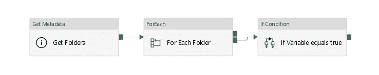
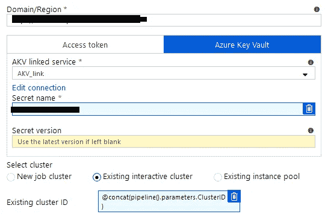
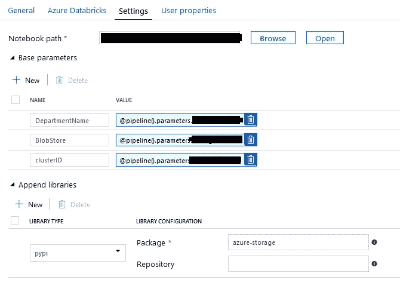
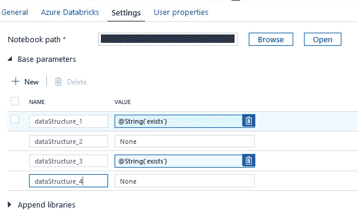

# 用 Databricks 和 Azure 数据工厂构建动态数据管道

> 原文：<https://towardsdatascience.com/building-a-dynamic-data-pipeline-with-databricks-and-azure-data-factory-5460ce423df5?source=collection_archive---------10----------------------->

## 利用 Databricks 和 Azure Data Factory 使您的数据管道更加动态

TL；DR 一些简单有用的技术，可以应用在数据工厂和数据块中，使您的数据管道在可重用性方面更加动态。传递参数、嵌入笔记本、在单个作业集群上运行笔记本。


坦纳·博瑞克在 [Unsplash](https://unsplash.com/s/photos/data?utm_source=unsplash&utm_medium=referral&utm_content=creditCopyText) 上拍摄的照片

*-简单骨架数据管道*

*-执行时传递管道参数*

*-嵌入笔记本*

*-将数据工厂参数传递给 Databricks 笔记本*

*-在一个作业集群上运行多个临时作业*

# **第一步:简单骨架数据管道**

*该段将在基础管线的高层次分解*



图 1 — ETL 外壳文件检查器(外部管道)

主要思想是构建一个 shell 管道，在其中我们可以将变量的任何实例参数化。在本例中，我们将使用 get 元数据返回文件夹列表，然后使用 foreach 遍历文件夹并检查任何 csv 文件(*。csv)，然后将变量设置为**真。**然后*if*在具有 Databricks 组件的 true activities 内部条件为真以执行笔记本。

# 执行时传递管道参数

不用说，完成一个管道来确保尽可能多的值是参数化的。这是为了在运行时或被触发时将值传递给管道。减少尽可能多的硬编码值将减少在将 shell 管道用于相关的其他工作时所需的更改数量。



传递管道参数容器 ClusterID

# **嵌入笔记本**

出于可维护性的原因，将可重复使用的功能保存在单独的笔记本中，并在需要的地方嵌入运行它们。一个简单的例子:具有修剪任何额外空白的所有列的功能。

*儿童笔记本(包含功能)*

```
def trim_all_columns(x):
    """
    Trim white space from ends of each value across all series in   dataframe
    """
    trim_strings = lambda x: x.strip() if type(x) is str else x
    return x.applymap(trim_strings)
```

*父笔记本(调用功能)*

```
%run /[Users/..U](mailto:Users/a2270226-msp01@ey.net)sername../ParentFunctionsdf = trim_all_columns(data)
```

# **将数据工厂参数传递给 Databricks 笔记本**

可以在数据块中选择高并发集群，或者只使用作业集群分配来选择临时作业。创建连接后，下一步是工作流中的组件。下面我们来看看如何利用高并发集群。



图 1 —数据块 ADF 管道组件设置

如图 1 所示，在这里调整基本参数设置将允许 Databricks 笔记本能够检索这些值。这是通过使用 getArgument("BlobStore ")函数实现的。这些参数可以从父管道传递。这使得它特别有用，因为可以使用触发器来调度它们的传递。

创建到 Blob 存储的连接的一个关键部分是 [azure-storage](https://pypi.org/project/azure-storage-blob/) 库。这将允许我们创建到 blob 的连接，因此必须将该库添加到集群中。

[下一部分将假设您已经在 databricks CLI](https://docs.databricks.com/security/secrets/secret-scopes.html) 中为 blob 存储创建了一个秘密范围。在这里，您可以为 blob 存储存储 SAS URIs。如果您需要进行数据隔离，并隔离对帐户中各个容器的访问，这可能特别有用。

```
from azure.storage.blob import (BlockBlobService,ContainerPermissions)
import pandas as pdfrom importlib import reload
import sys, re, iotrigger = getArgument("DepartmentName")
scope = "" # Insert Secret scope name heredbutils.secrets.list(scope=scope)
keyC = trigger+"-home"Secrets = dbutils.secrets.get(scope = scope ,key = keyC)
storage_account_name = getArgument("BlobStore")
container_name = trigger+"-home-exp"blobService = BlockBlobService(account_name=storage_account_name, account_key=None, sas_token=Secrets[1:])generator = blobService.list_blobs(container_name)
for blob in generator:
  print(blob.name)
blobs = [b for b in generator]
```

上面是一个使用 Databricks 笔记本连接到 blob 存储的示例。半信半疑地说，有[其他有记载的方法可以连接 Scala 或 pyspark](https://docs.databricks.com/data/data-sources/azure/azure-storage.html) 并将数据加载到 spark 数据帧而不是 pandas 数据帧。

在创建用于连接的代码块并将数据加载到数据帧中之后。现在，您可以在将数据输出到容器之前执行任何数据操作或清理。

最后一步是清理活动的处理容器，并将新文件发送到它自己的 blob 容器中，或者与其他整理过的数据一起发送。

# **在一个作业集群上运行所有临时作业**

在处理较小的工作(不是很大的数据任务)时，为了提高效率，在单个工作集群上动态运行笔记本电脑。如果出于任何特殊原因，您选择不使用作业池或高并发集群，则使用此选项。

这里的想法是，您可以将变量或管道参数传递给这些值。为了演示这个例子的简单性，我将它们硬编码。其中 name***data structure _ * n ****定义了数据块中 4 个不同笔记本的名称。



ADF 中的数据块组件

如果发现从名为 exists 的数据工厂传递的参数，下面来自 Databricks 笔记本的代码将运行列表 nbl 中的笔记本。这方面的一个用例可能是，您有 4 种不同的数据转换要应用于不同的数据集，并且更喜欢将它们隔离起来。

*嵌入式笔记本*

```
nbl = ['dataStructure_1', 'dataStructure_2', 
       'dataStructure_3', 'dataStructure_4']arg1 = "exists"
exitParam =[]def argCheck(list: nbl):
    return [getArgument(i) for i in nbl]
var_s = argCheck(nbl)def notebookExe(list: nbl):
  for x,y in zip(nbl,var_s):
    try:
      if y == arg1:
        output = dbutils.notebook.run("/..NotebookLocation/JobA/"+ x, 60,
                             {"key": x})
        print(x,y)
        print(output)
        exitParam.append(output)
      else:
        pass
    except:
      pass
notebookExe(nbl)
dbutils.notebook.exit(exitParam)
```

希望你能从中获得一些有用的信息，或者给我一些建议。请不要客气。