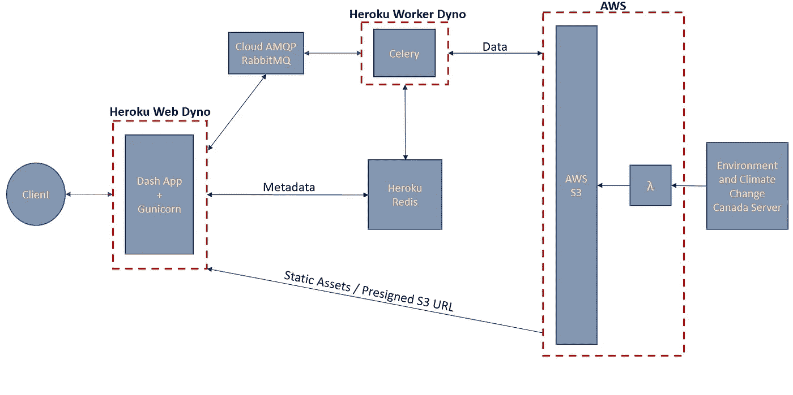
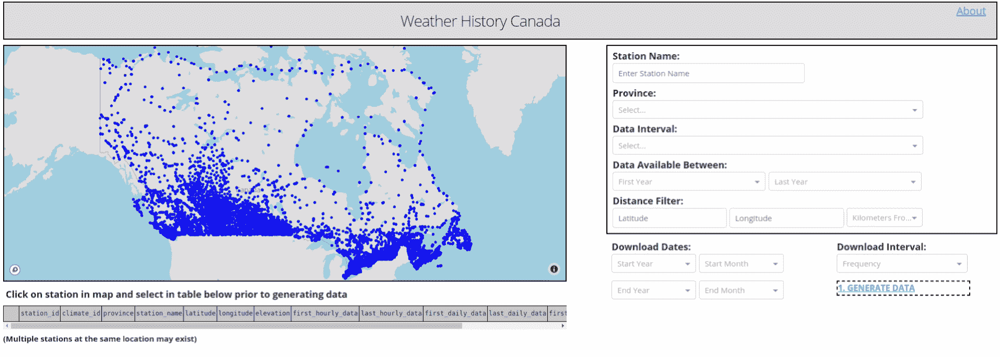
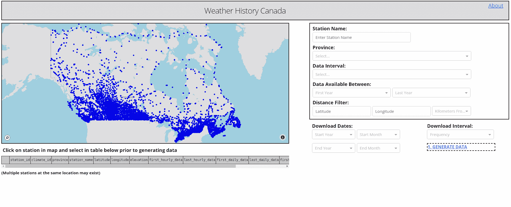
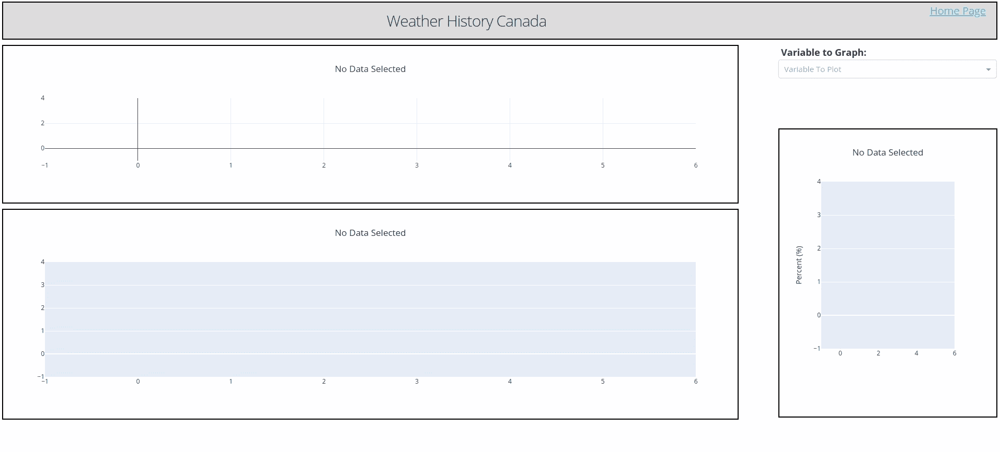

# 构建动态天气下载应用程序

> 原文：<https://towardsdatascience.com/building-a-dynamic-weather-download-app-1ce64a6c3e61?source=collection_archive---------54----------------------->

## 使用 Python、Dash 和 AWS 简化加拿大历史天气数据


照片由[维达尔·诺德里-马西森](https://unsplash.com/@vidarnm?utm_source=medium&utm_medium=referral)在 [Unsplash](https://unsplash.com?utm_source=medium&utm_medium=referral) 拍摄

本文描述了我用来构建动态仪表板 web 应用程序的框架，该应用程序用于下载和可视化历史加拿大天气数据…快！！！

【WeatherHistoryCanda.com】查看 App:[](http://www.weatherhistorycanada.com)

***获取代码:** [GitHub Repo](https://github.com/david-hurley/env-can-wx-app)*

# *动机*

**加拿大有 8000 多个活跃和不活跃的政府气象站，它们都有开源数据。然而，下载数据并不容易。**

*目前，通过由加拿大环境和气候变化部(ECCC)维护的一个政府运营的门户网站[可以访问和下载加拿大的历史天气数据。虽然 ECCC 提供了优秀的开源数据服务，但下载门户还有待改进。该门户没有地图来直观地搜索和显示气象站的位置，下载仅限于一小部分数据，并且下载后无法绘制数据图表。](https://climate.weather.gc.ca/historical_data/search_historic_data_e.html)*

# *目标*

**构建仪表板 web 应用程序，动态搜索、过滤和下载加拿大历史天气数据。**

***几个要求:***

*   *基于过滤标准显示气象站的交互式地图*
*   *任何时间范围内气象站数据的单个文件下载(即不再有多文件下载)*
*   *快速下载气象站数据(即分钟级)*
*   *气象站数据的交互式图形*
*   *便宜的💰*

# *步骤 1:应用程序框架*

*最初，我制定了一个松散的概念，即我希望如何构建应用程序，例如使用哪个微服务框架，经过一些尝试和错误后，我确定了如下所示的架构。这是一个由前端进程、后台进程和数据库存储组成的标准结构。*

**

*web 应用程序框架概述*

## *Dash 应用*

*对于小型仪表板应用，微服务是必由之路。它加速了开发，并且易于部署。我选择使用 Python 微服务框架 [Plotly Dash](https://dash.plotly.com/introduction) 来构建我的应用程序。Dash 是一个非常棒的工具，尤其是对于不熟悉 JavaScript 的人来说，因为它允许您用纯 Python 构建复杂的交互式仪表板！*

```
*##  BASIC MULTI-PAGE DASH APP FRAMEWORK- app.py    # Flask server
- index.py  # browser caching and page routing
- tasks.py  # background job in Celery
- Procfile  # Heroku commands on start-up
- /pages
    | -- __init__.py    
    | -- homepage.py
    | -- graphpage.py
    | -- about.py
- /assets
    | -- CSS and JS*
```

## *后台作业*

*我的应用程序的要点是允许用户下载历史天气数据。由于下载任务需要几秒到几分钟的时间来执行，因此无法在前端高效运行(即，这会引入延迟，并阻止应用程序快速响应传入的请求)。更好的解决方案是将长时间运行的任务作为后台作业执行，并将结果反馈给前端。*

*为此，我使用了 Celery，一个异步任务队列，以及 CloudAMQPs RabbitMQ 消息代理和 Heroku Redis 结果存储。关于如何建立一个异步任务队列有很多很棒很详细的教程([也就是 Miguel Grinberg 的博客](https://blog.miguelgrinberg.com/post/using-celery-with-flask))，所以我在这里就不赘述了。相反，我提供了芹菜后台作业架构的概要。*

*   ***消息代理:**客户端发送一个请求来执行一个长时间运行的任务。消息代理(即 RabbitMQ)接收请求，并将其放入消息队列，Celery worker 在该队列中卸载并运行任务。*
*   *这些是运行后台作业的进程，比如下载历史天气数据。在 Celery 中，您可以同时运行多个工作线程来处理多个请求。*
*   ***结果存储:**用于存储任务结果的数据库(即 Heroku Redis)。在我的例子中，我用它来存储气象站元数据，比如位置、海拔和站 ID。*

*我强烈建议不要同时使用 Heroku Redis 作为结果存储和消息队列。我一开始尝试了这种方法，并不断达到允许的最大并发连接数。通过将消息队列分配给 RabbitMQ，将结果存储分配给 Heroku Redis，可以获得更多的并发连接。*

## *数据库存储*

*最初，我的应用程序的结构是直接从 ECCC 服务器(第三方)下载数据。这被证明是缓慢的并且不是非常健壮的。相反，我把所有的 ECCC 数据(大约 37 Gb)下载到一个 AWS S3 桶中。我通过使用 AWS Lambda 和 SQS 消息队列运行多个批量下载作业来实现这一点。一旦我有了 S3 桶中的数据，我就使用 AWS Lambda 和 CloudWatch 事件来更新每天午夜的活动气象站数据。结果是一个灵活的数据库，不依赖于 ECCC 服务器。*

*将数据存放在 S3 存储桶中的最大好处是，可以在应用中使用 S3 选择(即简单的 SQL 表达式)直接从 S3 的 CSV 文件中查询数据。我曾考虑过使用传统的 SQL 数据库，如 MySQL，但在我的用例中，S3 更便宜，而且非常适合持久存储。💪*

## *赫罗库*

*我选择使用 Heroku 云服务来部署我的应用程序。除了非常容易部署之外，我没有什么理由在 DigitalOcean、Linode 或 EC2 上使用 Heroku 这样的云服务。Heroku 应用程序运行在 dyno(虚拟 Linux 容器)上，有两种类型，一种是处理 web 进程(即 HTTP 流量)的 web dyno，另一种是处理后台作业(即芹菜任务)的 worker dyno。我最终在 Heroku 免费层用一个免费网站和 worker dyno 部署了这个应用程序。*

*对于我的用例，Heroku 有一些缺点:*

*   *Heroku dynos 有一个短暂的文件系统。这意味着应用程序保存到磁盘的文件(即下载)最终会丢失，web 和 worker dynos 可能看不到相同的文件。如果一个文件被工人保存到磁盘，web dyno 可能找不到它。*
*   *Heroku 可能很贵。例如，Heroku Redis 插件在免费层有 25mb 的内存，不足以让我的应用程序存储完整的芹菜任务结果，下一层是 15 美元/月。*

*最后，通过使用 AWS S3 进行数据库存储，很容易就可以解决这两个问题。*

# *步骤 3:构建仪表板过滤器功能*

*我想要一个简单的界面，在交互式地图上显示气象站，这样用户就可以根据气象站的位置和数据可用性等直观地过滤气象站。Dash 库包括易于实现的高级组件，如图表、下拉框和输入框。Dash 应用程序的结构是应用程序布局，由 HTML 和 Dash 核心组件组成，后面是创建链式交互的应用程序回调。*

**

*交互式地图过滤*

*背景地图来自 Mapbox API，气象站元数据(如气象站位置)在应用程序启动时从 S3 自动气象站加载。Dash 中的回调很容易实现，包括输入组件(即省或站名)和输出组件(即地图图形)。*

*Dash 应用回调示例*

# *步骤 4:构建仪表板下载功能*

*单击地图上的气象站后，用户可以查看表格中的气象站元数据，并选择所需的气象站来下载数据。然后，用户可以设置下载间隔(即在站点记录数据的频率)和下载日期。完成后，会显示一条消息，让用户知道他们将要下载的内容。该消息还会激活“生成数据”按钮。*

**

*交互式气象站选择和下载*

*当点击“生成数据”按钮时，一个任务被发送到 RabbitMQ 消息队列，芹菜工人在那里接收它。芹菜任务使用选定的表格数据(即，站名、省等。)、下载日期和数据间隔，以查询 S3 相关 CSV 的子集。在 Celery 执行任务的同时，前端使用 task.id 查询 task.state(即待定、进度、成功或失败)。这每 250 毫秒发生一次，并更新进度微调器的可见性。*

*如果我没有使用 Heroku，我可以将查询的数据保存到磁盘，或者如果我的数据较小，我可以在浏览器中缓存。相反，我将查询到的 S3 数据推回到 S3 的一个临时文件夹中。在前端，创建一个指向临时数据的 S3 预签名 URL，并使用 Flask routing 链接到“下载数据”按钮。当用户点击“下载数据”按钮时，它重定向到临时数据并在浏览器中下载文件。*

*即使我的下载结构稍慢且效率较低(例如，多个 S3 GET 和 PUSH 命令)，预签名 URL 的出色之处在于，客户端直接从 S3 下载，避免了将数据保存到服务器或缓存在浏览器中。*

*S3 预签名 URL 的 Flask 路由示例*

# *步骤 5:构建仪表板图形功能*

*在我看来，能够近实时地可视化下载的数据对用户来说是最重要的功能，因为它允许他们在现场进行探索性的数据分析。*

*我选择使用 Dash graph 组件呈现三个基本图形来传达不同的数据统计(即季节性趋势的箱线图和数据分布的直方图),以呈现数字。即使是大型数据集(> 500000 个数据点)，折线图和直方图的渲染速度也相对较快，但箱形图可能会比较慢。为了保持几秒钟的渲染时间，我使用了箱线图的数据子样本。这是通过 Pandas DataFrame.sample 函数完成的，并保持分布与原始分布相同。*

**

*下载数据的交互式绘图*

*如上所述，因为我使用 Heroku，保存到磁盘不是一个选项，而且由于数据集可能超过 50mb，使用 Heroku Redis 来存储 Celery 任务结果是不切实际的(例如，在空闲层上只有 25mb 的内存)。此外，在 Dash 回调和 Dash 页面之间共享数据可能很棘手。标准解决方案是使用 dcc。存储组件(即在浏览器存储中)，但这只适用于小于几兆字节的数据。*

*经过一些测试，我发现最大化成本和速度的解决方案是使用 S3 选择在 S3 和图形中查询数据。这样做的最大缺点是图形的加载时间较长(即从云数据库查询数据，而不是在本地检索)，并且需要在每次图形渲染时查询 S3。*

# *步骤 6:部署应用程序*

*Dash(即 Flask)应用程序本身一次只能处理一个 HTTP 请求，因此要处理多个请求，应该使用 Gunicorn WSGI web 服务器将 Dash 部署到 Heroku。Gunicorn web 服务器允许您同时运行应用程序。Heroku 对 Gunicorn 工作进程的配置有几个建议，比如在一个空闲层上将 Gunicorn 工作进程的数量限制在 2-3 个。*

*正确设置 Procfile、RabbitMQ、Heroku Redis 和 Celery 配置是相当具有挑战性的。CloudAMQP [推荐使用 Celery 时 RabbitMQ 消息队列的配置](https://www.cloudamqp.com/docs/celery.html)。使用 CloudAMQP 自由层时最重要的方面是降低“后台”消息速率(即配置 Celery worker 在没有流言蜚语、混杂和心跳的情况下运行)。*

*Heroku Procfile 示例*

*芹菜配置示例*

# *第七步:监控成本*

*如果你的业余爱好应用花费你一大笔钱，你将无法支撑很久！我的应用程序目前每月花费约 1-2 美元，但这将随着规模的扩大而改变。*

*   ***Heroku Dyno** :自由层！*
*   ***CloudAMQP RabbitMQ:** 自由层！*
*   *Heroku Redis: 自由层！*
*   ***AWS S3:**~ $ 1–2/月(取决于获取/推送命令的数量)*

# *后续步骤*

*在未来版本的应用程序中，我想添加和更改一些内容。*

*   *迁移到 DigitalOcean 或其他 IaaS 云服务。这将允许我将数据保存到磁盘，或者在 Redis 缓存方面有更大的灵活性，并防止我的应用程序每次下载都需要 GET 和 PUSH 请求。*
*   *加速绘图。这可以通过仅缓存数据以生成初始图表或在浏览器中存储数据子集来实现。*

*总的来说，这是一个非常有趣的项目，我学到了很多关于全栈开发的知识！*