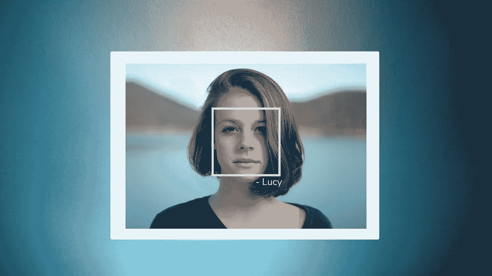
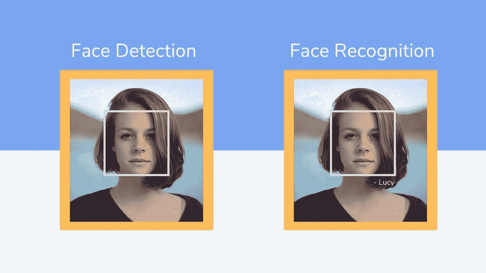
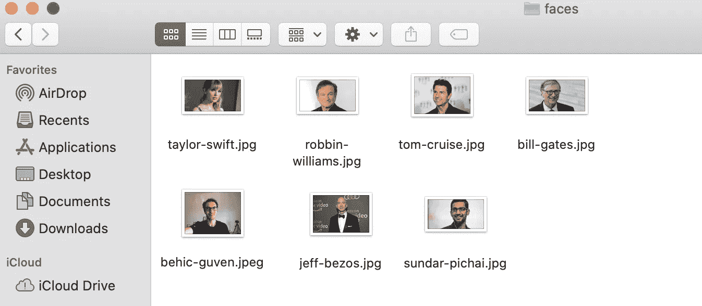
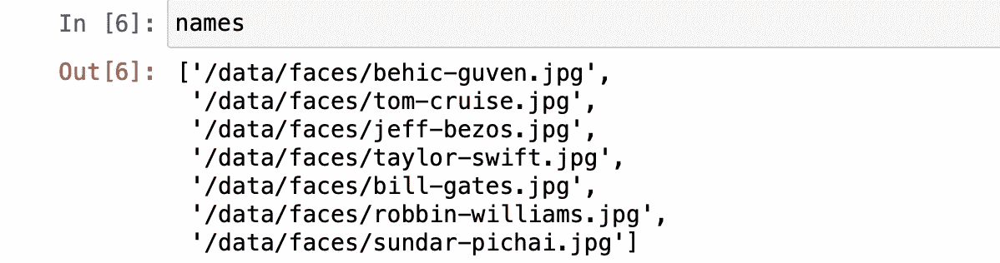
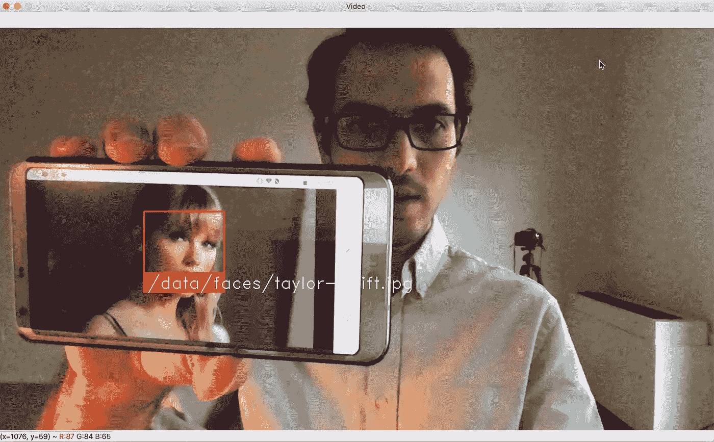
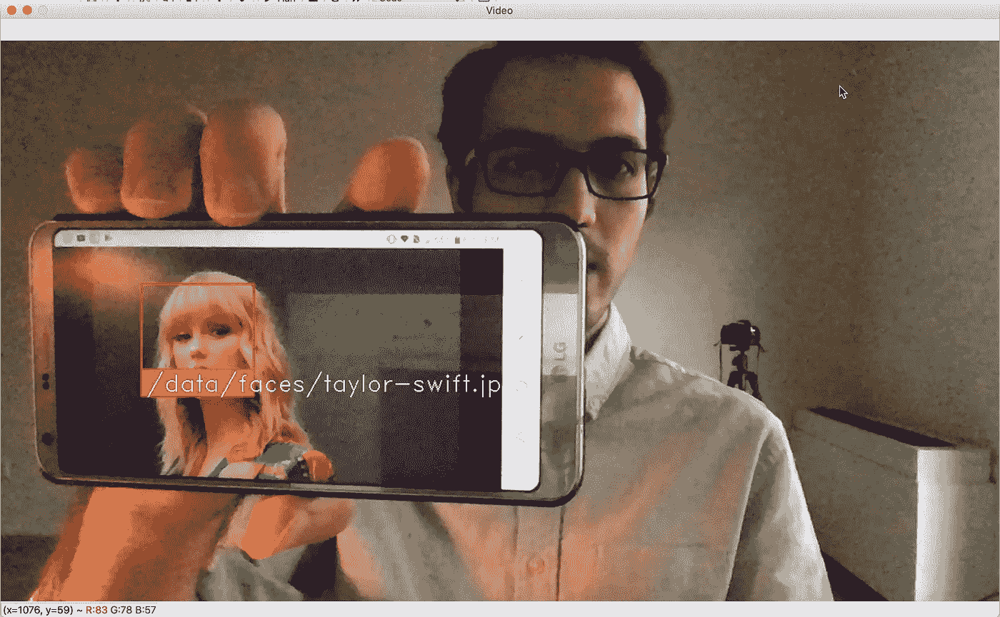

# 用 Python 构建人脸识别器

> 原文：<https://towardsdatascience.com/building-a-face-recognizer-in-python-7fd6630c6340?source=collection_archive---------1----------------------->

## 使用 OpenCv 库进行实时人脸识别的分步指南



[克里斯托弗·坎贝尔](https://unsplash.com/@chrisjoelcampbell?utm_source=unsplash&utm_medium=referral&utm_content=creditCopyText)在 [Unsplash](https://unsplash.com/s/photos/face?utm_source=unsplash&utm_medium=referral&utm_content=creditCopyText) 上拍照

在这篇文章中，我将向你展示如何使用 Python 来构建你自己的人脸识别器。构建一个检测和识别人脸的程序是一个非常有趣和好玩的计算机视觉入门项目。在以前的帖子中，我展示了如何[识别文本](/building-a-simple-text-recognizer-in-python-93e453ddb759)以及如何[检测图像中的人脸](/simple-face-detection-in-python-1fcda0ea648e)，这些都是在计算机视觉中练习 python 的伟大项目。今天，我们将做一些更高级的事情，那就是人脸识别。

从名字就可以理解，我们将编写一个程序，它将识别图像中的人脸。我说的“程序”，你可以理解为教一台机器做什么，怎么做。我喜欢用教学来代替编程，因为那实际上是我们将要做的。最好的学习方式是教学，所以在教机器如何识别人脸的同时，我们也在学习。在我们开始这个项目之前，我想分享一下人脸检测和人脸识别之间的区别。这是值得知道的事情。

## 目录:

*   ***人脸检测 vs 人脸识别***
*   ***入门***
*   ***图书馆***
*   ***训练图像***
*   ***人脸识别***
*   ***测试识别器***

# 人脸检测与人脸识别

这两件事听起来可能非常相似，但实际上，它们并不相同。让我们明白其中的区别，这样才不会漏掉重点。

**人脸检测**就是从无关紧要的图像或视频中检测人脸的过程。这个程序除了寻找人脸之外什么也不做。但是另一方面，**人脸识别**，这个程序可以找到人脸，还可以分辨出哪张脸属于谁。所以它比仅仅检测它们更能提供信息。

要编写一个识别人脸的代码需要一些训练数据，我们应该训练我们的机器，让它知道这些人脸以及他们是谁。在这个项目中，我们是教授我们程序的人。在机器学习中，有两种类型的学习；有人监督和无人监督。我将不会进入细节，在这个项目中，我们将使用监督学习。这里有一个关于机器学习方法的[不错的帖子](/supervised-vs-unsupervised-learning-14f68e32ea8d)。

## 比较示例



[克里斯托弗·坎贝尔](https://unsplash.com/@chrisjoelcampbell?utm_source=unsplash&utm_medium=referral&utm_content=creditCopyText)在 [Unsplash](https://unsplash.com/s/photos/face?utm_source=unsplash&utm_medium=referral&utm_content=creditCopyText) 上拍照

# 入门指南

我们将为这个项目使用两个主要模块，他们被称为人脸识别和 OpenCV。OpenCV 是一个高度优化的库，专注于实时应用。

> *OpenCV(开源计算机视觉库)是一个开源的计算机视觉和机器学习软件库。OpenCV 旨在为计算机视觉应用提供一个公共基础设施，并加速机器感知在商业产品中的应用。作为一个 BSD 许可的产品，OpenCV 使得企业利用和修改代码变得很容易。*
> 
> *来源:*[*https://opencv.org*](https://opencv.org/)

[](/step-by-step-guide-building-a-prediction-model-in-python-ac441e8b9e8b) [## 分步指南-用 Python 构建预测模型

### 使用长短期记忆预测模型的动手练习

towardsdatascience.com](/step-by-step-guide-building-a-prediction-model-in-python-ac441e8b9e8b) 

# 图书馆

我们必须安装一些库，这样我们的程序才能运行。下面是我们将要安装的库的列表:cmake，face_recognition，numpy，opencv-python。Cmake 是一个必备的库，所以面部识别库安装不会给我们一个错误。

我们可以使用 PIP 库管理器在一行中安装它们:

```
pip install cmake face_recognition numpy opencv-python
```

安装完成后，让我们将它们导入到代码编辑器中。其中一些库包含在 Python 中，这就是为什么我们可以在不安装它们的情况下导入它们。

```
import face_recognition
import cv2
import numpy as np
import os
import glob
```

太好了！现在我们进入下一步，我们将导入图像并使用它们来训练我们的程序。

# 训练图像

首先，让我们找到我们的图像。

## 导入图像

我下载了一些名人的照片，并把它们添加到一个名为“面孔”的新文件夹中。同样为了获得当前目录，换句话说，你的程序的位置，我们可以使用一个叫做“getcwd()”的操作系统方法。

```
faces_encodings = []
faces_names = []cur_direc = os.getcwd()path = os.path.join(cur_direc, 'data/faces/')list_of_files = [f for f in glob.glob(path+'*.jpg')]number_files = len(list_of_files)names = list_of_files.copy()
```

理解上面的行:

*   所有的照片都在一个名为“面孔”的文件夹里。
*   图像文件名必须是图像中人物的名字。(如:bill-gates.jpg)。
*   文件名被列出并分配给“names”变量。
*   文件类型必须相同。在这个练习中，我使用了“jpg”格式。



这是我的文件夹截图

让我们进入下一步。

## 训练面部表情

```
for i in range(number_files):
    globals()['image_{}'.format(i)] = face_recognition.load_image_file(list_of_files[i])
    globals()['image_encoding_{}'.format(i)] = face_recognition.face_encodings(globals()['image_{}'.format(i)])[0]
    faces_encodings.append(globals()['image_encoding_{}'.format(i)])# Create array of known names
    names[i] = names[i].replace(cur_direc, "")  
    faces_names.append(names[i])
```

为了让你有所了解，这里是我的“名字”列表的样子。



姓名列表

太好了！这些图像是经过训练的。在接下来的步骤中，我们将使用设备的网络摄像头来查看我们的代码如何执行。

# 人脸识别

在这一步中，我们有很长的代码行。如果你仔细阅读，你会很容易理解每一行发生了什么。让我们定义需要的变量。

```
face_locations = []
face_encodings = []
face_names = []
process_this_frame = True
```

人脸识别代码来了。(如果您复制下面的代码，您可能需要重新格式化间距，我建议您通过查看代码来从头开始编写，并尝试理解)

```
video_capture = cv2.VideoCapture(0)while True:
    ret, frame = video_capture.read() small_frame = cv2.resize(frame, (0, 0), fx=0.25, fy=0.25) rgb_small_frame = small_frame[:, :, ::-1] if process_this_frame:
        face_locations = face_recognition.face_locations( rgb_small_frame)
        face_encodings = face_recognition.face_encodings( rgb_small_frame, face_locations) face_names = []
        for face_encoding in face_encodings:
            matches = face_recognition.compare_faces (faces_encodings, face_encoding)
            name = "Unknown" face_distances = face_recognition.face_distance( faces_encodings, face_encoding)
            best_match_index = np.argmin(face_distances)
            if matches[best_match_index]:
                name = faces_names[best_match_index] face_names.append(name)process_this_frame = not process_this_frame# Display the results
    for (top, right, bottom, left), name in zip(face_locations, face_names):
        top *= 4
        right *= 4
        bottom *= 4
        left *= 4# Draw a rectangle around the face
        cv2.rectangle(frame, (left, top), (right, bottom), (0, 0, 255), 2)# Input text label with a name below the face
        cv2.rectangle(frame, (left, bottom - 35), (right, bottom), (0, 0, 255), cv2.FILLED)
        font = cv2.FONT_HERSHEY_DUPLEX
        cv2.putText(frame, name, (left + 6, bottom - 6), font, 1.0, (255, 255, 255), 1)# Display the resulting image
    cv2.imshow('Video', frame)# Hit 'q' on the keyboard to quit!
    if cv2.waitKey(1) & 0xFF == ord('q'):
        break
```

# 测试识别器

在第一张图中，我使用的图像与训练数据中使用的图像完全相同。



人脸识别测试 1

现在，我将尝试使用泰勒·斯威夫特的不同图像。效果非常好！



面部识别测试 2

恭喜你。！您已经创建了一个程序，可以检测并识别图像中的人脸。现在，你已经知道如何在实际项目中使用计算机视觉了。希望你喜欢阅读这个循序渐进的指南。如果你今天学到了新东西，我会很高兴。从事像这样的动手编程项目是提高编码技能的最好方式。

如果您在执行代码时有任何问题，请随时[联系我](https://sonsuzdesign.blog)。

*我是* [*贝希克居文*](https://medium.com/u/a073b4360020?source=post_page-----7fd6630c6340--------------------------------) *，喜欢分享编程、教育、生活方面的故事。* [*订阅*](https://lifexplorer.medium.com/membership) *我的内容待启发* [*走向数据科学*](https://towardsdatascience.com/) *待启发。谢谢你，*

## 更多机器学习项目

[](/rendering-text-on-video-using-python-1c006519c0aa) [## 使用 Python 渲染视频文本

### 使用 moviePy 库的动手机器学习项目

towardsdatascience.com](/rendering-text-on-video-using-python-1c006519c0aa) [](/extracting-speech-from-video-using-python-f0ec7e312d38) [## 使用 Python 从视频中提取语音

### 使用 Google 语音识别 API 的简单实用项目

towardsdatascience.com](/extracting-speech-from-video-using-python-f0ec7e312d38)