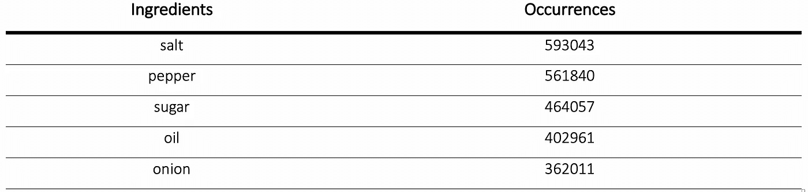

# 建立食物推荐系统

> 原文：<https://towardsdatascience.com/building-a-food-recommendation-system-90788f78691a?source=collection_archive---------0----------------------->

## 机器学习通过营养预防和治疗癌症

任何影响个人健康的因素，如体育锻炼、睡眠、营养、遗传和污染。营养是我们生活中最大的可变因素之一，微小的变化也会产生巨大的影响。随着可供选择的食物数量呈指数增长，不可能再把它们都考虑进去了。考虑用户偏好、最大化食品中健康化合物的数量并最小化不健康化合物的唯一方法是使用(3D)推荐系统。

这个项目的目标是使用最大的公开可用食谱数据集合(Recipe1M+)来构建一个食材和食谱推荐系统。训练、评估和测试一个模型，该模型能够从多种配料中预测菜肴。根据预测的菜肴，估计负面配方-药物相互作用的概率。最后，构建一个 web 应用程序，作为构建 3D 推荐系统的一个步骤。

从 GitHub [库](https://github.com/warcraft12321/HyperFoods)下载 web 应用并在本地执行。

# 介绍

已知有许多因素会影响一个人的健康。体育锻炼、睡眠、营养、遗传、污染以及其他外部因素[1]。营养是我们生活中最大的可改变因素之一，所以小的改变会导致重大的结果也就不足为奇了。

由于我们的饮食与文化有着紧密的联系，我们有可能在世界范围内找到大量的美食。每一种中最常见的成分都与该地区的特征密切相关，例如气候。这对当地食谱中每种成分的可用性有很大的影响[3]。

众所周知，一些分子对健康有积极的影响，即抗癌。能够确定哪些成分含有较高的浓度，可能有助于我们治疗和预防疾病[4]。此外，通过在美味和负担得起的膳食中加入这些成分，它可以促进人们营养习惯的转变。在一个快餐消费不断增长的世界里，很明显，除了前面两点，准备的速度也是一个重要因素。

随着越来越多的数据在网上公布，无论是来自研究还是网络应用，这是一个分析这些数据并创建新的食物推荐系统的机会，这些系统不仅考虑了抗癌特性等因素，还考虑了味道、营养成分以及与药物的负面相互作用。这将使用户在购买或准备下一餐时做出更好的决定[5]。

## **癌症**

二十一世纪疾病(图 1)。癌症属于更广泛的肿瘤，是细胞分裂不受控制的一种亚型，有可能扩散到不同的组织。相反，良性肿瘤局限于某个器官。随着寿命的增加，衰老和一些调节途径的功能丧失之间存在密切的相关性，疾病的发病率也呈同样的趋势[6]。

众所周知，营养可以在预防和治疗这种疾病中发挥重要作用[4]。这样，它将有利于最大限度地增加食物中抗癌化合物的数量，并减少已知的与抗癌药物发生负面作用的化合物。

**图 1**2016 年全球主要死亡原因。癌症排在第二位。改编自[7]。

## 自然语言处理

尽管在线数据集和 API(应用程序编程接口)包含易于检索的结构化信息，但大多数在线资源并不具有这种有组织的结构。因此，需要不仅能够提取数据，而且能够获得其上下文的算法[8]。这一部分集中在单词嵌入和主题建模。

有几种方法可以实现单词的矢量表示。一种可能是将它们全部对齐，并将每一个表示为 0 的向量，数字 1 位于对齐的相应位置。那么，向量空间的维数将等于词汇表的大小。虽然这种方法对于小词汇表是可行的，但是计算效率不高。或者，有一种不同的单词嵌入机制，该机制通过考虑单词在句子中的上下文，允许使用低维向量来表示大型词汇表。

Word2Vec 由谷歌的 Tomas Mikolov 领导的研究团队开发，是一个浅层的两层神经网络特定类别的模型，可以产生单词嵌入[9]。它将文本语料库作为输入，并跨越一个向量空间，其中每个单词都被映射到一个向量。更经常出现在相似上下文中的单词被映射到由更短的欧几里德距离分隔的向量中。

Word2Vec 并不是主题建模的唯一工具。 *Doc2Vec* 和 *FastText* 分别能够对整个文档进行编码或者专门查看每个单词的形态结构【10】。

Word2Vec 被选择来编码这个项目中使用的数据集中的成分，作为向量。这使得从食谱的上下文中捕捉它们的相似性成为可能。

## 逆向烹饪算法

这种食谱检索算法是由脸书人工智能研究所开发的，它能够直接从图像中预测配料、烹饪说明和食谱标题[11]。

过去，算法一直使用简单的配方检索系统，该系统基于某些嵌入空间中的图像相似性。这种方法高度依赖于学习嵌入的质量、数据集大小和可变性。因此，当输入图像和静态数据集不匹配时，这些方法就会失败[11]。

反向烹饪算法不是直接从图像中检索食谱，而是提出了一个流水线，其中有一个中间步骤，首先获得配料集。这使得指令的生成不仅考虑了图像，还考虑了成分(图 2) [11]。

**图 2** 使用多个编码器和解码器的反向烹饪食谱生成模型，生成烹饪指令[11]。

这种方法的主要成就之一是在试图从图像中预测成分时，呈现出比基线配方检索系统[12]和普通人[11]更高的准确性。

本项目开发的美食推荐系统中包含了反向烹饪算法。基于 web 应用程序中的预测成分，向用户提供若干建议，例如:不同的成分组合。

## 降维

一般来说，降维的目的是从高维向量中保留尽可能多的信息。主成分分析(PCA) [13]和 T-分布随机相邻实体(T-SNE) [14]是两种最常用的方法。第一种通常被定义为用数学方法解决问题，第二种是用统计方法。

PCA 的主要目的在于保留数据中具有较高可变性的矢量分量，同时丢弃增加较少信息的分量。这种分解可以通过两种不同的方式实现。一种是通过分解数据协方差矩阵的特征值。第二种方法是在通常将初始数据标准化后，对数据矩阵进行单值分解[13]。

另一方面，T-SNE 将点之间的相似性转换成联合概率。并且最小化低维嵌入和高维数据上的这些概率之间的 Kullback-Leibler 散度。这种方法具有非凸的成本函数，因此，不同的初始化可能产生不同的降维向量[14]。

能够可视化高维数据是至关重要的，尤其是在对执行聚类感兴趣的情况下。根据应用，社区发现算法可以输入不同的阈值参数，这些阈值参数影响集群的大小和连通性。能够可视化数据如何分布允许在选择这些值时使用人类推理。

其快速的执行和可靠的结果，使 PCA 成为首选。

## 社区发现

有许多优化不同成本函数的聚类算法。

Louvain 算法反复分割网络，优化模块化[15]。它的值与同一集群内节点间的连接数成比例，当集群间的连接数开始增加时，该值会减少。数学上，模块化被定义为:

*Aij* 是表示连接节点 *i* 和 *j* 的边的权重的邻接矩阵条目， *ki = ∑j Aij* 是节点 *i* ， *ci* 是其所属的社区， *𝛿(u,v)* 如果 *u = v* 则为 1，否则为 0。 *m = 1/2*∑ij Aij* 是图中所有边的权重之和【15】。

在迭代步骤之间，要优化的值是它的变化，这使得计算更有效[15]:

虽然需要为每个试验社区计算 *ki，in* 和 *∑tot* ，但是 *ki/2m* 是特定于正在被分析的节点的。这样，后一个表达式只有在优化模块性时考虑不同节点时才重新计算[15]。

Infomap 算法试图通过减少在网络内部确定的集群之间随机传播的假想流来减少网络的描述长度[16]。数学上可以表示为:

被 *q = ∑(m)(j=1) qj* 每个社区的退出概率之和， *H(Q)* 社区间移动的平均码长， *p(i)(o)= qi + ∑(m)(β∈i) pβ* 在一个社区中随机行走的停留概率 *c* 和*H(Pm)*a 的平均码长

第三种方法也被广泛使用，称为谱聚类[17]。与前两者相比，它有几个优点。最重要的是，在检测高度非凸的聚类时，或者当聚类的中心和扩散的度量不是预测社区的合适描述时，它显示出更高的准确性。此外，与其他两种方法相反，它的 Python 实现允许用户输入数据中出现的所需集群的数量。这是沿着项目执行集群的第一选择。

## 数据可视化

Python 中有几个工具可用于数据可视化。即 Matplotlib [18]、Plotly [19]、Seaborn [20]和 Pandas [21]。有些被认为在表示大量数据时更有效，而其他的则以非常通用和允许用户以多种方式轻松可视化数据而闻名。其他的则与现有的数据容器集成在一起，最终促进了它的可视化。与最新的数据分析和可视化平台(如 Jupyter Notebook 或 JupyterLab)兼容也是一个重要的标准。

Matplotlib 允许生成各种类别，例如:散点图、误差图、条形图、功率谱、直方图等。尽管它们是静态的，当散点图中的节点数量超过数万时，就不再能够代表它们[18]。

Plotly 不同于 Matplotlib，它允许数据点及其标签的动态表示。当点的数量超过数万个时，它也能更好地伸缩[19]。

Seaborn 是一个构建在 Matplotlib 之上的 Python 库。在表示大量数据点方面，它与后者一样强大，并允许用户以更简单的方式探索新的可视化选项[20]。

由于之前强调的要点和与 JupyterLab 完全兼容的事实(在 Plotly 的情况下，在安装相应的扩展之后),这 3 个模块在项目中一起使用。

## 食物推荐系统

虽然吃是一种基本需求，但有时人们不知道选择什么。事实上，当购买食品或在线订购时，选项的数量太大，无法将它们全部考虑在内。

人类有不同的营养需求，并以不同的方式感受味道。出于这个原因，满足他们需求的唯一选择是通过了解这个人。无论推荐对象是单纯的饥饿用户、烹饪爱好者、关心健康的人、节食者还是希望改善自己健康状况的人，这都会影响最终的选择[5]。

此外，被推荐的产品也有重要的影响:简单的配料替代、食谱、饭菜、餐馆甚至是一道菜。推荐的时机:实时或简讯。并且它可以考虑用户的位置并建议最近的地方。提出建议的平台。根据推荐的生成方式(协作过滤、基于内容、图形聚类或嵌入)，它们可能需要设备提供不同的功能。这样，它们可以在网站、应用程序或纯文本(SMS)中共享。过敏或不耐受化合物(如坚果和牛奶)的存在，品牌，烹饪所需的时间，课程，烹饪，动物衍生物的存在，菜肴类型，配料，成本，配料数量，准备时间，味道或烹饪所需的技术[5]。

构建这些系统时的一个重要因素是数据的来源。它可以来自过去的订单，用户对某个帖子的反应(喜欢或不喜欢)，社区的评级，观看的图像或视频，或其他社交网络相关的行为，包括帖子，分享，搜索，评论或追随者[5]。

食品推荐系统的成功(图 3)与其考虑用户偏好、最大化食品中健康化合物的数量和最小化不健康化合物的能力相关。

在这个项目中，探索了基于公开可用数据生成食物推荐的不同方法。大型食谱数据集(Recipe1M+和 Kaggle 和 Nature (K&N))包含关于现有配料、标题、源统一资源定位器(URL)和烹饪的信息，经过解析后可提供最精确的建议。

**图 3** 一个食物推荐系统的例子[5]。

# 目标

这个项目的目的是建立一个食材和食谱推荐系统。这包括预处理 Recipe1M+数据集以进行成分检索。优化配料的词汇，使之与食谱中的相匹配。训练 Word2Vec 模型，使其能够将配料和配方转换为数字向量。将 2D 空间中的配料可视化，并将其用作配料推荐系统。训练、评估和测试支持向量分类器(SVC)模型，该模型能够通过考虑菜谱的配料集来预测菜谱所属的菜系。基于预测的烹饪，预测负面配方-药物相互作用的概率。为了鉴别菜肴，每份食谱中抗癌分子的平均数量较高。最后，创建一个 web 应用程序，该应用程序能够从图像中预测成分，建议新的组合，并检索食谱所属的菜肴，以及与抗肿瘤药物的预期负面相互作用次数的分数。

# 文章大纲

在介绍中，讨论了癌症、自然语言处理、逆向烹饪算法、降维、社区发现、数据可视化和在线食物推荐系统背后的基本概念。方法详述了项目的目标，并介绍了用于解决这些目标的工具。在结果中，介绍并讨论了项目的成果。最后，在结论中，回顾了项目的目标，讨论了目标是否实现，提出了主要的困难和对未来工作的建议。

# **方法**

简介涵盖了广泛的理论概念，尤其是项目中使用的工具。在方法上，将描述如何根据要实现的目标调整和应用这些方法。在项目的每一步中使用的最重要的 Python 和 JavaScript 包也包括在内。

首先，Recipe1M+和 K&N 数据集，以及成分的词汇表，根据它们的结构和对项目的价值进行描述。它还包括他们提交的优化过程。

将成分嵌入向量空间、减少其维数和聚类的过程根据所采用的工具和考虑到先前数据集的特征而执行的参数调整来详细描述。

接下来，考虑到参数和函数的选择，并考虑到训练集的维度，解释了预测每个食谱配料集的烹饪的分类器。

然后，描述了根据抗癌分子的数量和预测的负面配方-药物相互作用的数量对配方和烹饪进行分类的方法。

指定了每个地块使用的数据可视化工具。

最后，介绍了一个 web 应用程序，该应用程序从菜谱图像中检索配料，并使用了本项目开发的许多食物推荐系统，并详细介绍了它的实现。

## Recipe1M+数据集

Recipe1M+数据集是最大的公开配方数据集[22]。每个配方包含的信息被分成两个 JavaScript 对象符号(JSON)文件。

第一个用 ID 标识每个配方，并定义成分、说明、标题、URL 和它所属的集合:训练、验证或测试集合。这三组用于训练、验证和测试反向烹饪算法。第二个文件包括第一个文件的配方 id 和一组指向配方被废弃的网站的图片的 URL。一些网址不再活跃。虽然使用 Wayback 机器(【archive.org/web】)也可以访问和可视化菜谱。

除了这个数据集之外，还有两个 pickle 文件，其中包含配料词汇表和食谱说明。

构建食物推荐系统的一个必要步骤是从 Recipe1M+数据集中的食谱文本中提取配料。为了实现这一点，它优化了现有成分的词汇，其中所有的停用词和标点符号都被删除，其余的词被词条化。

一旦 Recipe1M+数据集从公开网站上抓取，包含来自访问者的食谱，预计会出现错误信息、错别字、非拉丁字符等。例如，有人证实，有些食谱中的配料或说明是空的，或者完全是由数字或标点符号组成的。所有这些情况都得到了纠正。在开始从数据集中的词汇中搜索成分之前，所有的停用词都被删除，剩下的被词条化。

## Kaggle 和自然数据集

这个数据集包含几个标有它们所属菜系的菜谱([github . com/altos AAR/food 2 vec/blob/master/dat/ka ggle _ and _ nature . CSV](https://github.com/altosaar/food2vec/blob/master/dat/kaggle_and_nature.csv))。它被用来训练监督学习模型，该模型能够从一系列配料中预测菜肴。使用上一节中描述的词汇确定的相同成分。

它的结构是一个逗号分隔的文件，每行包含一个不同的配方。第一个值是菜谱的菜系。剩下的都是令牌化的成分。因此，不需要使用任何词汇来检索它们。

为了尽可能地使该数据集中的配料名称与 Recipe1M+中的一致，所有配料名称都进行了词条化，并删除了停用词。

## 食品包埋

为了构建一个配料和食谱推荐系统，最基本的是将它们表示为向量。这将允许用数学方法计算它们的上下文相似性。

使用 Recipe1M+和 K&N 数据集训练 Word2Vec 模型。在 Recipe1M+和 K&N 数据集的情况下，按照 Recipe1M+数据集和 K&N 数据集的说明分别检索每个配方中的成分。Word2Vec 工具可以在 python 库 *Gensim* 中免费获得。

训练 Word2Vec 模型的关键点之一是捕捉单词的周围环境。考虑到这一点，确保每个食谱中的配料顺序遵循一定的标准是非常重要的。否则，模型会将排序不同的相同成分解释为具有不同的上下文。为此，配料按字母顺序排列。作为模型输入而引入的语料库是来自 2 个数据集的食谱中存在的一组配料。

需要适当调整的超参数是*尺寸*、*工人*、*窗口*、 *sg* 和*最小计数*。*尺寸*指的是代表配料的每个向量所考虑的维数(100)。该值的选择是基于所获得的配料嵌入(配料推荐)的质量以及从烹饪方法到烹饪一节中介绍的配料集中检索烹饪的模型的准确性。*工作人员的数量*被设置为等于模型被训练的核心的数量(8)——MacBook Pro 15’2016 年末。这大大加快了培训过程。*窗口*指的是与被编码的单词的最大距离，该单词被认为是周围环境的一部分。为了计算该值，确定了 Recipe1M+和 K & N 中配料数量最高的配方。在 K & N 数据集中找到 66 个元素的配方后，窗口*被设置为 65。最后，由于模型的目标是从相邻单词中预测目标向量，因此选择连续单词包。这意味着， *sg* 被作为 1 引入。考虑的最后一个参数是*最小计数*。为了获得每种配料的矢量表示，即使较少表示， *min_count* 被设置为 1。*

在获得成分的向量之后，它们在 2D 图中被可视化。使用下一节介绍的工具降低维度后，这是可能的。

## 降维

为了将 Word2Vec 创建的成分嵌入的维数从 100 减少到 2，使用了 PCA。在 *scikit-learn* 中，在*分解*包中，有几个模块可以减少向量维数。其中一个是 *PCA* ，用于允许 Recipe1M+数据集中所有成分的可视化。

## 聚类成分

为了根据相似性对 Recipe1M+数据集中的成分进行聚类，将谱聚类应用于用 Word2Vec 创建的成分嵌入和用 PCA 降维。同样，它使用了 *scikit-learn* ，但是是一个不同的包。 *cluster* 包含了很多能够在数据中发现社区的函数，但是使用的是 *SpectralClustering* 。

该功能为用户提供了输入所需聚类数的可能性。选择的数量与[3] — 9 中确定的成分类别的数量相同。它们是主菜、小吃、饮料、汤/炖菜、面包、沙拉、开胃菜、配菜和甜点。

## 烹饪食谱

一个 SVC 模型被训练来根据它们的配料预测食谱的烹饪。

选择 K&N 数据集来训练模型是因为它的大小，包含每个食谱和各自菜肴的成分列表。然而，不可能向 SVC 提供一组字符串来执行训练。在对所有成分的矢量表示进行平均后，每个配方都被转换成一个矢量。之前介绍的 Word2Vec 模型是用来自 Recipe1M+和 K&N 数据集的数据训练的，因此，第二个数据集中每种成分的矢量表示已经可用。

为了训练支持向量机(SVM)模型，使用了来自 *scikit-learn* 的 SVM 软件包。它需要选择一个函数，还需要根据训练数据集调整几个参数。

由于大量的功能(100 个)、配方和模型训练的计算限制(MacBook Pro 15 ' 2016 年末)，它使用了线性内核来减少训练时间。使用的函数是 *LinearSVC* 。

需要调整函数的几个参数。发现 K&N 是一个不平衡的数据集。数据集中某些类别(菜系)的规模有时相差两个数量级。由于这个原因， *class_weight* 被设置为平衡。这意味着每个类的权重与它们的元素数量成反比。接下来，为了保证训练收敛，将最大迭代次数( *max_iter* )从标准值 1000 增加到 5000。此外，每当数据集包含的元素数量比每个特征配方的元素数量多时，建议设置算法来解决对偶优化问题。这是通过将*双*参数设置为假来实现的。有一些参数(例如:正则化)不能从数据集的特征中直接推断出来。因此，使用 *model_selection* 包(也属于 *scikit-learn* )中的 *GridSearchCV* 函数是很重要的，这样就可以对它们进行详尽的搜索，并优化模型的精度。对于正则化参数，测试范围从 0.00001 到 10000 的 10 的倍数的值。发现 0.0001 是最佳的，然后将其用于训练模型。该参数说明了数据点错误分类的重要性。

## 菜肴分类

这个项目的目标之一是根据抗癌分子的数量对菜肴进行排序。首先，使用表 1 中的全套成分(包括未列出的成分)，确定 Recipe1M+数据集中每种配方中抗癌分子的数量[4]。为了将它们的名称与数据集中的成分相匹配，它们被简化了。比如*普通葡萄*转化为*葡萄*。在使用《烹饪方法》中介绍的 SVC 检索数据集中每种烹饪方法后，计算出每种烹饪方法中抗癌分子的平均存在量。

**表 1** 每种成分在第一栏和第二栏分别用其(修改后的)通用名称和学名表示。抗癌分子的数量及其名称出现在最后两位。只有五种抗癌分子数量最多的成分被显示出来。改编自[4]。

烹饪也可以根据它们的食谱与药物的预期负面相互作用的数量来分类。对于抗肿瘤药和免疫调节剂，引入了预期有害相互作用的百分比(表 2) [3]。在使用 HyperFoods 应用程序从食谱图像中检索菜肴后，这些信息将用于预测负面食谱-药物相互作用的可能性。

**表 2** 抗癌药与全球美食之间预期的负面相互作用的千分之一[3]。缩写:NA(北美)、WE(西欧)、NE(北欧)、EE(东欧)、SE(南欧)、ME(中东)、SA(南亚)、SEA(东南亚)、EA(东亚)、LA(拉美)和 A(非洲)。

## 可视化工具

Matplotlib、Plotly 和 Seaborn 是三个 python 可视化框架，用于可视化项目的一些数据。

Matplotlib 用于绘制报告中所有 2D 成分的矢量嵌入。在项目存储库中可用的 Jupyter 笔记本中，可以使用 Plotly 来动态可视化相同的数据。使得逐个成分的检查变得更容易，一旦它们的标签最初被隐藏，仅当鼠标悬停在相应的节点上时才出现。也可以分别放大和缩小以获得更多或更少的细节。

Seaborn 绘制了困惑矩阵，这是评估《烹饪法到烹饪法》中详述的烹饪检索算法的结果。

## HyperFoods 应用程序

作为建立新的食材和食谱推荐平台的一个步骤，它开发了一个 web 应用程序。这能够从图像(由 URL 提供)中预测成分。基于它们在嵌入向量空间中与由反向烹饪算法识别的成分的接近度来建议替代成分。从检索到的一组配料中预测菜系。并且基于预测的烹饪来估计负配方-抗肿瘤药物相互作用的概率。

下面描述 web 应用程序的后端和前端的实现。

后端是使用 Node.js 开发的。在服务器端，导入了包含词汇表中前 3 个最相似成分的文件。这个文件是在计算嵌入空间中所有向量之间的欧几里德距离并将结果字典导出为 JSON 文件之后获得的。通过设置监听端口，在前端 HTML 页面和服务器之间建立连接。python 外壳用于:执行用 Python 实现的反向烹饪算法；加载 Word2Vec 模型；将图像的成分转换成矢量；计算每个食谱的矢量表示，并加载 SVC 模型，以便能够根据食谱矢量预测菜肴。在服务器端实现并执行了一个将二进制代码转换回字符串的函数。由于一般 URL 的格式，不可能从前端获取到服务器的链接。所以，这在前端被转换成二进制，在后端被转换回字符串。

在前端，使用 HTML 构建界面的主要结构。CSS 被用来使界面简单直观。JavaScript 支持响应性网页和与服务器的通信。用于使网站用户友好的一个基础 JavaScript 库是 D3.js 的缩小版，版本 4。它处理所有的鼠标事件。

在实现后端和前端之后，目标是使 web 应用程序在线可用。由于 Heroku 应用程序(托管平台)的大小限制和一些 PyTorch 文件的大小，这没有实现。在执行反向烹饪算法时，它使用了 PyTorch 模块的一个版本，该版本包括 GPU 和 CPU 支持。模块占用的内存超过 1GB。由于托管平台的存储限制(500 MB ),它使用了仅在 CPU 上执行的 PyTorch 的较轻版本。一旦 Heroku 不提供图形处理能力，这不会影响应用程序的执行。这一修改将应用程序的大小减少了一半。但仍然有来自反向烹饪算法的训练 PyTorch 模型导致应用程序超出服务器的内存限制。克服这一点的一种方法是使用较小的训练数据集来重新训练模型，但这将显著降低检测的准确性。由于时间限制，没有遵循这条路线。模型的大小(436 MB)不足以超过阈值，但与执行应用程序所需的 Node.js 和 Python 包并行，不可能使其在线可用。虽然，从 GitHub [库](https://github.com/warcraft12321/HyperFoods)下载后，web 应用仍然可以在本地运行。

# 结果

在方法上，项目的目标和实现它们所使用的工具被详细描述。在结果中，呈现了来自数据分析和可视化的结果。同时讨论结果的可预测性及其影响。

首先，提供了用于数据分析(Recipe1M+数据集)和模型训练(K&N 数据集)的数据集的详细概述。然后，指定成分嵌入和在二维空间中可视化它们的标准(成分推荐)。接下来，使用混淆矩阵评估 SVC 的性能，并在之后进行测试(食谱到烹饪)。每份食谱中抗癌分子数量较多的菜系会被排名(菜系分类)。最后，介绍了开发的食物推荐 web 应用程序(HyperFoods App)。

## Recipe1M+数据集

该数据集包含 1029715 种配方，由 1480 种不同的成分混合而成。

为了更好地了解菜谱的来源，对数据集进行了解析，并返回了一个抓取的网站列表(表 3)。大多数数据库是欧洲或美国的。通过这种方式，烹饪检索算法可以将大量的食谱分类到这些类别中。

**表 3** 左侧废弃的用于创建 Recipe1M+数据集的网站。中间是各自的网址。右边是每个来源的食谱数量。

为了从 Recipe1M+中检索配料，开发了一个词汇表的优化版本，它是由发布数据集的同一个团队创建的。

表 4 显示了 Recipe1M+数据集中最常从食谱中检索到的前 5 种配料及其各自的出现次数。在 2D 嵌入向量空间中绘制成分时使用了该数据，并讨论了其在成分推荐方面的相关性(成分推荐)。

**表 4** 左侧 Recipe1M+数据集中出现频率最高的 5 种配料。右边是各自出现的次数。

## Kaggle 和自然数据集

K&N 数据集包含 96250 种食谱和 3904 种不同的配料，涵盖 11 种菜系:北美、西欧、北欧、东欧、南欧、中东、南亚、东南亚、东亚、拉丁美洲和非洲。尽管这个数据集包含 Recipe1M+中大约 10%的食谱，但它包含的不同配料的数量是前者的两倍多。这是因为在该数据集中，糖等简单成分根据其颜色或来源(例如:有机砂糖、超细白糖、烘焙糖等)被分成不同的成分。

表 5 列出了前 5 种最常见的成分。Recipe1M+和 K&N 数据集中最常见的成分明显重叠。在前 5 名中，洋葱和胡椒同时出现在两个数据集中。

**表 5** 在左边，K & N 数据集中出现频率更高的成分。右边是各自的存在数量。

在表 6 中，根据食谱的数量，表示了数据集中的烹饪的分布。在 K&N 数据集中检测到的每种菜肴的食谱数量不平衡。北美烹饪包含的食谱比东欧多 2 个数量级。这将影响 SVC 模型的准确性(混淆矩阵)。

**表 6**K&N 数据集中属于不同菜系的菜谱数量。缩写:NA(北美)、WE(西欧)、NE(北欧)、EE(东欧)、SE(南欧)、ME(中东)、SA(南亚)、SEA(东南亚)、EA(东亚)、LA(拉美)和 A(非洲)

## 成分推荐

在 100 个特征嵌入中表示 Recipe1M+数据集中存在的每种成分，并将维度减少到二维空间后，获得了图 4 中的图。为了清楚起见，在数据集中出现少于 4500 次的所有成分都没有表示出来。不同的颜色对应于使用光谱聚类识别的不同聚类。

> 光谱聚类确定了*沙拉*、*亚洲菜肴*、*水果&坚果*和*甜点*类别(图 4)。

**图 4**recipe 1m+中几种成分的上下文相似性。仅表示在数据集中至少出现 4500 次的那些。配料根据它们所属的种类而着色。

这种食物表征允许我们提取关于哪些成分最常同时出现的信息。因此，它为根据它们在图中的接近程度尝试新的组合提供了基线。重叠成分的半径越大，它们组合成功的信心就越大。

> 一些成功的组合是大蒜、鸡肉和洋葱；番茄，罗勒和芹菜或蜂蜜和橘子。

相同的图像被重印，但是具有不同的着色标准。这一次，含有至少一种抗癌分子的成分被涂成绿色，其余成分被涂成黑色(图 5)。

**图 5**recipe 1m+中成分的上下文相似度。仅表示在数据集中至少出现 4500 次的那些。绿色节点(成分)包含至少 1 个抗癌分子。

通过识别与含有抗癌分子(绿色节点)的成分更接近的成分，人们可以假设，鉴于它们在食谱中存在的相似背景，可能更有可能在食谱中找到这些相同的分子。

此外，图 5 不仅为我们提供了通常同时出现的成分的信息，还为用户提供了它们在抗癌分子中的含量信息。这样，用户可以考虑他们的抗癌特性，同时考虑上下文相似性。检索了一些潜在的组合，如图 6 所示。

**图 6** 肉桂、核桃、蔓越莓；观察图 5，花生和芒果是两种最成功的配料组合。

## 烹饪食谱

在 Recipe to Cuisine 中讨论过，SVC 的实现能够在给定 Recipe1M+和 K&N 数据集包含的一组食材的情况下预测菜系。在这一节中，在构建混淆矩阵后评估其准确性，在 Recipe1M+数据集中测试该模型，并确定在菜系分类中起重要作用的一些食材。

## 混淆矩阵

为了理解分类器如何检测不同的菜肴，从训练集计算出多维混淆矩阵(图 7)。它包括对 K&N 食谱数据集中 11 种烹饪法中每一种的预测。

**图 7** 使用 K & N 数据集训练的 SVM 模型的混淆矩阵。每一行，以及各自的值，代表正确分配给真正的菜肴的配料比例。每一列都是由算法预测的菜系。

属于北欧、东欧、西欧和中东地区的食谱经常被误归类为北美食谱。就北欧、东欧和中东而言，这可能是因为它们在数据集中代表性不足:分别为 739、381 和 645 种食谱。以及过多的北美美食。

另一个重要因素是常见的成分。事实上，所有的欧洲美食经常被错误地归入其中。例如，11.5%的北欧食谱被错误地归类为西欧食谱。欧洲是拥有最多美食的大陆(4)。这可能会降低它们之间的特异性。

> 该模型在预测东亚、南亚和北美食谱时更加准确。事实上，分别有 84.8%、83.4%和 73.0%的人回答正确。

## 测试分类器

在训练分类器之后，它被用来预测 Recipe1M+数据集中每个食谱的烹饪。各自的比例如表 7 所示。

为了测试分类器，使用了以下方法:首先，检索标题中出现单词 *tea* 的所有食谱。然后，计算出最终的菜肴分布(表 7)。

**表 7**recipe 1m+内菜系分布。另外，过滤标题中包含关键字*沙拉*和*茶*的。

> 正如所料，标题中包含单词 tea 的大多数食谱被归类为，第一，属于东亚(27%的食谱)，第二，属于北欧(25%的食谱)(图 8)。

这两个领域在 tea 精选食谱中比在整个 Recipe1M+数据集中表现得更多。在东亚，中国是世界上最大的茶叶绝对消费国，每年消费 16 亿英镑[23]。从北欧国家来看，爱尔兰、英国和俄罗斯是人均消费率较高的前 4 个国家[23]。另一方面，排名最高的南欧国家(西班牙)在人均茶叶消费量上仅排在第 40 位[23]。事实上，数据集的最大下降(从 21%到 5%)是在这个地区得到验证的。

**图 8** 全球每人每年的茶叶消费率。[23]

## 菜肴分类

为了分析不同菜肴中抗癌分子的存在，人们使用了每种菜肴中抗癌分子数量的信息。在对一个烹饪类别中的所有食谱进行平均后，确定每个食谱的得分(表 8)。

**表 8**11 种代表性菜系中每一种的平均抗癌分子数量。缩写:NA(北美)、WE(西欧)、NE(北欧)、EE(东欧)、SE(南欧)、ME(中东)、SA(南亚)、SEA(东南亚)、EA(东亚)、LA(拉美)和 A(非洲)。

> 地中海地区的三个地区获得了最高的抗癌得分:南欧、中东和非洲(图 9)。另一方面，北美菜肴被认为是抗癌分子数量最少的。

这些结果与对北美烹饪的预测一致，北美烹饪通常被归类为不健康，并与肿瘤疾病的发病率呈正相关[24]。地中海饮食富含水果和蔬菜，通常被认为可以预防癌症[25]。

**图 9** 包含抗癌分子数量较高的食谱的菜肴。使用[26]生成的世界地图。

为了了解哪些配料可能是导致南欧、中东和非洲菜肴排名靠前的原因，通过只考虑标题中包含关键字*沙拉*的配料来计算它们的分布(表 7)。

表 7 显示沙拉食谱大多被归类为南欧菜肴的一部分。它们可能是增加这种菜肴抗癌得分的主要原因之一，因为表 1 完整版本中的大多数成分通常在沙拉中都能找到。此外，值得强调的是，南欧饮食的主要组成部分之一是沙拉[27]。

## HyperFoods 应用程序

在网页的顶部，FoodReco 接收在线可用图像的 URL，并在执行反向烹饪算法后返回预测的配料列表。它们将显示在已处理图像的下方。将鼠标悬停在每种成分上，会显示 Recipe1M+和 K&N 中最常同时出现的前 3 种成分的有序列表。底部显示的是根据一系列配料预测的菜肴。每当与药物的负面相互作用数量低于平均值时，该文本字段的背景颜色为绿色，如果高于平均值，则为红色(图 10)。该值是对表 2 中的所有许可值求平均值后计算得出的。

> 点击可下载[网络应用。](https://github.com/warcraft12321/HyperFoods)

**图 10**FoodReco web 应用界面。它能够从图像中预测配料，建议每种配料的 3 种替代物，并检索出这道菜最可能属于的菜肴。

# 结论

这个项目的目标是使用最大的公开可用食谱数据集合(Recipe1M+)来构建一个食材和食谱推荐系统。训练、评估和测试一个模型，该模型能够从多种配料中预测菜肴。基于预测的烹饪，预测负面配方-药物相互作用的概率。最后，建立一个 web 应用程序，作为建立一个考虑用户口味偏好的推荐系统的一个步骤，使食物中健康化合物的数量最大化，不健康化合物的数量最小化。

使用 Word2Vec 生成每种成分的矢量表示。通过对矢量化配料的所有成分进行平均，获得了食谱的类似表示。SVC 模型被训练来从它们的配料集合中返回食谱的烹饪。南亚、东亚和北美菜肴的预测准确率超过 73%。非洲、南欧和中东的菜肴含有最多的抗癌分子。最后，它开发了一个 web 应用程序，能够从图像中预测成分，建议新的组合，并检索食谱所属的菜肴，以及与抗肿瘤药物的预期负面相互作用次数的分数。它不可能在网上发布，但是可以在本地执行([github.com/warcraft12321/HyperFoods](https://github.com/warcraft12321/HyperFoods))。

这个项目中使用的方法的未来增强是为成分创建更详尽和准确的词汇表。在使用 Word2Vec 嵌入成分之前，Recipe1M+和 K&N 数据集中存在的成分之间的一致化可以增强嵌入和 SVC 的准确性。为考虑到不同成分的比例的配方生成向量。这个项目朝着这个方向迈出了一步，开发了一个词汇表，其中包括 Recipe1M+数据集中的所有单位(习惯单位和常用公制单位)。以及所有确定的单位与克之间的转换系统。除了线性核之外的不同的核可以用于训练烹饪检索 SVC 模型。或者，深度学习被用来优化相同的问题。最后，虽然 web 应用程序可以在本地计算机上顺利运行，但下一步将是使其在线可用并具有更多功能，例如:添加额外的食物推荐，以选择富含抗癌分子的成分(超食物)，同时减少除抗肿瘤药之外的其他类型药物的药物-菜肴负面相互作用的数量。

[报告](https://github.com/warcraft12321/HyperFoods/blob/master/thesis/report.pdf) | [海报](https://github.com/warcraft12321/HyperFoods/blob/master/thesis/poster.pdf) | [GitHub 资源库](https://github.com/warcraft12321/HyperFoods)

# 参考

[1] H. Arem 和 E. Loftfield，“癌症流行病学:预防和生存的可变风险因素调查”，*美国生活方式医学杂志，*第 12 卷，第 3 期，第 200–210 页，2018 年。

[2] M. S. Donaldson，“营养与癌症”，*《营养杂志》，*第 3 卷，第 19-25 页，2004 年。

[3] M. Jovanovik，A. Bogojeska 和 D. e. a. Trajanov，“使用关联数据方法推断烹饪-药物相互作用”，*科学报告，*第 5 卷，第 9346 号，2015 年。

[4] K. Veselkov，G. Gonzalez，S. Aljifri，D. Galea，R. Mirnezami，J. Youssef，M. Bronstein 和 I. Laponogov，“HyperFoods:食品中抗癌分子的机器智能绘图”，*科学报告，*第 3 卷，第 9237 号，2019 年。

[5] C. Anderson，《食品推荐者调查》， *ArXiv，*第一卷 abs/1809.02862，2018。

[6] J. R. Aunan，W. C. Cho 和 K. Sø reide，“衰老和癌症的生物学:共享和分歧分子特征的简要概述”，*衰老和疾病，*第 8 卷，第 5 期，第 628-642 页，2017 年。

[7]“IHME，全球疾病负担，数据中的世界”，2016 年。【在线】。可用:[http://www.healthdata.org/gbd.](http://www.healthdata.org/gbd.)【2020 年 3 月 8 日获取】。

[8] M. Chary，S. Parikh，A. F. Manini，E. W. Boyer 和 M. Radeos，“医学教育中的自然语言处理综述”，*《西方急诊医学杂志》，*2019 年第 20 卷第 1 期。

[9] T. Mikolov，K. Chen，G. Corrado 和 J. Dean，“向量空间中词表征的有效估计”，*学习表征国际会议论文集，* 2013。

[10]r . řehůřek，“gensim:人类的主题建模”，[在线]。可用:[https://radimrehurek.com/gensim/.](https://radimrehurek.com/gensim/.)【2020 年 3 月 8 日获取】。

[11] A. Salvador，M. Drozdzal，X. Giro-i-Nieto 和 A. Romero，“逆向烹饪:从食物图像生成食谱”，*计算机视觉与模式识别，* 2018。

[12] A. Salvador，N. Hynes，Y. Aytar，J. Marin，F. Ofli，I. Weber 和 A. Torralba，“学习烹饪食谱和食物图像的跨模态嵌入”，*计算机视觉和模式识别，* 2017。

[13] I. T. Jolliffe 和 J. Cadima，《主成分分析:回顾与近期发展》，*英国皇家学会哲学汇刊 A 数学物理与工程科学，*2016 年第 374 卷第 2065 期。

[14] L. v. d. Maaten 和 G. Hinton，“使用 t-SNE 可视化数据”，*《机器学习研究杂志》，*，第 9 卷，第 2579-2605 页，2008 年。

[15] V. D. Blondel，J.-L. Guillaume，R. Lambiotte 和 E. Lefebvre，“大型网络中社区的快速展开”， *J. Stat 机甲战士。，* 2008 年。

[16] M. Rosvall、D. Axelsson 和 C. T .博格斯特伦，“地图方程”，*《欧洲物理杂志专题》，*第 178 卷，第 1 期，第 13-23 页，2009 年。

[17] A. Y. Ng，M. I. Jordan 和 Y. Weiss，“关于谱聚类:分析和算法”，*第 14 届国际神经信息处理系统会议记录:自然和合成，*第 849-856 页，2001 年。

[18]《Matplotlib:Python 绘图》，Matplotlib，[在线]。可用:[https://matplotlib.org/.](https://matplotlib.org/.)【2020 年 3 月 8 日获取】。

[19]“Plotly:面向企业的现代分析应用”，Plotly，[在线]。可用:[https://plot.ly/.](https://plot.ly/.)【2020 年 3 月 8 日获取】。

[20]“seaborn:统计数据可视化”，Seaborn，[在线]。可用:[https://seaborn.pydata.org/.](https://seaborn.pydata.org/.)【2020 年 3 月 8 日获取】。

[21]《熊猫》，[在线]。可用:[https://pandas.pydata.org/.](https://pandas.pydata.org/.)【2020 年 3 月 8 日获取】。

[22] J. Marin，A. Biswas，F. Ofli，N. Hynes，A. Salvador，Y. Aytar，I. Weber 和 A. Torralba，“Recipe1M+:用于学习烹饪食谱和食物图像的跨模态嵌入的数据集”， *IEEE 模式分析和机器智能汇刊，* 2019。

[23] R. A. Ferdman，“地图:喝茶最多的国家”，《大西洋月刊》，2014 年 1 月 21 日。【在线】。可用:[https://www . theatlantic . com/international/archive/2014/01/map-the-countries-the-drink-the-most-tea/283231/。](https://www.theatlantic.com/international/archive/2014/01/map-the-countries-that-drink-the-most-tea/283231/.)【2020 年 3 月 7 日访问】。

[24] M. S. Donaldson，“营养与癌症:抗癌饮食证据综述”，*《营养杂志》，*第 3 卷，第 19 期，2004 年。

[25] A. Maruca，R. Catalano，D. Bagetta，F. Mesiti，F. A. Ambrosio，I. Romeo，F. Moraca，R. Rocca，F. Ortuso，A. Artese，G. Costa，S. Alcaro 和 A. Lupia，“地中海饮食作为具有多靶向抗癌概况的生物活性化合物的来源”，*《欧洲药物化学杂志》，*第 181 卷，2019 年。

[26]《地图图》，[在线]。可用:【https://mapchart.net/world.html. 【2020 年 3 月 7 日接入】。

[27] C. M. Lăcătușu，E. D .格里戈里斯库，m .弗洛里亚，a .奥诺弗雷斯库和 B. M .米海，《地中海饮食:从环境驱动的饮食文化到新兴医学处方》，*《国际环境研究与公共卫生杂志》，*第 6 卷，第 16 期，2019 年。

[28]“朱庇特项目”，朱庇特，[在线]。可用:[https://jupyter.org/.](https://jupyter.org/.)【2020 年 3 月 8 日获取】。