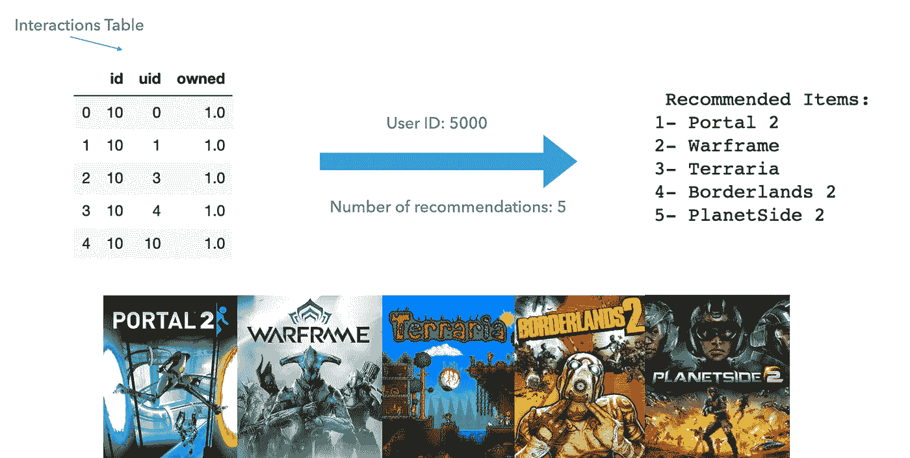
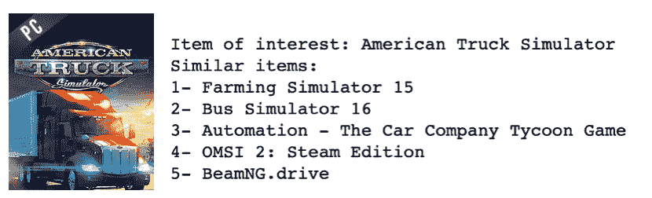

# 构建游戏推荐引擎

> 原文：<https://towardsdatascience.com/building-a-game-recommendation-engine-870a1ccd11c4?source=collection_archive---------35----------------------->

## 使用来自 Steam 和 LightFM 库的数据生成预测

对于我的 Flatiron 数据科学训练营顶点项目，我知道我想建立一个推荐引擎。推荐系统已经成为我们日常生活的一部分，从网飞推荐电影到亚马逊展示我们感兴趣的商品。虽然 MovieLens 数据集似乎是学习和构建推荐系统的首选数据集，但我希望使用不同的数据源来确保项目更加独特。

在 COVID 疫情期间，随着人们更多地呆在家里，视频游戏出现了激增。事实上，Steam 在 2020 年 3 月报告了创纪录的在线并发用户数。因此，我决定调查游戏推荐，看看我的预测是否与 Steam 的一致。

由[亚历克斯·哈尼](https://unsplash.com/@alexhaney?utm_source=medium&utm_medium=referral)在 [Unsplash](https://unsplash.com?utm_source=medium&utm_medium=referral) 拍摄的照片

**第一步:获取数据**

这些数据是从朱利安·麦考利的推荐系统数据集页面获得的。我使用了两个文件:[版本 1:用户和物品数据](http://deepx.ucsd.edu/public/jmcauley/steam/australian_users_items.json.gz)，其中包含了协作过滤模型所必需的用户-物品交互数据；以及[版本 2:物品元数据](http://cseweb.ucsd.edu/~wckang/steam_games.json.gz)，其中包含了与游戏相关的信息，比如发布日期、标签、价格等等。

**第二步:加载并预处理数据**

虽然数据据说是 JSON 格式的，但我无法用 Pandas 直接加载它。当通过 JSON linter 运行它时，我注意到它不是正确的 JSON，因为使用了单引号而不是双引号。一个可行的解决方案是使用`ast.literal_eval().`读取数据，数据预处理相对简单，从字典列表中提取游戏 id 是一个小小的挑战。

**第三步:建模**

为了创建用户推荐模型，我使用了 [LightFM](https://making.lyst.com/lightfm/docs/home.html) 库。文档非常简单。在实例化模型之前，我将数据框架修改为稀疏交互矩阵。有许多可能的损失函数可以使用，我发现 WARP 提供了最好的模型。这种方法通过重复采样负样本直到找到一个违反规则的样本来最大化正样本的等级。当只有积极的互动，人们希望优化推荐列表的顶部时，这也是最常用的，这两种情况都适用于我的情况。

**步骤 4:生成用户推荐**

随着我们的最终模型在完整的交互矩阵上得到训练，我现在可以为用户生成推荐了。我创建了一个函数，它将训练好的模型、交互矩阵、用户 id 和所需推荐的数量`k`作为输入，并为该用户返回排名前`k`的游戏。

**第五步:单品推荐**

我还使用余弦相似性作为距离度量，使用该模型来生成项目到项目的推荐。我创建了一个函数，它接受一个游戏 id 并返回`k`最相似的游戏。

示例输出:五个类似于美国卡车模拟器的游戏

更多细节和底层代码，请看我的 [GitHub 库](https://github.com/nadinezab/video-game-recs)。

参考

[https://www . games industry . biz/articles/2020-03-16-record-number-of-steam-users-online-during-coronavirus-outbreak](https://www.gamesindustry.biz/articles/2020-03-16-record-number-of-steam-users-online-during-coronavirus-outbreak)