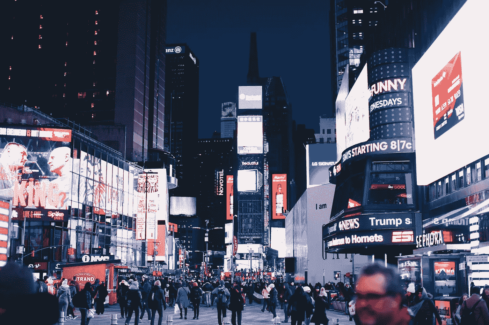
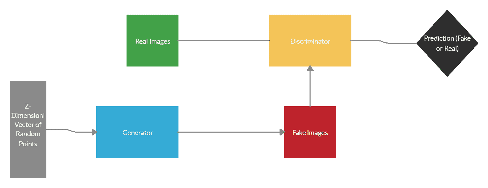
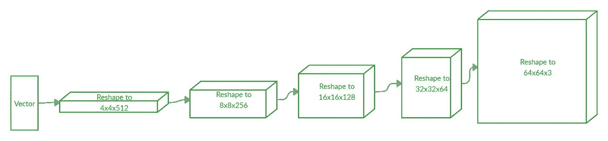
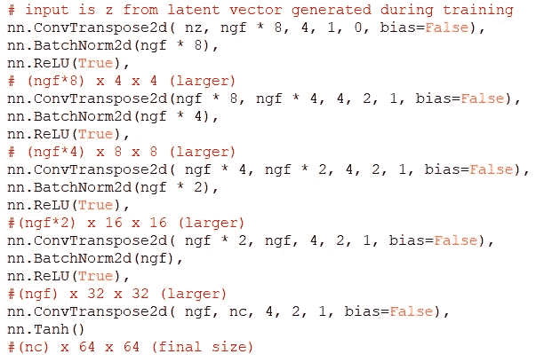
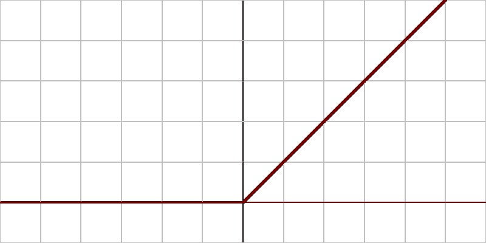
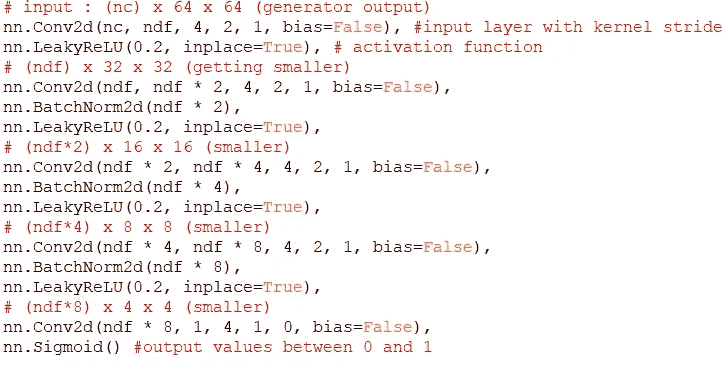
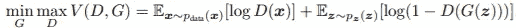
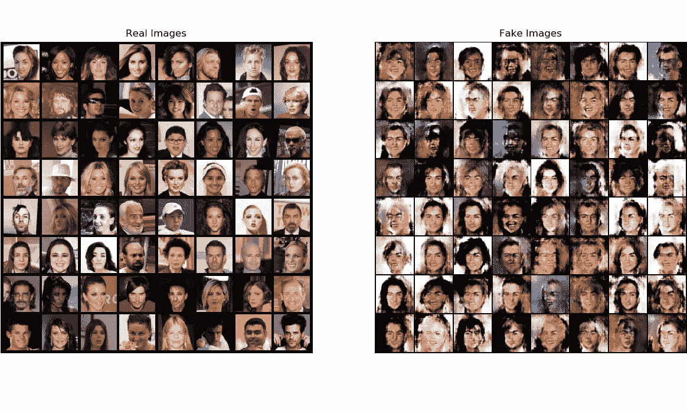
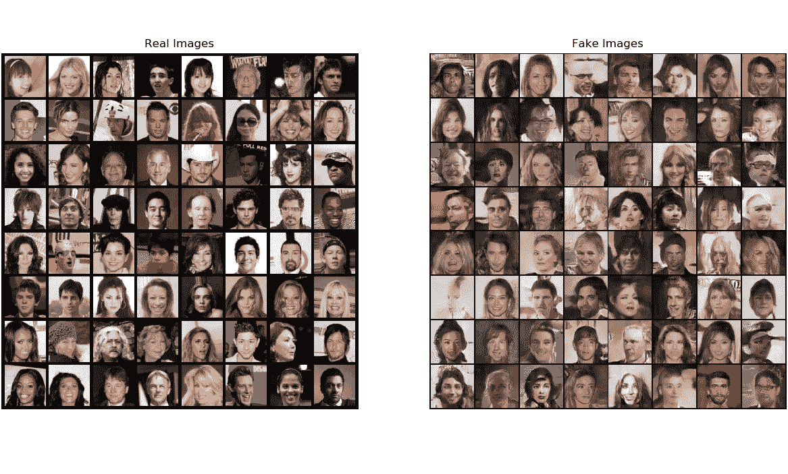

# 构建 GAN(通用对抗网络)

> 原文：<https://towardsdatascience.com/building-a-gan-general-adversarial-network-6d0f69747945?source=collection_archive---------27----------------------->

## 用 Pytorch 生成人脸

致谢: [Pexels](https://www.pexels.com/photo/people-walks-in-time-square-1634278/?utm_content=attributionCopyText&utm_medium=referral&utm_source=pexels) 的 jimmy teoh

在过去的一个月里，我一直在开发一个人脸识别系统。我从一开始就对 gan 感兴趣，因为它们能够创造新的照片和不存在的数据集。在本文中，我将介绍什么是 GAN，然后简单介绍一下我使用的代码。

# 【甘简介:】

GAN 或通用对抗网络是利用两个神经网络的网络，一个生成器和一个鉴别器。生成器的工作是创造新的数据，鉴别器的工作是决定生成器吐出的数据是不是假的。在我的例子中，生成器创建图像，鉴别器决定图像是否真实。在训练过程中，生成器的目标是生成越来越好的图像来欺骗鉴别器，而鉴别器的作用是越来越好地决定图像是不是假的。目标是鉴别器不能区分图像是否来自训练数据。如您所见，这为两种算法创建了一个正反馈循环，从而改善了生成器生成的最终图像。

GAN 的基本图。署名:维克拉姆·梅农

我专门构建了一个 DCGAN，一个深度卷积的一般对抗网络，它的工作方式有点不同。它利用卷积网络，而不是在发生器和鉴别器中使用多层感知器。

DCGAN 图。署名:维克拉姆·梅农

这有利于我们，因为需要更少的训练数据和时间。ConvNets 基于数据相关的思想。在我的例子中，它允许算法将图像一侧的像素关联到另一侧。这使得它能够为图像中的不同结构赋予重要性，并区分它们。这对于图像非常有帮助，因为常规的多层神经网络单独观察和训练每个像素，而 ConvNet 可以训练一个区域，并将其应用于其他像素。此外，DCGAN 不使用池，而是使用 Stride。这是因为池只关心图像中的对象是否存在，而 Stride 也关心位置。总的来说，DCGANs 能够实现更平滑和更高效的过程，这就是为什么它是最常见的 GAN。

# **这一切是如何运作的**

我将回顾所使用的代码，以及这些代码对于 DCGAN 如何工作的意义。

**发电机**

如上所述，生成器的工作是生成一个图像来欺骗鉴别器。那么，它到底是怎么做到的呢？

发电机的输入是一个**潜向量**。潜在向量是映射到潜在空间中的一组隐藏点，这些点应用于向量算法。矢量算法建立点之间的关系，例如距离和地形数据。

图像尺寸开始很小，最后变大。署名:维克拉姆·梅农

然后，潜在向量被送入一系列**步长二维卷积转置层**。这基本上包括一个跨越(或跳过)输入矩阵的内核。为了增加图像的大小，需要上采样。上采样是指程序将维度加倍，以获得特定维度的更大、更密集的图像。

接下来，我们通过**批量标准化**来运行它，以使训练更容易。通过规范化图层，它减少了潜在值的变化量。这稳定了层的激活，允许最佳权重并降低损失函数。

信用:[笑库存](https://commons.wikimedia.org/w/index.php?title=User:Laughsinthestocks&action=edit&redlink=1)，通过[维基](https://commons.wikimedia.org/wiki/File:Activation_rectified_linear.svg) (CC BY-SA 4.0)

接下来我们通过一个 **ReLU 激活**来运行它。Relu 的特别之处在于，虽然它在照片的右半部分看起来像一条直线，但在左半部分可以看到，它并不是。这是一个基本的激活功能，它允许程序超越线性回归，学习更复杂的数据，如视频、音频或对我来说是图像。

最后，我将我的数据输出到一个**双曲正切函数**中，该函数依次输出-1 和 1 之间的数据。这将使数据正常化，并将其返回到原始范围。

**鉴别器**

图像发生器的尺寸减小了。署名:维克拉姆·梅农

如前所述，鉴别器将生成的图像作为输入，并输出图像来自训练数据的概率。鉴别器只是做与生成器相反的事情。首先，它将数据输入到一个 2dConv 网络中，这次没有放大(因为我们在缩小)。然后，它通过批处理规范化和 Relu 来馈送它。最后，它使用 **sigmoid 激活函数**输出概率，而不是生成器中的双曲正切函数。这样做的好处是它输出 0 到 1 之间的概率。

# **结果**

既然我们已经有了生成器和鉴别器，我们必须实际训练网络并得到结果。我们首先根据训练数据训练鉴别器，然后从生成器生成图像，并对生成的图像运行鉴别器。

快速旁注:

那就是 [Goodfellow 的论文](https://papers.nips.cc/paper/5423-generative-adversarial-nets.pdf)中提到的 GAN 损失函数。D(G(z))是生成器(G)的输出是真实图像的概率。鉴别器 D 试图最大化它对生成的图像进行正确分类的机会(log(D(x))。另一方面，G 试图最小化鉴别器将图像分类为假图像的概率(log(1D(G(x)))。这迫使生成器和鉴别器在工作中做得更好。

经过一个时期的训练后，结果如下:

经过 10 个时期的训练，结果看起来像这样:

正如你所看到的，随着时间的推移，生成的图像在识别和再现人脸的面部结构方面变得越来越好

疯狂的是生成的人都是百分百假的。这太疯狂了。这方面的应用有很多。从图像编辑到安全和银行业务，GANs 拥有巨大的潜力。能够生成新的数据集是理解和创造新事物的关键因素

创作这个 GAN 对我来说是一次非常享受的经历，因为我必须真正弄清楚所有复杂的部分是如何组合在一起的。请继续关注我的下一个版本！

教程:[https://py torch . org/tutorials/初学者/dcgan_faces_tutorial.html](https://pytorch.org/tutorials/beginner/dcgan_faces_tutorial.html)

*联系我:*

*领英:*[*https://www.linkedin.com/in/vikram-menon-986a67193*](https://www.linkedin.com/in/vikram-menon-986a67193)

*电子邮件:vikrammenon03@gmail.com*