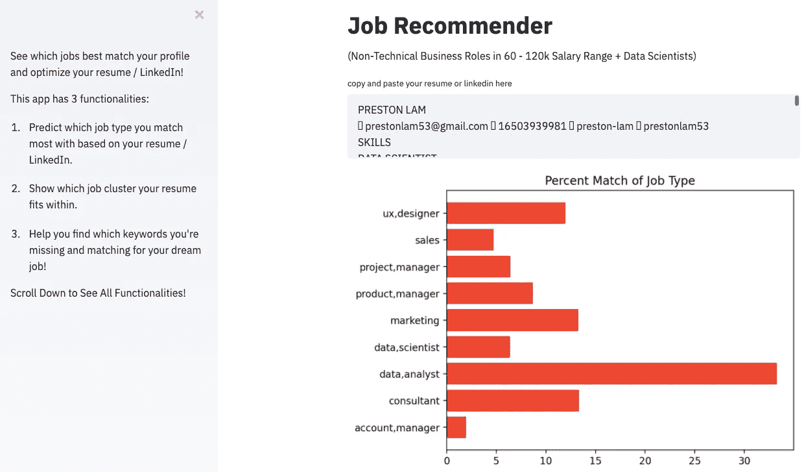
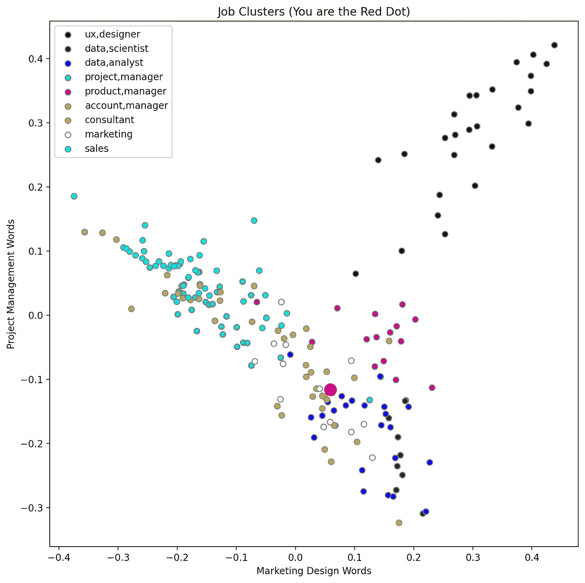
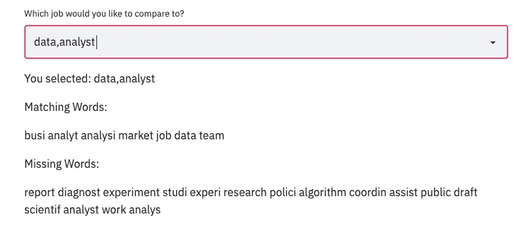

# 基于自然语言处理和机器学习的工作推荐系统

> 原文：<https://towardsdatascience.com/building-a-job-recommender-for-non-technical-business-roles-via-nlp-and-machine-learning-626c4039931e?source=collection_archive---------12----------------------->

> 我**为非技术背景的人建了一个工作推荐器。这篇文章是关于这个应用的特性和我构建它的步骤。**

[剧组](https://unsplash.com/@crew)在 [Unsplash](https://unsplash.com/?utm_source=medium&utm_medium=referral) 上拍照

[***这里是 app 的链接。***](https://immense-cove-42591.herokuapp.com/)

由于我以前的公司最近裁员，我受到启发创建了一个工作推荐器。我的许多被解雇的前同事进入职业生涯不到 3 年，他们想知道，根据他们的经验，他们适合什么样的角色，他们应该从哪里开始找工作。我记得大学毕业时也有过类似的挣扎，当时我也不知道应该把目光放在哪里。我相信这个问题对于非技术背景的人来说是相当普遍的。

因此，我决定为我们这种职位的人——那些非技术背景的人，如心理学专业的人——建立一个工作推荐器，它将使用基于我们过去经历的信息来帮助我们走上正确的道路。

该应用程序结合了自然语言处理技术，如主题建模和分类风格的机器学习，以确定最适合你的。你复制并粘贴你的简历/ LinkedIn 到文本框中，应用程序解析文本并为你提供 ML 驱动的分析，分析你适合哪些工作以及为什么适合。

# 该应用程序有 3 个特点:

**功能 1:** 按作业类型返回匹配百分比。

功能 2: 根据主题匹配，返回一张你的简历与其他职位的匹配度图。这个图表有望对你从特性 1 中得到的结果提供某种解释。

**特点 3:** 选择不同工作原型的下拉列表，看看你的简历中哪些关键词匹配，哪些不匹配。

在本文的剩余部分，我将回顾我构建工作推荐器的步骤。我的代码的链接在这里。

# 步骤 1:确定项目范围

数据科学项目最重要的部分是范围界定，也就是说，规划您的项目，使其符合您的时间和精力限制，但仍然能够回答有价值的问题。某个领域可以拥有如此多的数据和探索途径，其数量之大令人难以招架。因此，你需要清楚你要解决什么问题，你要寻找什么具体数据，成功的最低门槛是什么。

我研究的关键问题是找出需要分析的工作类型。在非技术性的商业领域，有如此多不同的工作。我觉得如果我包括太多的工作申请，这个项目就不会达到预期的效果。建模可能不太准确，应用程序最终可能过于混乱和不集中，对最终用户没有帮助。因此，我回想了一下自己的初衷，并为乔布斯的分析确定了两个标准:

1.  这些工作必须是不需要技术技能的商业角色。这不包括软件工程师、医学或表演。
2.  这份工作的薪水必须在 40-120，000 英镑之间。这反映了具有 0-3 年工作经验的人的典型收入范围。

之后，我想到了一些有意义的宽泛的工作原型，但也发出了一份调查，看看别人对我的想法有什么看法。然后，我让我的同事对他们感兴趣的工作类型进行排名，这样我就可以限制我必须分析的工作类型的数量。理想情况下，我希望分析不到 10 种工作类型。

有了这些信息，我选择了 5 个最受欢迎的工作作为我分析的基础，但后来当我确信我的模型可以正确区分工作类型时，我又添加了更多。我最终在非技术业务领域选择了 8 种不同的工作类型，还出于个人兴趣添加了“数据科学家”。

# 步骤 2:收集数据

我计划使用的数据是符合上述标准的各个工作类型的职位发布。我第一次看 LinkedIn 和确实，但他们的网站证明太难刮，因为动态加载。

我决定从 Glassdoor 上抓取招聘信息，它也使用动态加载。但这一次，我借用了一位数据科学家同事的代码，并根据我的需要进行了修改。我很感激这段代码，因为构建我自己的 scraper 将花费我更多的时间！

在修改了 scraper 以适应我的需求后，我为每个工作类型刮了 40 个帖子并加入了文件。许多工作显然不符合正确的工作原型——例如，当我担任“项目经理”时，我得到了许多建筑方面的工作。我还得到了许多头衔为“高级(工作类型)分析师”或“主管(工作类型)”的工作，这些职位对于有 0-3 年工作经验的人来说显然是高不可攀的。因此，我设置了文本过滤器来筛选这些工作类型，并仔细检查以确保其余的数据符合我的要求。最终，我得到了来自 9 个不同工作类型的 149 个工作列表的文本描述作为我的数据集。

# **第三步:数据清理和主题建模**

下一步是清理文本描述。我使用了标准的清理技术，比如删除标点符号和大写，然后对单词进行标记化和词干化，以实现语义标准化。最后，我使用矢量器将数据放入数组格式。

一旦数据是可分析的格式，我就执行主题建模，尝试了几种技术，但最终还是采用了 TruncatedSVD。优化因素是我在步骤 4 中建立的分类模型预测工作类型的准确度。我总共想出了 20 个不同的主题。

# 步骤 4:构建分类算法

在主题建模之后，我使用了主题-文档矩阵，并将其输入到分类算法中。为了提高准确性，我最终选择了随机森林分类器。该模型在验证集上返回了约 90%的准确度，显示了在预测每个职位描述的正确职位类型方面的强大能力。

接下来，是时候赋予模型一个功能性的目的了。我用了上面的主题模型来改造一个人的简历，然后用上面的分类模型来预测简历最适合哪些工作。然后，我根据工作类型提取了匹配百分比，给出了一个人最佳工作匹配的更细致的视图——例如，60%的项目经理，40%的产品经理——并为最终用户提供了多种职业发展途径进行调查。

# 步骤 5:构建 PCA 图表构建函数

当我向人们展示他们各自工作匹配百分比的结果时，他们问*为什么*他们适合这些群体。我很难向非技术人群解释模型的基本机制，因此我决定向他们展示一个简化的图表来解释这些工作匹配结果。

首先，我使用主成分分析将主题-文档矩阵简化为二维。然后，我根据缩减后的维度划分出每种工作类型。我还对一个人的简历进行了降维处理，并在图表上画出了一个人的简历与其他工作的对比。在解释新的 PCA 特性时，我发现它们主要面向两种主题类型:市场营销相关的关键词和项目管理相关的关键词。

# 步骤 6:构建关键字匹配功能

用户感兴趣的是*如何*改善他们的简历，以便在他们瞄准的任何工作中获得更好的机会。为了让应用程序更有用，我决定做一个匹配关键词的功能。

在这个功能中，用户从下拉列表中选择他们感兴趣的工作，应用程序会返回他们简历中匹配和缺失的关键词。人们可以看到他们的简历目前所处的位置，以及他们可以在更有针对性的申请中加入哪些词语和经历。

这个特性可能是最容易制作的。我使用了上面相同的主题模型来找出每种工作类型中最重要的单词——比如前 20 个——并使用列表理解来查看哪些单词匹配或错过了。

# 步骤 6:编写和部署应用程序

既然我已经创建了函数和模型，我需要在线部署一个应用程序，以便人们可以使用它。

对于 app 编写，我用的是 Streamlit。这是最简单和最有效的软件包之一。然后我用 Heroku 和 git 把它上传到网上，尽管回想起来，使用 streamlit 新发布的应用程序部署功能要容易得多。

我们做到了！工作推荐人。我为这个项目感到非常自豪，我希望人们会发现它很有用。如果你认为这个应用可以帮助某人，就发给他们吧！如果你有任何批评，欢迎在下面评论或者给我发信息。感谢阅读。