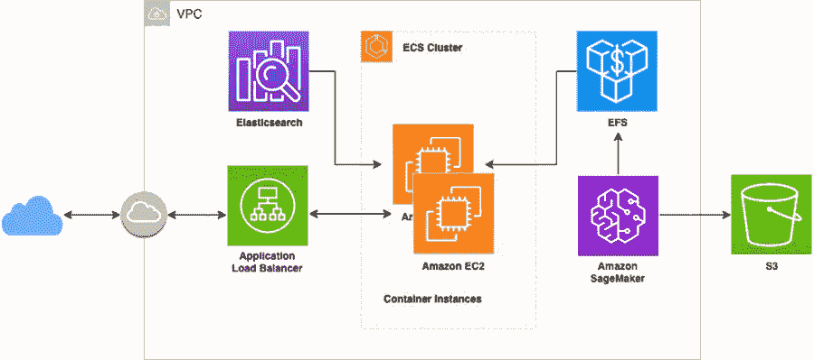
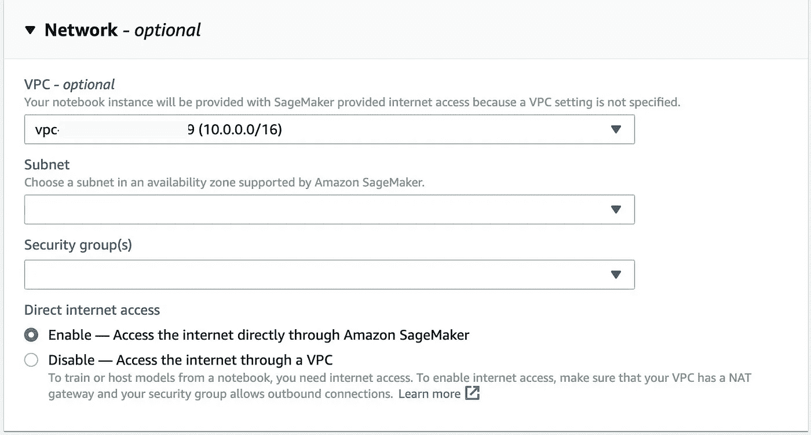
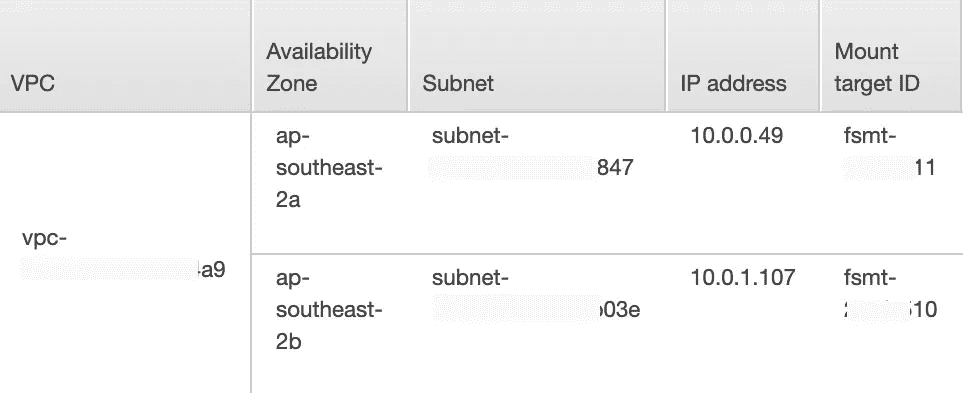

# 使用 Amazon Elasticsearch 和 SageMaker 构建 k-NN 相似性搜索引擎

> 原文：<https://towardsdatascience.com/building-a-k-nn-similarity-search-engine-using-amazon-elasticsearch-and-sagemaker-98df18d883bd?source=collection_archive---------12----------------------->

## 构建高效且可扩展的文档相似性搜索引擎的分步指南


[NeONBRAND](https://unsplash.com/photos/CXDw96Oy-Yw) 在 [Unsplash](https://unsplash.com/photos/CXDw96Oy-Yw) 拍摄的照片

亚马逊 Elasticsearch 服务最近增加了对 k 近邻搜索的支持。它使您能够像运行任何常规的 Elasticsearch 查询一样轻松地在数千个维度上运行高规模和低延迟的 k-NN 搜索。

> k-NN 相似性搜索由 Elasticsearch 开放发行版提供支持，这是一个 Apache 2.0 许可的 Elasticsearch 发行版。

在这篇文章中，我将展示如何使用 Amazon Sagemaker、Amazon Elasticsearch、Amazon Elastic File System (EFS)和 Amazon ECS 构建一个可扩展的相似性问题搜索 api。

# 我们将在本例中介绍的内容:

*   在 VPC 部署并运行一个 Sagemaker 笔记本实例。
*   将 EFS 装载到笔记本实例。
*   下载 Quora 问题对数据集，然后使用 DistilBERT 模型将数据集中的变长问题映射到定长向量。
*   创建下游任务以减少嵌入维数，并将句子嵌入器保存到 EFS。
*   将问题文本转换为向量，并将所有向量索引到 Elasticsearch。
*   将容器化的 Flask rest api 部署到 ECS。

下图显示了上述步骤的架构:



# 在 VPC 部署和运行 Sagemaker 笔记本实例

首先，让我们创建一个连接到 Elasticsearch 的 Sagemaker 笔记本实例，并确保它们在同一个 VPC 中。

要在 **Sagemaker 控制台中配置 VPC 选项，请在**创建笔记本实例**页面的**网络**部分的**中，设置 VPC 网络配置详细信息，如 VPC 子网 id 和安全组 id:



# 将 EFS 安装到笔记本实例

我们将在 **SageMaker 笔记本**中完成所有必要的句子转换步骤(代码在 处找到 [**)。**](https://github.com/yai333/knnelasticsearch/blob/master/knn-search.ipynb)

现在，将 EFS 安装到**型号**目录，关于 EFS 的更多详情，请查看 [AWS 官方文件](https://docs.aws.amazon.com/efs/latest/ug/gs-step-two-create-efs-resources.html)。

**注**:

*   `fs-xxxxx.efs.ap-southeast-2.amazonaws.com`是 EFS 的 DNS 名称。
*   EFS 山目标和萨格马克在同一个 VPC。



# 使用 DistilBERT 模型将变长问题映射到定长向量

要运行最近邻搜索，我们必须获得句子和标记嵌入。我们可以使用[句子变形器](https://github.com/UKPLab/sentence-transformers)，这是一个用 PyTorch 使用 BERT/RoBERTa/distil BERT/ALBERT/XLNet 的句子嵌入。它让我们只用几行代码就能把句子映射成固定长度的表示。

我们将使用轻量级 **DistilBERT** 模型到生成句子嵌入在这个例子中，请注意 **DistilBERT** 的隐藏单元数量是 768。这个维度对于 Elasticsearch index 来说似乎太大了，我们可以通过在合并后添加一个密集层来将维度减少到 256:

接下来，将句子嵌入器保存到 EFS 安装的目录中:

```
transformer.save("model/transformer-v1/")
```

我们需要确保数据集已经下载，本例中的数据集是`[quora question paris datas](https://www.kaggle.com/quora/question-pairs-dataset)`。

接下来，将每个问题的全文提取到 dataframe 中:

## 将问题文本转换为向量，并将所有向量编入索引以进行弹性搜索

首先，创建一个 kNN 索引，

然后将问题向量转换并索引到 Elasticsearch。

弹性搜索中的问题具有以下结构:

```
{'question_vector': [-0.06435434520244598, ... ,0.0726890116930008],
'question': 'How hard is it to learn to play piano as an adult?'}
```

我们将问题嵌入到固定长度的向量中，并将所有向量编入索引以进行弹性搜索。让我们创建一个连接到 Elasticsearch 的 rest api 并进行测试！

# 部署容器化的 Flask rest api

我们将使用示例云形成模板在 VPC 创建 ECS 集群和服务(模板和 bash 脚本在 [**这里**](https://github.com/yai333/knnelasticsearch/tree/master/cf-templates) )。

我们将使用带有 ECS 的 **EFS 卷，搜索流程为 **1)** Flask 应用程序将保存的句子嵌入器加载到 EFS 卷中， **2)** 将输入参数句子转换为向量， **3)** 然后在 Elasticsearch 中查询 K-最近邻居。**

我们现在已经在 ECS 容器中运行了 flask api，让我们使用基本的搜索功能来查找类似的问题，以进行查询:“ ***在线赚钱的最佳方式是什么*** ？”：

```
$**curl** --data '**question=What is best way to make money online?**' --data '**size=5**' --data '**min_score=0.3**'  -X POST http://knn-s-publi-xxxx-207238135.ap-southeast-2.elb.amazonaws.com/search
```

查看结果:

正如你所看到的，结果是相当惊人的，你也可以微调你自己的句子嵌入方法，这样你就可以为 k-NN 搜索得到特定任务的句子嵌入。

太好了！我们有我们需要的！我希望这篇文章对你有用。

完整的脚本可以在我的 [**GitHub repo**](https://github.com/yai333/knnelasticsearch) 中找到。