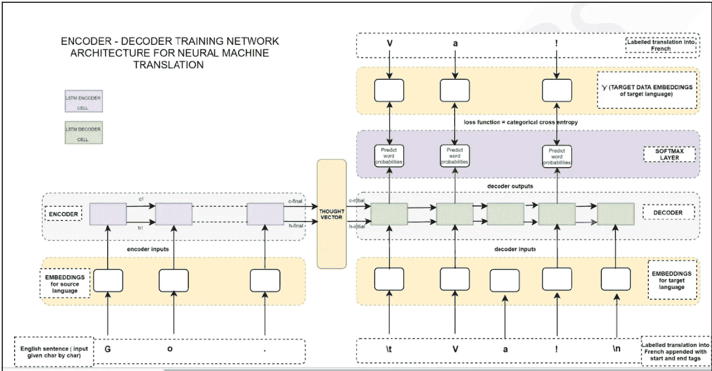

# 用 Python 一步步构建语言翻译聊天机器人

> 原文：<https://towardsdatascience.com/building-a-language-translation-chatbot-in-python-step-by-step-40709393a98?source=collection_archive---------14----------------------->

## *Python 中的语言翻译模型*


[沃洛德梅尔·赫里先科](https://unsplash.com/@lunarts?utm_source=medium&utm_medium=referral)在 [Unsplash](https://unsplash.com?utm_source=medium&utm_medium=referral) 上的照片

这里，在本文中，我们将制作一个语言翻译模型，并通过提供一种语言的输入并获得您想要的语言的翻译输出来进行测试。对于使用 Python 的语言翻译模型，我们将使用序列到序列模型架构。

> 一个**序列到序列模型**有两个部分。第一部分是编码器，第二部分是解码器。这两个特征是两个不同的神经网络**模型**组合成一个巨大的神经网络。编码器模型的任务是在应用其他文本清理机制后理解输入序列**并创建给定输入文本的较小矢量表示。然后，编码器模型将创建的向量转发到解码器网络，解码器网络生成序列，该序列是表示模型输出的输出向量。**



作者照片

# 数据

我们将使用英语到印地语的翻译数据集，其中包含我们日常生活中使用的大约 3000 个对话。我们可以从任何开源资源中获取数据。你可以在卡格尔买到。

这里，我使用一个简单的文本文件，它是空格分隔的对话。它基于英语到印地语的对话，但是你也可以使用你自己的语言。但是，数据格式应该与文本文件相同，这将有助于您更好地遵循我的代码，不做任何更改。否则你可能需要根据你的数据格式做一些小的改变。


作者照片

# 大量数据

我们需要将我们的数据分成一些部分，并使用这些部分来训练出深度学习模型，以便我们的机器不会耗尽内存。

# 设置向量大小

我们需要设置向量的大小。向量大小是我们需要定义的输出数组的大小，这样所有的输出数组都可以有相同的大小。

```
embed_size=100 #define the vector size based on word your embedding
max_features=6000 #to restrict your number of unique words
maxlen=100
```

# 文本处理

如前所述，需要对编码器和解码器的数据进行处理，以获得更好的结果。这里，在我们的语言翻译中，我们将使用一些文本清理方法，如:

1.  移除所有停用字词
2.  单词大小写的变化
3.  删除所有数字数据
4.  删除重复的单词

# 单词嵌入

我们将使用 word2vec 模型将文本数据转换成定义大小的向量。

> Word2Vec 是一种把单词变成数字的技术。我们的机器学习或深度学习模型接受数字形式的输入。


鸣谢:维基百科

我们有两种著名的单词嵌入技术:

1.  CBOW:
2.  跳跃图


作者照片

我们可以使用任何预先训练好的 word2vec 模型。这里，我们将利用手套模型。 **GloVe** 模型在单词类比任务中结合了 **word2vec** skip-gram 模型的优点。这个手套模型可以在谷歌上找到。它有一个. txt 格式，我们可以使用下面的代码导入。

手套嵌入以小尺寸嵌入而闻名，足以满足我们的日常聊天。

# 数据标记化

初始化单词嵌入后，我们需要使用嵌入来标记数据。嵌入将每个单词转换成定义大小的数字向量。我们的机器学习或深度学习模型对数字数据起作用，因为有必要通过将每个单词定义为特定的向量来将任何文本数据转换为数字数据，以便我们稍后可以识别它们。

# 数据准备

最后，我们需要使用我们定义的数据处理步骤来清理我们的数据，并使用 tokenized_data.py 将它们转换为令牌。这里，我们将把一个问答集作为输入。我们将应用文本清理步骤，最后，我们将通过我们预先训练的 word2vec 模型，为每个单词分配一个向量。然后，取单词向量的平均值来构成句子向量。


[斯科特·格雷厄姆](https://unsplash.com/@sctgrhm?utm_source=medium&utm_medium=referral)在 [Unsplash](https://unsplash.com?utm_source=medium&utm_medium=referral) 上拍照

这里，我们还需要定义聊天句子的开始和结束，以便模型可以理解特定句子的结束位置和句子的开始位置，这有助于我们的模型进行推理。

# 火车

最后，是时候训练我们的模型了。这里，我们将使用清理后的矢量格式数据将其传递给序列对序列模型。我们的模型将在所有对话中使用我们在开始时定义的批量数据进行训练。


Liam Charmer 在 [Unsplash](https://unsplash.com?utm_source=medium&utm_medium=referral) 上的照片

# 使用我们的语言翻译聊天机器人

现在，是时候使用我们训练好的模型了。但是，在使用它之前，我们需要定义一些函数来帮助我们清理输入数据，将其转换为向量，并将其传递给经过训练的语言翻译模型，并获得输出向量，我们将解码该向量以获得输出的翻译句子。

```
enc_model , dec_model = make_inference_models()
```

# 运行聊天机器人

因此，我们已经在我们创建的大量数据上训练了我们的模型。我们在不同的时代接受训练。现在，为了检查模型性能，我们可以开始给出输入，并观察我们从模型接收到的输出类型。这里，我使用一个循环向我们的模型提出 10 个语言翻译问题。我们的模型接受输入。清理输入，创建一个词向量，最后取词向量的平均值，生成一个句子向量。句子向量进入模型，模型作为输出提供另一个句子向量，我们解码并输出。


运行语言翻译

所以，现在我们有了语言翻译模型，可以将任何英语句子转换成印地语。我们也可以使用任何其他语言，代码也是一样的。

# 如何提高准确性


micha Parzuchowski 在 [Unsplash](https://unsplash.com?utm_source=medium&utm_medium=referral) 上的照片

模型的准确性取决于数据源和适合您的数据的模型使用类型。您拥有的数据越多，您就越能训练和验证您的模型。

所以，在这里。我们已经用 Python 建立了我们的语言翻译。用自己的数据，自己的语言去尝试。如有任何疑问，欢迎在评论区提问。快乐学习！