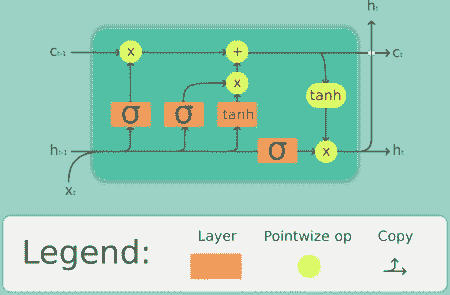
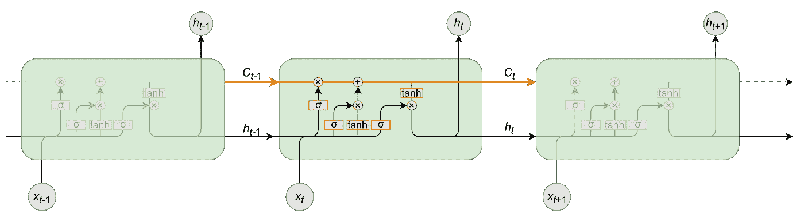
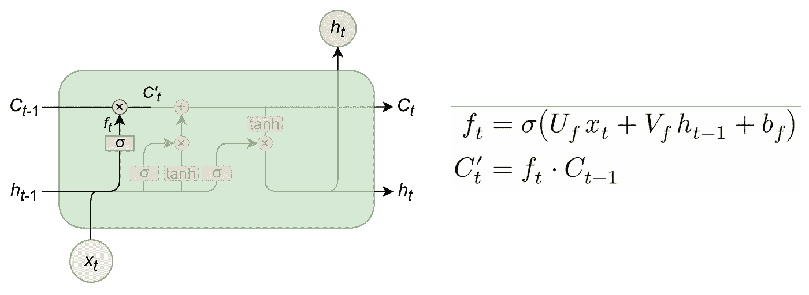
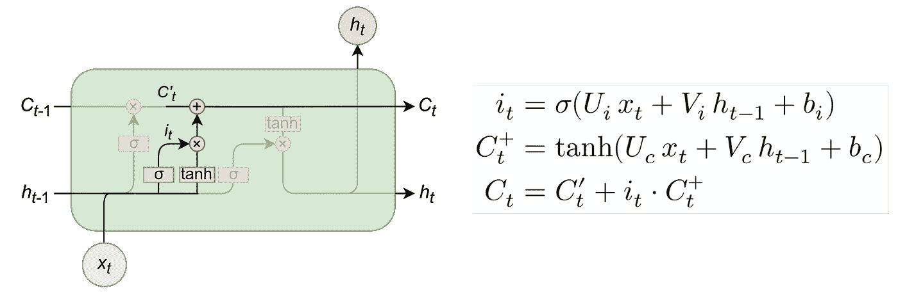
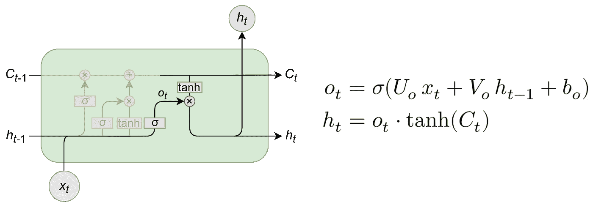
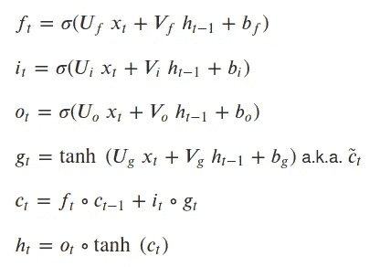
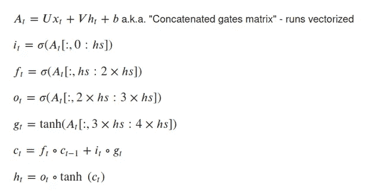
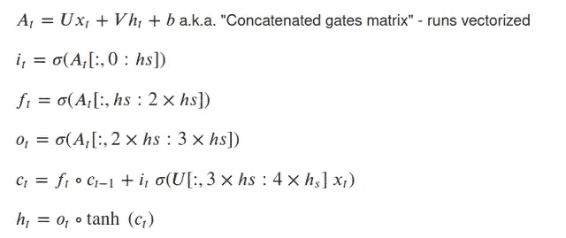

# 在 PyTorch 上手工制作 LSTM

> 原文：<https://towardsdatascience.com/building-a-lstm-by-hand-on-pytorch-59c02a4ec091?source=collection_archive---------3----------------------->

## 能够从零开始建立一个 LSTM 细胞使你能够在架构上做出自己的改变，并把你的研究带到一个新的水平。

LSTM 细胞图解—来源:[https://upload . wikimedia . org/Wikipedia/commons/thumb/3/3b/The _ LSTM _ cell . png/300 px-The _ LSTM _ cell . png](https://upload.wikimedia.org/wikipedia/commons/thumb/3/3b/The_LSTM_cell.png/300px-The_LSTM_cell.png)—2020 年 5 月 24 日获取

所有提到的代码都在下面的列表中或者在[我们的回购](https://github.com/piEsposito/pytorch-lstm-by-hand)中。

LSTM 细胞是深度学习的递归神经网络研究领域中最有趣的架构之一:它不仅使模型能够从长序列中学习，而且还为长期和短期记忆创建了一个数字抽象，能够在需要时用一个代替另一个。

在这篇文章中，我们不仅要浏览 LSTM 单元的架构，还要在 PyTorch 上手工实现它。

最后但同样重要的是，我们将展示如何对我们的实现做一些小的调整，以实现一些确实出现在 LSTM 研究领域的新想法，如窥视孔连接。

# LSTM 建筑

LSTM 有翼被称为门控结构:一些数学运算的组合，使信息从计算图上的那个点流动或被保留。正因为如此，它能够在长期记忆和短期记忆之间“做出决定”,并对序列数据输出可靠的预测:

LSTM 单元格中的预测序列。注意，它不仅流过预测 h_t，还流过 c_t，它是长期记忆的代表。来源:[https://medium . com/turing-talks/turing-talks-27-modelos-de-predi % C3 % A7 % C3 % A3o-lstm-df 85d 87 ad 210](https://medium.com/turing-talks/turing-talks-27-modelos-de-predi%C3%A7%C3%A3o-lstm-df85d87ad210)。访问时间:2020 年 5 月 24 日

我们将一部分一部分地讲述:

## 遗忘之门

遗忘门是输入信息和候选信息一起操作的门，作为长期记忆。请注意，在输入、隐藏状态和偏置的第一个线性组合上，应用了一个 sigmoid 函数:

忘记 LSTM 牢房的门。来源:[https://medium . com/turing-talks/turing-talks-27-modelos-de-predi % C3 % A7 % C3 % A3o-lstm-df 85d 87 ad 210](https://medium.com/turing-talks/turing-talks-27-modelos-de-predi%C3%A7%C3%A3o-lstm-df85d87ad210)。访问时间:2020 年 5 月 24 日

这个 sigmoid 将遗忘门的输出从 0“缩放”到 1——通过将其乘以候选值，我们可以将其设置为零，这表示长时间记忆中的“遗忘”,或者设置为一个更大的数字，这表示我们从长时间记忆中记住了“多少”。

## 新长时记忆的输入门及其解决方案

输入门是包含在输入和隐藏状态上的信息被组合，然后与候选和部分候选 c'_t 一起操作的地方:

LSTM 池的输入门。来源:[https://medium . com/turing-talks/turing-talks-27-modelos-de-predi % C3 % A7 % C3 % A3o-lstm-df 85d 87 ad 210](https://medium.com/turing-talks/turing-talks-27-modelos-de-predi%C3%A7%C3%A3o-lstm-df85d87ad210)。访问时间:2020 年 5 月 24 日

在这些操作中，决定了有多少新信息将被引入内存以及它将如何改变——这就是为什么我们使用一个双曲正切函数(“从-1 到 1 的标度”)。我们结合来自短时和长时记忆的部分候选项，并将其设置为候选项。

现在我们可以进入输出门了。

# 单元的输出门和隐藏状态(输出)

之后，我们可以收集 o_t 作为 LSTM 细胞的输出门，然后将其乘以已经通过适当操作更新的候选(长期记忆)的 tanh。网络的输出将是 h_t。

LSTM 电池的输出门。来源:[https://medium . com/turing-talks/turing-talks-27-modelos-de-predi % C3 % A7 % C3 % A3o-lstm-df 85d 87 ad 210](https://medium.com/turing-talks/turing-talks-27-modelos-de-predi%C3%A7%C3%A3o-lstm-df85d87ad210)。访问时间:2020 年 5 月 24 日

最后，我们有:

## LSTM 电池的方程式:

# 在 PyTorch 上实现它

为了在 PyTorch 上实现它，我们将首先进行适当的导入。

我们现在将通过从`nn.Module`继承来创建它的类，然后实例化它的参数和权重初始化，您将在下面看到(注意它的形状由网络的输入大小和输出大小决定):

## 设置参数

为了了解每个砝码的形状，让我们看看:

矩阵的输入形状为(batch_size，sequence_length，feature_length)-因此将乘以序列中每个元素的权重矩阵必须具有形状(feature _ length，output_length)。

序列中每个元素的隐藏状态(也称为输出)的形状为(batch_size，output_size)，这在序列处理结束时会产生(batch_size，sequence_length，output_size)的输出形状。—因此，与其相乘的 weight_matrix 必须具有与单元格的参数 hidden_sz 相对应的形状(output_size，output_size)。

这里是权重初始化，我们使用的和 PyTorch 默认的一样:

## 前馈操作

前馈操作接收`init_states`参数，该参数是具有上述等式的(h_t，c_t)参数的元组，如果不引入，该参数被设置为零。然后，我们对保持(h_t，c_t)的每个序列元素执行 LSTM 方程的前馈，并引入它作为序列的下一个元素的状态。

最后，我们返回预测和最后的状态元组。让我们看看它是如何发生的:

## 现在和优化版本

这种 LSTM 在运算方面是正确的，但在计算时间方面不是很优化:我们分别执行 8 次矩阵乘法，这比以向量化的方式执行要慢得多。我们现在将展示如何通过将它减少到 2 个矩阵乘法来实现，这将使它更快。

为了进行这种操作，我们设置两个矩阵 U 和 V，它们的权重包含在 4 次矩阵乘法中。然后，我们对已经通过线性组合+偏置运算的矩阵执行门控运算。

通过矢量化运算，LSTM 单元的方程将为:

所以它的`nn.Module`类应该是:

## 优化的 LSTM 细胞等级

最后但同样重要的是，我们可以展示使用 LSTM 窥视孔连接来调整您的实现有多容易。

## LSTM 窥视孔

LSTM 窥视孔对其前馈操作进行了细微调整，优化后的情况是:

有了 LSTM 的良好实现和优化实现，我们就可以添加窥视孔连接的选项，并做一些小的调整:

这样我们的 LSTM 就完成了。你可能想在[我们的回购](https://github.com/piEsposito/pytorch-lstm-by-hand)上看到它，并用我们的 LSTM 文本情感分析笔记本进行测试，我们准备用火炬 LSTM 内置层进行测试和比较。

# 结论

我们可以得出一个结论，尽管这是一种深度学习的禁忌，但是如果一步一步地完成，并且有干净和良好的编码，实际上很容易将它的操作执行成一个干净、易于使用的`nn.Module`。我们也看到了改变和调整它的连接来完成像窥视孔连接这样的操作是多么容易。

# 参考

 [## piEsposito/py torch-lstm-手工

### 一个关于如何制作 LSTM 神经网络的小而简单的教程。PyTorch 上的手工模块。记得执行 bash…

github.com](https://github.com/piEsposito/pytorch-lstm-by-hand)  [## 了解 LSTM 网络

### 2015 年 8 月 27 日发布人类不是每秒钟都从零开始思考。当你读这篇文章时，你…

colah.github.io](https://colah.github.io/posts/2015-08-Understanding-LSTMs/)  [## LSTM 神经网

### 机器学习

medium.com](https://medium.com/turing-talks/turing-talks-27-modelos-de-predi%C3%A7%C3%A3o-lstm-df85d87ad210)