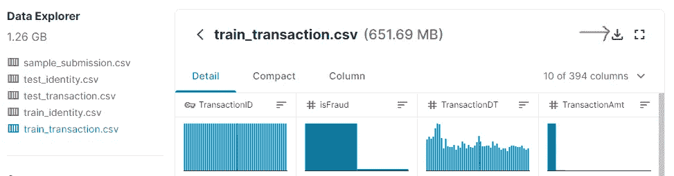

# 构建机器学习管道—第 1 部分

> 原文：<https://towardsdatascience.com/building-a-machine-learning-pipeline-part-1-b19f8c8317ae?source=collection_archive---------48----------------------->

## 使用软件包 fast_ml


照片由 [JJ 英](https://unsplash.com/@jjying?utm_source=medium&utm_medium=referral)在 [Unsplash](https://unsplash.com?utm_source=medium&utm_medium=referral)

以下是构建 ML 管道的常用步骤:

1.  输入数据
2.  探索性数据分析
3.  缺失值插补
4.  异常值处理
5.  特征工程
6.  模型结构
7.  特征选择
8.  模型解释
9.  保存模型
10.  模型部署*

# 问题陈述和获取数据

我用一个相对更大更复杂的数据集来演示这个过程。参考 Kaggle 竞赛— [IEEE-CIS 欺诈检测](https://www.kaggle.com/c/ieee-fraud-detection/)。

导航到数据浏览器，您会看到类似这样的内容:



选择 *train_transaction.csv* ，它将向您展示数据的大概情况。单击红色箭头突出显示的下载图标获取数据。

除了通常的库导入语句，您还需要检查另外两个库——

## 安装 pyarrow

## pip 安装快速 _ml

# 主要亮点

这是构建机器学习管道系列的第一篇文章。在本文中，我们将重点关注关于在 Jupyter notebook 中导入数据和更快执行的优化。

这篇文章中有 3 个关键点需要注意—

1.  **Python zipfile**
2.  **减少数据集的内存使用量**
3.  **保存/加载工作数据集的更快捷方式**

# 1:导入数据

下载压缩文件后。使用 python 来解压文件要好得多。

> **提示 1:****se 函数从 python 的 zipfile 库中解压文件。**

```
***import zipfile**with zipfile.ZipFile('train_transaction.csv.zip', mode='r') as zip_ref:
    zip_ref.extractall('data/')*
```

*这将创建一个文件夹`data`并在该文件夹中解压缩 CSV 文件`train_transaction.csv`。*

*我们将使用 pandas `read_csv`方法将数据集加载到 Jupyter 笔记本中。*

```
*%time trans = pd.read_csv('train_transaction.csv')df_size = trans.memory_usage().sum() / 1024**2
print(f'Memory usage of dataframe is {df_size} MB')print (f'Shape of dataframe is {trans.shape}')---- Output ----
CPU times: user 23.2 s, sys: 7.87 s, total: 31 s
Wall time: 32.5 sMemory usage of dataframe is 1775.1524047851562 MB
Shape of dataframe is (590540, 394)*
```

*该数据约为 1.5 GB，包含 50 多万行。*

> ***技巧二:***我们将使用 fast_ml 中的一个函数来减少这种内存占用。**

```
***from fast_ml.utilities import reduce_memory_usage**%time trans = reduce_memory_usage(trans, convert_to_category=False)---- Output ----
Memory usage of dataframe is 1775.15 MB
Memory usage after optimization is: 542.35 MB
Decreased by 69.4%CPU times: user 2min 25s, sys: 2min 57s, total: 5min 23s
Wall time: 5min 56s*
```

> *这一步花了将近 5 分钟，但是它将内存大小减少了将近 70%,这是一个相当显著的减少*

*为了进一步分析，我们将创建一个包含 20 万条记录的样本数据集，这样我们的数据处理步骤就不会花费很长时间。*

```
**# Take a sample of 200k records*
%time trans = trans.sample(n=200000)#reset the index because now index would have shuffled
trans.reset_index(inplace = True, drop = True)df_size = trans.memory_usage().sum() / 1024**2
print(f'Memory usage of sample dataframe is **{**df_size**}** MB')---- Output ----
CPU times: user 1.39 s, sys: 776 ms, total: 2.16 s
Wall time: 2.43 s
Memory usage of sample dataframe is 185.20355224609375 MB*
```

*现在，我们将把它保存在本地驱动器中— CSV 格式*

```
***import** **os**os.makedirs('data', exist_ok=True) trans.to_feather('data/train_transaction_sample')*
```

> ***技巧三:***使用羽化格式代替 csv**

```
***import** **os**os.makedirs('data', exist_ok=True)
trans.to_feather('data/train_transaction_sample')*
```

*一旦从这两个来源加载数据，您将会看到显著的性能改进。*

***加载保存的样本数据— CSV 格式***

```
*%time trans = pd.read_csv('data/train_transaction_sample.csv')df_size = tras.memory_usage().sum() / 1024**2
print(f'Memory usage of dataframe is **{**df_size**}** MB')
print (f'Shape of dataframe is **{**trans**.**shape**}**')---- Output ----
CPU times: user 7.37 s, sys: 1.06 s, total: 8.42 s
Wall time: 8.5 sMemory usage of dataframe is 601.1964111328125 MB
Shape of dataframe is (200000, 394)*
```

***加载保存的样本数据—羽毛格式***

```
*%time trans = pd.read_feather('tmp/train_transaction_sample')df_size = trans.memory_usage().sum() / 1024**2
print(f'Memory usage of dataframe is **{**df_size**}** MB')
print (f'Shape of dataframe is **{**trans**.**shape**}**')---- Output ----
CPU times: user 1.32 s, sys: 930 ms, total: 2.25 s
Wall time: 892 msMemory usage of dataframe is 183.67779541015625 MB
Shape of dataframe is (200000, 394)*
```

## *注意这里的两件事:*

*I .加载 CSV 文件所花费的时间几乎是加载羽毛格式数据所花费时间的 10 倍。*

*二。加载的数据集的大小以羽化格式保留，而在 CSV 格式中，数据集再次消耗大量内存，我们将不得不再次运行 reduce_memory_usage 函数。*

# *感谢阅读！*

*   *如果你喜欢这个，[在 medium](https://medium.com/@samarth.agrawal.86) 上跟随我了解更多。*
*   *你们的掌声对写更多、写得更好是一个巨大的鼓励和帮助。*
*   *有兴趣合作吗？我们在 [Linkedin](https://www.linkedin.com/in/samarth-agrawal-2501/) 上连线吧。*
*   *请随意写下您的想法/建议/反馈。*
*   *我们将使用我们创建的新样本数据集进行进一步分析。*
*   *我们将在下一篇文章中讨论探索性数据分析。*
*   *[Github 链接](https://github.com/samarth-agrawal-86/kaggle-ieee-fraud)*