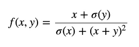
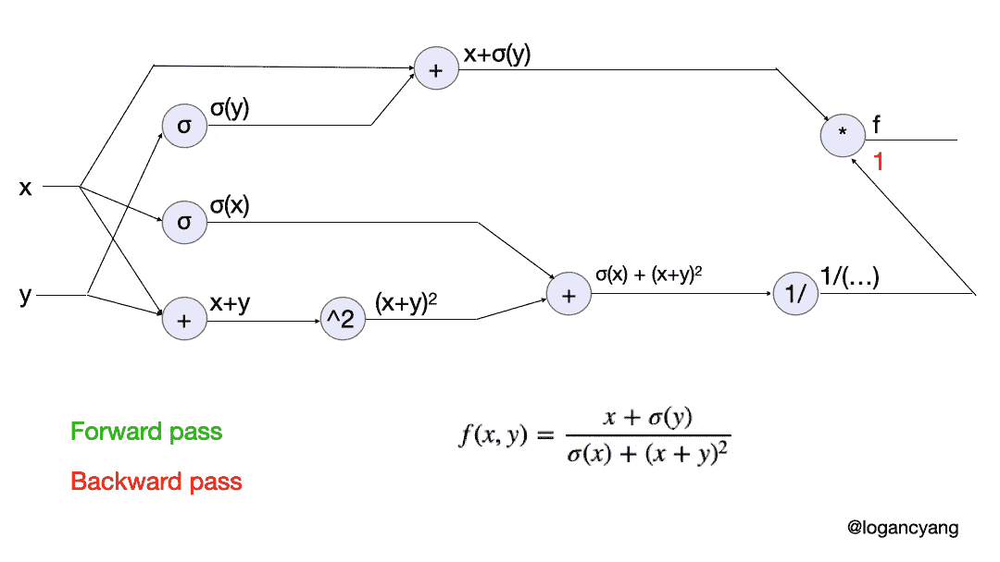
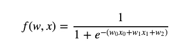
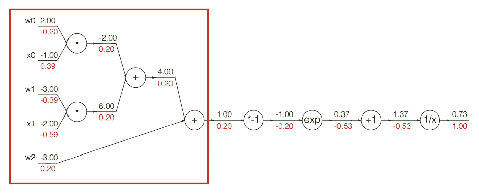
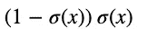
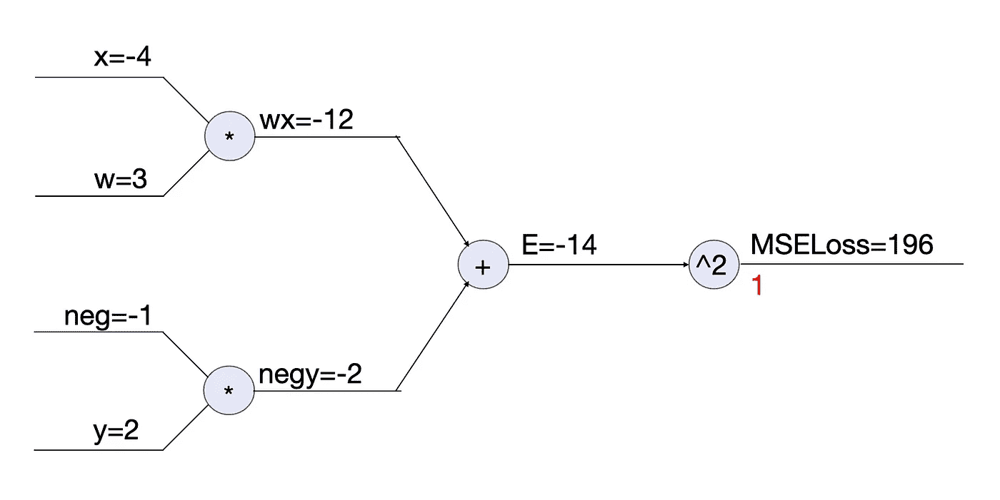
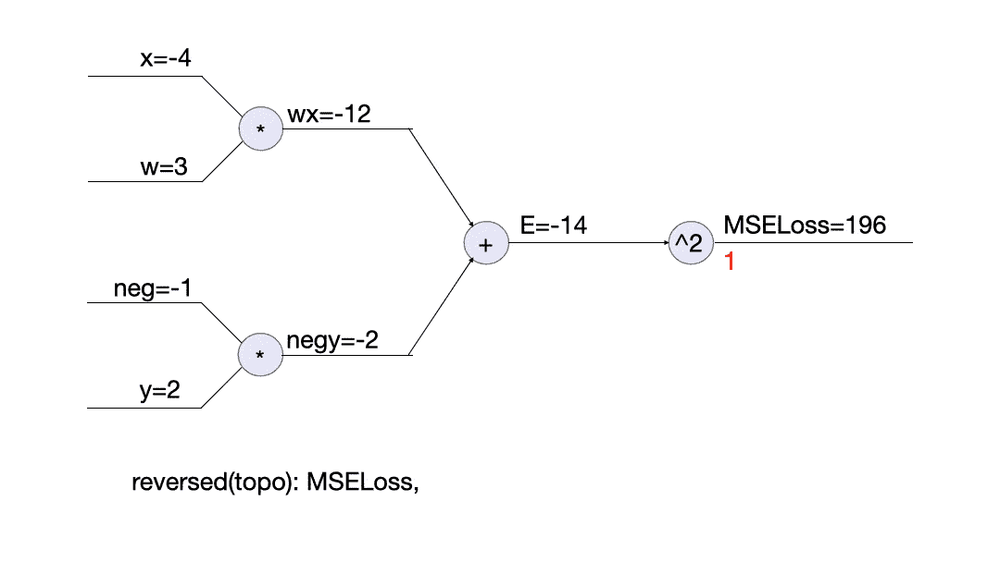

# 建立反向传播的心智模型

> 原文：<https://towardsdatascience.com/building-a-mental-model-for-backpropagation-987ac74d1821?source=collection_archive---------27----------------------->

## 通过用 Python 实现自己的深度学习框架


安德烈·韦莱在 [Unsplash](https://unsplash.com?utm_source=medium&utm_medium=referral) 上拍摄的照片

作为深度学习的跳动的心脏，任何深度学习实践者都需要对反向传播有坚实的理解。虽然互联网上已经有很多解释反向传播的好资源，但大多数都是从非常不同的角度来解释的，并且每个都适合特定类型的受众。在这篇文章中，我将把直觉、动画图和代码结合在一起，供深度学习的初学者和中级水平的学生更容易使用。对任何算法的理解的一个好的评估是你是否能从头开始自己编码。看完这篇文章后，你应该知道如何用 Python 实现你自己版本的反向传播。

# 实值电路和校正力

从数学上讲，反向传播是通过应用**链式法则**来计算函数分量梯度的过程。在神经网络的情况下，感兴趣的函数是**损失函数**。我喜欢 Andrej Karpathy 在 CS231n 中的解释:把计算图看成是带有逻辑门的**实值电路**。门是函数中的运算，例如加、乘、取幂、矩阵乘法等。


来源:[https://cs231n.github.io/optimization-2/](https://cs231n.github.io/optimization-2/)

这是一个很好的心理模型，因为它意味着反向传播是一个局部过程。电路中的每个门都可以计算其输出和局部梯度，而无需了解全局。

在反向传递(反向传播)期间，门应用链规则，即，在电路的最终输出上取其输出的梯度，并将其乘以关于其所有输入的局部梯度。可以使用**递归方法**从电路的输出返回到所有输入来实现反向传递。

直观上，反向传播及其相关权重更新的最终效果是，电路**“想要】**输出一个更接近我们所拥有的任何目标值的值。以上图中加法门(-4)的梯度为例，意思是**将 q 改变+1ε会导致 f** 中-4ε的变化。如果我们想要更高的 f 值，我们可以把 q 值降低。这就是梯度的本质。人们有时称之为“敏感”。另一个很好的类比是**修正力**。梯度的符号表示校正的**方向**，大小表示**强度**。

# 从函数到计算图

可视化反向投影的最好方法之一是绘制函数的计算图。让我们看看下面这个奇怪的函数，演示如何绘制它的计算图，然后手动反向投影。( *σ()是 sigmoid 函数*)



为了计算其梯度，我们可以将其分解为加法、s 形、正方形门，如下面的动画步骤所示:



具体来说，该流程包括 3 个高级步骤

1.  从操作(门)构建计算图
2.  在每个操作中运行正向传递
3.  基于(1)正向过程中计算的值和(2)每个门的反向函数运行反向过程，以计算其局部梯度

您可以跟随并手动计算这些值。我将在最后一节展示如何实现它，但是现在让我们来看一个技巧，它将帮助我们简化这个过程。

# 分阶段计算

任何一种可微函数都可以充当一个门，**我们可以在方便的时候将多个门组合成一个门**。

因为我们不应该明确地解析求解梯度，所以这些函数分量的选择就成了一个需要考虑的问题。以 sigmoid 函数为例:



我们可以将其分解为加法、乘法、求反、取幂和倒数门，如下图所示:



资料来源:https://cs231n.github.io/optimization-2/

一个简单的乙状结肠已经有这么多的运算和梯度，这似乎是不必要的复杂。我们可以做的另一件事就是**将一个 sigmoid gate** 与计算其梯度的函数一起应用于红框的输出。乙状结肠的坡度非常简单:



这样我们避免了许多不必要的计算。它节省了我们的时间、空间和能量，使代码更加模块化和易于阅读，并避免了数值问题。

乙状结肠门的代码可能类似于:

它既有向前传递的输出，又有计算向后传递的局部梯度的功能，只需几行代码。在下一节中，我将把它放到更大的图片中，并展示如何用这样的组件编写一个迷你的**亲笔签名的**库。

# 亲笔签名:递归方法

要让计算机使用链规则计算任何用有向无环图(DAG)表示的函数的梯度，我们需要为前面提到的 3 个高级步骤编写代码。这样的程序通常被称为自动分化或自动签名。正如您接下来将看到的，我们可以将代码组织成一个定义数据和操作的`Tensor`类，这样它不仅可以支持动态构建动态计算图，还可以递归地反向传播。

# 向前传递:构建图表

卡帕西显微图中的代码

一个张量对象有`data`、`grad`、一个`_backward()`方法、一组`_prev`张量节点和一个`_op`操作。当我们执行一个表达式时，它会动态构建计算图，因为我们已经用定制的 *dunder 方法*覆盖了 Python 操作符，如`+`、`*`和`**`。当前张量的`_backward()`、`_prev`和`_op`由其父张量定义，即产生它的张量。例如`c = a + b`中的`c`有`__add__`中定义的`_backward()`，还有`_prev = {a, b}`、`_op = '+'`。这样我们就可以定义任何我们想要的操作，并让 Python 来构造图形。

这里说的是神经网络，所以我们关心的表达式是**损失函数**。以 MSE 损失为例(为简单起见，使用 1 个标量数据点)，`MSELoss = (w*x - y)**2`其中`w`、`x`和`y`为张量对象，分别初始化为 3、-4 和 2。然后，图形会自动构建为:



注意减法其实就是否定和加法。我命名中间节点只是为了便于说明。有了图形，我们就可以实现反向投影了！

# 向后传递:拓扑排序

卡帕西显微图中的代码

`backward`应该从当前张量节点开始逐个计算梯度，并移动到其祖先。遍历的顺序需要进行拓扑排序，以确保每一步都计算了依赖关系。实现这种拓扑排序的一个简单方法是深度优先搜索。这里有一个动画来展示如何在 MSELoss 示例中执行它。



这是图遍历 101:一个普通的老 DFS。如果你有一个大型复杂的神经网络，你只需用你的大图替换左上角的`wx`，并且假设所有的操作和它们的`_backward`都在`Tensor`类中定义，那么 DFS 将会去那里计算梯度。这里我们需要的一些显而易见的操作包括`max`、`sum`、矩阵乘法、转置等。要使用渐变来更新权重，请执行以下操作:

```
for p in <your_parameters>:
    p.data -= learning_rate * p.grad
```

就这样，几行代码中的亲笔签名算法。它是任何深度学习框架的支柱。现在，困难的部分已经过去了，要完成您的 mini 深度学习框架的实现，您只需要实现一个模型接口，其中包含层类型、损失函数和一些优化器的集合。

# 推荐读物

这篇文章的灵感很大程度上来源于 Andrej Karpathy 令人敬畏的 [CS231n 讲座](https://cs231n.github.io/)和漂亮的文字[微图:最小的亲笔签名引擎](https://github.com/karpathy/micrograd)。如果你想看看一个 DIY 深度学习框架的不同和更扩展的版本，它非常类似于 PyTorch，请查看 Andrew Trask 在 [Grokking Deep Learning 中实现的那个。如果你更喜欢直接阅读 PyTorch 的亲笔签名，埃利奥特·韦特在 Youtube 上有一个](https://livebook.manning.com/book/grokking-deep-learning/chapter-13/1)[很棒的视频](https://youtu.be/MswxJw-8PvE)，它将为你节省大量钻研源代码的时间。坚持学习！

# 参考

*   [CS231n 讲座](https://cs231n.github.io/)
*   [微克:最小的亲笔签名引擎](https://github.com/karpathy/micrograd)

*看我在* [*上的其他帖子*](https://medium.com/@loganyang) *，或者关注我在* [*上的推特*](https://twitter.com/logancyang) *。*