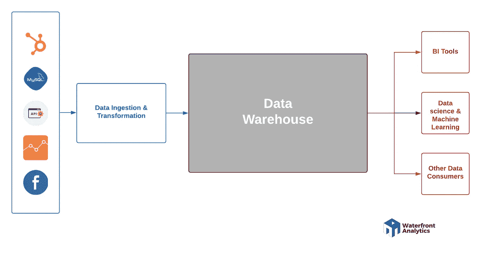
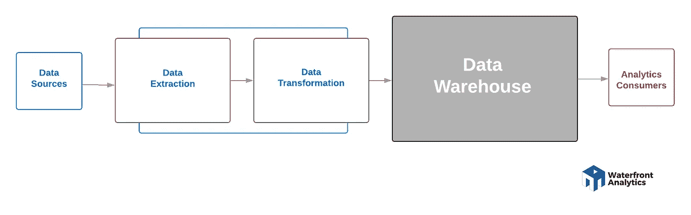
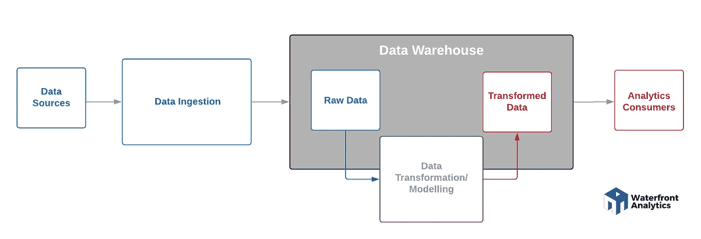

# 构建现代分析堆栈

> 原文：<https://towardsdatascience.com/building-a-modern-analytics-stack-966b0525dbc5?source=collection_archive---------23----------------------->

美国宇航局在 [Unsplash](https://unsplash.com?utm_source=medium&utm_medium=referral) 拍摄的照片

各行各业各种规模的公司都很快认识到，为了保持竞争力，他们必须接受一种文化，在所有业务中，决策都以数据为依据，并快速做出。这可以是在管理层，BI 仪表板用于监控公司的整体健康和绩效，分析师通过查询多个来源的数据来寻找见解，或者工程师在公司数据的基础上构建机器学习工具和智能自动化应用程序。

随着数据量和使用案例的增加，组织、集成和管理数据访问变得更加困难，在较小规模下有效的工具和流程不再有效。试图处理数据并将其嵌入整个组织的公司需要一个强大的基础架构，能够快速、轻松地提供数据。随着数据规模的增长，他们需要考虑指导数据管理的框架。这项工作的一个重要部分是建立分析堆栈。

# **什么是分析堆栈？**

分析堆栈是作为集成系统的一部分执行特定流程的一组工具。通过组合执行简单过程的工具，如存储来自多个来源的数据、合并和转换数据以及可视化数据，我们能够组装更复杂的行为。通过使用具有特定功能的工具，您可以获得可定制性和可互换性的好处。这意味着，例如，当您的数据存储需求急剧增加，而您当前的存储解决方案变得太贵或太慢时，您可以轻松替换堆栈中的该层，或者添加满足您需求的新层，而不必替换整个堆栈。

# 如今的数据分析堆栈有什么问题？

如今，大多数公司都在一系列应用程序上运营，如用于 CRM 的 Salesforce、用于在线销售的 Shopify、用于 ERP 的 Workday、用于收集、组织和可视化数据的 Microsoft Excel 以及用于存储和共享数据的 Sharepoint。这些工具对于业务任务来说非常棒，但是对于分析来说却变得非常有限。您很快意识到 Excel 电子表格对于存储或操作大量数据来说效率不高，或者对 Sharepoint 的不同访问级别会导致孤立的数据，而其他团队无法利用这些数据来构建他们的用例。至少，你会发现有些人使用来自 Salesforce 和 Hubspot 等工具的自动化报告和仪表盘。这样做的最大问题是，您无法跨应用程序合并数据来构建自动化工具或进行高级分析。此外，这些服务提供了汇总和聚合级别的数据，如果您想深入了解细节或比较不同时间的数据，这是没有帮助的。

那些对构建可靠的分析基础设施不够重视的公司意识到，数据分析师和科学家在 ETL 等基本数据处理和管理任务上分配的时间不均衡。软件公司 Jetbrains 的一项调查显示，分析团队中高达 75%的成员最终从事这些任务，而不是商业智能、数据科学或机器学习，这些才是分析的真正附加值。

那些已经采取下一步措施，通过内部部署数据仓库、数据集成工具和 BI 来构建分析基础架构的公司面临着自己的挑战。硬件服务器需要大量的 IT 参与，难以维护，并且需要很长时间来证明其价值。此外，高昂的设置成本使得随着需求的变化很难互换解决方案，并且随着时间的推移，对于许多公司来说，这是一个负担不起和难以扩展的障碍。

AWS 和 Azure 等云计算平台的兴起及其基于使用的数据仓库、集成和高级分析产品的成本，减轻了设置的重大负担，并大大缩短了分析的价值实现时间。下一阶段的 SaaS 和云分析公司(如 Snowflake、Stitch 和 Looker)进一步推动了这一趋势，这些公司提供自助服务技术，这些技术非常容易设置和运行，并且彼此无缝集成。

# 现代分析堆栈

为了建立一个功能性的数据操作，一个组织通常需要将几个服务组合成一个数据栈。从根本上说，有效的数据堆栈将使执行三种基本操作成为可能，包括从许多来源收集数据并将其吸收到存储系统中，为各种用例清理和转换数据，以及最终将转换后的数据用于可视化或机器学习等分析的增值部分。这三个过程都是数据管道的一部分。您在每个流程中使用的工具构成了分析堆栈。根据公司的需求，数据管道的架构可能会有所不同，但它们在上述主要流程中都有共同点，如下图所示。

分析数据管道

我们将详细介绍每个流程的功能，并列出一些可用的流行云平台。

## 数据接收和转换

任何分析项目的最初挑战都是使来自多个孤立数据源的数据可用。这些可能是您的 SaaS 工具、企业应用程序、应用程序数据库、来自您的 IOT 系统的遥测数据，也可能是许多其他来源。有许多云优先工具越来越受欢迎，用于将数据从源移动到目标，如 [Stitch](https://www.stitchdata.com/company/) 和 [Fivetran](https://fivetran.com/) 。这些工具可以从 100 多个来源移动数据，包括公司使用的最流行的应用程序和数据库。但是一些公司可能需要自己的方法或途径来收集数据，也有很多编程工具来帮助这一点。例如， [Singer](https://www.singer.io/#what-it-is) 是一个开源工具，可用于编程连接器，在任何自定义源和目标(如 web APIs 和文件)之间发送数据。

**实时流**

分析中的一些主要用例，如检测信用卡欺诈，依赖于实时数据流。不断生成新数据的应用程序可以使用流式 API 将数据推送到接收方，也可以由接收方应用程序从队列中或通过对 API 的轮询请求来提取数据。像 Stitch 这样的工具可以用来在很短的时间间隔内轮询数据，以模拟实时流，但像 Apache Kafka 和 Amazon Kinesis 这样的流处理服务是专门为处理实时数据馈送而设计的。你可以在这里阅读一篇关于如何使用亚马逊 Kinesis [的文章。](/streaming-real-time-data-into-snowflake-with-amazon-kinesis-firehose-74af6fe4409)

**ETL**

一旦建立了数据接收流程，您将需要决定是以原始形式存储数据，还是将数据转换为更有利于分析的形式。这将取决于原始数据的有用程度。在将数据加载到数据存储器之前，您可能希望清理并统一不完整、混乱或不相关的数据。此外，数据的格式可能与您的存储解决方案不兼容；例如，您可能希望从 API 中展平嵌套的 JSON 对象，以便可以将它们存储在数据库中。

提取、转换、加载

在存储数据之前对其进行转换的过程称为 ETL(提取、转换、加载)。有很多云 ETL 工具，其中 Talend 和 Matillion 是著名的例子。

**ELT**

另一方面，您可以选择在将原始数据加载到存储提供程序后立即对其进行转换。这就是所谓的 ELT(提取、加载、转换)。这种方法允许来自许多来源的原始数据的历史可用于更广泛的分析用例。 [DBT](https://www.getdbt.com/) 是一款开源工具，因为它将工程最佳实践与分析相结合，所以在英语教学中非常流行。

提取、加载、转换

许多现代分析架构更喜欢 ELT 方法，因为它增加了管道中的灵活性。有了像雪花数据仓库这样允许存储和查询半结构化数据的存储解决方案，这变得更加容易。但是，这不是选择 ETL 还是 ELT 的问题，因为根据公司的需要，两种方法的组合可能是正确的。

## 数据库

数据分析堆栈的下一部分是数据存储平台。最流行的策略是将来自所有数据源的数据放入一个公共存储库中，在那里可以针对各种用例对数据进行转换和组合。最流行的数据存储解决方案是数据仓库——它们将原始数据和转换后的数据存储在数据库中，便于公司内的不同团队访问。传统上，数据集市一直是将特定领域(如人力资源和财务)的数据管理到他们自己的数据库和服务器中的流行解决方案，但代价是被孤立。云数据仓库的革命和像[雪花](https://www.snowflake.com/)、 [AWS 红移](https://aws.amazon.com/redshift)和[谷歌 BigQuery](https://cloud.google.com/bigquery) 这样的平台正在彻底打破这种模式。例如，雪花越来越受欢迎，因为它的架构将存储和计算资源分开。随着存储成本的大幅降低，雪花的分离架构使公司能够廉价地存储来自所有来源的大量原始数据，并将计算资源仅用于转换分析用例的数据。阅读这篇关于如何建立雪花架构的文章。

另一种方法是将目前没有任何特定目的的原始数据存储到数据湖中。数据湖不像数据仓库那样是基于关系 SQL 的平台，在概念上与数据集市完全相反。数据湖是一般数据的广泛存储，它允许任何类型的数据，无论是结构化的还是非结构化的，都可以在没有任何组织的情况下存储。虽然它们很难导航，但它们有利于轻松启动新的分析用例和数据科学探索。AWS S3 和 Azure Blobs 就是数据湖的一些例子。然而，像雪花这样的平台也结合了数据湖的优势，使用 S3 这样的云存储作为他们的存储解决方案，使雪花的存储成本一样低。此外，凭借其存储半结构化数据和自动优化数据以进行存储和查询的能力以及其他[功能](/9-features-that-you-should-know-about-snowflake-data-warehouse-46bdd62995ef)，像雪花这样的解决方案可以替代许多分析堆栈中的数据湖。

## 数据分析和机器学习

在分析堆栈中，分析位于层次结构的顶部。对于每一个分析用例，团队都希望制定出相关的目标指标和 KPI。然后，他们可以选择在数据仓库中建模和存储数据以服务于用例，或者在数据进入他们选择的分析工具后建模数据。选择使用哪种分析工具取决于正在执行哪种活动以及用户是谁。这些用户可能是业务团队、产品和工程团队或数据团队。

商业智能是大多数公司最常见的分析用例。从根本上说，BI 为用户提供了一种分析业务运营的历史、当前和预测视图的简单方法。要选择 BI 工具，我们必须首先缩小用例范围。公司现在认识到，为业务线用户和高管提供 BI 仪表板有很大的好处。控制面板让终端用户能够自助获取能够影响利润的见解。它们还提供具有数据过滤器等功能的即席分析，以及分组或隔离数据以发现有趣趋势的能力。像 Chartio 和 Microsoft PowerBI 这样 BI 平台的例子也非常容易为业务团队部署，而不需要持续的 IT 参与。建立后，业务用户可以轻松地将 BI 平台连接到数据仓库中满足其需求的模型数据。此外，许多公司也在寻找将分析工具集成到现有应用程序和整体业务流程中的方法。嵌入式分析工具通过允许开发人员将可视化嵌入到应用程序中来提供这些功能。Sisense 是一个平台的例子，它帮助开发者使用 API 将定制分析构建到任何类型的应用中。

高级分析的部署频率仍然较低，但它们可能是一些让公司脱颖而出的最高价值活动。数据科学是将更复杂的统计技术和建模应用于大量结构化和非结构化数据以生成预测性或规范性见解的活动之一。数据科学涉及大量探索性工作，因此数据科学家通常使用查询工具进行初始数据探索，然后构建连接到数据仓库的自定义程序来提取数据，或者与 RapidMiner 等平台集成，为挖掘和预测分析工作提供集成环境。机器学习是数据科学工作的延伸，其中建模数据被输入到 AWS SageMaker 或数据机器人等服务中，以训练、评估和部署模型。然后，这些模型被集成到公司的现有产品中，以实现面向客户的功能，如推荐引擎，与现有的分析工具一起用于[增强分析，如流失预测](/load-customer-churn-data-to-snowflake-f271b2124a72)，或者作为智能自动化应用的一部分，如服务器负载的预测性维护。由于高级分析和机器学习下的用例范围巨大，很难缩小几个工具的范围。与 BI 不同，高级分析可以有自己非常复杂的架构，但分析堆栈的数据处理和数据仓库组件保持不变。

# 最后的想法

从依赖孤岛式应用程序进行基本分析转变为构建自己的堆栈可能是一项重大任务。我们已经为您应该如何考虑堆栈中的组件提供了指南。如果您的公司刚刚开始这一旅程，那么知道没有放之四海而皆准的工具是很重要的。此外，随着数据的增长，适用于您当前使用情形的工具可能需要改变。因此，您的分析堆栈将不断发展。无论您处于哪个阶段，都要仔细考虑一下哪些工具能很好地满足您目前的需求，但在未来是可扩展的或可互换的。

您的分析堆栈需要帮助吗？通过 [LinkedIn](https://www.linkedin.com/in/abizer-jafferjee/) 联系。