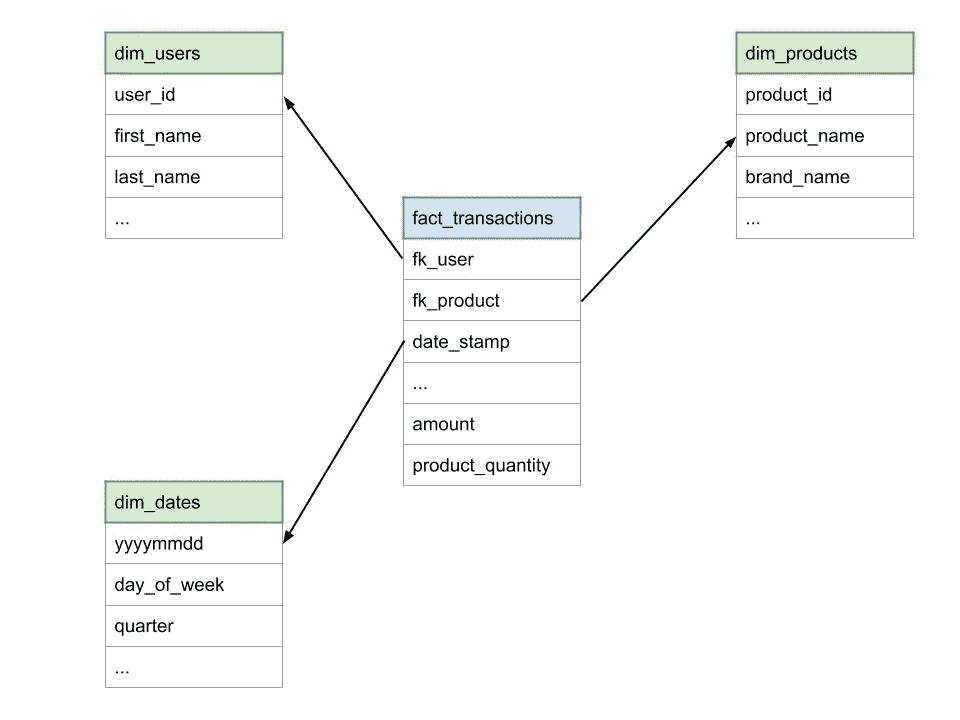

# 构建无需更新的现代批量数据仓库

> 原文：<https://towardsdatascience.com/building-a-modern-batch-data-warehouse-without-updates-7819bfa3c1ee?source=collection_archive---------4----------------------->


在 [Unsplash](https://unsplash.com/@helloquence?utm_source=unsplash&utm_medium=referral&utm_content=creditCopyText) 上由 [Helloquence](https://unsplash.com/@helloquence?utm_source=unsplash&utm_medium=referral&utm_content=creditCopyText) 拍摄的照片

## 功能数据工程|星形模式

## 创建没有更新、锁定或 ACID 合规性的星型模式

在这篇文章中，我将描述如何设计**维度**、**事实**以及在不执行*可变*变更的情况下为其提供信息的流程。

出于本文的目的，我将假设数据在一个便宜的云存储上，由一个直接操作文件的计算引擎处理，并写入不可变的块中。

了解大数据堆栈中的事务性、更新和锁定选项。Databricks 和 Snowflake 围绕提供这些服务(以及更多服务)建立了非常成功的企业。Databricks 甚至开源了“ [Delta Lake](https://delta.io/) ”，为 Apache Spark 带来了其中的一些功能。

然而，更新是大数据堆栈中复杂的操作。我相信保持我们的大部分数据处理不变是更容易维护和推理的。

更新可能会给数据管道带来不必要的灵活性。我见过一个团队只通过(非常低效的)更新来扩展另一个团队拥有的表，而不是协作和扩展公共脚本。不变性迫使数据管道具有某种**结构**。

我将从高层次描述星型模式概念开始，并解释为什么它们今天仍然相关。如果你熟悉这些概念，我邀请你跳到**“管理维度”**。

# 星形模式

星型模式是一种关系建模技术，它将与业务流程相关的度量或事件(事实)从其上下文(维度)中分离出来。

与关系数据库模式(应用程序数据库)相比，它更加[非规范化](https://medium.com/@katedoesdev/normalized-vs-denormalized-databases-210e1d67927d)，并且被设计为对分析查询( [OLAP](https://en.wikipedia.org/wiki/Online_analytical_processing) 工作负载)高效。

**举例:**

在电子商务网站中，业务流程的一个例子是网站上的交易。

在这种情况下，一些示例度量是:交易期间支付的金额和购买的产品数量。

上下文包括:进行交易的用户、交易日期和购买的产品。



简化星形模式提取

*实际上，每个交易可能包含不同的产品:这是一个简化的模型*

> 星型模式的名字来源于物理模型与星型的相似性，星型的中心有一个事实表，周围的维度表代表星型的点
> 
> [https://en.wikipedia.org/wiki/Star_schema](https://en.wikipedia.org/wiki/Star_schema)

## 雪花模式

维度可以进一步规范化:例如，产品的“品牌”可以保存在一个单独的表中，该表具有与“产品”的外键关系，从而创建一个从*维度到*维度的关系。

星型模式维度的进一步规范化导致了“雪花模式”，从历史上看，其主要目标是*减少冗余数据量*(节省存储)。

缺点是雪花模式通过更多的连接引入了更多的复杂性。随着存储变得不那么受关注，对于大多数情况来说,“雪花模式”方法是不合适的。

## 大数据中的星型模式相关性

星型模式是在存储和计算昂贵的时代创建的。因为存储昂贵且有限，减少数据冗余是数据仓库团队的主要关注点。

这也是支持数据仓库查询的有效方式，因为通过维度表的连接和过滤器，可以跳过事实表上的大量数据。可预测的访问模式允许简单的优化，比如在事实表的外键上创建索引。

> 简洁明了—所有外键列都应该有一个非聚集的非唯一索引。
> 
> [https://www . data vail . com/blog/how-to-index-a-fact-table-a-best-practice/](https://www.datavail.com/blog/how-to-index-a-fact-table-a-best-practice/)

如今，存储很便宜，并且根据需要配置计算能力(相对而言)很容易。我们可以衡量设计和实现这些模型的工程成本与节省的硬件成本，并问自己— **这样做还值得吗？**


照片由[阿齐兹·阿查基](https://unsplash.com/@acharki95?utm_source=unsplash&utm_medium=referral&utm_content=creditCopyText)在 [Unsplash](https://unsplash.com/s/photos/star?utm_source=unsplash&utm_medium=referral&utm_content=creditCopyText) 上拍摄

# **为什么星型模式仍然相关？**

## 多样的来源

公司从越来越多的来源收集越来越多的数据，需要对产生的数据集进行协调以进行分析。

例如，有线电视网络可能有非常不同的系统来托管有关其电视订户和其新推出的流媒体服务的订户的信息。同样，他们的“客户支持”分析必须整合来自 Twitter、第三方呼叫中心和支持电子邮件的数据。

标准化工作的目标是汇集“订户”、“客户反馈”和其他逻辑实体的不同定义，消除否则将由异构源系统引入的分析复杂性。

## 标准

Ralph Kimball 编写的数据仓库工具包(1996)和 Kimball 集团网站[定义了业内广泛理解的概念(如星型模式)。](https://www.kimballgroup.com/data-warehouse-business-intelligence-resources/kimball-techniques/dimensional-modeling-techniques/)

新员工可以快速掌握数据仓库结构，而不需要熟悉组织的具体情况。

数据工程师、数据科学家和分析师有共同的术语(事实、维度、粒度)，有助于协作。

## 展开性

新添加的事实可以重用现有的维度。

通过向事实表添加更多的外键，可以向事实添加新的维度。

因此，可以集成新的数据集，而无需对模式进行重大更改。

## 表演

星型模式可以完全通过在 Map-Reduce 框架中容易并行化的插入和计算来填充(我们将在下一节中看到“如何进行”)。

**查询性能调优:**

虽然外键索引通常不是一个选项，因为它们在许多现代数据仓库框架中不受支持，但是我们有其他选项来提高性能。

维度通常很小，有时可以放在内存中，支持[地图端](https://jaceklaskowski.gitbooks.io/mastering-spark-sql/spark-sql-joins-broadcast.html)连接优化(参见 [Spark 的 BroadcastJoin](https://jaceklaskowski.gitbooks.io/mastering-spark-sql/spark-sql-joins-broadcast.html) )。

我们可以在维度表上使用[桶](https://kb.databricks.com/data/bucketing.html)。

Spark 支持[星型模式检测、](https://developer.ibm.com/code/2018/04/16/star-schema-enhancements-in-apache-spark/)对连接进行重新排序并有效地跳过数据。

## 适应大数据

1996 年的许多实践今天仍然适用，但是一些方法需要重新定义。

Lyft[等公司已经成功地更新了这些数据仓库实践，以适应新的技术环境。](https://medium.com/u/54708edc644b?source=post_page-----7819bfa3c1ee--------------------------------) [Maxime Beauchemin](https://medium.com/u/9f4d525c99e2?source=post_page-----7819bfa3c1ee--------------------------------) 就这个主题做了一个很棒的演讲[，](https://www.youtube.com/watch?v=4Spo2QRTz1k&t=989s)这篇文章的“管理维度”部分很大程度上受到了它的启发。

> 来自同一个演讲:
> 
> *先学习规则，再打破规则*


照片由 [**乔治·贝克尔**](https://www.pexels.com/@eye4dtail?utm_content=attributionCopyText&utm_medium=referral&utm_source=pexels) 发自 [**派克斯**](https://www.pexels.com/photo/close-up-of-keys-333837/?utm_content=attributionCopyText&utm_medium=referral&utm_source=pexels)

# 外键

## 自然键

数据仓库书籍警告[不要重复使用“自然键”](https://www.kimballgroup.com/1998/05/surrogate-keys/)(来自生产系统的唯一 id)作为事实表中的外键。

如果表被部分清空(出于性能原因)，生产系统中的自然键可能会重用 id。因为数据仓库保存历史数据，IDs 的重用会产生难以解决的冲突。

## 顺序生成的 id

创建“代理键”**的最佳实践是**使用由数据处理系统顺序生成的整数 id，并与生产系统的自然键分离。

整数可以节省存储空间，创建更小更高效的 T4 索引。

现代数据仓库中不使用索引。Hive 3.0 [移除了索引](https://cwiki.apache.org/confluence/display/Hive/LanguageManual+Indexing)，它们被*替换为*在文件(ORC、Parquet)、物理分区和存储桶中编译的统计信息/元数据，这同样能够跳过大部分数据。

## 性能命中

生成代理键是一个复杂的并行操作。

这篇 [BigQuery (Google)博客文章](https://cloud.google.com/blog/products/data-analytics/bigquery-and-surrogate-keys-practical-approach)描述了使用通用方法(对新行使用`ROW_NUMBER`函数)添加生成序列的限制:

> 不幸的是，这种方法是有限的。为了实现`ROW_NUMBER()`，BigQuery 需要在执行树的根节点对值进行排序，这受限于一个执行节点的内存量。

## 解决方案

UUIDs 和散列更容易并行化，这使得它成为为“大”数据集生成 id 的更具可伸缩性的方法。

对于“维度快照”，我们更喜欢使用散列而不是 UUIDs，我们将在下面的小节中讨论动机:**“管理维度”/“代理键”**。


照片来自 [**创业股票照片**](https://www.pexels.com/@startup-stock-photos?utm_content=attributionCopyText&utm_medium=referral&utm_source=pexels) 来自 [**Pexels**](https://www.pexels.com/photo/man-marker-blackboard-handwriting-7364/?utm_content=attributionCopyText&utm_medium=referral&utm_source=pexels)

# 管理维度

## **静态尺寸**

一些特殊维度如[“日期”维度](https://www.kimballgroup.com/data-warehouse-business-intelligence-resources/kimball-techniques/dimensional-modeling-techniques/calendar-date-dimension/)(静态维度)，是**生成**，而不是数据处理的结果。这些表可以预先生成，并且不会保留它们的更改历史。

当一个维度是静态的时，我们可以在每次需要对它进行修改时简单地用**覆盖**整个数据。

## 缓慢和快速变化的尺寸

对于要求*随时间变化的维度*，我们需要一种策略来改变数据。

用户可以更改其家庭地址，产品可以更改名称，品牌可以更换所有者。

多年来，许多“类型”的缓慢和快速变化的维度管理策略被形式化了。其中一些保留历史记录，大多数使用“更新”就地添加或修改信息。

这里的**是**具有**快速改变**属性的维度和具有**缓慢改变**属性的维度之间的分离。

在保存历史记录的维度中，当记录中的任何属性发生更改时，需要复制整行数据，如果属性经常更改，则会使用更多的存储空间。

这些技术很复杂，因为它们是在严格的存储限制下设计的。

维度快照使用**更多的存储**，但是它们**更容易创建和查询**。

## 维度快照

尺寸应该比事实小得多。一个电子商务的交易、订单和客户评论(事实)可能有数百万，但是独立客户的数量(维度)会小得多。

维度也因其携带的“状态”而不同于事实。维度中的记录将有一个“身份”,当其他属性改变时，需要保留该身份。

**维度快照易于管理**

每天，我们都会在版本化快照中重写整个维度表

```
s3://my_data_warehouse/dim_users/ds=2020-01-01
s3://my_data_warehouse/dim_users/ds=2020-01-02
...
```

因为不管发生多少变化，整个表都会被重写，所以对于快速和缓慢变化的维度采用不同的策略没有什么好处。

**历史**

有了这个模型，我们可以通过在特定的日子加入一个**过滤器来轻松回答历史问题。**

历史记录也不会减慢查询速度，因为传递特定日期实际上会跳过其他日期的文件。

该表的结构使得尺寸表上的**时序**变得容易。例如，我们可以计算一段时间内每个居住国家的用户数量。

**代理键**

UUIDs 引入了*随机性。为了保持新的代理键与前一个快照的代理键一致，我们需要查询那个快照。*

相反，散列是基于构成记录“身份”的键的连接(不包括自然键)，因此我们只能从**当前数据**重新计算它。这就是为什么我们更喜欢在维度快照中使用 UUIDs 散列的原因。

请注意，每日快照消除了对第二个密钥的需要。某些类型的渐变维度实现了两个代理键:一个指向维度记录的“最新”状态，另一个指向特定事实被摄取时记录的历史快照。因为每个快照都包含该时间点的所有数据，所以我们可以使用快照的日期来获得“最新”状态，或者给定时间点的状态。

那不会产生大量数据吗？

数据重复是维度快照的主要缺点。

另一个缺点是维度只需要从**的一个进程**中创建，因为一天多个快照会加重重复。

以比每天更频繁的频率刷新维度的要求也会放大重复。

收益是**简单性**、**易于访问历史**、**维度上的时间序列**和**在写入和查询方面的性能**。

然而，在数据复制不可行的情况下，我们可以求助于另一种缓慢变化的维度管理。使用像[三角洲湖](https://delta.io/)这样的项目来支持更新。


照片由[Unsplash](https://unsplash.com/@climatereality?utm_source=unsplash&utm_medium=referral&utm_content=creditCopyText)[上的](https://unsplash.com/s/photos/facts-matter?utm_source=unsplash&utm_medium=referral&utm_content=creditCopyText)气候现实项目拍摄

# 管理事实

> 事实表是数据仓库的基础。它们包含企业的基本度量，并且是大多数数据仓库查询的最终目标
> 
> [https://www.kimballgroup.com/2008/11/fact-tables/](https://www.kimballgroup.com/2008/11/fact-tables/)

有多种类型的事实模型来涵盖事实表旨在捕捉的不同度量和事件。

## 谷物

在设计事实时，我们需要决定表中每一行的详细程度。

预先汇总事实可以节省存储空间，但这是一个高风险的赌注，因为来自业务的分析需求可能在未来需要更多的细节。对于今天的大多数情况，在**最低细节层次**捕捉事实信息是可取的。

## 仅插入

绝大多数事实不需要更新。即使在[累积快照](https://www.kimballgroup.com/data-warehouse-business-intelligence-resources/kimball-techniques/dimensional-modeling-techniques/accumulating-snapshot-fact-table/)的特定情况下，我们也可以通过一种消除可变性需求的方式来设计模型。

例如，对于电子商务订单，如果我们有状态:`ORDER_BEING_PREPARED, ORDER_SHIPPED, ORDER_IN_TRANSIT`。我们可以创建新的状态来象征先前状态的结束，而不是每次动作结束时都去事实表并用一个`end_date`来更新行:`ORDER_BEING_PREPARED_END, ORDER_SHIPPED_END, ORDER_IN_TRANSIT_END`。现在每个状态的改变都是一个可以插入的独立事件。

## 物理分区

为了创建在上游错误或业务需求变化的情况下可以被覆盖的不可变分区，我们需要按照“**提取日期**”——从源系统提取数据的日期——对我们的数据进行分区。

第一个分区键通常对查询性能没什么用，但是对于实现[等幂批处理作业](https://medium.com/@maximebeauchemin/functional-data-engineering-a-modern-paradigm-for-batch-data-processing-2327ec32c42a)来说很重要。

此外，建议按“**事件日期**进行分区，因为查询经常使用它作为过滤器(WHERE 子句)。

可以添加其他分区键来额外提高查询速度，但是我们需要确保它们在过滤器中使用，并且生成的文件[不会太小](https://blog.cloudera.com/the-small-files-problem/)。

*表格结构示例:*

```
under s3://my_data_warehouse/fact_transactions:/event_date=2020-02-05/extraction_date=2020-02-05/event_date=2020-02-05/extraction_date=2020-02-06
/event_date=2020-02-06/extraction_date=2020-02-06
...
```

我们的数据处理作业在 5 号创建了 1 个分区:即`/event_date=2020–02–05/extraction_date=2020–02–05`分区。

然而在 6 号:在*前一天*发生的一些事务被延迟捕获，因此创建了两个分区:`/event_date=2020–02–05/extraction_date=2020–02–06`和`/event_date=2020–02–06/extraction_date=2020–02–06`，这通常被称为[、](https://www.kimballgroup.com/data-warehouse-business-intelligence-resources/kimball-techniques/dimensional-modeling-techniques/late-arriving-fact/)，并且由该表结构支持。

# 最后

通过采用“星型架构”方法来利用廉价的云存储，我们可以避免数据仓库中的更新、锁定和 ACID 合规性需求。

*   外键是**散列**而不是整数序列
*   维度使用**每日快照**
*   事实按照“**提取日期**进行分区，以支持等幂处理和分区的潜在覆盖