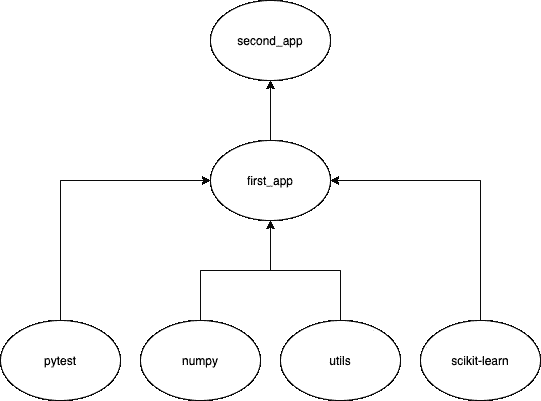

# 使用 Pantsbuild 为数据科学构建 monorepo

> 原文：<https://towardsdatascience.com/building-a-monorepo-for-data-science-with-pantsbuild-2f77b9ee14bd?source=collection_archive---------18----------------------->

## 并了解它的好处


塞尔吉奥·索萨在 [Unsplash](https://unsplash.com/@serjosoza?utm_source=unsplash&utm_medium=referral&utm_content=creditCopyText) 上的照片

在 [HousingAnywhere](http://housinganywhere.com/) ，我们在扩展数据团队时必须面对的第一个主要障碍是建立一个包含我们不断增长的机器学习应用程序的集中式存储库。在这些项目之间，许多项目相互依赖，这意味着代码重构可能会成为一种痛苦，并消耗大量时间。此外，由于我们非常反对数据科学家复制/粘贴代码的倾向，我们需要一个统一的位置来存储可以轻松访问的可重用函数。

我们用例的完美解决方案是构建一个 monorepo。在本文中，我将介绍如何使用构建自动化系统 [**Pantsbuild**](https://www.pantsbuild.org/) 构建一个简单的 monorepo。

# 什么是单向回购？

monorepo 是一个存储库，其中存储了许多项目的代码。为您的团队建立一个集中的存储库有很多好处:

*   **复用性**:允许项目共享功能，在数据科学的情况下，预处理数据、*计算度量*甚至*绘制图形*的代码可以跨项目共享。
*   **原子变更**:只需要一个操作就可以跨多个项目进行变更。
*   大规模的重构 : 可以简单快速地完成，确保项目在之后仍然有效。

然而，Monorepo 并不是一个适合所有人的解决方案，因为它有许多缺点:

*   **安全问题**:没有办法只暴露存储库的一部分。
*   大代码库:随着回购规模的增长，它会带来问题，因为开发人员必须检查整个存储库。

在 HousingAnywhere，我们的数据科学家团队发现 monorepo 是我们数据团队用例的完美解决方案。我们的许多机器学习应用程序都有从中派生出来的较小的项目。monorepo 使我们能够快速地将这些新项目整合到 CI/CD 管道中，减少了为每个新项目单独设置管道的时间。

我们尝试了许多构建自动化系统，我们坚持使用的是[](https://www.pantsbuild.org/)**。Pants 是为数不多的原生支持 Python 的系统，是 Twitter、Toolchain、Foursquare、square、Medium 广泛使用的开源项目。**

**最近 Pants 已经更新到了 v2，目前只支持 Python，但是对于数据科学项目来说并没有太大的限制。**

# **一些基本概念**

**有几个关于裤子的概念你应该事先了解:**

*   ****目标**帮助用户告诉裤子采取什么行动，例如`test`**
*   ****任务**是运行动作的裤子模块**
*   ****目标**描述对哪些文件采取这些操作。这些目标是在构建文件中定义的**
*   ****目标类型**定义可在目标上执行的操作类型，例如，您可以在测试目标上执行测试**
*   ****地址**描述回购中目标的位置**

**要了解更多信息，我强烈推荐阅读这篇文档，裤子的开发者在详细解释这些概念方面做得非常好。**

# ****示例存储库****

**在本节中，我将介绍如何使用 Pants 轻松设置 monorepo。首先，确保满足以下安装裤子的要求:**

*   **Linux 或者 macOS。**
*   **Python 3.6+可在您的`PATH`上发现。**
*   **互联网接入(这样裤子就可以完全自举了)。**

**现在，让我们建立一个新的存储库:**

```
mkdir monorepo-example
cd monorepo-example
git init
```

**或者，您可以通过以下方式克隆示例[回购](https://github.com/uiucanh/monorepo-example):**

```
git clone [https://github.com/uiucanh/monorepo-example.git](https://github.com/uiucanh/monorepo-example.git)
```

**接下来，运行以下命令下载安装文件:**

```
printf '[GLOBAL]\npants_version = "1.30.0"\nbackend_packages = []\n' > pants.toml
curl -L -o ./pants https://pantsbuild.github.io/setup/pants && \ chmod +x ./pants
```

**然后，通过奔跑`./pants --version`拉起裤子。您应该收到`1.30.0`作为输出。**

**让我们向回购中添加几个简单的应用程序。首先，我们将创建一个`utils/data_gen.py`和一个`utils/metrics.py`，它们包含几个实用函数:**

**现在，我们将添加一个应用程序`first_app/app.py`来导入这些代码。应用程序使用来自`generate_linear_data`的数据，将它们传递给线性回归模型，并输出*平均绝对百分比误差。***

**另一个应用程序`second_app/app.py`使用第一个应用程序代码:**

**然后，我们为这些应用程序添加了几个简单的测试，例如:**

**在每个目录中，我们都需要一个构建文件。这些文件包含关于目标及其依赖项的信息。在这些文件中，我们将声明这些项目需要什么需求，以及声明测试目标。**

**让我们从存储库的根开始:**

**这个构建文件包含一个宏`python_requirements()`，它创建了多个目标来从同一个目录下的`requirements.txt`中提取第三方依赖项。它节省了我们为每个需求手工操作的时间:**

```
python_requirement_library(
    name="numpy",
    requirements=[
        python_requirement("numpy==1.19.1"),
    ],
)
```

**`utils`中的构建文件如下所示:**

**这里我们有两个目标:第一个是 Python 库，包含在`source`中定义的 Python 代码，即我们的两个实用程序文件。它还指定了运行这些代码所需的需求，这是`numpy`，我们在根构建文件中定义的第三方依赖项之一。**

**第二个目标是我们之前定义的测试集合，它们依赖于之前的 Python 库。要运行这些测试，只需从 root 运行`./pants test utils:utils_test`或`./pants test utils::`即可。第二个`:`告诉 Pants 运行构建文件中的所有测试目标。输出应该如下所示:**

```
============== test session starts ===============
platform darwin -- Python 3.7.5, pytest-5.3.5, py-1.9.0, pluggy-0.13.1
cachedir: .pants.d/test/pytest/.pytest_cache
rootdir: /Users/ducbui/Desktop/Projects/monorepo-example, inifile: /dev/null
plugins: cov-2.8.1, timeout-1.3.4
collected 3 items

utils/data_gen_test.py .                   [ 33%]
utils/metrics_test.py ..                   [100%]
```

**类似地，我们将为`first_app`和`second_app`创建两个构建文件**

**在`second_app`构建文件中，我们将上面`first_app`中的库声明为这个库的依赖项。这意味着来自该库的所有依赖项，连同它的源，将成为`first_app`的依赖项。**

**类似地，我们也向这些构建文件添加一些测试目标，它们可以用`./pants test first_app::`或`./pants test second_app::`运行。**

**最终的目录树应该如下所示:**

```
.
├── BUILD
├── first_app
│   ├── BUILD
│   ├── app.py
│   └── app_test.py
├── pants
├── pants.toml
├── requirements.txt
├── second_app
│   ├── BUILD
│   ├── app.py
│   └── app_test.py
└── utils
    ├── BUILD
    ├── data_gen.py
    ├── data_gen_test.py
    ├── metrics.py
    └── metrics_test.py
```

**Pants 的强大之处在于它能够跟踪受变更影响的项目和测试目标之间的可传递依赖关系。Pants 的开发人员为我们提供了这个漂亮的 bash 脚本，可以用来追踪受影响的测试目标:**

**为了展示它的威力，让我们运行一个例子。我们将创建一个新分支，对`data_gen.py`进行修改(例如，更改`generate_linear_data`的默认参数)并提交:**

```
git checkout -b "example_1"
git add utils/data_gen.py
git commit -m "support/change-params"
```

**现在，运行 bash 脚本，我们将看到一个`minimized.txt`，它包含所有受影响的项目和将要执行的测试目标:**

```
first_app:app_test
second_app:app_test
utils:utils_test
```

****

**传递依赖性**

**查看上图，我们可以清楚地看到，更改`utils`会影响它上面的所有节点，包括`first_app`和`second_app`。**

**让我们再做一个例子，这次我们只修改`second_app/app.py`。切换分支，提交并再次运行脚本。在`minimized.txt`内部，我们只会得到`second_app:app_test`，因为它是最顶层的节点。**

**就这样，希望我已经成功地向你们展示了 Pantsbuild 对于数据科学 monorepos 是多么有用。加上正确实现的 CI/CD 管道，开发的速度和可靠性可以大大提高。**