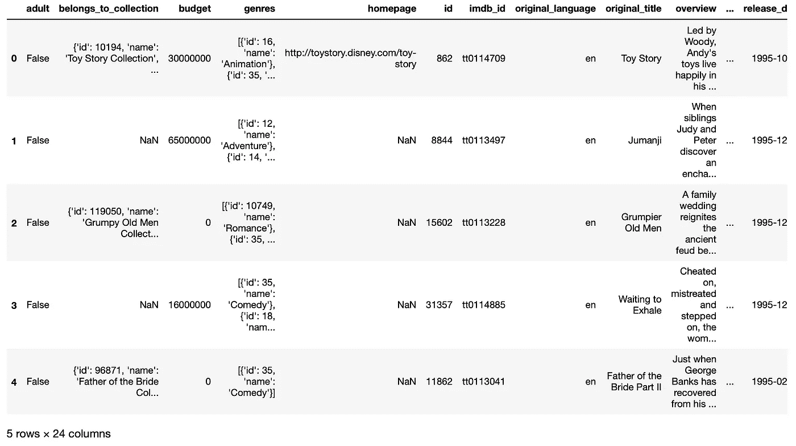
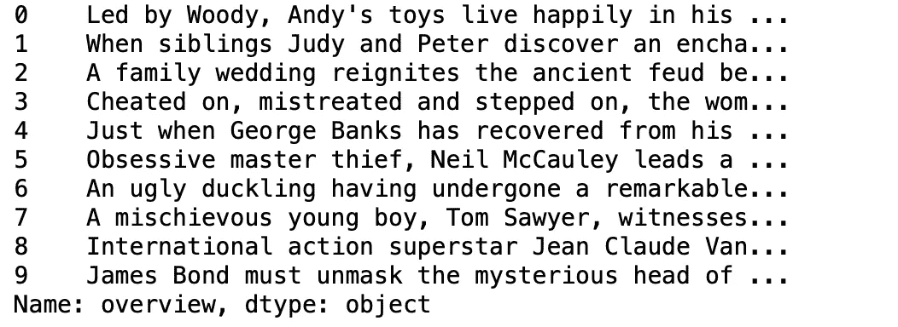
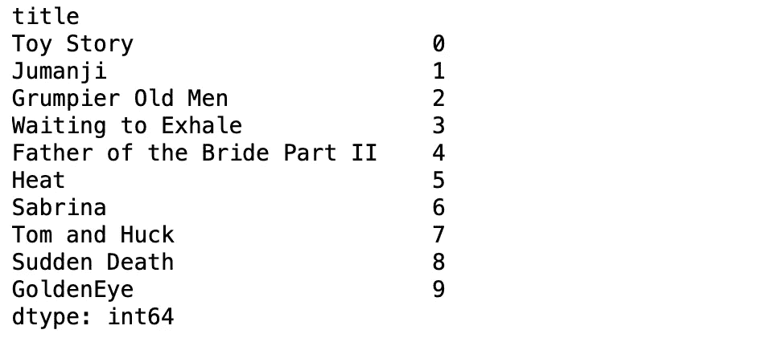
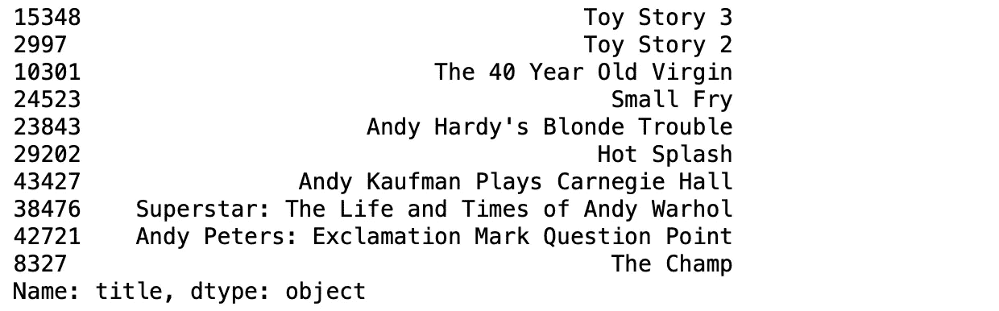

# 使用 Python 构建电影推荐器

> 原文：<https://towardsdatascience.com/building-a-movie-recommender-using-python-277959b07dae?source=collection_archive---------8----------------------->

## 使用 sci-kit learn 的简单实用的机器学习项目


照片由[晨酿](https://unsplash.com/@morningbrew?utm_source=unsplash&utm_medium=referral&utm_content=creditCopyText)在 [Unsplash](https://unsplash.com/s/photos/apple-tv?utm_source=unsplash&utm_medium=referral&utm_content=creditCopyText) 拍摄

在这篇文章中，我将向你展示如何使用 Python 来构建一个电影推荐程序。这将是一个简单的项目，我们将能够看到机器学习如何在我们的日常生活中使用。如果你查看我的其他文章，你会发现我喜欢演示动手项目。我觉得这是练习我们编码技能，提升自己的最好方式。建立一个电影推荐程序是开始使用机器推荐器的好方法。在分享了目录之后，我想给你介绍一下推荐系统。

## 内容

*   **简介**
*   **电影数据**
*   **数据准备**
*   **基于内容的推荐器**
*   **显示时间**
*   **视频演示**

# 介绍

推荐系统已经伴随我们有一段时间了，它们是如此的强大。这些天来，他们确实对我们的决定有很大的影响。从电影流媒体服务到在线购物商店，它们几乎无处不在。如果你想知道在你的购物车中添加一个“x”项目后，他们如何知道你可能会购买什么，答案很简单: ***数据的力量*** 。

我们可能看起来非常不同，但我们的习惯可能非常相似。这些公司喜欢寻找他们客户的相似习惯。由于他们知道许多购买了“x”商品的人也购买了“y”商品，他们建议您将“y”商品添加到购物车中。你猜怎么着，你买得越多，你就在训练你自己的推荐者，这意味着机器会更了解你。

推荐系统是机器学习的一个非常有趣的领域，它的酷之处在于它就在我们身边。关于这个话题有很多东西要学，为了简单起见，我就讲到这里。让我们开始建立自己的电影推荐系统吧！

# 电影数据

我在 Kaggle 上找到了很棒的电影数据。如果你没有听说过 Kaggle，Kaggle 是世界上最大的数据科学社区，拥有强大的工具和资源来帮助你实现数据科学目标。

这里是下载[数据集](https://www.kaggle.com/rounakbanik/the-movies-dataset/data)的链接。

## 语境

*   数据文件夹包含完整的 [MovieLens](https://grouplens.org/datasets/movielens/latest/) 数据集中列出的所有 45，000 部电影的元数据。
*   该数据集由 2017 年 7 月或之前上映的电影组成。数据点包括演员、工作人员、情节关键词、预算、收入、海报、上映日期、语言、制作公司、国家、TMDB 票数和平均票数。
*   该数据文件夹还包含评级文件，该文件具有来自 270，000 个用户对所有 45，000 部电影的 2，600 万个评级。

# 数据准备

首先，让我们从导入和探索我们的数据开始。下载数据文件夹后，您将多个数据集文件。对于这个项目，我们将使用 *movies_metadata.csv* 数据集。这个数据集包含了我们创建电影推荐器所需的所有内容。

```
import pandas as pd#load the data
movie_data = pd.read_csv('data/movie_data/movies_metadata.csv', low_memory=False)movie_data.head()
```



电影数据头

## 绘图概述

```
movie_data['overview'].head(10)
```



完美！我们的数据都准备好了。准备接受我们模特的训练。是时候进入下一步了，我们将开始构建基于内容的推荐器。

# 基于内容的推荐器

基于内容的推荐器是一种推荐模型，它根据特定的项目返回项目列表。推荐者的一个很好的例子是网飞、YouTube、Disney+等等。例如，网飞推荐你以前看过的更喜欢的类似节目。通过这个项目，你将更好地理解这些在线流媒体服务的算法是如何工作的。

回到这个项目，作为训练我们模型的输入，我们将使用我们之前检查过的电影的概述。然后我们将使用一些 sci-kit learn ready 函数来构建我们的模型。我们的推荐程序将在四个简单的步骤中准备就绪。我们开始吧！

## 1.定义矢量器

```
from sklearn.feature_extraction.text import TfidfVectorizertfidf_vector = TfidfVectorizer(stop_words='english')movie_data['overview'] = movie_data['overview'].fillna('')tfidf_matrix = tfidf_vector.fit_transform(movie_data['overview'])
```

理解上面的代码

*   从 sci-kit 学习模块导入矢量器。在这里了解更多。
*   Tf-idf 矢量器对象删除所有英文停用词，如' the '，' a '等。
*   我们用空字符串替换空值，这样在训练它们时就不会返回错误消息。
*   最后，我们通过拟合和转换数据来构建所需的 Tf-idf 矩阵

## 2.线性核

我们将从 sci-kit 学习模块中导入线性内核函数开始。线性核将帮助我们创建一个相似性矩阵。这些行执行起来要花一点时间，不要担心这是正常的。计算两个巨大矩阵的点积并不容易，即使对机器来说也是如此:)

```
from sklearn.metrics.pairwise import linear_kernelsim_matrix = linear_kernel(tfidf_matrix, tfidf_matrix)
```

## 3.指数

现在，我们必须构建索引和电影标题的反向映射。在系列函数的第二部分，我们用一个简单的函数 *drop_duplicates* 清除重复的电影标题。

```
indices = pd.Series(movie_data.index, index=movie_data['title']).drop_duplicates()indices[:10]
```



前十个指数

## 4.最后—推荐功能

```
def content_based_recommender(title, sim_scores=sim_matrix):
    idx = indices[title] sim_scores = list(enumerate(sim_matrix[idx])) sim_scores = sorted(sim_scores, key=lambda x: x[1], reverse=True) sim_scores = sim_scores[1:11] movie_indices = [i[0] for i in sim_scores] return movie_data['title'].iloc[movie_indices]
```

# 秀场

干得好！是时候测试我们的推荐者了。让我们看看实际情况，看看它到底有多强大。我们将通过添加电影名称作为一个字符串参数来运行该函数。

## 类似《玩具总动员》的电影

```
content_based_recommender('Toy Story')
```



# 视频演示

项目视频演示

恭喜你。！您创建了一个向您推荐电影的程序。现在，当你想选择下一场网飞秀时，你有一个程序可以运行。希望你喜欢阅读这个动手项目。如果你今天学到了新东西，我会很高兴。从事像这样的动手编程项目是提高编码技能的最好方式。

如果您在执行代码时有任何问题，请随时[联系我](https://sonsuzdesign.blog/)。

> 关注我的[博客](https://medium.com/@lifexplorer)和 [youtube](https://www.youtube.com/channel/UCmo4tnTcj92DlzES5hvlWwQ) 频道，保持灵感。谢谢你，

## 更多机器学习项目

[](/building-a-face-recognizer-in-python-7fd6630c6340) [## 用 Python 构建人脸识别器

### 使用 OpenCv 库进行实时人脸识别的分步指南

towardsdatascience.com](/building-a-face-recognizer-in-python-7fd6630c6340) [](/extracting-speech-from-video-using-python-f0ec7e312d38) [## 使用 Python 从视频中提取语音

### 使用 Google 语音识别 API 的简单实用项目

towardsdatascience.com](/extracting-speech-from-video-using-python-f0ec7e312d38)