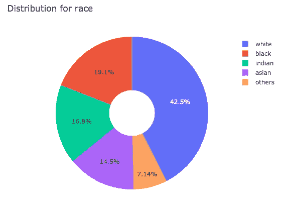
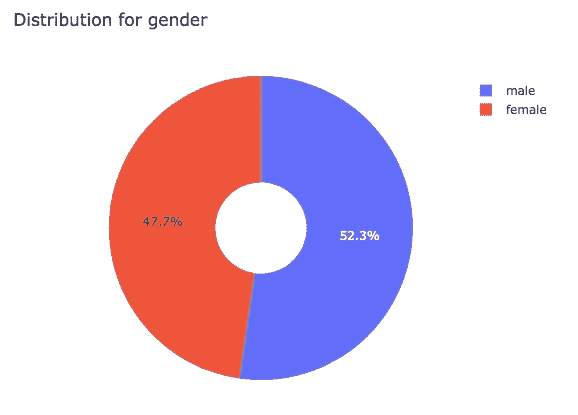
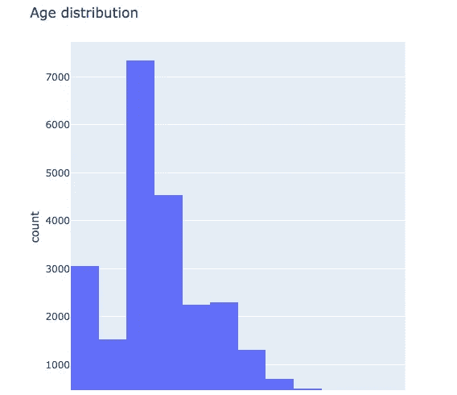
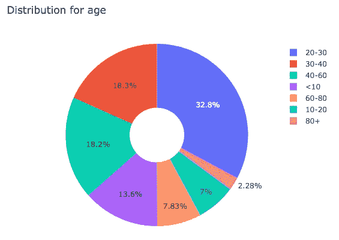
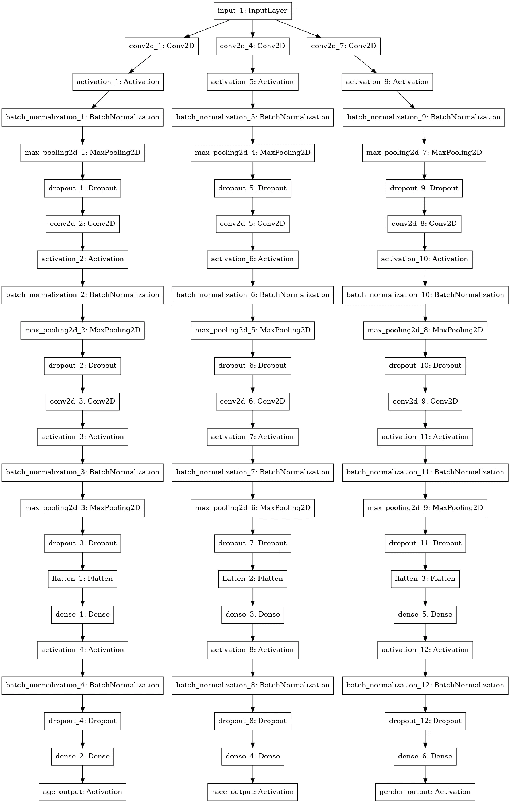
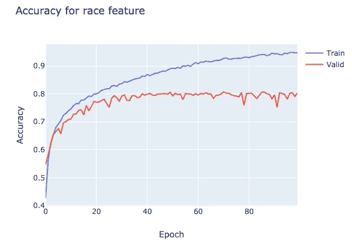
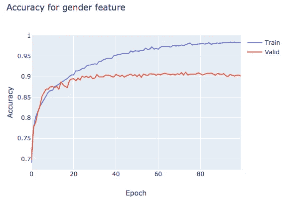
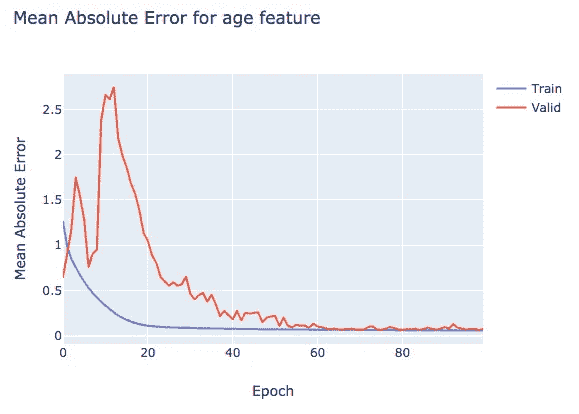
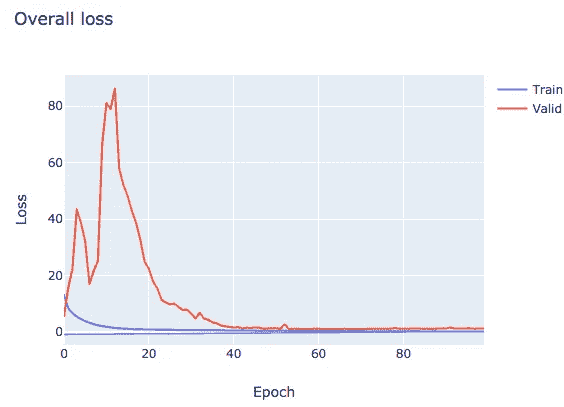

# 用 Keras 构建多输出卷积神经网络

> 原文：<https://towardsdatascience.com/building-a-multi-output-convolutional-neural-network-with-keras-ed24c7bc1178?source=collection_archive---------2----------------------->

在这篇文章中，我们将探索 Keras functional API，以建立一个多输出深度学习模型。我们将展示如何训练能够预测三种不同输出的单一模型。通过使用 UTK 人脸数据集，该数据集由超过 2 万张不受控制的环境中的人的照片组成，我们将预测数据集中呈现的每条记录的年龄、性别和性别，性别的准确率达到 91%，种族的准确率达到 78%。

# 数据集

UTKFace 数据集是一个大型数据集，由超过 2 万张人脸图像组成，并分别标注了年龄、性别和种族。图像被适当地裁剪到面部区域，但是在姿势、照明、分辨率等方面显示一些变化。

为了检索每个记录的注释，我们需要解析文件名。每条记录以如下格式存储:**年龄 _ 性别 _ 种族 _ 日期&time.jpg**

其中:

*   年龄是从 0 到 116 的整数
*   性别是一个整数，其中 0 代表男性，1 代表女性
*   种族是一个从 0 到 4 的整数，分别代表白人、黑人、亚洲人、印度人和其他人种
*   日期和时间，表示照片拍摄的时间

如果你想进一步了解这个数据集，请查看他们的[网站](http://aicip.eecs.utk.edu/wiki/UTKFace)。

让我们首先导入一些库并创建我们的字典来帮助我们解析来自数据集的信息，以及一些其他信息(数据集位置、训练分割、样本的宽度和高度)。

```
import numpy as np 
import pandas as pd
import os
import glob
import pandas as pd
import matplotlib.pyplot as plt
import seaborn as snsdataset_folder_name = 'UTKFace'TRAIN_TEST_SPLIT = 0.7
IM_WIDTH = IM_HEIGHT = 198dataset_dict = {
    'race_id': {
        0: 'white', 
        1: 'black', 
        2: 'asian', 
        3: 'indian', 
        4: 'others'
    },
    'gender_id': {
        0: 'male',
        1: 'female'
    }
}dataset_dict['gender_alias'] = dict((g, i) for i, g in dataset_dict['gender_id'].items())
dataset_dict['race_alias'] = dict((r, i) for i, r in dataset_dict['race_id'].items())
```

让我们定义一个函数来帮助我们从数据集中提取数据。该函数将用于迭代 UTK 数据集的每个文件，并返回一个包含我们记录的所有字段(年龄、性别和性别)的熊猫数据帧。

```
def parse_dataset(dataset_path, ext='jpg'):
    """
    Used to extract information about our dataset. It does iterate over all images and return a DataFrame with
    the data (age, gender and sex) of all files.
    """
    def parse_info_from_file(path):
        """
        Parse information from a single file
        """
        try:
            filename = os.path.split(path)[1]
            filename = os.path.splitext(filename)[0]
            age, gender, race, _ = filename.split('_') return int(age), dataset_dict['gender_id'][int(gender)], dataset_dict['race_id'][int(race)]
        except Exception as ex:
            return None, None, None

    files = glob.glob(os.path.join(dataset_path, "*.%s" % ext))

    records = []
    for file in files:
        info = parse_info_from_file(file)
        records.append(info)

    df = pd.DataFrame(records)
    df['file'] = files
    df.columns = ['age', 'gender', 'race', 'file']
    df = df.dropna()

    return dfdf = parse_dataset(dataset_folder_name)
df.head()
```

# 数据可视化

作为理解数据集分布以及模型生成的预测的重要步骤，建议对数据集执行一些数据可视化过程。我们将首先定义一个助手函数，根据给定的 Pandas 系列生成饼图:

```
import plotly.graph_objects as godef plot_distribution(pd_series):
    labels = pd_series.value_counts().index.tolist()
    counts = pd_series.value_counts().values.tolist()

    pie_plot = go.Pie(labels=labels, values=counts, hole=.3)
    fig = go.Figure(data=[pie_plot])
    fig.update_layout(title_text='Distribution for %s' % pd_series.name)

    fig.show()
```

## 种族分布

让我们首先用我们预定义的 *plot_distribution* 方法绘制比赛分布图。

```
plot_distribution(df['race'])
```



快速浏览一下这个图，我们可以看到几乎一半的样本来自白色人种，所以我们可以期待这个组有很大的准确性。其他种族，如黑人、印度人和亚洲人也显示了大量的样本，可能也使我们获得了准确的数据。另一方面，种族“其他人”(西班牙裔、拉丁裔等)显示少量样本，更可能具有较小的准确性。

## 性别分布

```
plot_distribution(df['gender'])
```



对于男性和女性样本，我们有相当好的平衡数量的记录，所以当使用我们的模型时，我们应该对两类都有很高的准确性。

## 年龄分布

我们还可以使用一个简单的直方图来绘制年龄特征在数据集上的分布，该直方图包含 20 个条块/扇区。

```
import plotly.express as px
fig = px.histogram(df, x="age", nbins=20)
fig.update_layout(title_text='Age distribution')
fig.show()
```



我们也可以在饼图中显示同样的图。让我们将年龄列分组，然后用饼图绘制出来

```
bins = [0, 10, 20, 30, 40, 60, 80, np.inf]
names = ['<10', '10-20', '20-30', '30-40', '40-60', '60-80', '80+']age_binned = pd.cut(df['age'], bins, labels=names)
plot_distribution(age_binned)
```



我们可以观察到，我们的数据集主要由年龄在 20 至 30 岁之间的个体组成，其次是 30 至 40 岁以及 40 至 60 岁的个体。这些群体约占我们数据集的 70%,因此我们可以假设我们在预测这些范围内的个体时会有很好的准确性。

我们还可以对我们的数据集执行一些多变量分析，但由于这篇文章的范围是演示 Keras 的多输出模型的用法，所以我们不会涉及它——如果你们感兴趣的话，也许改天吧。

# 数据生成程序

为了将我们的数据输入到我们的 Keras 多输出模型中，我们将创建一个辅助对象作为数据集的数据生成器。这将通过生成批量数据来完成，这些数据将用于向我们的多输出模型提供图像及其标签。这一步也要完成，而不是一次将所有数据集加载到内存中，这可能会导致内存不足错误。

```
from keras.utils import to_categorical
from PIL import Imageclass UtkFaceDataGenerator():
    """
    Data generator for the UTKFace dataset. This class should be used when training our Keras multi-output model.
    """
    def __init__(self, df):
        self.df = df

    def generate_split_indexes(self):
        p = np.random.permutation(len(self.df))
        train_up_to = int(len(self.df) * TRAIN_TEST_SPLIT)
        train_idx = p[:train_up_to]
        test_idx = p[train_up_to:] train_up_to = int(train_up_to * TRAIN_TEST_SPLIT)
        train_idx, valid_idx = train_idx[:train_up_to], train_idx[train_up_to:]

        # converts alias to id
        self.df['gender_id'] = self.df['gender'].map(lambda gender: dataset_dict['gender_alias'][gender])
        self.df['race_id'] = self.df['race'].map(lambda race: dataset_dict['race_alias'][race]) self.max_age = self.df['age'].max()

        return train_idx, valid_idx, test_idx

    def preprocess_image(self, img_path):
        """
        Used to perform some minor preprocessing on the image before inputting into the network.
        """
        im = Image.open(img_path)
        im = im.resize((IM_WIDTH, IM_HEIGHT))
        im = np.array(im) / 255.0

        return im

    def generate_images(self, image_idx, is_training, batch_size=16):
        """
        Used to generate a batch with images when training/testing/validating our Keras model.
        """

        # arrays to store our batched data
        images, ages, races, genders = [], [], [], []
        while True:
            for idx in image_idx:
                person = self.df.iloc[idx]

                age = person['age']
                race = person['race_id']
                gender = person['gender_id']
                file = person['file']

                im = self.preprocess_image(file)

                ages.append(age / self.max_age)
                races.append(to_categorical(race, len(dataset_dict['race_id'])))
                genders.append(to_categorical(gender, len(dataset_dict['gender_id'])))
                images.append(im)

                # yielding condition
                if len(images) >= batch_size:
                    yield np.array(images), [np.array(ages), np.array(races), np.array(genders)]
                    images, ages, races, genders = [], [], [], []

            if not is_training:
                break

data_generator = UtkFaceDataGenerator(df)
train_idx, valid_idx, test_idx = data_generator.generate_split_indexes() 
```

# 构建我们的模型

在这一步，我们将定义我们的多输出 Keras 模型。我们的模型将由三个主要分支组成，每个分支对应一个可用的特征:年龄、性别和种族。

我们的卷积层的默认结构基于一个带有 ReLU 激活的 Conv2D 层，然后是 BatchNormalization 层、MaxPooling 层，最后是 MaxPooling 层。这些层中的每一层之后是最终的致密层。对我们试图预测的每个输出重复这一步。

这些默认层是在*make _ default _ hidden _ layers*方法中定义的，它将在构建我们模型的每个分支时被重用。在下面的代码中，我们将定义负责创建多输出模型的类。

```
from keras.models import Model
from keras.layers.normalization import BatchNormalization
from keras.layers.convolutional import Conv2D
from keras.layers.convolutional import MaxPooling2D
from keras.layers.core import Activation
from keras.layers.core import Dropout
from keras.layers.core import Lambda
from keras.layers.core import Dense
from keras.layers import Flatten
from keras.layers import Input
import tensorflow as tfclass UtkMultiOutputModel():
    """
    Used to generate our multi-output model. This CNN contains three branches, one for age, other for 
    sex and another for race. Each branch contains a sequence of Convolutional Layers that is defined
    on the make_default_hidden_layers method.
    """
    def make_default_hidden_layers(self, inputs):
        """
        Used to generate a default set of hidden layers. The structure used in this network is defined as:

        Conv2D -> BatchNormalization -> Pooling -> Dropout
        """
        x = Conv2D(16, (3, 3), padding="same")(inputs)
        x = Activation("relu")(x)
        x = BatchNormalization(axis=-1)(x)
        x = MaxPooling2D(pool_size=(3, 3))(x)
        x = Dropout(0.25)(x) x = Conv2D(32, (3, 3), padding="same")(x)
        x = Activation("relu")(x)
        x = BatchNormalization(axis=-1)(x)
        x = MaxPooling2D(pool_size=(2, 2))(x)
        x = Dropout(0.25)(x) x = Conv2D(32, (3, 3), padding="same")(x)
        x = Activation("relu")(x)
        x = BatchNormalization(axis=-1)(x)
        x = MaxPooling2D(pool_size=(2, 2))(x)
        x = Dropout(0.25)(x) return x def build_race_branch(self, inputs, num_races):
        """
        Used to build the race branch of our face recognition network.
        This branch is composed of three Conv -> BN -> Pool -> Dropout blocks, 
        followed by the Dense output layer.
        """
        x = self.make_default_hidden_layers(inputs) x = Flatten()(x)
        x = Dense(128)(x)
        x = Activation("relu")(x)
        x = BatchNormalization()(x)
        x = Dropout(0.5)(x)
        x = Dense(num_races)(x)
        x = Activation("softmax", name="race_output")(x) return x def build_gender_branch(self, inputs, num_genders=2):
        """
        Used to build the gender branch of our face recognition network.
        This branch is composed of three Conv -> BN -> Pool -> Dropout blocks, 
        followed by the Dense output layer.
        """
        x = Lambda(lambda c: tf.image.rgb_to_grayscale(c))(inputs) x = self.make_default_hidden_layers(inputs) x = Flatten()(x)
        x = Dense(128)(x)
        x = Activation("relu")(x)
        x = BatchNormalization()(x)
        x = Dropout(0.5)(x)
        x = Dense(num_genders)(x)
        x = Activation("sigmoid", name="gender_output")(x) return x def build_age_branch(self, inputs):   
        """
        Used to build the age branch of our face recognition network.
        This branch is composed of three Conv -> BN -> Pool -> Dropout blocks, 
        followed by the Dense output layer. """
        x = self.make_default_hidden_layers(inputs) x = Flatten()(x)
        x = Dense(128)(x)
        x = Activation("relu")(x)
        x = BatchNormalization()(x)
        x = Dropout(0.5)(x)
        x = Dense(1)(x)
        x = Activation("linear", name="age_output")(x) return x def assemble_full_model(self, width, height, num_races):
        """
        Used to assemble our multi-output model CNN.
        """
        input_shape = (height, width, 3) inputs = Input(shape=input_shape) age_branch = self.build_age_branch(inputs)
        race_branch = self.build_race_branch(inputs, num_races)
        gender_branch = self.build_gender_branch(inputs) model = Model(inputs=inputs,
                     outputs = [age_branch, race_branch, gender_branch],
                     name="face_net") return model

model = UtkMultiOutputModel().assemble_full_model(IM_WIDTH, IM_HEIGHT, num_races=len(dataset_dict['race_alias']))
```

让我们看一下我们的模型结构，以便更好地理解我们正在构建什么。从中我们可以看到，我们有一个单一的输入，在我们的情况下，是我们正在向 CNN 提供的图像，它确实分解为三个独立的分支，每个分支都有自己的卷积层，然后是各自的密集层。



# 训练我们的模型

现在，一旦我们有了可以使用的数据和定义的模型架构，就该训练我们的多输出模型了。但是在进行这一步之前，我们需要编译我们的模型。对于这个任务，我们将使用 0.0004 的学习率和 Adam 优化器，但是您也可以随意尝试其他超参数。我们还将为每个特征使用自定义损失权重和自定义损失函数。在构建我们的优化器时，让我们使用一个基于学习率除以时期数的衰减，因此我们将在时期内慢慢降低我们的学习率。

```
from keras.optimizers import Adaminit_lr = 1e-4
epochs = 100opt = Adam(lr=init_lr, decay=init_lr / epochs)model.compile(optimizer=opt, 
              loss={
                  'age_output': 'mse', 
                  'race_output': 'categorical_crossentropy', 
                  'gender_output': 'binary_crossentropy'},
              loss_weights={
                  'age_output': 4., 
                  'race_output': 1.5, 
                  'gender_output': 0.1},
              metrics={
                  'age_output': 'mae', 
                  'race_output': 'accuracy',
                  'gender_output': 'accuracy'})
```

现在，让我们用有效集和训练集的批量大小 32 来训练我们的模型。我们将使用一个*模型检查点*回调，以便在每个时期结束时将模型保存在磁盘上。

```
from keras.callbacks import ModelCheckpointbatch_size = 32
valid_batch_size = 32
train_gen = data_generator.generate_images(train_idx, is_training=True, batch_size=batch_size)
valid_gen = data_generator.generate_images(valid_idx, is_training=True, batch_size=valid_batch_size)callbacks = [
    ModelCheckpoint("./model_checkpoint", monitor='val_loss')
]history = model.fit_generator(train_gen,
                    steps_per_epoch=len(train_idx)//batch_size,
                    epochs=epochs,
                    callbacks=callbacks,
                    validation_data=valid_gen,
                    validation_steps=len(valid_idx)//valid_batch_size)
```

训练完模型后，让我们更好地了解一下模型在各个时期的训练集和验证集上的表现:

## 比赛准确性

```
plt.clf()
fig = go.Figure()
fig.add_trace(go.Scatter(
                    y=history.history['race_output_acc'],
                    name='Train'))fig.add_trace(go.Scatter(
                    y=history.history['val_race_output_acc'],
                    name='Valid')) fig.update_layout(height=500, 
                  width=700,
                  title='Accuracy for race feature',
                  xaxis_title='Epoch',
                  yaxis_title='Accuracy')fig.show()
```



我们可以看到，在第 50 个时期，我们的模型在验证集上稳定下来，仅在训练集上有所增加，准确率约为 80%。

## 性别准确性

```
plt.clf()fig = go.Figure()
fig.add_trace(go.Scatter(
                    y=history.history['gender_output_acc'],
                    name='Train'))fig.add_trace(go.Scatter(
                    y=history.history['val_gender_output_acc'],
                    name='Valid')) fig.update_layout(height=500, 
                  width=700,
                  title='Accuracy for gender feature',
                  xaxis_title='Epoch',
                  yaxis_title='Accuracy') fig.show()
```



与种族特征类似，我们可以看到，我们的模型能够学习大多数模式，以在第 30 个时期正确预测给定个体的性别，准确率约为 90%。

## 年龄平均绝对误差

```
plt.clf()fig = go.Figure()
fig.add_trace(go.Scattergl(
                    y=history.history['age_output_mean_absolute_error'],
                    name='Train'))fig.add_trace(go.Scattergl(
                    y=history.history['val_age_output_mean_absolute_error'],
                    name='Valid')) fig.update_layout(height=500, 
                  width=700,
                  title='Mean Absolute Error for age feature',
                  xaxis_title='Epoch',
                  yaxis_title='Mean Absolute Error')fig.show()
```



在预测年龄特征的任务中，我们可以看到，我们的模型需要大约 60 个时期来适当地稳定其学习过程，平均绝对误差为 0.09。

## 总体损失

```
fig = go.Figure()
fig.add_trace(go.Scattergl(
                    y=history.history['loss'],
                    name='Train'))fig.add_trace(go.Scattergl(
                    y=history.history['val_loss'],
                    name='Valid')) fig.update_layout(height=500, 
                  width=700,
                  title='Overall loss',
                  xaxis_title='Epoch',
                  yaxis_title='Loss')fig.show()
```



我们可以注意到，到了时期 50，我们的模型开始稳定，损失值大约为 1.4。在损失曲线中也有一个峰值，它确实出现在年龄特征的平均绝对误差中，这可以解释年龄特征的学习对总损失的影响。

# 在测试集上评估我们的模型

为了评估我们的模型在测试集上的表现，让我们使用我们的 UTK 数据生成器类，但是这次使用测试索引。然后，我们将从训练好的模型中调用 *predict_generator* 方法，该方法将输出测试集的预测。

```
test_batch_size = 128
test_generator = data_generator.generate_images(test_idx, is_training=False, batch_size=test_batch_size)
age_pred, race_pred, gender_pred = model.predict_generator(test_generator, 
                                                           steps=len(test_idx)//test_batch_size)
```

让我们在所有测试样本上再迭代一次，以便将它们的标签放在一个列表中。我们还将提取每个记录的 *argmax* ，以便检索顶级预测和基本事实。

```
test_generator = data_generator.generate_images(test_idx, is_training=False, batch_size=test_batch_size)
samples = 0
images, age_true, race_true, gender_true = [], [], [], []
for test_batch in test_generator:
    image = test_batch[0]
    labels = test_batch[1]

    images.extend(image)
    age_true.extend(labels[0])
    race_true.extend(labels[1])
    gender_true.extend(labels[2])

age_true = np.array(age_true)
race_true = np.array(race_true)
gender_true = np.array(gender_true)race_true, gender_true = race_true.argmax(axis=-1), gender_true.argmax(axis=-1)
race_pred, gender_pred = race_pred.argmax(axis=-1), gender_pred.argmax(axis=-1)age_true = age_true * data_generator.max_age
age_pred = age_pred * data_generator.max_age
```

最后，让我们打印测试集上每个特性的分类报告。

```
from sklearn.metrics import classification_reportcr_race = classification_report(race_true, race_pred, target_names=dataset_dict['race_alias'].keys())
print(cr_race)precision    recall  f1-score   support white       0.80      0.91      0.85      2994
       black       0.86      0.82      0.84      1327
       asian       0.86      0.79      0.83      1046
      indian       0.74      0.74      0.74      1171
      others       0.38      0.19      0.25       502 accuracy                           0.80      7040
   macro avg       0.73      0.69      0.70      7040
weighted avg       0.78      0.80      0.78      7040
```

从上面的报告中，我们可以看到，我们的模型在预测亚裔和黑人个体方面非常出色，准确率为 86%，其次是白人 80%，印度人 74%。“其他”种族的精确度仅为 38%，但我们需要考虑到，与其他群体相比，该群体由不同的种族和民族以及一些样本组成。这一分类任务的加权准确率为 78%，表明我们的分类器能够正确地学习模式以区分不同类型的种族。

```
cr_gender = classification_report(gender_true, gender_pred, target_names=dataset_dict['gender_alias'].keys())
print(cr_gender)**precision    recall  f1-score   support** **male       0.94      0.87      0.91      3735
      female       0.87      0.94      0.90      3305** **accuracy                           0.90      7040
   macro avg       0.90      0.91      0.90      7040
weighted avg       0.91      0.90      0.90      7040**
```

从这个报告中，我们可以注意到，我们的模型在预测给定个体的性别方面非常出色，对于这项任务，加权准确率为 91%。

```
from sklearn.metrics import r2_scoreprint('R2 score for age: ', r2_score(age_true, age_pred))
```

R2 年龄得分:0.582979466456328

## 参考

http://aicip.eecs.utk.edu/wiki/UTKFace UTK 人脸数据集:

Keras 多输出文档:[https://keras.io/getting-started/functional-api-guide/](https://keras.io/getting-started/functional-api-guide/)

SanjayaSubedi 关于多输出模型的帖子:[https://sanjayasubdi . com . NP/deep learning/multi output-keras/](https://sanjayasubedi.com.np/deeplearning/multioutput-keras/)

时尚网上的 PyImageSearch 帖子:[https://www . PyImageSearch . com/2018/06/04/keras-multiple-outputs-and-multiple-loss/](https://www.pyimagesearch.com/2018/06/04/keras-multiple-outputs-and-multiple-losses/)

剧情:[https://plot.ly/](https://plot.ly/)