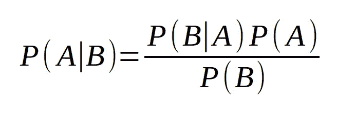
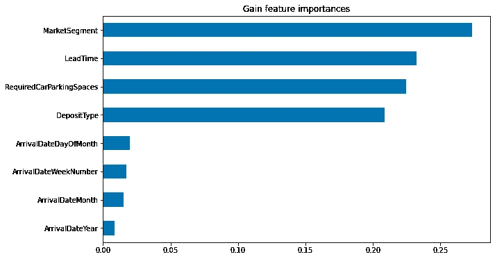

# 构建朴素贝叶斯分类器:预测酒店取消

> 原文：<https://towardsdatascience.com/building-a-naive-bayes-classifier-predicting-hotel-cancellations-31e3b8766614?source=collection_archive---------36----------------------->

## 在此示例中，构建了一个朴素贝叶斯分类器，以预测可能取消酒店预订的客户。

朴素贝叶斯分类器是一种概率分类器，也是最基本的分类模型之一。我们称该分类器为“幼稚”分类器的原因是因为该分类器*天真地*假设数据集中的所有特征相互独立，即条件独立。


来源:照片由[埃里克·斯坦](https://pixabay.com/users/erik_stein-2524241/)从[皮克斯拜](https://pixabay.com/illustrations/cube-random-luck-eye-numbers-1655118/)拍摄。

从这个角度来看，特征选择通常不是朴素贝叶斯分类器的优势。假设所有的特征都是相互独立的，那么当特征之间存在显著的相关性时，这个分类器就有表现不佳的风险。

贝叶斯定理定义如下:



来源:作者图片

这个定理的基础是**条件概率**，即给定前一个结果的发生，一个结果发生的概率。在这种情况下，特定事件发生的概率随着新信息的收集而更新。

对于这个特定的场景，我们希望找到答案——在给定先验概率的情况下，客户取消酒店预订的概率是多少？

在这种情况下，将应用高斯朴素贝叶斯分类算法。尽管结果变量是分类变量(1 =取消，0 =不取消)，但模型中包含的许多特征是连续的。因此，假设这些连续特征按照正态(高斯)分布分布。

# 数据操作

在这点上，在运行朴素贝叶斯模型之前不会进行特征选择。该模型使用以下功能构建:

1.  *交付周期*
2.  *到达日期年份*
3.  *arrivaldateweekno*
4.  *抵达日期*
5.  *staysweekendnights*
6.  *周末夜*
7.  *成年人*
8.  *婴儿*
9.  *isrepeatedguest*
10.  *以前的取消*
11.  *先前预订未取消*
12.  *预订变更*
13.  *dayswaitinglist*
14.  *adr*
15.  *RCP*
16.  *总计数量*
17.  *到达日期月*
18.  *餐*
19.  *国家*
20.  *细分市场*
21.  *分销渠道*
22.  *reservedroomtype*
23.  *assignedroomtype*
24.  *沉积类型*
25.  *客户类型*

定义了区间(或连续随机变量)。举两个例子:

```
leadtime = train_df['LeadTime']
adr = train_df['ADR']
```

使用'''类别代码' ' '定义具有分类成分的变量。

作为另外两个例子:

```
deposittypecat=train_df.DepositType.astype("category").cat.codes
deposittypecat=pd.Series(deposittypecat)
customertypecat=train_df.CustomerType.astype("category").cat.codes
customertypecat=pd.Series(customertypecat)
```

numpy 列堆栈是为独立变量(连续变量和分类变量)制定的:

```
x1 = np.column_stack((leadtime,arrivaldateyear,arrivaldateweekno,arrivaldatedayofmonth,staysweekendnights,staysweeknights,adults,babies,isrepeatedguestcat,previouscancellations,previousbookingsnotcanceled,bookingchanges,dayswaitinglist,adr,rcps,totalsqr,arrivaldatemonthcat,mealcat,countrycat,marketsegmentcat,distributionchannelcat,reservedroomtypecat,assignedroomtypecat,deposittypecat,customertypecat))
x1 = sm.add_constant(x1, prepend=True)
```

然后，数据被分成训练集和验证集:

```
X_train, X_val, y_train, y_val = train_test_split(x1, y1)
```

# 精确度与召回率和 f1 分数

在我们运行模型之前，让我们稍微谈一下**精度**与**召回**。

当比较准确度分数时，我们看到在每个混淆矩阵中都提供了大量的读数。

```
Precision = ((True Positive)/(True Positive + False Positive))Recall = ((True Positive)/(True Positive + False Negative))
```

这两个读数经常相互矛盾，也就是说，通常不可能在不降低召回率的情况下提高精确度，反之亦然。

对理想指标的评估很大程度上取决于所分析的具体数据。例如，癌症检测筛查出现假阴性(即表明患者没有患癌症，而事实上他们患有癌症)是一大禁忌。在这种情况下，召回是理想的衡量标准。

然而，对于电子邮件，人们可能更喜欢避免误报，例如，将一封重要的电子邮件发送到垃圾邮件文件夹，而实际上它是合法的。

f1 分数在设计一个更通用的分数时考虑了精确度和召回率。

哪个因素对预测酒店取消更重要？

从酒店的角度来看，他们可能希望更准确地识别出最终会取消预订的客户，这使得酒店能够更好地分配房间和资源。确定不打算取消预订的客户不一定会增加酒店分析的价值，因为酒店知道，无论如何，很大一部分客户最终都会坚持预订。

# 模型配置和结果

上面概述的相关特征包括在内，用于确定客户是否将取消他们的预订。

GaussianNB 库是从 scikit-learn 导入的:

```
from sklearn.naive_bayes import GaussianNB
```

高斯朴素贝叶斯模型被定义为:

```
>>> gnb = GaussianNB()
>>> gnbGaussianNB(priors=None, var_smoothing=1e-09)
```

在验证集上生成预测:

```
>>> y_pred = gnb.fit(x1_train, y1_train).predict(x1_val)
>>> y_predarray([1, 1, 0, ..., 0, 1, 1])
```

将预测与来自验证集的实际结果进行比较，生成混淆矩阵:

```
>>> from sklearn.metrics import classification_report,confusion_matrix
>>> print(confusion_matrix(y1_val,y_pred))
>>> print(classification_report(y1_val,y_pred))[[2842 4424]
 [ 165 2584]]
              precision    recall  f1-score   support 0       0.95      0.39      0.55      7266
           1       0.37      0.94      0.53      2749 accuracy                           0.54     10015
   macro avg       0.66      0.67      0.54     10015
weighted avg       0.79      0.54      0.55     10015
```

第 1 类的召回率为 **94%** ，而 f1 分数的准确率为 **54%** 。现在，让我们在 H2(测试集)上测试预测性能。

```
[[ 7863 38365]
 [ 2722 30380]]
              precision    recall  f1-score   support 0       0.74      0.17      0.28     46228
           1       0.44      0.92      0.60     33102 accuracy                           0.48     79330
   macro avg       0.59      0.54      0.44     79330
weighted avg       0.62      0.48      0.41     79330
```

我们看到，1 类的召回率略微下降至 **92%** ，而 f1 分数的准确率为 **48%** 。

显然，在较高的召回率和总体较高的准确率之间存在一种权衡。假设数据集中的大多数条目为 0(未取消)，那么有理由认为具有总体高准确率的模型在预测未取消方面表现得相当好，但是在预测 1 条目(取消)方面表现不佳。

例如，当对此数据集运行 SVM 时，会获得以下结果:

```
[[25217 21011]
 [ 8436 24666]]
              precision    recall  f1-score   support 0       0.75      0.55      0.63     46228
           1       0.54      0.75      0.63     33102 accuracy                           0.63     79330
   macro avg       0.64      0.65      0.63     79330
weighted avg       0.66      0.63      0.63     79330
```

我们看到 f1 分数的准确率高达 63%,但是 1 类的召回率下降到 75%。

在这方面，如果希望优先识别取消，而不是最大化整体准确性，那么可以认为朴素贝叶斯模型在这种情况下工作得更好。然而，应该记住，最大化回忆只在一定程度上起作用。如果召回率为 100%，那么所有预订都可以归类为取消，这并不能揭示取消预订的客户和未取消预订的客户之间的差异。

# 限制

如前所述，朴素贝叶斯认为所有特征都是独立的。在这方面，在变量之间存在强烈的条件依赖性的情况下，该模型有表现不佳的风险，例如，假设在来自特定来源国的客户中观察到更多的取消。但是，我们也观察到，在特定的细分市场中，这些取消率要高得多。

在这方面，考虑到这两个特征之间的条件依赖性，我们不能再确定来自特定来源国的客户的取消率更高，因为来自特定细分市场的更高数量的客户可能正好出现在来自该特定国家的预订中。

特征选择是机器学习的重要组成部分，事实上，有许多模型能够解释哪些特征对影响结果变量的贡献更大，如下例所示。



来源:InterpretML 输出

但是，朴素贝叶斯假设所有要素的权重基本相等，这可能会根据数据显著影响读数的准确性。

# 结论

在这个例子中，我们看到了如何在 Python 中构建朴素贝叶斯模型，以及如何使用精度和召回率来评估模型的准确性。

本例的数据集和笔记本可从 MGCodesandStats GitHub 库获得，以及对该主题的进一步研究。

*免责声明:本文是在“原样”的基础上编写的，没有担保。本文旨在提供数据科学概念的概述，不应以任何方式解释为专业建议。*

# 参考

*   [安东尼奥、阿尔梅迪亚和努内斯(2019)。酒店预订需求数据集](https://www.sciencedirect.com/science/article/pii/S2352340918315191)
*   [DZone:朴素贝叶斯教程:Python 中的朴素贝叶斯分类器](https://dzone.com/articles/naive-bayes-tutorial-naive-bayes-classifier-in-pyt)
*   Gunopulos 和 Ratanamahatana，2003 年:使用决策树为朴素贝叶斯分类器选择特征
*   [不平衡类:用支持向量机预测酒店取消](/svms-random-forests-and-unbalanced-datasets-predicting-hotel-cancellations-2b983c2c5731)
*   [使用 InterpretML 预测酒店取消预订](/predicting-hotel-cancellations-using-interpretml-e4e64fefc7a8)
*   [sci kit-学习指南](https://scikit-learn.org/stable/modules/naive_bayes.html)
*   [当事件之间的依赖是有条件的](https://www.probabilisticworld.com/conditional-dependence-independence/)