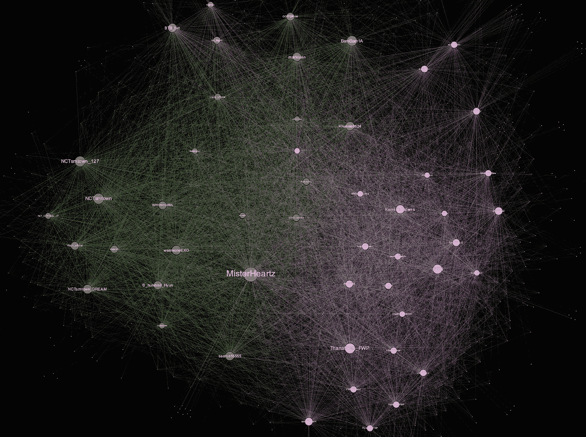
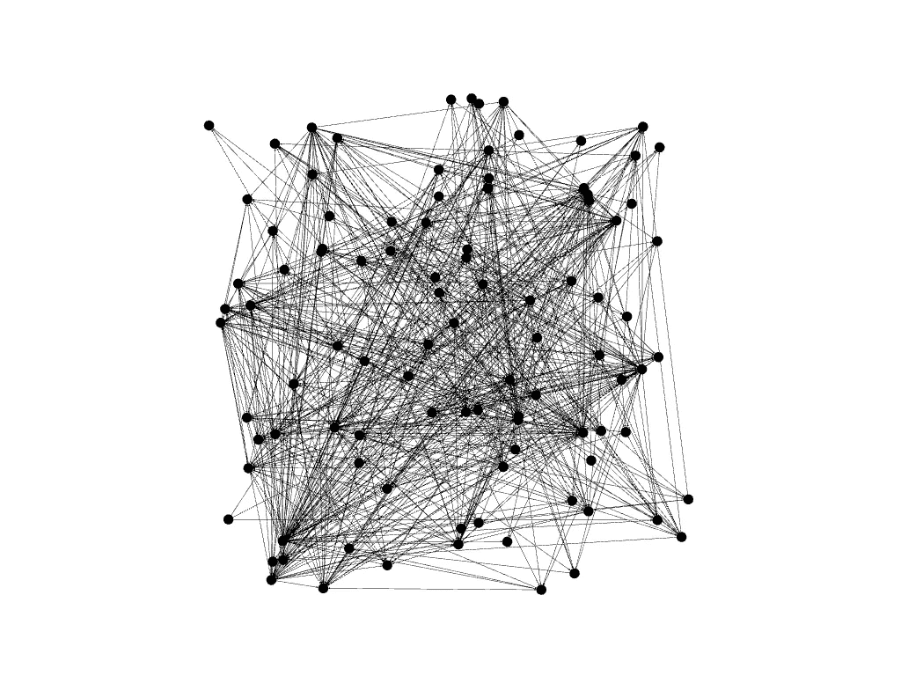
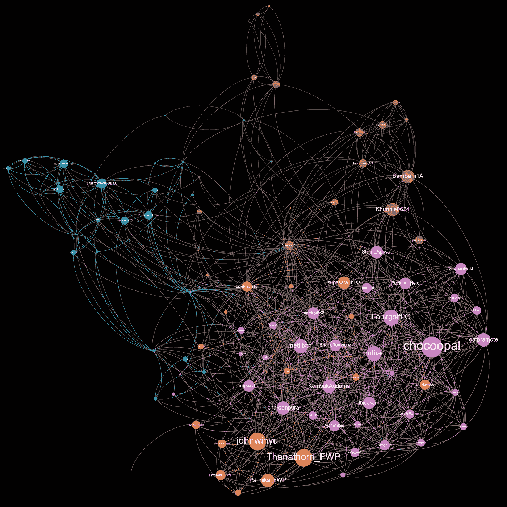

# 从 Twitter 数据中构建网络图

> 原文：<https://towardsdatascience.com/building-a-network-graph-from-twitter-data-a5e7b8672e3?source=collection_archive---------15----------------------->

## 编写 Java 应用程序来收集 Twitter 数据，并以图表的形式显示出来。

在本文中，我们将构建一个数据科学项目。我们从 Twitter 上收集数据，因为它有大量的数据，这让我们可以获得这些数据。我们更喜欢 Java，因为它是一种编译语言，并且有强大的并发库。最后，我们使用开源图形平台 Gephi 对这些数据进行总结。



使用 Gephi 从 9/14/20 的样本推文中生成的图表。语言是 TH

我们需要以下做这个项目:

*   Java IDE。我们的选择是日蚀。
*   Twitter4j 库。从[这里](http://twitter4j.org/en/index.html)获取 jar 文件和教程。
*   Twitter 开发者账号。我们需要这个来调用 Twitter API。有一些资源提到了如何获得访问权限。
*   任何符合 JDBC 标准的数据库。我们使用 Sqlite。它很轻。不需要安装软件。没有守护进程。只需将 Sqlite jar 文件复制到项目中。但是，有一些限制需要解决。
*   Gephi 是一个开源的图形工具。从[这里](https://gephi.org)下载。

顺便说一下，读者可以使用他们喜欢的任何语言或平台，Python 或 Node.js。

以下是构建 Twitter 网络图的步骤:

*   收集推文和用户，并保存到数据库中。
*   检索用户的朋友。从上一步的用户列表中，获取这些用户的朋友。我们将把这些保存到表格中
*   筛选我们希望在图表中看到的数据
*   将数据导出到 CSV 文件
*   将 CSV 文件导入 Gephi。做一些格式化，布局。我们会得到一个 twitter 社交图

# 收集推文和用户

第一步，我们收集样本 tweets，然后将它们写到表中。为此:

*   创建一个 twitter 流对象。对溪流进行采样。API 提供了所有 tweets 的随机子集。
*   对于收到的每条 tweet，向 executor 服务提交一个可调用的任务。该任务将执行数据库操作和/或进一步的处理。

下面是代码:

可调用任务中的代码会将 tweets 和相关对象(如用户)保存到表中。通过使用 executor 服务，我们分离了 tweet 处理和数据库相关的任务。即使有时推文的速度超过了数据库的处理速度，我们的应用程序仍然不会错过任何东西。此外，因为我们使用 Sqlite 数据库，并且在一个时刻只能有一次对数据库的写入，所以 executor 服务必须是单线程 Executor。以下是该任务的部分代码:

# 检索用户的朋友

从上一步，我们得到了一个用户列表，我们想知道他们所有的朋友。Twitter API 返回指定用户的朋友 id，但单次请求不会超过 5000 个 id。如果该用户拥有更多，我们需要多次呼叫。此外，Twitter 有费率限制。它只允许每个 15 分钟的窗口有 15 个请求。基本上每分钟 1 个请求。

所以，我们得到了朋友 id。需要其他 API 调用来将用户 id 转换为用户对象。Twitter 为此提供了 API。对于每个请求，我们可以查询多达 100 个用户 id。对此速率限制是每 15 分钟窗口 300 个请求。所以，是每分钟 20 个请求。

Twitter API 和速率限制的更多细节[点击这里](https://developer.twitter.com/en/docs/api-reference-index)。

为了有效地处理速率限制，我们将有两个线程。第一个线程将调用朋友 id 查询。第二个线程将执行用户查找部分。朋友查找线程将通过阻塞队列将用户 id 传递给用户查找线程。基本上，我们在这里使用生产者-消费者模式。

## 朋友查找线程

以下代码是 FriendsLookupRunnable 的一部分。

一些要点:

*   这个 runnable 的 run 方法将从要处理的用户 id 阻塞队列中轮询一个用户 id。
*   对于每个 id，调用 getFriendIds 方法。这个方法返回朋友 id 列表。每个用户 id 和朋友 id 对都被插入到 User_friend 表中。
*   得到朋友 id 也被放入另一个阻塞队列。这些 id 将由另一个线程检索并进行处理。
*   getFriendIds 方法跟踪最后一次调用它的时间，并通过使用 Thread.sleep()确保每次调用之间有足够的延迟(1 分钟)。
*   即使我们这样做了，也很少有超出速率限制的异常情况发生。因此，我们捕获 TwitterException 并比较异常状态代码。如果超过了速率限制，我们就重试查询。
*   还有一些其他的例外。例如，当用户受到保护时，twitter API 会给你一个未经授权的错误。

以下是创建 User_Friend 表的命令，该表存储第一个线程的结果:

```
CREATE TABLE User_Friend ( user_id       INT (8), friend_id     INT (8), PRIMARY KEY (user_id,friend_id));
```

## 用户查找线程

下面的代码是 UsersLookupRunnable 类。

以下是一些要点:

*   在 run 方法中，有一个 while 循环从队列中检索用户 id。然后它将调用 lookupUsers 方法进行实际的查找
*   因为 Twitter lookupUsers API 一次只能处理不超过 100 个用户 id，所以在调用 Twitter API 之前，我们将把一个用户 id 数组分割成包含 100 个或更少元素的数组。
*   lookupUsers 方法跟踪上次调用它的时间，并通过使用 Thread.sleep()确保每次调用之间有足够的延迟(3 秒)。
*   该方法返回将被插入到用户表中的用户列表。表格的结构应该类似于 Twitter 用户界面。

以下是创建存储第二个线程结果的用户表的命令:

```
CREATE TABLE User ( id              INT (8)       PRIMARY KEY, name            VARCHAR (100), screen_name     VARCHAR (100), description     VARCHAR (255), email           VARCHAR (50), favorites_count INT, followers_count INT, friends_count   INT, statuses_count  INT, lang            VARCHAR (10), location        VARCHAR (255), url             VARCHAR (255), imageurl        VARCHAR (255), is_protected    INT (1), is_verified     INT (1), created         VARCHAR (20), last_modified   VARCHAR (20));
```

主要的方法是:

*   设置数据库连接
*   创建 2 个阻塞队列
*   准备用户 id 列表。将其添加到第一个阻塞队列中。
*   创建 2 个可运行线程和 2 个线程。
*   启动两个线程。
*   添加关机挂钩。所以，当进程终止时，它会中断两个线程。
*   等到两个线程都完成。
*   清理数据库

代码应该如下所示:

# 过滤数据(可选)

有时，我们希望只看到全部数据的一部分。这样做很简单，因为数据已经在 SQL 表中了。假设我们想看看在我们的样本推文中拥有最多关注者的前 100 名用户是如何相互关注的。以下是要做的事情:

*   创建用于存储结果的表格。下面是使用的 SQL 语句:

```
CREATE TABLE Graph_Friend_Edge ( Source      INT, Target      INT );
CREATE TABLE Graph_Friend_Node ( id              INT      PRIMARY KEY, label           VARCHAR (50), name            VARCHAR (100),);
```

*   仅用顶级用户填充边缘表。以下是 SQL 语句:

```
insert into graph_friend_edge(source, target)select user_id, friend_id from user_friendjoin user u1 on friend_id=u1.idjoin user u2 on user_id=u2.idwhere user_id in(select friend_id from user_friendgroup by friend_id order by count(*) desc limit 100)and friend_id in(select friend_id from user_friend group by friend_id order by count(*) desc limit 100);
```

*   然后，用以下 SQL 填充节点表:

```
insert into graph_friend_node(id, label, name)select n.id, u.screen_name, u.namefrom(select source id from graph_friend_edgeunionselect target id from graph_friend_edge) n join user u on n.id = u.id;
```

# 将数据导出到 CSV 文件

这部分很简单。使用数据库工具将数据导出到 CSV 文件。

*   将 user_friend 表导出到 edge CSV 文件。
*   将用户表导出到节点 CSV 文件。

# 创建网络图

Gephi 是一个开源的图形分析和可视化工具。外面有很多 Gephi 教程。看一看[这里](https://gephi.org/users/)。导入 CSV 文件教程，在这里找到[。](https://github.com/gephi/gephi/wiki/Import-CSV-Data)

以下是在我们的项目中要做的步骤概述:

*   打开 Gephi。创建新项目。
*   导入边和节点 CSV 文件。最初的图表可能看起来不像这样:



9/14/20 应用样本推文布局前的前 100 名用户好友图表。语言是 TH

我们需要显示节点标签。配置节点大小和颜色。应用一些布局。

*   启用节点标签
*   配置与入度(传入边的数量)成比例的节点大小和标签大小
*   选择“ForceAtlas2”的布局并运行它。
*   运行社区检测算法
*   根据模块等级设置节点颜色。这将根据它检测到的社区给节点着色。

完成这些后，图表看起来更有意义:

*   用户的屏幕名称显示为节点标签。
*   该组中拥有更多追随者的节点看起来更大。
*   边，箭头线，代表跟随关系
*   根据图算法，具有相同颜色的节点在相同的社区中。



使用 Gephi 从 9/14/20 的样本推文中生成的前 100 名用户的朋友图。语言是 TH

# 结论

我们构建了 Java 应用程序来从 Twitter 收集推文、用户和朋友数据，并将其放入关系数据库。我们对数据做了一些过滤。然后，导入到 Gephi，图形平台和可视化工具，产生一个社会网络图。

这只是我们利用 Twitter 数据所能做的很小一部分。Gephi 能给我们提供更多的东西。此外，还有更多图形分析平台。例如，Neo4j 可以让我们将数据存储到它的数据库中，并运行图形算法。