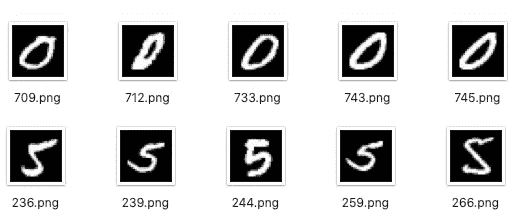
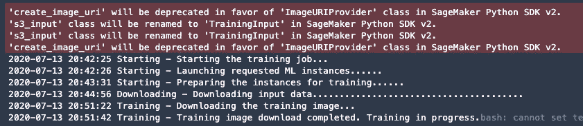
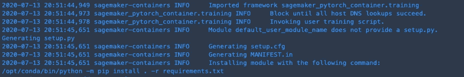

# 用 PyTorch Lightning 在亚马逊 SageMaker 上构建神经网络

> 原文：<https://towardsdatascience.com/building-a-neural-network-on-amazon-sagemaker-with-pytorch-lightning-63730ec740ea?source=collection_archive---------25----------------------->

## 用现代工具为每个数据科学家民主化人工智能

图片由[com break](https://pixabay.com/users/Comfreak-51581/?utm_source=link-attribution&amp;utm_medium=referral&amp;utm_campaign=image&amp;utm_content=845848)来自 [Pixabay](https://pixabay.com/?utm_source=link-attribution&amp;utm_medium=referral&amp;utm_campaign=image&amp;utm_content=845848) 。闪电的力量可以点燃火炬。

在现实世界的应用中，托管人工智能服务，如[亚马逊认知](https://aws.amazon.com/rekognition/?blog-cards.sort-by=item.additionalFields.createdDate&blog-cards.sort-order=desc)和[亚马逊理解](https://aws.amazon.com/comprehend/?nc1=h_ls)为专门的数据科学团队从零开始构建模型提供了一个可行的替代方案。即使当用例需要使用定制图像标签或文本实体等专门构建的数据集进行模型重新训练时，也可以使用 [Amazon Rekognition 定制标签](https://aws.amazon.com/rekognition/custom-labels-features/?nc1=h_ls)或[Amazon understand 定制实体](https://aws.amazon.com/blogs/machine-learning/build-a-custom-entity-recognizer-using-amazon-comprehend/)轻松实现。

这些服务提供最先进的机器学习模型实现，涵盖几个用例。这种模型在某些情况下并不可行。这可能是因为底层网络需要根据数据进行深度定制，科学家需要实施先进的网络架构，如 LSTMs、GANs、OneShot learners、强化学习模型甚至模型集成。

在机器学习中，研究和模型构建是一项永无止境的工作，每天都开放一套全新的功能。然而，通常需要一个由不同专业人员组成的大型团队来构建从神经网络架构定义到生产部署的模型。

Amazon SageMaker 旨在为每个人实现机器学习的民主化，提供了一套针对数据科学家和软件工程师的工具。截至 2020 年，亚马逊 SageMaker (SM)是一套工具，专门用于数据集标签化(SM GroundTruth)、模型开发(SM 笔记本)、分布式训练和推理部署(SM 模型/端点)以及实验创建、调试和监控(SageMaker Studio)。

短短几年间，出现了许多深度学习框架，从 TensorFlow、Apache MXNet 和 PyTorch 开始，每一个都提高了模型创建和定制的门槛。最有前途的技术之一，由于它在动态计算图形定义和数据并行性支持方面的灵活性。

有了闪电，PyTorch 变得既简单又强大。

Amazon SageMaker 从第一天起就引入了对 PyTorch 的支持，并在过去几年中建立了稳定的用户基础。然而，PyTorch 错过了 Keras(tensor flow)等替代方案的简单性、低学习曲线和高抽象级别。开发了一些框架来填补空白，例如优秀的 [Fast.ai](https://docs.fast.ai/) 库，旨在为接近 PyTorch 的开发人员提供一个简单易学的解决方案。

2019 年，为了让机器学习的努力成为一个共同点，[威廉·猎鹰](https://github.com/williamFalcon)发布了第一个生产就绪版本的 [PyTorch Lightning](https://github.com/PyTorchLightning/pytorch-lightning) ，这是一个架构 PyTorch 项目的框架，获得了对更少样板文件和改进代码阅读的支持。

在本文中，我们将从一个简单的神经网络创建开始，遵循一个统一的工作流程，在 Amazon SageMaker 上开发、测试和部署一个机器学习模型，并有一个循序渐进的教程，侧重于初学者。不需要预先了解 Amazon SageMaker 或 PyTorch，即使它有助于理解一些语言 API。

# MNIST 是新的“你好世界”

我们将从一个用于手写数字识别的简单神经网络开始，使用著名的 [MNIST 数据集](http://yann.lecun.com/exdb/mnist/)。用例非常狭窄，但近年来，由于结果模型的简单性，它已经成为使用神经网络进行图像处理的“Hello World”。

## 亚马逊 SageMaker 笔记本

处理机器学习项目的第一步是在一些实验环境中建立模型。**亚马逊 SageMaker 笔记本**提供 JupyterLab 环境的简单设置。PyTorch 通过 torchvision 库提供了一个准备好的数据集。由于本文想要展示一个适用于通用模型训练的工作流，我们决定不使用 PyTorch 数据集，而是从互联网上下载 MNIST 图像并保存到 S3 桶中。

当使用 SageMaker Studio 构建模型时，我们建议在本地下载一堆数据，以加快开发和测试速度。我们可以使用以下命令轻松做到这一点:

现在，我们可以显示一些随机数据，只是为了在开始构建 Lightning 模型之前更好地理解它是如何组织的。

手写数字图像的小 MNIST 数据集。

# MNIST 分类器和亚马逊 SageMaker

在我们建立 PyTorch 评估之后，Amazon SageMaker 管理来自 Python 代码的代码运行。估计器是一个类，包含训练所需的所有必需参数(或在 SageMaker 容器上运行的推理脚本)。

上图显示了如何为 PyTorch 创建 SageMaker 估计器。详细解释代码中的注释。

为了执行具有卷积层的神经网络的训练，我们必须使用 GPU 在 **ml.p2.xlarge** 实例上运行我们的训练作业。

Amazon Sagemaker 默认将训练代码放在我们项目中的**代码**文件夹中，但是它的路径可以在实例化 Estimator 时被覆盖。训练脚本是 PyTorch 闪电的神奇之处。

我们模特的培训班。详细解释代码中的注释。

我们的训练器可以在本地 GPU 平台或 Amazon SageMaker 容器上运行，无需任何更改。

Amazon SageMaker 的神奇之处在于默认为教练和模型参数的环境变量。在一个容器中，这些变量被设置到文件夹中，这些文件夹是在运行我们的脚本之前从 S3 复制的，在训练完成之后又被复制回 S3。

在这一点上，我们还没有定义一个模型，只是映射了一些变量并配置了一个估计器对象，但是一些 Lightning 特定的构造已经可见，例如**训练器**类。

Trainer，顾名思义，是一个 Python 类，能够抽象所有训练工作流步骤，加上一系列日常操作，如在每个纪元后保存模型检查点。培训师自动执行一系列活动，例如*寻找最佳学习率*、*确保可重复性、设置并行培训的 GPU 和多节点后端的数量、*和[更多](https://pytorch-lightning.readthedocs.io/en/latest/trainer.html#trainer-flags)、*。*

Lightning 提供了一组默认设置，让训练变得超级简单。值可以被覆盖，因为它完全控制整个生命周期，因为我们的分类器类必须符合协议。

让我们分解代码，检查每一步发生了什么

## **1。导入库并扩展 LightningModule**

每个 PyTorch Lightning 实现都必须扩展 base **pl。继承自 **nn 的 LightningModule** 类。模块**增加了一些实用方法。

## **2。准备网络层**

在类构造函数中，我们准备了网络层，用于以后构建计算图。卷积层从图像中提取特征，并传递给随后的层，增加了非线性和随机性。

## 3.为训练、验证和测试数据集构建数据加载器

数据加载器类是从 PyTorch 图像加载器精心制作的。混洗和分割确保了从训练图像构建的随机验证数据集。

## 4.实施培训师要求的实用方法

PyTorch Lightning 实施了一个标准的项目结构，要求分类器实现某些方法，这些方法将由训练器类在执行训练和验证时调用。

## 5.机具向前传递

forward 方法相当于传统的 PyTorch *forward* 函数，必须实现该函数才能构建计算图。

## 6.实施培训步骤

训练器对每个图像批次调用训练步骤方法，计算网络预测和它们的相对损失函数。

## 7.验证计算和堆叠

Lightning 提供了对一组可选方法的支持，如 *validation_step* 、 *validation_epoch_end、*和 *validation_end* ，以允许开发人员定义如何计算验证损失并堆叠结果，从而在训练期间找到改进。这些方法要求代码返回符合特定模式的数据，然后 PL 以 TensorBoard 兼容格式输出所有指标。

可以实现等效的方法来支持模型测试，这在投入生产之前是非常鼓励的。

现在我们准备好让我们的模型旋转起来，并开始用 Amazon SageMaker 进行训练。

## 亚马逊 SageMaker 上的模型培训

训练开始从命令行或另一个 Jupyter 笔记本运行 **main.py** 。它也可以从 AWS Lambda 函数运行，由 AWS Step 函数调用，以使训练过程完全可脚本化且无需服务器。然而，日志被收集到控制台中，并被推送到 Amazon CloudWatch 以供进一步检查。当启动多个训练任务来微调超参数时，此功能非常有用。

亚马逊 SageMaker 培训作业的控制台输出。

Amazon SageMaker 代表我们启动 **p2.xlarge** 实例，然后将输入数据下载到容器中并启动我们的代码，在安装了我们的 **requirements.txt** 文件中的所有依赖项之后，启动 **main.py、**。

亚马逊 SageMaker 培训作业的控制台输出。

Amazon SageMaker 以 JSON 格式构建一个作业描述符，并将其传递给训练上下文。在这个对象中，所有参数被发送到训练作业，输入目录被映射到 **/opt/ml/** 子文件夹，从 S3 接收数据，输出被收集到结果桶中。训练代码也打包在不同的 S3 路径中，然后下载到容器中。

最后，在启动我们的训练脚本之前，环境变量被设置为标准的 SageMaker 值。

几分钟后，由于我们只训练了六个纪元，我们的验证显示出来，保存的模型被上传到 S3。由于 PyTorch Lightning 代表我们自动保存模型检查点，并且我们将其输出目录映射到 output_data_dir，因此我们还可以从 S3 收集中间检查点和验证数据，以备 TensorBoard 处理和分析。

S3 上有一个分类模型，可用于推理脚本、Amazon SageMaker 端点，或者使用 JIT 编译器部署在边缘设备上。

# 从这里去哪里？

在这篇文章中，我们讨论了 Amazon SageMaker 和 PyTorch Lightning 如何合作实现深度学习的民主化，减少了每个开发人员或数据科学家从零开始构建模型到生产的样板文件。Amazon SageMaker 只用几行代码就减轻了启动和配置训练机器的负担。同时，Lightning 使梯度管理、优化和反向传播等步骤变得透明，使研究人员能够专注于神经网络架构。

该项目的完整代码可在 [GitHub](https://github.com/aletheia/mnist_pl_sagemaker) 上获得。它可以作为一个独立的脚本在任何 PC 上运行，只需启动

安装 pipenv 的简单 shell 命令，然后运行我们的脚本。感谢 Amazon SageMaker，我们不需要任何 GPU 来训练我们的模型

如果你喜欢 Jupyter 笔记本界面，同样的代码可以在**亚马逊 SageMaker、**内运行，只需运行**Notebook/SageMaker _ deploy . ipynb**。由于 SageMaker 启动培训作业，因此不需要有 GPU 实例来运行笔记本。

本文只是一个展示 SageMaker 和 Lightning 如何协同工作的示例项目。尽管如此，它仍可用作图像分类等计算机视觉任务的起点，只需将网络架构更改为类似 VGG 或 ResNet，并提供足够的数据集。

在接下来的文章中，我们将深入研究图像处理的机器学习生产管道，并介绍我们在 Neosperience 中采用的一些架构解决方案，以实现图像记忆和客户行为分析。敬请期待！

我的名字是卢卡·比安奇。我是**在[T5](https://www.neosperience.com/)**的首席技术官 ， [**无服务器设计模式和最佳实践**](https://www.packtpub.com/application-development/serverless-design-patterns-and-best-practices-video) 的作者。近十年来，我一直在 AWS 上为大规模生产工作负载构建软件架构。

**Neosperience Cloud** 是面向品牌的一站式 SaaS 解决方案，旨在带来*技术上的共鸣*，利用机器学习方面的创新为 1:1 客户体验提供支持。

你可以通过 [Twitter](https://twitter.com/bianchiluca) 和 [LinkedIn](https://www.linkedin.com/in/lucabianchipavia/) 联系我。