# 使用 Numpy 构建单隐层神经网络

> 原文：<https://towardsdatascience.com/building-a-neural-network-with-a-single-hidden-layer-using-numpy-923be1180dbf?source=collection_archive---------9----------------------->

使用 Numpy 实现具有单个隐藏层的两类分类神经网络

在[上一篇](/build-a-simple-neural-network-using-numpy-2add9aad6fc8?source=your_stories_page---------------------------)中，我们讨论了如何使用 NumPy 制作一个简单的神经网络。在本帖中，我们将讨论如何制作一个具有隐藏层的深度神经网络。

1.  **导入库**

我们将导入一些基本的 python 库，如 numpy、matplotlib(用于绘制图形)、sklearn(用于数据挖掘和分析工具)等。这是我们需要的。

```
import numpy as np
import matplotlib.pyplot as plt
from sklearn.model_selection import train_test_split
```

**2。数据集**

我们将使用钞票数据集，该数据集涉及在给定从照片中获取的几个测量值的情况下预测给定钞票是否是真实的。这是一个二元(2 类)分类问题。有 1，372 个具有 4 个输入变量和 1 个输出变量的观察值。更多详情请参见[链接。](http://archive.ics.uci.edu/ml/datasets/banknote+authentication)

```
data = np.genfromtxt(‘data_banknote_authentication.txt’, delimiter = ‘,’)
X = data[:,:4]
y = data[:, 4]
```

我们可以使用散点图来可视化数据集。我们可以看到两类(真实和非真实)是可分的。我们的目标是建立一个模型来拟合这些数据，也就是说，我们希望建立一个神经网络模型来定义区域是真实的还是不真实的。

```
plt.scatter(X[:, 0], X[:, 1], alpha=0.2,
 c=y, cmap=’viridis’)
plt.xlabel(‘variance of wavelet’)
plt.ylabel(‘skewness of wavelet’);
```

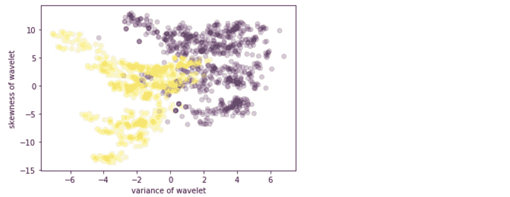

现在，让我们将数据分为训练集和测试集。这可以使用 sk learn*train _ test _ split()*函数来完成。选择 20%的数据用于测试，80%用于训练。此外，我们将检查训练集和测试集的大小。这将有助于以后设计我们的神经网络模型。

```
X_train, X_test, y_train, y_test = train_test_split(X, y, test_size=0.2, random_state=42)X_train = X_train.T
y_train = y_train.reshape(1, y_train.shape[0])X_test = X_test.T
y_test = y_test.reshape(1, y_test.shape[0])print (‘Train X Shape: ‘, X_train.shape)
print (‘Train Y Shape: ‘, y_train.shape)
print (‘I have m = %d training examples!’ % (X_train.shape[1]))

print ('\nTest X Shape: ', X_test.shape)
```


**3。神经网络模型**

构建神经网络的一般方法是:

```
1\. Define the neural network structure ( # of input units,  # of hidden units, etc). 
2\. Initialize the model's parameters
3\. Loop:
    - Implement forward propagation
    - Compute loss
    - Implement backward propagation to get the gradients
    - Update parameters (gradient descent)
```

我们将构建一个具有单一隐藏层的神经网络，如下图所示:

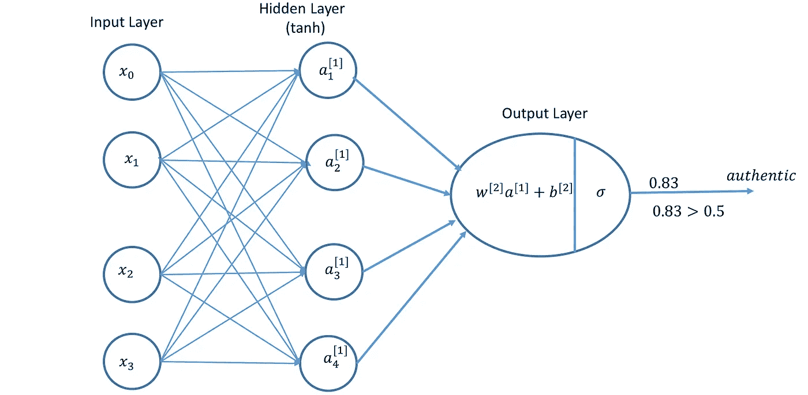

**3.1 定义结构**

我们需要定义输入单元的数量、隐藏单元的数量和输出层。输入单位等于数据集中的要素数量(4)，隐藏层设置为 4(为此)，问题是我们将使用单一图层输出的二进制分类。

```
def **define_structure**(X, Y):
    input_unit = X.shape[0] # size of input layer
    hidden_unit = 4 #hidden layer of size 4
    output_unit = Y.shape[0] # size of output layer
    return (input_unit, hidden_unit, output_unit)(input_unit, hidden_unit, output_unit) = **define_structure**(X_train, y_train)
print("The size of the input layer is:  = " + str(input_unit))
print("The size of the hidden layer is:  = " + str(hidden_unit))
print("The size of the output layer is:  = " + str(output_unit))
```

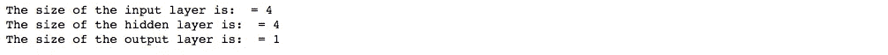

**3.2 初始化模型参数**

我们需要初始化权重矩阵和偏置向量。当偏差设置为零时，权重被随机初始化。这可以使用下面的函数来完成。

```
def **parameters_initialization**(input_unit, hidden_unit, output_unit):
    np.random.seed(2) 
    W1 = np.random.randn(hidden_unit, input_unit)*0.01
    b1 = np.zeros((hidden_unit, 1))
    W2 = np.random.randn(output_unit, hidden_unit)*0.01
    b2 = np.zeros((output_unit, 1))
    parameters = {"W1": W1,
                  "b1": b1,
                  "W2": W2,
                  "b2": b2}

    return parameters
```

**3.3.1 正向传播**

对于正向传播，给定一组输入特征(X)，我们需要计算每一层的激活函数。对于隐藏层，我们使用 **tanh** 激活函数:

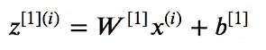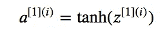

同样，对于输出层，我们使用 sigmoid 激活函数。

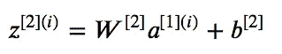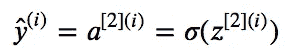

我们可以使用下面的代码来实现向前传播。

```
def **sigmoid**(z):
    return 1/(1+np.exp(-z))def **forward_propagation**(X, parameters):
    W1 = parameters['W1']
    b1 = parameters['b1']
    W2 = parameters['W2']
    b2 = parameters['b2']

    Z1 = np.dot(W1, X) + b1
    A1 = np.tanh(Z1)
    Z2 = np.dot(W2, A1) + b2
    A2 = sigmoid(Z2)
    cache = {"Z1": Z1,"A1": A1,"Z2": Z2,"A2": A2}

    return A2, cache
```

3.3.2 计算成本

我们将计算交叉熵成本。在上一节中，我们计算了 A2。使用 A2，我们可以使用以下公式计算交叉熵成本。

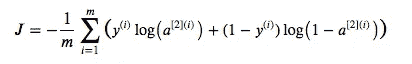

```
def **cross_entropy_cost**(A2, Y, parameters):
    # number of training example
    m = Y.shape[1] 
    # Compute the cross-entropy cost
    logprobs = np.multiply(np.log(A2), Y) + np.multiply((1-Y), np.log(1 - A2))
    cost = - np.sum(logprobs) / m
    cost = float(np.squeeze(cost))

    return cost
```

**3.3.3 反向传播**

我们需要计算不同参数的梯度，如下所示。

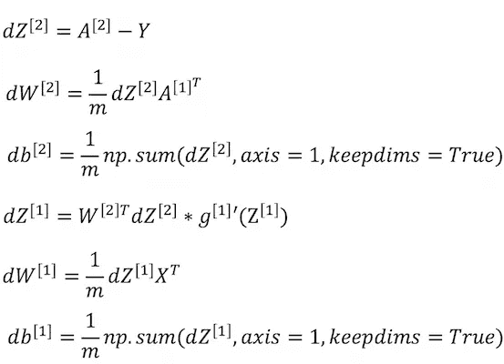

图片提供:[吴恩达](https://www.coursera.org/learn/neural-networks-deep-learning/)

```
def **backward_propagation**(parameters, cache, X, Y):
    #number of training example
    m = X.shape[1]

    W1 = parameters['W1']
    W2 = parameters['W2']
    A1 = cache['A1']
    A2 = cache['A2']

    dZ2 = A2-Y
    dW2 = (1/m) * np.dot(dZ2, A1.T)
    db2 = (1/m) * np.sum(dZ2, axis=1, keepdims=True)
    dZ1 = np.multiply(np.dot(W2.T, dZ2), 1 - np.power(A1, 2))
    dW1 = (1/m) * np.dot(dZ1, X.T) 
    db1 = (1/m)*np.sum(dZ1, axis=1, keepdims=True)

    grads = {"dW1": dW1, "db1": db1, "dW2": dW2,"db2": db2}

    return grads
```

**3.3.4 梯度下降(更新参数)**

我们需要使用梯度下降规则更新参数，即

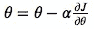

其中 **𝛼** 是学习率 **𝜃** 是参数。

```
def **gradient_descent**(parameters, grads, learning_rate = 0.01):
    W1 = parameters['W1']
    b1 = parameters['b1']
    W2 = parameters['W2']
    b2 = parameters['b2']

    dW1 = grads['dW1']
    db1 = grads['db1']
    dW2 = grads['dW2']
    db2 = grads['db2'] W1 = W1 - learning_rate * dW1
    b1 = b1 - learning_rate * db1
    W2 = W2 - learning_rate * dW2
    b2 = b2 - learning_rate * db2

    parameters = {"W1": W1, "b1": b1,"W2": W2,"b2": b2}

    return parameters
```

**4。神经网络模型**

最后，把所有的功能放在一起，我们可以建立一个只有一个隐藏层的神经网络模型。

```
def **neural_network_model**(X, Y, hidden_unit, num_iterations = 1000):
    np.random.seed(3)
    input_unit = **define_structure**(X, Y)[0]
    output_unit = **define_structure**(X, Y)[2]

    parameters = **parameters_initialization**(input_unit, hidden_unit, output_unit)

    W1 = parameters['W1']
    b1 = parameters['b1']
    W2 = parameters['W2']
    b2 = parameters['b2']

    for i in range(0, num_iterations):
        A2, cache = **forward_propagation**(X, parameters)
        cost = **cross_entropy_cost**(A2, Y, parameters)
        grads = **backward_propagation**(parameters, cache, X, Y)
        parameters = **gradient_descent**(parameters, grads)
        if i % 5 == 0:
            print ("Cost after iteration %i: %f" %(i, cost)) return parametersparameters = **neural_network_model**(X_train, y_train, 4, num_iterations=1000)
```

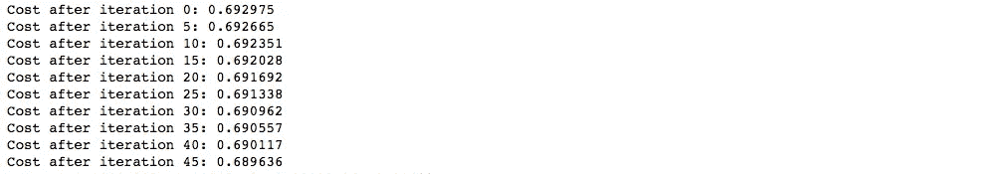

**5。预测**

使用学习到的参数，我们可以通过使用前向传播来预测每个示例的类。

```
def **prediction**(parameters, X):
    A2, cache = forward_propagation(X, parameters)
    predictions = np.round(A2)

    return predictions
```

如果*激活> 0.5，*则预测为 1 否则为 0。

```
predictions = **prediction**(parameters, X_train)
print ('Accuracy Train: %d' % float((np.dot(y_train, predictions.T) + np.dot(1 - y_train, 1 - predictions.T))/float(y_train.size)*100) + '%')predictions = **prediction**(parameters, X_test)
print ('Accuracy Test: %d' % float((np.dot(y_test, predictions.T) + np.dot(1 - y_test, 1 - predictions.T))/float(y_test.size)*100) + '%')
```

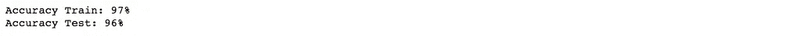

正如我们所看到的，训练精度约为 97%，这意味着我们的模型正在工作，并且以高概率拟合训练数据。测试准确率在 96%左右。给定简单的模型和小的数据集，我们可以认为它是一个好的模型。

> 在这里成为 Medium 会员[，支持独立写作，每月 5 美元，可以完全访问 Medium 上的每个故事。](https://medium.com/@rmesfrmpkr/membership)