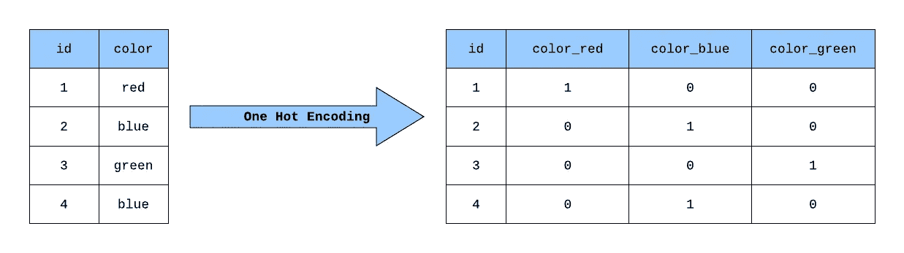

# 用 TensorFlow 构建一个热编码层

> 原文：<https://towardsdatascience.com/building-a-one-hot-encoding-layer-with-tensorflow-f907d686bf39?source=collection_archive---------10----------------------->

## 如何在 TensorFlow 中创建自定义神经网络图层以对分类输入要素进行热编码

一个热编码是机器学习模型预处理分类特征的一种常见方式。这种类型的编码为每个可能的类别创建一个新的二进制特征，并将值 1 分配给对应于其原始类别的每个样本的特征。这在视觉上更容易理解:在下面的例子中，我们对一个由三个类别组成的*颜色*特征进行了热编码(*红色*、*绿色*和*蓝色*)。

一个简单分类特征的热编码(*作者图片)*

Sci-kit Learn 提供了开箱即用的`OneHotEncoder`类，使用一个热编码来处理分类输入。简单地创建一个`sklearn.preprocessing.OneHotEncoder`的实例，然后将编码器安装到输入数据上(这是一个热编码器识别数据帧中可能的类别并更新一些内部状态，允许它将每个类别映射到一个唯一的二进制特征)，最后，调用`one_hot_encoder.transform()`对输入数据帧进行一次热编码。关于`OneHotEncoder`类的伟大之处在于，一旦它适合输入特征，您可以继续向它传递新的样本，它将一致地对分类特征进行编码。

一个使用 Sci-kit Learn 的 OneHotEncoder 的热编码

# 张量流模型的一种热编码

最近，我正在处理一些作为输入传递给张量流模型的分类特征，所以我决定尝试找到一种热编码的“张量流原生”方式。

经过大量的搜索，我发现了两个建议:

## 用 Sci-kit Learn 的 OneHotEncoder 就行了

我们已经知道它是可行的，一个热编码就是一个热编码，所以为什么还要用 TensorFlow 来做呢？

虽然这是一个有效的建议，对于简单的示例和演示非常有效，但是在您计划将您的模型作为服务进行部署以便它可以在生产环境中执行推理的场景中，它可能会导致一些复杂性。

退一步说，将`OneHotEncoder`与 Sci-kit Learn 模型结合使用的一大好处是，您可以将它与模型本身一起作为 Sci-kit Learn **管道**中的一个步骤，本质上是将一个热编码(可能还有其他预处理)逻辑和推理逻辑捆绑为一个可部署的工件。

具有一个热编码和预测逻辑的 Sci-kit 学习流水线

回到我们的 TensorFlow 场景:如果您要使用`OneHotEncoder`来预处理 TensorFlow 模型的输入特征，您将需要处理一些额外的复杂性，因为您必须:

1.  在模型用于推理的任何地方复制一个热编码逻辑。
2.  或者，将 fit `OneHotEncoder`和经过训练的 TensorFlow 模型作为单独的构件进行部署，然后确保它们被正确使用，并由使用该模型的所有应用程序保持同步。

## 使用 tf.one_hot 操作

这是我遇到的另一个建议。`tf.one_hot`操作接受一个类别索引列表和一个深度(对于我们的目的，本质上是一些独特的类别)，并输出一个热编码张量。

tf.one_hot 操作

在上面的例子中，你会注意到`OneHotEncoder`和`tf.one_hot`之间的一些关键区别。

*   首先，`tf.one_hot`只是一个操作，所以我们需要创建一个使用这个操作的神经网络层，以便将一个热编码逻辑包含到实际的模型预测逻辑中。
*   其次，不是传入字符串类别(*红色*、*蓝色*、*绿色*)，而是传入一个整数列表。这是因为`tf.one_hot`不接受类别本身，而是接受一个热编码特征的索引列表(注意，类别索引 0 映射到 1×3 列表，其中列 0 的值为 1，其他的值为 0)
*   第三，我们必须传入一个唯一的类别计数(或*深度* ) *。*该值决定了生成的一个热编码张量中的列数。

因此，为了将一个热编码逻辑作为 TensorFlow 模型的一部分，我们需要创建一个自定义层，将字符串类别转换为类别索引，确定输入数据中唯一类别的数量，然后使用`tf.one_hot`操作对分类特征进行热编码。我们接下来会做所有这些。

# 创建自定义层

首要任务是以一致的方式将字符串类别转换为整数索引(例如，字符串*蓝色*应该总是被转换为相同的索引)。

## 输入文本矢量化

实验性的`TextVectorization`层可用于标准化和标记化字符串序列，例如句子，但是对于我们的用例，我们将简单地将单个字符串类别转换成整数索引。

使文本矢量化图层适应颜色类别

我们在创建层时指定了`output_sequence_length=1`,因为我们只希望传递到层中的每个类别有一个整数索引。调用`adapt()`方法使图层适合数据集，类似于对`OneHotEncoder`调用`fit()`。在层被拟合之后，它维护唯一类别的内部词汇表，并将它们一致地映射到整数索引。你可以通过调用`get_vocabulary()`来查看图层的词汇。

## OneHotEncodingLayer 类

最后，我们现在可以创建一个类来表示神经网络中的一个热编码层。

一个热编码分类要素的自定义图层类

该类继承自`PreprocessingLayer`，因此它继承了基础`adapt()`方法。当这个层被初始化时，`TextVectorization`层也被初始化，当`adapt()`被调用时，`TextVectorization`被拟合到输入数据，并且两个类属性被设置:

*   `**self.depth**` 是输入数据中唯一的类别数。该值在调用`tf.one_hot`时使用，以确定结果二进制特征的数量。
*   `**self.minimum**` 是`TextVectorization`层输出的最小指标。从运行时的索引中减去该值，以确保传递给`tf.one_hot`的索引落在范围[0，self.depth-1]内(例如，如果`TextVectorization`输出范围[2，4]内的值，我们将从每个值中减去 2，以便得到的索引在范围[0，2]内)。

`get_config()`方法允许 TensorFlow 在模型保存到磁盘时保存层的状态。当模型加载到内存中时，来自层配置的值将被传递给层的`__init__()`方法。注意，每当这些值被传入时，我们都显式地设置了词汇、深度和最小值。

## 使用自定义图层

现在我们可以在一个简单的神经网络中尝试新的层。

具有一个热编码的简单神经网络

这个简单的网络只接受分类输入，对其进行热编码，然后将热编码的要素与数字输入要素连接起来。注意，我在 DataFrame 中添加了一个数字列`id`,以说明如何将分类输入从数字输入中分离出来。

就是这样！我们现在有一个工作的神经网络层，可以热编码分类特征！我们还可以将这个模型保存为 JSON 配置文件，部署它，并将其重新加载到内存中以执行推理。请注意，它以与之前相同的方式对*颜色*类别进行了热编码，因此我们知道我们模型的后续层将按照它们在训练期间出现的相同顺序提供相同的功能。

从配置中保存和加载模型

你可以在这里找到包含所有代码示例的笔记本:[https://github . com/gnovack/TF-one-hot-encoder/blob/master/onehotencoderlayer . ipynb](https://github.com/gnovack/tf-one-hot-encoder/blob/master/OneHotEncoderLayer.ipynb)

感谢阅读！欢迎在下面留下任何问题或评论。

## 参考

*   [https://sci kit-learn . org/stable/modules/generated/sk learn . preprocessing . onehotencoder . html](https://scikit-learn.org/stable/modules/generated/sklearn.preprocessing.OneHotEncoder.html)
*   [https://www.tensorflow.org/api_docs/python/tf/one_hot?hl=en](https://www.tensorflow.org/api_docs/python/tf/one_hot?hl=en)
*   [https://www . tensor flow . org/API _ docs/python/TF/keras/layers/experimental/预处理/text 矢量化？hl=en](https://www.tensorflow.org/api_docs/python/tf/keras/layers/experimental/preprocessing/TextVectorization?hl=en)