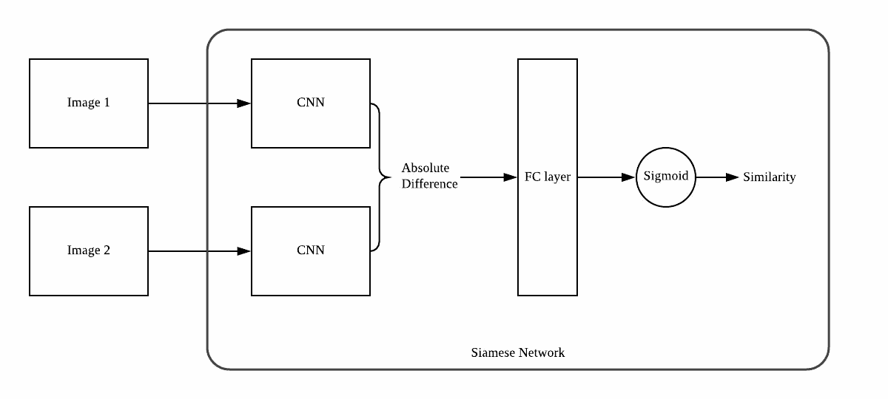
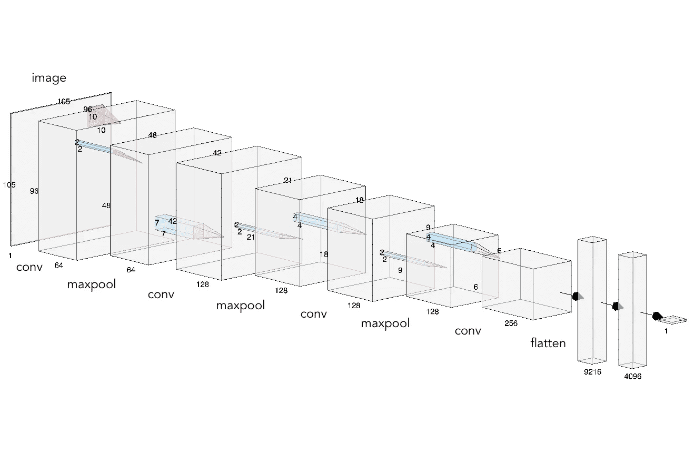
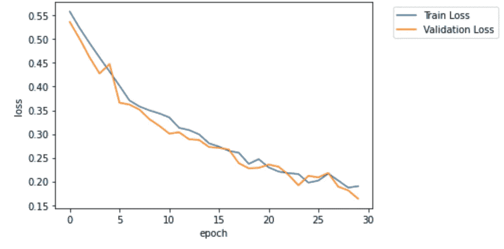
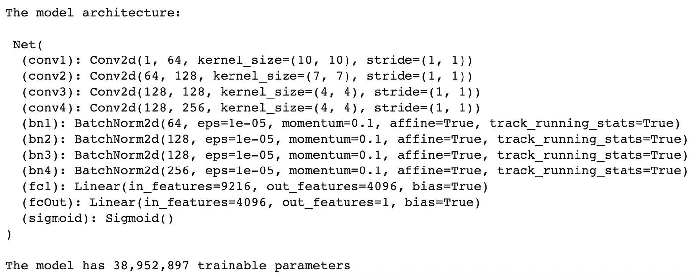
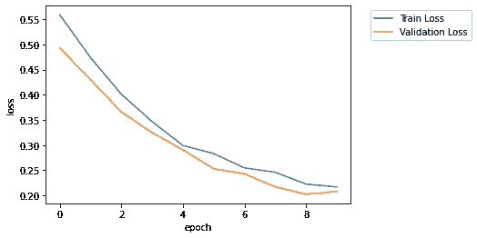
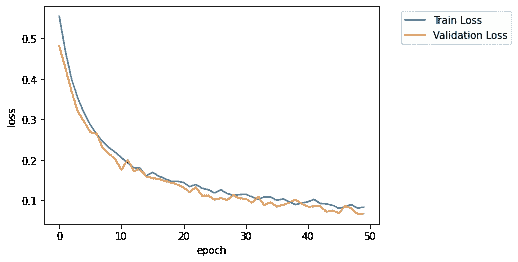
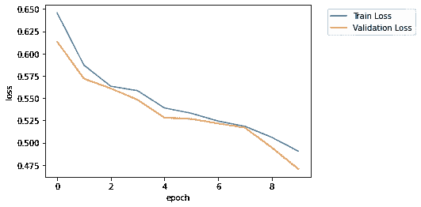
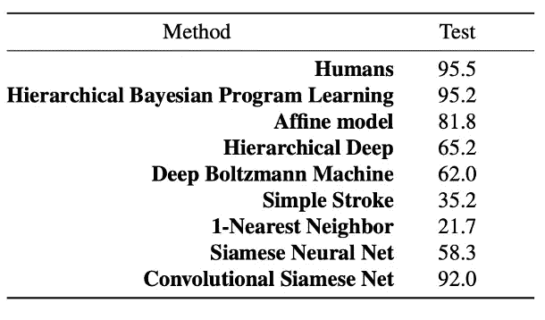

# 用 PyTorch 构建一次性学习网络

> 原文：<https://towardsdatascience.com/building-a-one-shot-learning-network-with-pytorch-d1c3a5fafa4a?source=collection_archive---------4----------------------->

## 我们如何用每门课这么少的样本建立一个深度网络？

近年来，深度学习由于其高性能而在图像识别和分类任务中非常流行。然而，传统的深度学习方法通常需要一个大型数据集来训练模型，以区分非常少的不同类别，这与人类能够从甚至非常少的例子中学习的方式截然不同。

少击或单击学习是一个分类问题，旨在只给定有限数量的样本对对象进行分类，最终目标是创建一个更像人类的学习算法。在本文中，我们将通过使用一种特殊的网络结构:暹罗网络，深入研究解决一次性学习问题的深度学习方法。我们将使用 PyTorch 构建网络，并在 Omniglot 手写字符数据集上对其进行测试，并使用一次性学习评估指标进行多次实验，以比较不同网络结构和超参数的结果。

# **Omniglot 数据集**

Omniglot 手写字符数据集是由 Lake 等人提出的用于一次性学习的数据集。它包含来自 50 个不同系列的字母表的 1623 个不同的手写字符，其中每个字符由 20 个不同的人手写。每个图像的大小为 105x105 像素。这 50 个字母被分成 30:20 的比例进行训练和测试，这意味着测试集是在一个全新的字符集上，这是以前从未见过的。

# 计算环境

训练和实验完全是通过谷歌实验室完成的，使用了包括特斯拉 K80 和 P100 在内的一系列 GPU。我们使用的库包括 Numpy、Matplotlib 和 PyTorch。

# 方法

传统的深度网络通常不能很好地进行一次或几次学习，因为每类很少的样本很可能导致过拟合。为了防止过度拟合问题，并将其扩展到看不见的字符，我们建议使用暹罗网络。

图一。卷积暹罗网络架构

图一。是卷积暹罗网络的主干架构。与传统的 CNN 采用 1 幅图像的输入来生成暗示图像所属类别的独热向量不同，Siamese 网络采用 2 幅图像并将它们馈入具有相同结构的 2 个 CNN。输出将被合并在一起，在这种情况下是通过它们的绝对差异，并被馈送到完全连接的层，以输出一个表示两幅图像相似性的数字。数字越大，表示两幅图像越相似。

暹罗网络不是学习哪个图像属于哪个类，而是学习如何确定两个图像之间的“相似性”。在训练之后，给定一个全新的图像，网络然后可以将该图像与来自每个类别的图像进行比较，并确定哪个类别与给定的图像最相似。

# 数据集预处理和生成

## **训练和验证数据加载器**

为了训练暹罗网络，我们必须首先生成适当的输入(成对)并为模型定义基础事实标签。

我们首先定义两幅图像，它们来自相同字母表中的相同字符，相似度为 1，否则为 0，如图 3 所示。然后，我们根据 dataloader 迭代中索引的奇偶性，随机选择一对图像输入到网络中。换句话说，如果当前迭代是奇数，我们从同一个字符检索一对图像，反之亦然。这确保了我们的训练数据集对于两种类型的输出都是平衡的。两幅图像经历相同的图像转换，因为目标是确定两幅图像的相似性，所以将它们输入不同的图像转换没有意义。

以下是生成训练集的代码:

我们创建了 10000 对这些数据作为我们的训练集，然后以 80:20 的比例随机地进一步分成训练和验证。

## **测试加载器**

对网络在一次学习中的性能的评估可以通过 n 路一次学习评估度量来完成，其中我们找到代表 n 个类别的 n 个图像和属于 n 个类别之一的一个主图像。对于我们的暹罗网络，我们计算了主图像相对于所有 n 个图像的相似性，具有最高相似性的对意味着主图像属于该类。

测试加载器是以支持上述评估的方式构建的，其中随机获取了一个主图像，并且还检索了代表 *n* 个类别的 *n* 个图像，其中一个图像来自主图像的相同类别。

以下是用于生成测试集的代码:

对于我们的最终测试，我们将我们的网络扩展到 4 路一次性学习，测试集大小为 1000，20 路为 200。

# 实验

## **实验一。用于一次性学习的传统连体网络**

图二。Koch 等人的暹罗网络架构。

暹罗网络的主要部分是前面显示的双卷积架构。我们将尝试构建的第一个卷积架构来自 Koch 等人的论文“用于一次性图像识别的暹罗神经网络”，如图 2 所示。需要注意的一点是，在展平之后，两个卷积分支之间的绝对差异被馈送到全连接层，而不仅仅是一个图像的输入。

PyTorch 中的网络构建如下:

我们可以使用以下功能进行培训:

**超参数设置**

批量大小:因为我们正在学习两幅图像有多相似，所以批量大小需要相当大，以便模型具有通用性，特别是对于像这样有许多不同类别的数据集。因此，我们使用的批量大小为 128。

学习率:我们测试了从 0.001 到 0.0005 的几个学习率，并选择了 0.0006，它提供了最好的损失减少率。

优化器和损耗:我们采用传统的 Adam 优化器来优化该网络，并使用 logits 进行二进制交叉熵(BCE)损耗。

**结果**

图 3。原始网络的训练和验证损失

该网络被训练 30 个时期。图 3。是每个时期后的训练和验证损失图，正如我们所看到的，它显示了接近结束时的急剧下降和收敛。验证损失通常随着训练损失而减少，表明在整个训练中没有发生过拟合。在训练期间，将保存具有最低验证损失的模型。我们使用验证损失而不是训练损失，因为它是模型不仅仅对训练集表现良好的指标，这可能是过度拟合的情况。

## **实验二。添加批量标准化**

图 4。使用 BatchNorm 的模型架构

为了进一步改善网络，我们可以添加批量标准化，这应该会使收敛过程更快、更稳定。图 4 是更新后的架构，每个卷积层后都有一个 BatchNorm2d。

**结果**

图 4。10 个时期后的训练结果

正如预期的那样，与原始网络相比，训练损失和验证损失都下降得更快。有了更好的结果，我们决定也训练模型更多的时期，看看它是否会比实验 1 表现得更好。

图 5。50 个时期后的训练结果

如损失图所示，结果略好于实验 1 的原始结果。由于损失在 40 和 50 代之间缓慢收敛，我们在第 50 代停止了训练。这是目前我们取得的最好成绩。

## **实验三。用轻型 VGG16** 替换 ConvNet

在让原来的网络工作得相当好之后，我们还可以为我们的暹罗网络测试不同的成熟 CNN，看看我们是否能取得更好的结果。对于 105x105 的小图像大小，我们希望使用一个相对较小的网络，没有太多的层，但仍能产生不错的结果，因此我们借用了 VGG16 的网络架构。

最初的 VGG16 对于我们的尺寸来说仍然有点太大，其中最后 5 个卷积层只处理单个像素，所以我们取消了它们，最终网络如下:

**结果**

图 6。VGG16 暹罗网络结果

如损失图所示，训练损失比先前的实验下降得慢得多。这可能是由于卷积层的内核大小相当小(3×3)，这给出了小的感受域。对于计算两个图像之间的相似性的问题，查看两个图像的“更大画面”而不是关注小细节可能是有益的，因此在原始网络中提出的更大的感受野工作得更好。

## **对模型的评价**

评估网络的代码实现如下:

**四路一次学习**

我们首先使用一组全新的图像来测试 4 向一次学习进行评估，其中所有的测试图像在训练期间都没有使用，并且模型也不知道任何角色。结果显示大约 90%的准确率，这表明该模型可以很好地推广到看不见的数据集和类别，实现了我们在 Omniglot 数据集上一次性学习的目标。

**20 路一次学习**

之后，我们对 200 组进行了 20 路单镜头学习评估。结果仍然是 86%左右。我们将结果与 Lake 等人提供的基线进行了比较:

虽然我们没有超过或复制论文提出的 92%的准确性(可能是由于细节，如变化的层学习率)，但我们实际上非常接近它。

此外，我们的模型实际上比许多其他模型表现得更好，包括正常的暹罗网络和最近邻居。

# 结论

所以你有它！这就是如何为一次性学习 Omniglot 数据集构建卷积暹罗网络。完整代码也发布在 Github 的以下目录中:

 [## ttchengab/One_Shot_Pytorch

### 设置:从 https://github.com/brendenlake/omniglot 下载数据集，转到/python 并提取文件夹…

github.com](https://github.com/ttchengab/One_Shot_Pytorch.git) 

*感谢您坚持到现在*🙏！*我将发布更多关于计算机视觉/深度学习不同领域的文章，请务必查看我关于 3D 重建的另一篇文章！*