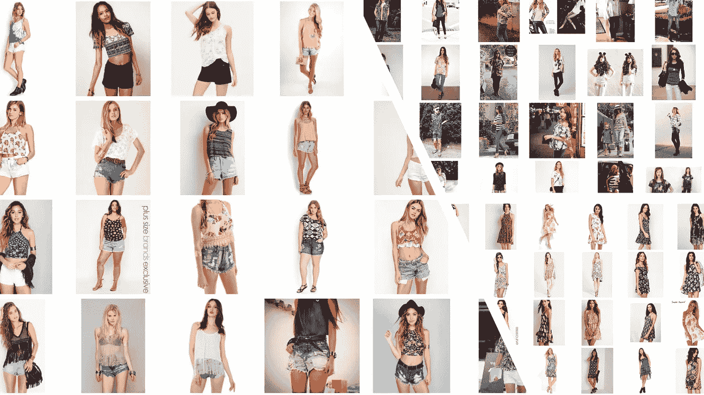
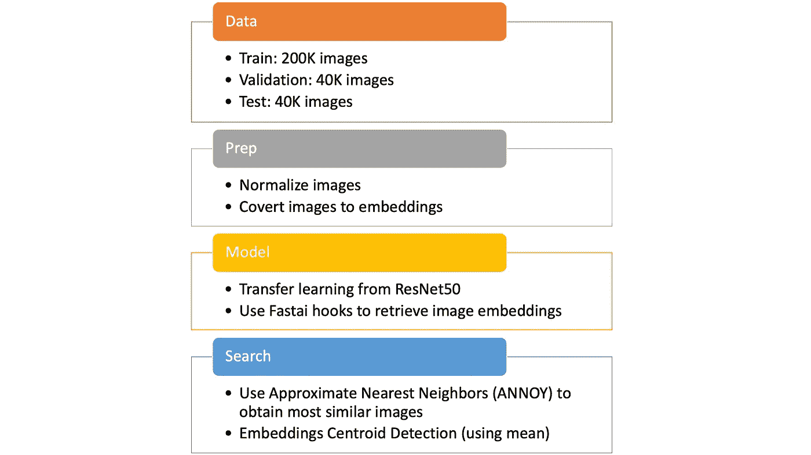
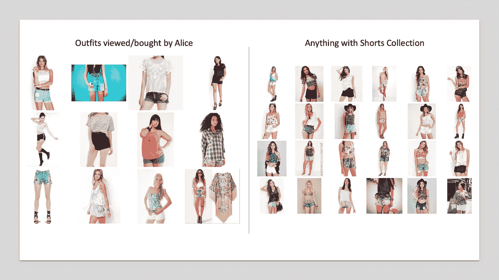
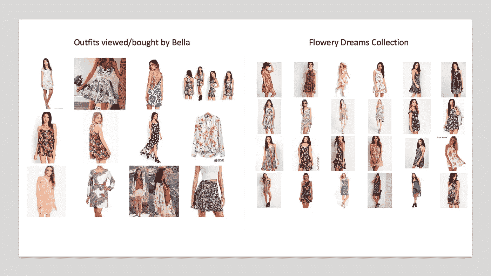
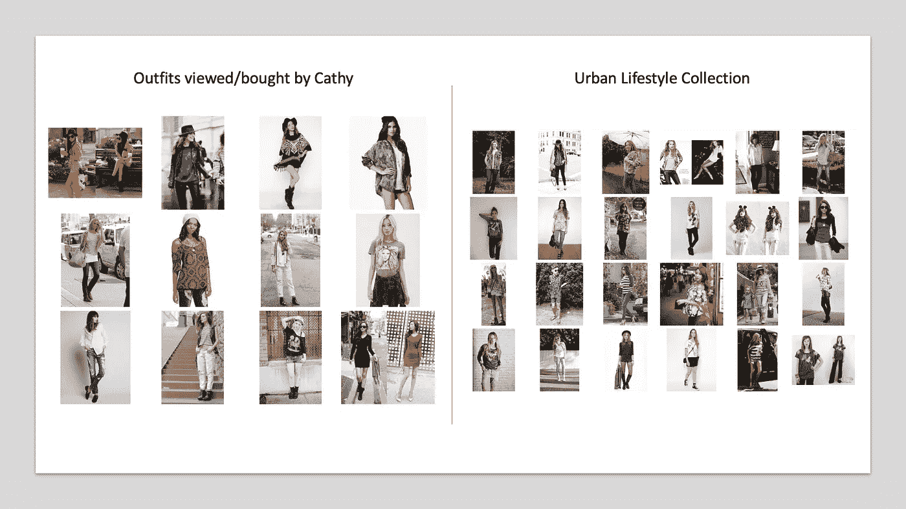
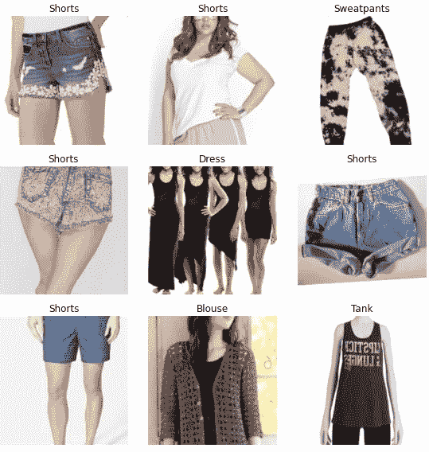
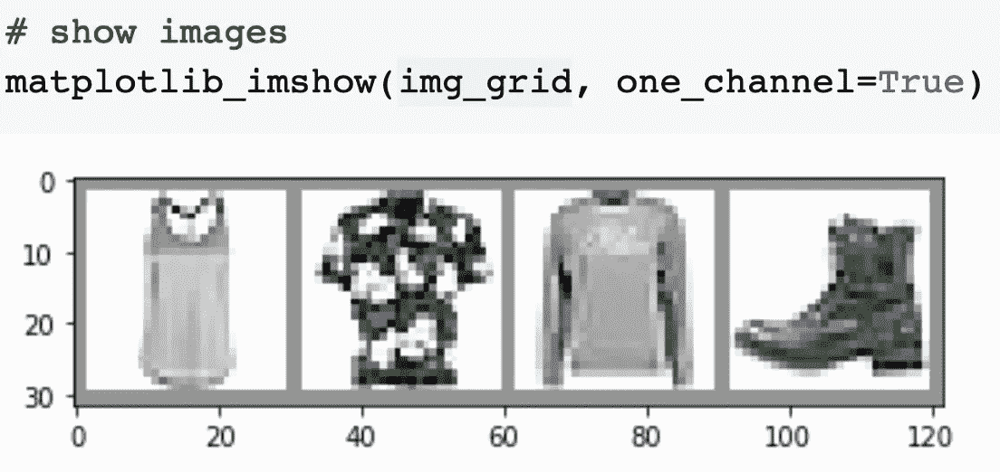
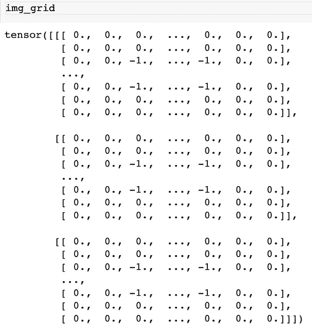
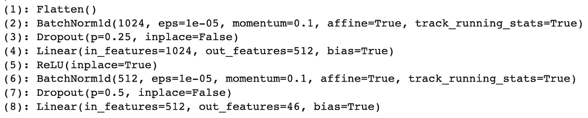
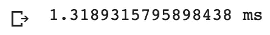

# 构建个性化的实时时装收藏推荐系统

> 原文：<https://towardsdatascience.com/building-a-personalized-real-time-fashion-collection-recommender-22dc90c150cb?source=collection_archive---------9----------------------->



我们的 RecSys 选择的服装。左:“任何有短裤的东西”。右上:“都市生活方式”。右下:《如花梦》。服装从 [DeepFashion、](http://mmlab.ie.cuhk.edu.hk/projects/DeepFashion.html)开源由 [**刘 z 等人**](https://liuziwei7.github.io/)

## 现代 RecSys

## 我们将利用 PyTorch 中的迁移学习、近似最近邻和嵌入质心检测来构建我们的推荐器。

我在数据行业工作了七年多，有幸设计、构建和部署了两个推荐系统(RecSys ),并为数百万客户提供了服务。在本文中，我将通过一个带有代码的案例研究来介绍可视化推荐器的现代方法，并分享我设计 RecSys 的一些经验。

# 商业问题

假设你被一家电子商务公司**happy panda co .**聘用，负责他们的时装系列专题。产品团队概述了需求:

*   该模型应该能够**扫描所有 280，000+产品图像**，并自动**生成一组推荐产品**，这些产品是根据用户查看/购买的内容**定制的。**
*   速度对电子商务公司至关重要。该组推荐的**产品应在 2ms** 内生成，以满足管道的“实时”要求。
*   该模型应该能够适应新产品和新用户。

听起来很有趣？让我们建造这个。

# 数据

我们将使用**[**【deep fashion】**](http://mmlab.ie.cuhk.edu.hk/projects/DeepFashion.html)**的子集数据，由香港中文大学刘 z 等人开源，**。我们的数据由 46 个类别的 28 万张时尚图片组成。你可以从他们的网站上下载数据。**

**此外，该团队发布了一个[更新版本，增加了](https://github.com/switchablenorms/DeepFashion2)的数据。你需要[填写谷歌表格](https://docs.google.com/forms/d/e/1FAIpQLSeIoGaFfCQILrtIZPykkr8q_h9qQ5BoTYbjvf95aXbid0v2Bw/viewform?usp=sf_link)来获取数据。**

# **时尚系列——打造时尚系列的步骤**

**了解业务需求后，我们分解构建时装系列所需的步骤:**

****

**我打造时装系列的步骤**

# **回顾时尚系列的成果**

**在深入研究代码之前，让我们看一下模型的输入/输出，以获得对问题和建议的解决方案的直觉。**

**输入:**

*   **我和妻子商量，通过选择 **12 套风格相似的服装**来模拟用户查看/购买的服装。我们将关注三个用户:爱丽丝、贝拉和凯茜，每个人都有不同的口味偏好。**
*   ****我只会将图像传递到模型中；模型不吸收额外的属性/描述/产品细节；**这是因为我们希望模型能够自动学习和检测传递给它的时尚图像的风格，而无需进一步的人/机器标记。**

**输出:**

*   **目标是让模型生成的集合**包含输入的某些方面，但给用户带来惊喜。****

****

**左图:爱丽丝查看/购买的服装。右图:时装系列推荐的服装。 [DeepFashion、](http://mmlab.ie.cuhk.edu.hk/projects/DeepFashion.html)开源 [**刘 z 等人**](https://liuziwei7.github.io/)**

**A **lice** 来自阳光明媚的新加坡，喜欢短裤和适合炎热天气的服装。根据她选择的服装,《时尚收藏》推荐了各种各样的新服装，都配有短裤，看起来非常适合阳光下的生活。**请注意，我们没有明确告诉模特根据短裤过滤服装。** Fashion Collection 可以捕捉到爱丽丝喜欢搭配短裤的服装的信号，并做出适当的推荐。**

****

**左图:Bella 查看/购买的服装。右图:时装系列推荐的服装。服装来自 [DeepFashion，](http://mmlab.ie.cuhk.edu.hk/projects/DeepFashion.html)开源来自 [**刘等**](https://liuziwei7.github.io/)**

**ella 来自艺术巴塞罗那，喜欢她衣服上的花卉图案和多彩设计。根据她选择的服装，时装系列推荐了各种颜色、图案和剪裁与她品味相似的各种新服装。**

****

**左图:Cathy 查看/购买的服装。右图:时装系列推荐的服装。服装从 [DeepFashion、](http://mmlab.ie.cuhk.edu.hk/projects/DeepFashion.html)开源由 [**刘 z 等人**](https://liuziwei7.github.io/)**

**阿西来自国际化的纽约，穿着她熟悉的都市生活方式。城市生活方式是一种**更复杂的风格**，分层、破牛仔裤、配饰、靴子、图案 t 恤是其中一些定义特征。因此，令人兴奋的是，时装系列已经认识到了这种风格的一些关键特征，并推荐了带有层次感的服装组合，破旧的牛仔裤，配饰，靴子，图案 t 恤！**

> **这也是为什么我们不想硬编码过滤器/按类别限制服装。**我们希望时装系列能够响应不同用户和不断变化的用户偏好，即使是像城市生活方式这样多样化的风格。****

**在下一节中，我将介绍一些主要的概念和代码片段。如果你不能在一次阅读中理解所有的理论，不要担心。本质上，这些都是不断发展的密集话题；我将提供一个高层次的概述，并在进一步的阅读材料中提供额外的资源供您参考。我们将遵循上面流程中概述的阶段(数据、准备、建模、搜索)。**

# **代码**

**[**链接到 Colab 上的代码**](https://colab.research.google.com/gist/thiakx/c850d08ab37b7e57b8dae9ecfa1a3b8b/building-a-personalized-real-time-fashion-collection-recommender.ipynb) (你只需要一个免费的 Google 账号就可以在云端的 GPU 上运行代码)。我们将使用杰瑞米·霍华德的 Fastai 包(以及著名的[程序员实用深度学习](https://course.fast.ai/)课程)。**

# **[Prep]代码:将图像转换为嵌入内容**

**这种转换是我们模型数据处理的第一步:**

****

**我们代码的结果——图像数据已处理，可用于训练。各路服装来自 [DeepFashion，](http://mmlab.ie.cuhk.edu.hk/projects/DeepFashion.html)开源作者 [**刘 z 等人**](https://liuziwei7.github.io/)**

# **理论:什么是嵌入，为什么我们需要它们？**

**为了解释和说明嵌入的概念，我们将使用一个更小的开源数据集，称为 [FashionMNIST](https://github.com/zalandoresearch/fashion-mnist) 。**

********

**左图:示例图像。右图:图像的数字表示。样本图片来自[时尚达人，](https://github.com/zalandoresearch/fashion-mnist)开源作者[小 H.](https://hanxiao.io/2018/09/28/Fashion-MNIST-Year-In-Review/)**

**传统上，我们将图像表示为一个巨大的整数数组(RGB 图像的 3D 数组和灰度图像的 1D 数组)。这些阵列非常庞大，并且呈指数级增长，我们将需要跟踪数百万个数字来分析数百张高分辨率图像！使用整数数组来缩放任何建模都是不可能的；因此，现代的嵌入方法产生了。**

**嵌入概念的一个很好的例子是 Will Koehrsen 的“[神经网络嵌入解释](/neural-network-embeddings-explained-4d028e6f0526)”中的例子。传统上，我们利用像一键编码这样的技术来表示矩阵中的项目。例如，给定三本书，我们将有一个 3x3 矩阵，其中每一项都由一个由**个离散的**个数字组成的数组表示，这个数组的**随着每增加一个新项而增长** (4x4 有 4 项，5x5 有 5 项……)。此外，**没有相似感，也没有距离感**，因为这些项目没有以任何形式的关系连接。**

```
**# One Hot Encoding Categoricals****books = ["Harry Potter and The Philosopher's Stone",
         "Harry Potter and The Chamber of Secrets", 
         "The Lean Startup"]****books_encoded = [[1, 0, 0],
                 [0, 1, 0],
                 [0, 0, 1]]****Similarity (dot product) between First and Second = 0
Similarity (dot product) between Second and Third = 0
Similarity (dot product) between First and Third = 0**
```

**一旦我们应用一个转换来将对象转换成嵌入，我们现在**在一个连续的尺度上限制表示每个项目的数组中的元素数量(在这个例子中限制为 2)**，并且这些值具有基于关系的含义。基于相似性(点积)彼此接近的对象是高度相关的。**

```
**# Idealized Representation of Embedding****books = ["Harry Potter and The Philosopher's Stone",
         "Harry Potter and The Chamber of Secrets", 
         "The Lean Startup"]****books_encoded_ideal = [[0.53,  0.85],
                       [0.60,  0.80],
                       [-0.78, -0.62]]****Similarity (dot product) between First and Second = 0.99
Similarity (dot product) between Second and Third = -0.94
Similarity (dot product) between First and Third = -0.97**
```

> **嵌入是离散变量的矢量表示，而不是分析每幅图像的数百万个离散变量。对于深度学习，我们通常利用神经网络嵌入来将分类变量的维度降低到可管理的程度**

****

**时尚嵌入投影。图片来自 [FashionMNIST，【Tensorboard 动画](https://github.com/zalandoresearch/fashion-mnist)**

**因为我们可以控制向量表示的大小，所以我们可以将一个巨大的图像数组缩小成一个由更少的数字组成的小向量。从上图中的 FashionMNIST 对象可以看出结果，其中对象被投影到 3D 矢量空间。通过嵌入过程，相似的**个图像向量将被投影成彼此靠近**。因此，当我们有嵌入时，我们可以将对象投影到向量空间中，并为可视化和简单的推荐制定距离和邻居的概念。**你可以用下面的笔记本探索嵌入的概念，并在进一步阅读部分阅读更多相关内容:****

# **[模型]代码:深度卷积神经网络(CNN)的迁移学习**

**Fastai 在建立神经网络的过程中抽象出了许多代码逻辑，允许我们用几行代码进行迁移学习:**

**用 Fastai 钩子运行模型并为每个图像生成嵌入也相当简单。注意，我们想要倒数第二个线性层，因为该层存储图像表示的嵌入；最后一个线性图层是输出图层。**

****

**请注意，倒数第二个线性图层是(4)**

**因此，当我们调用 learner.model.module[1][4]来获得具有嵌入的层时。**

# **【模式】理论:CNN 是什么？**

**卷积并不是一项新技术。本质上，我们正在对图像中的每个像素应用内核以实现一个目标，通常是模糊、锐化或检测边缘/对象。对于每个像素，我们将用内核做一个元素级的乘积，然后将结果相加得到一个单一的数。**

> **由于每个内核专门检测图像的一个方面，你可以想象我们将不同的内核堆叠起来，制定一个全面的策略。事实的确如此，内核的集合被称为过滤器。在 CNN 中，我们甚至可以堆叠多层过滤器，每个过滤器都有特定的任务。**

**[如果你有兴趣，你应该试试 Victor Powell 开发的带有不同类型内核的工具](https://setosa.io/ev/image-kernels/)。CNN 是一个迷人的模型，因为它结合了卷积和神经网络的力量。有许多不同的架构，但通常由[卷积、子采样、激活和完全连接的组合组成，如 Algobeans](https://algobeans.com/2016/01/26/introduction-to-convolutional-neural-network/) 所述。你可以在进一步阅读部分了解更多关于内核和 CNN 的知识。**

# **【模型】理论:迁移学习是如何工作的？**

> **对于大多数现实部署，我们不会从头开始训练 CNN。多年来，像微软研究院这样的组织已经发布了最先进的大规模预训练深度 CNN (DCNN)模型，我们应该通过在他们的基线模型上进行训练来利用他们的工作。这就是所谓的迁移学习。**

**具体来说，我们拿一个像 [ResNet50 (He K .，et al.)](https://arxiv.org/abs/1512.03385) 这样的大型预训练 DCNN，冻结大部分层，在最后几层上训练。直觉是，对于大多数 DCNN，过滤器获得的知识是可转移的成分，例如边缘、图案、梯度、颜色等的检测。因此，我们对问题的最后几层进行微调，就可以得到一个可行的解决方案。**你可以在进一步阅读部分探索迁移学习的概念。****

# **[搜索]代码:用骚扰和嵌入质心检测来近似最近邻居**

**我们遍历数据帧中的每一行，用 get_nss_by_vector 函数找到最近的邻居。**

**最后，我们将所有 12 个(或更多)用户选择的项目的嵌入插入到一个列表中，然后**对每个维度的嵌入值进行平均**；**这将创建一个虚拟对象，表示所有选定项目的聚合值。然后，我们可以找到这个虚拟物品的最近邻居，当我们调用 Annoy 时，这可以在大约 2ms 内完成。****

****

**用 Shorts 集合生成任何内容所花费的时间**

# **[搜索]理论:近似最近邻**

**如果我们只有一个小的图像搜索语料库，简单的距离度量，如余弦相似性将工作。在现实世界的部署中，比如电子商务，我们通常有数百万张图片需要相互比较，API 对每张图片进行成对比较是不切实际的。来自 Spotify 的 Erik Bernhardsson 编写了一个易于使用的 API，可以集成到我们的 PyTorch 工作流中。**

> **更重要的是，它帮助我们找到最近的邻居，而不需要计算每张图像之间的成对距离。**

**如果你有兴趣了解更多关于 aroy 的知识，请在“进一步阅读”下查看 Erik 的文章。**

# **我们学到了什么**

**我们将详细介绍构建个性化实时时装系列推荐器的整个过程。借助 PyTorch、Fastai 和 Annoy 等现代工具，我们构建了一个强大的产品，可以根据用户的风格生成相关的推荐。**

# **进一步阅读**

*   **[神经网络嵌入解释](/neural-network-embeddings-explained-4d028e6f0526)**
*   **[卷积核的类型:简化的](/types-of-convolution-kernels-simplified-f040cb307c37)**
*   **[图像卷积示例](https://aishack.in/tutorials/image-convolution-examples/)**
*   **[由 deeplizard(视频)解释的卷积神经网络(CNN)](https://youtu.be/YRhxdVk_sIs)**
*   **[卷积神经网络(CNN)简介](https://algobeans.com/2016/01/26/introduction-to-convolutional-neural-network/)**
*   **[理解卷积神经网络的初学者指南](https://adeshpande3.github.io/A-Beginner%27s-Guide-To-Understanding-Convolutional-Neural-Networks/)**
*   **[py torch 中卷积神经网络的迁移学习](/transfer-learning-with-convolutional-neural-networks-in-pytorch-dd09190245ce)**
*   **[了解深层剩余网络](https://shuzhanfan.github.io/2018/11/ResNet/)**
*   **[ResNet 及其变体的概述](/an-overview-of-resnet-and-its-variants-5281e2f56035)**
*   **[全面的实践指南，将学习与深度学习中的真实世界应用相结合](/a-comprehensive-hands-on-guide-to-transfer-learning-with-real-world-applications-in-deep-learning-212bf3b2f27a)**
*   **[深度学习迁移学习的温和介绍](https://machinelearningmastery.com/transfer-learning-for-deep-learning/)**
*   **Erik:aroy:最近邻和向量模型——第二部分——算法和数据结构**