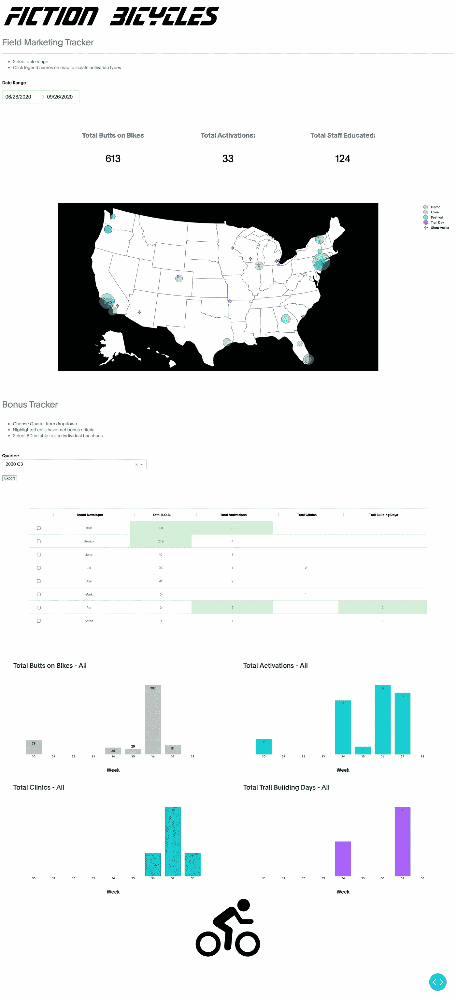
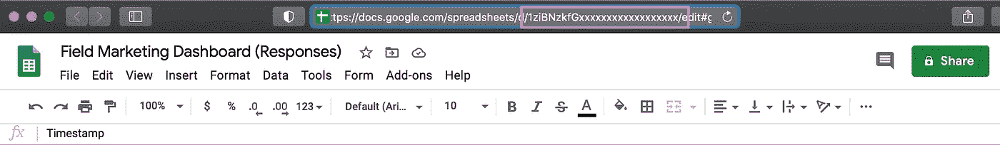

# 从 Google Sheets 构建一个精巧的 Dash 应用程序——第 1 部分

> 原文：<https://towardsdatascience.com/building-a-plotly-dash-app-from-google-sheets-part-1-d37dc41ece10?source=collection_archive---------21----------------------->

## Plotly Dash 应用程序

## 用众所周知的免费工具构建的非传统仪表板

# 介绍

对于大多数公司的数据科学家或分析师来说，仪表板仍然是一项非常受欢迎的任务。在一个完美的世界中，你可能会连接到大的数据流管道，或者用 OLAP 立方体建立一个单独的数据仓库，以提供一组复杂的实时分析。然后在应用程序中构建一些漂亮的灵活性，供业务团队用于即席号码。*也许*你甚至可以用一些预测算法来增加数据。听起来很有趣。这不是仪表板。

或者，有时您需要围绕现有的一组流程构建一个仪表板，并且尽量不干扰业务。那是仪表板着陆的地方。这个项目的想法是支持一个为*虚构的*自行车公司工作的现场营销团队。每个营销人员在全国各地举办实体活动，并需要向营销主管报告活动的类型、规模和频率。此外，这些指标需要跟踪员工奖金激励的进展。这家 T4 的大公司有很多繁文缛节，部门内部的部门和超负荷工作的 IT 团队。因此，营销负责人希望有一个非常简单的解决方案，可以在几天内完成，不需要召开 3 次预算会议来获得批准，也不需要培训现场员工使用新工具。

输入谷歌表单。我们将使用 Google 提供的简单、免费且非常熟悉的工具，而不是创建另一个生产级数据存储和 web 表单来接收数据。这允许团队快速调整和编辑数据。正如你将看到的，谷歌已经提供了一些他们用来构建 G-Suite 的相同代码，以制作我们自己的定制解决方案。

这个项目将分为 4 个部分。

1.  使用 Google 和 code.gs 的设计和 ETL 过程
2.  [将 Google Sheets 数据连接到 python](https://medium.com/p/f35cea7f834c)
3.  [打造一款 Plotly Dash app](https://medium.com/p/666c496c8a71)
4.  在 Heroku 上主持[即将推出]

## 我们要建造这个:

我们示例仪表板的图像——作者提供的图像。

# 第 1 部分——使用 Google 和 code.gs 进行设计和 E.T.L

在开始 dashboard 和任何应用程序之前，我们必须首先列出构建它所需的重要元素。

1.  按日期过滤—我们希望允许营销主管查看特定日期范围内的活动
2.  聚合值-每个事件都有一个可量化的特征，如在诊所接受教育的员工人数或测试骑过自行车的消费者人数
3.  地图——每个事件的规模和位置的直观概述，以便团队识别覆盖范围的缺口
4.  季度日期范围—现场营销团队按季度获得奖金，我们需要按此固定日期进行筛选

为了构建这个项目，我们将创建一个简单的[谷歌表单](https://www.google.com/forms/about/)。这对于调查和快速数据输入来说非常方便，并且允许数据验证，比如日期和所需的响应，就像典型的 SQL db 一样。此外，Google Forms 会将每个响应存储在一个 Google Sheet 中，作为我们 Dashboard 应用程序的数据源。

谷歌表单样本——作者图片。

带有表单响应的 Google 表单—作者图片

# 地理编码

在上述需求中，几乎所有需求都可以在 python 中以足够快的速度处理，以加载一个应用程序。然而，在 Plotly 中在地图上绘制坐标的最佳方法是使用纬度和经度。我不想让营销团队在提交 Google 表单时查找这些坐标，从而使数据输入变得复杂。在这一点上，我无法找到一个预建的 Google form 解决方案来整合地图，以实现“放下大头针”的解决方案(也许是我的下一个项目想法？).我发现将地址转换成坐标需要调用 python 中的 API，我想在我们的仪表板加载时避免这种情况。

然而，在 Google 产品套件中，有一个内部 API 可以快速调用经度和纬度。接下来，我们将在新的 Google Sheet 中编写一个脚本，将纬度和经度附加到 Google Sheet 中存储响应的最后一列。

# code.gs

[https://developers.google.com/apps-script/reference](https://developers.google.com/apps-script/reference)

Google Apps Script 是一个非常强大的工具，它允许您构建脚本函数来执行 Google 表单、文档或幻灯片中尚不存在的任务。code.gs 的名字是 Node.js 的巧妙变化，因为这种脚本语言与基于 javascript 的语言的外观和感觉有很多相似之处。该工具允许您将自定义函数写入您的电子表格(或任何 g-suite 工具！)可以像在工作表中使用`=SUM(A1:A5)`一样使用。或者您可以使用它连接到您的 Google 日历，在 Google 文档中查找会议请求。我不是用 javascript 写的，也没见过多少代码，但是对代码有一些基本的理解可以让你开始运行一些东西。

Sheets 脚本语言的核心建立在几个类上，如`.sheet()`或`.range()`或`.cell()`，这允许脚本在工作表中找到特定信息，进行一些转换，并将新值返回到另一个特定位置。正是我们要找的。

此外，还有很多很多类可以使用其他谷歌服务，比如[地图类](https://developers.google.com/apps-script/reference/maps/geocoder)中的`Maps.newGeocoder()`。有了这个类，我们就可以在脚本中使用健壮的谷歌地图服务，从*非常基本的*城市或邮政编码数据中调用我们的纬度和经度。

因此，为了准备仪表板的数据，要完成的第一项任务是运行一个脚本来插入纬度和经度。

在带有表单响应的 Google 表单中，打开脚本编辑器——作者图片

在 Will Geary 的这篇教程的帮助下，我能够在 code.gs 中创建一个函数来查找地址并插入纬度/经度坐标:

如果您熟悉 javascript，您可能会找到更简洁或更好的方式来编写这些代码。在伪代码中，这个函数的作用如下:

1.  第 2 行:从特定于*的*电子表格中获取数据。我有不确定性，因为我阅读的许多文档和我找到的示例代码片段似乎使用了这一行的通用版本，它只要求“当前的电子表格”。这个想法是，这个函数被专门绑定到我打开脚本编辑器的表单上。为了安全起见，我已经输入了该表的确切 ID。我不希望这个函数意外地将数据写入我的 Google drive 中的另一个工作表。您可以在下面找到唯一的 ID:

Google 工作表的唯一 ID—按作者分类的图片

1.  从 G 列开始，检查下一行的数据。这将创建一系列包含数据的行。
2.  从第 2 列到第 7 列中抓取我们刚刚找到的范围长度的单元格块，以获得每一行的邮政编码
3.  遍历每个单元格并创建一个纬度/经度数据的列表——是的，每次函数运行时都会遍历整个列表，这是一种浪费的编程。但是，我选择保留这一步，以防有人稍后对响应表单中的数据进行手动更改，并且数据不太可能超过 1000 行。
4.  将此数据列表插入工作表的最后一列。这不包括检查最后一列数据的逻辑。它被明确地告知去 AB 和 AC 列。如果对 Google 表单进行了修改并添加了问题，您将需要手动更新该脚本。

Logger.log 是一个很好的工具，可以测试过程中的各个步骤，并查看每个变量是否都按照应有的方式存储。

# 功能触发器

仪表板构建的第 1 部分中的最后一步是配置将运行该脚本的触发器。谷歌让这变得超级简单。标准的选择是当文件被打开或数据被更改时运行脚本，但是这只能识别用户的更改，而不能识别由 Google 表单或其他脚本所做的更改。很简单，Google 还设置了一个基于表单提交的特定触发事件。

1.从脚本编辑器中打开项目触发器—按作者排序的图像

2.为此脚本添加一个新的触发器—作者图片

3.用您需要的设置配置您的新触发器—按作者分类的图像

# Code.gs

Code.gs 在这里是一个非常酷的工具。它有如此大的潜力，将极大地帮助我的实际工作。如果您的公司已经在使用 G-suite，那么使用您团队的现有流程，并添加一些自定义功能，作为 mvp 步骤来帮助他们。许多销售团队将为单个客户或项目存储他们的信息大型电子表格，只需要一点数据帮助。使用地图功能、电子邮件或日历连接工作表。

# 将 Python 连接到 Google Docs API

接下来，我们将把我们的应用程序直接连接到谷歌表单中的实时数据。

最初的搜索把我带到了 Google Docs Quickstar 页面。虽然它很全面，对于你可能在命令行中运行的应用程序来说也很棒，但对于我们在 Heroku 上托管这个应用程序的最终目标来说，它并不起作用。

更好的解决方案是使用[谷歌服务账户](https://cloud.google.com/iam/docs/understanding-service-accounts)。

谢天谢地，另一个来自[的帖子完美地解释了我们在这里需要做什么。](https://medium.com/@denisluiz)

 [## Python 与 Google Sheets 服务帐户:一步一步

### 几天前，我第一次体验了 Google Sheets API。我原以为这是一个简单的任务，但是，嗯…不是。

medium.com](https://medium.com/@denisluiz/python-with-google-sheets-service-account-step-by-step-8f74c26ed28e) 

我不可能比上面的链接写得更好。相反，我会强调我在这个过程中遇到的地方，并指出我们将为我们的应用程序做出的一些轻微的偏差。

1.  添加你的电子邮件——也许我读教程读得太快了，或者我认为因为我的个人电子邮件负责 API 和 Google 表单，权限已经设置好了。您需要将特殊的 API 电子邮件添加到 Google 工作表的“共享”部分，就像您邀请同事进行编辑一样。

服务帐户设置屏幕截图-按作者分类的图像

2.安装 Google 客户端库——像许多数据科学项目一样，我使用 Anaconda 作为包管理器。我总是试着用它来管理依赖项，并在安装了其他包之后，把安装 pip 作为最后的选择。令人欣慰的是，Anaconda `conda install -c conda-forge google-api-python-client google-auth-httplib2 google-auth-oauthlib`中也包含了连接到 Google API 所需的包。最终，当我们到达将应用程序加载到 Heroku 的最后一步时，这些包将与 pip 一起下载，但在我测试时，我喜欢使用 Anaconda。

3.**stringy 凭据—** 如果我们要将该应用程序与 Heroku 一起使用，这与上面的中级教程有很大的不同。代替应用程序在当前工作目录中查找 credentials.json 文件，我们将使用。json 文件作为一个大字符串，并在我们的函数中将其转换回 json。

这是为了防止我们传递凭证文件并可能暴露它。Heroku 有一个内置的系统来传递这样的环境变量到我们的应用程序，就像我们的本地系统一样。

现在，为了在本地测试我们的项目，我们需要将它们添加到**中。bashrc** 或**。zshrc** 文件。如果你以前没有这样做过:[来自김영석的精彩教程](https://medium.com/@youngstone89/setting-up-environment-variables-in-mac-os-28e5941c771c)

*   在文本编辑器中打开凭证文件，高亮显示并复制所有的凭证文件(包括`{` & `}`)。
*   打开你的。bashrc 文件并添加新的环境变量，用单引号`'` `'`将您要粘贴的信息括起来:
*   `export GDRIVE_AUTH='<paste your credentials here>'`

4.找到要连接的数据的工作表 ID。重复上述步骤，为它创建一个环境变量。

Google 表单的唯一 ID——按作者分类的图片

*   `export SPREADSHEET_ID='<paste your unique ID here>'`

5.最后，在工作表中添加需要数据的特定区域作为环境变量

*   `export RANGE_NAME='Form Responses 1!A1:AF'`

# 去拿数据

我们的 Python 代码中的第一个任务是调用 Google Sheet API，并用最新的值创建一个 Pandas DataFrame。

Pandas 将允许我们在创建图表和视觉效果之前对数据进行大量的操作，并且会以足够快的速度完成这个网页。

这个函数需要我们刚刚提到的三个全局变量来定义 Google Sheet API 应该寻找什么。在最终的 Dash 应用程序脚本中，我们将在上面的函数之前定义这些。

*   `SPREADSHEET_ID = <the unique code from the URL of the Sheet>`
*   `RANGE_NAME = <The name of the tab and range to look for>`
*   `CREDS = The stringified version of our Google API Credentials above`

接下来，我们添加一个简单的函数，将电子表格中的值转换成 Pandas 数据帧。

现在，我们准备用结果数据创建一个 Plotly Dash 应用程序。

# 结论

这里，我们已经完成了构建仪表板的第一部分。我们现在有了一个从我们的数据存储中获取最新数据的流程，然后我们将构建一些可视化并将应用程序部署到 Heroku。

## 第二部分:

构建一个 Plotly Dash 应用程序

 [## 从 Google Sheets 构建一个精巧的 Dash 应用程序——第 3 部分

### 到目前为止，我们已经创建了一个免费的用户友好的数据存储，并通过 Python API 连接到它

medium.com](https://medium.com/@derrickjameslewis/building-a-plotly-dash-app-from-google-sheets-part-3-666c496c8a71)