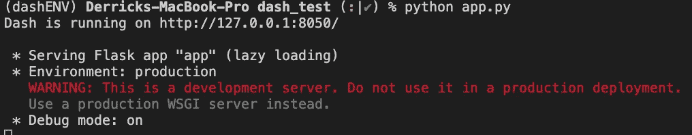
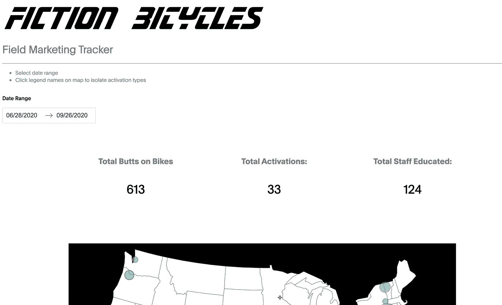

# 从 Google Sheets 构建一个精巧的 Dash 应用程序——第 2 部分

> 原文：<https://towardsdatascience.com/building-a-plotly-dash-app-from-google-sheets-part-3-666c496c8a71?source=collection_archive---------27----------------------->

## Plotly Dash 应用程序

## 创建一个 web 应用程序来显示我们新数据存储中的一些可视化效果。

到目前为止，我们已经创建了一个免费的、用户友好的数据存储，并通过 Google Python API 连接到它。

第 1 部分— [使用 Google 和 code.gs 进行设计和 ETL 过程](https://medium.com/p/d37dc41ece10)

接下来，我们将使用这些数据为现场营销团队构建仪表板，以跟踪他们的活动和奖金进度。


荒野中的自行车营销——作者图片

# 构建 Plotly Dash 应用程序

Dash 是 Plotly 的一个开源工具，它让数据科学家和其他像我一样对前端无知的人有机会组装一个交互式 web 应用程序，用几行 python 代码展示他们的 Plotly 图表。

Plotly Dash 上的[文档非常棒，并且有很好的例子，直入主题。](https://dash.plotly.com)

## 仪表板基础

打开一个终端，为我们的项目创建一个新的环境。

`conda create -n <yourEnvironmentName>`

`conda activate <yourEnvironmentName>`

`conda install plotly dash pandas numpy flask`

从第 1 部分开始，我们将需要 Google API 库:

`conda install -c conda-forge google-api-python-client google-auth-httplib2 google-auth-oauthlib`

开始一个新的项目文件夹，并创建一个名为`app.py`的文件。我们已经准备好构建我们的 Dash 应用程序了。

1.  *【第 5 行】*启动烧瓶
2.  *[第 7–8 行* ]使用刚刚创建的服务器创建一个 Dash 对象
3.  *[第 10–20 行]* 使用布局方法将组件和样式添加到该 Dash 对象。
4.  *【第 23 行】*运行服务器

就是这样。有了这 4 个核心部分，你现在就有了一个可以工作的应用程序。

Dash 的核心是应用程序的所有可视化组件都是 Python 类。对于您可能使用的组件类型，有特定的库可以导入，例如用于 div 和 image 等基本 HTML 项目的 [HTML 库](https://dash.plotly.com/dash-html-components)，用户友好的 [Dash Core Components](https://dash.plotly.com/dash-core-components) 库，其中包含预构建的下拉列表、列表、按钮、*图形(！)*等许多典型的 web 组件，最后是 [Dash 数据表](https://dash.plotly.com/datatable)库来显示和操作页面上的大型数据表。

从终端的工作目录运行`python app.py`。



如果没有错误，您应该会看到上面的内容。这意味着您的电脑正在运行该应用程序。打开浏览器，进入 [http://127.0.0.1:8050/](http://127.0.0.1:8050/) (或者上面给你的任何回复)。您将看到应用程序正在运行，并从您的布局中显示`<h2>`消息。还要注意浏览器右下角的蓝色圆圈。这对于将来调试和跟踪回调非常方便。

## 复试

理解我们的应用程序如何运行的另一个非常重要的步骤是回调。在我们启动 Flask 之后，创建一个 Dash 对象，并设计我们的应用程序可以响应更改的布局，例如在下拉列表中选择一个值，单击一个按钮或对一个表格进行排序。

Dash 中回调的基本结构如下所示:

```
@ app.callback(
    Output(component_id='graph', component_property='figure'),
    [Input(component_id='dropdown', component_property='value')]
)
def build_graph(selection): The first arguement in our function is the first item in the
    list of Inputs above. Name it as you like Do something here with the input.
    In this case it is the values from the dropdown. return the property needed for the output 
            (in this case it is a plotly figure object)
```

Dash 现在将监听我们名为“dropdown”的组件中的任何变化。当事情发生变化时，它将运行连接到回调的函数。然后将函数的输出返回给列出的组件。因此，用我们的选择更新页面。

**快进**

Plotly 为其 Dash 应用程序和可视化库提供了令人难以置信的文档。因此，我会让您找到您想要使用的特定工具，然后继续讨论我们将如何连接我们的 Google Sheet 以在仪表板中使用。

## 我们的建筑

首先，我们需要添加两个函数来从第 1 部分的[中获取 Google 数据到我们的`app.py`脚本中。这将从我们的谷歌表获取数据，并将其转换成熊猫数据框架。](https://medium.com/@derrickjameslewis/building-a-plotly-dash-app-from-google-sheets-part-1-d37dc41ece10)

## 布局

接下来，我们将构建 Dash 应用程序的布局。Dash 的想法是，它是为那些对前端开发、React 或 Javacript 知之甚少的人提供的工具。对于像我一样的初学者，我将在下面强调两点。

1.  **仪表板自举组件**

Bootstrap 是一个流行的 CSS 框架，用于在手机和其他屏幕上浏览响应站点。

在开发我的前几个 Dash 应用时，我努力调整布局。简单的任务，比如将一段文字居中或者增加页边空白是很困难的，很少能得到我想要的结果。

Dash Bootstrap Components 是第三方库，用于将 bootstrap CSS 集成到 Dash 中。文档非常棒，我从他们的视觉效果中学到了很多布局的工作原理。看一看:

[https://dash-bootstrap-components . open source . faculty . ai](https://dash-bootstrap-components.opensource.faculty.ai)

该库将容器、行和列的 Python 类添加到页面布局中。将这种结构与您的组件一起使用将允许站点更好地响应其他屏幕。对我来说，Python 类使得调整大小和对齐变得简单

在您的环境中安装 Dash 引导组件:

`conda install -c condo-forge dash-bootstrap-components`

**2。数据表**

数据表是 Dash 的一个组件，用于查看、编辑和浏览大型数据集。表格允许我们的应用程序用户过滤、排序和选择可以直接输入到我们的可视化数据。

他们非常强大，但也很挑剔。构建表格、列和标题非常简单，但是理解每个样式设置如何与其他样式设置交互可能需要一些时间来理解并导致意外的布局。

我遇到了与下面的单元格匹配的固定行标题的问题，以及某些 CSS 设置切断了数据的最左边和最右边的像素。

第一个提示是理解所有样式设置的优先级顺序:

1.  style *_data_* 有条件
2.  样式 _ 数据
3.  style *_filter_* 有条件
4.  样式 _ 过滤器
5.  style *_header_* 条件
6.  样式 _ 标题
7.  样式*_ 单元格 _* 条件
8.  样式 _ 单元格

这意味着将类似`minWidth=60`的设置调整为“样式 _ 数据”，将覆盖“样式 _ 单元格”中`maxWidth=50`的任何重叠设置。

我在使用 Dash 数据表时的下一个技巧是为所有的样式设置建立一个单独的文件。在我在网上找到的许多例子和教程中，每一列数据都是使用 for 循环添加的，甚至一些条件格式的列和数据也是如此。虽然这不是最有效的，但使用单独的文件并手动构建每一列使我能够快速轻松地调试、测试和调整数据。因此，在学习用表格构建 Dash 应用程序时，明确一点是个好主意。您可以测试并学习如何更改数据格式、颜色和列宽。下面是我在这个仪表板上使用的例子:

请注意，在第三个列表“bonus_data_cond”中，我可以设置一个条件样式来检查我们的员工是否超过了他们的奖金目标。然后脚本相应地设置背景颜色。

我在我们的主脚本`app.py`中导入所有这些变量，并在上面的表格布局中分配它们，如下所示:`style_cell_conditional=bonus_cell_cond`

## 复试

接下来，我们将为每个可视化和交互式组件添加回调。我们要建造:

1.  响应摘要统计
2.  交互式地图
3.  一个数据表，带有对应于数据选择的条形图。

## 特殊的数据回调

我们将从一些我在许多教程中没有发现的有趣的东西开始。在测试应用程序时，加载页面时数据通常不会刷新。此外，我发现一些资料提到了创建回调的最佳实践，该回调将数据作为字符串存储到`html.Div()`中，而不是让 python 脚本将数据作为每个函数都可以使用的全局变量存储在 Pandas DataFrame 中。对于这个数据存储库`html.Div()`，我们将设置`style={'display':'none'}`

但是为什么呢？

这为我们做了几件事。首先，它强制页面在每次加载时更新数据。其次，每个可视组件都将使用存储在这个隐藏组件中的数据来构建。API 调用和一些计算量更大的数据转换将只发生一次。对可视化的改变发生得更快，因为数据已经是干净的，只需要被过滤。最后，我知道如果数据不打算被看到或读取，这种做法有一点安全隐患。

因此，在我们的第一个页面加载期间，这个函数将由隐藏的`html.Div()`运行*。主数据转换将在这里发生，日期被转换，数字被存储为整数。然后 2 个响应回调将使用这些干净的数据进行过滤。所有数据都以字符串格式存储在`.Div()`组件中，而不是存储在服务器的内存中。幸运的是，这个项目永远无法处理非常大的数据集。如果这是您的情况，您应该找到一个替代方案来保持较低的内存使用率。*

实际上，我将设置两个数据收集回调。原因是允许仪表板在主地图和员工奖金表之间独立设置时间范围。

## 地图构建回调

在这里，我们深入了解 Plotly 的一些核心可视化优势。我们从我们的隐藏数据组件输入数据，并将其从字符串转换回 Pandas DF 进行一些操作，然后我们返回一个散点图以在上面的应用程序布局中呈现。

## 数据表回调

设置 Dash 数据表的大部分繁琐工作都是在布局和样式中完成的，这里我们使用 Pandas 对每个现场营销员工进行一些聚合，并返回一个字符串格式的数据供 [dash_table 读取。布局中的 DataTable()](https://dash.plotly.com/datatable) 组件。

## 条形图回调

这是许多仪表板项目中我最喜欢的部分之一。数据表提供了选择行、突出显示、删除和过滤的灵活性。所有这些对表格的调整都可以作为结果可视化的输入发送(或者更好…机器学习预测！)

为什么这是我最喜欢的部分？因为我喜欢给仪表盘尽可能多的灵活性。用户可能想知道一个非常具体的问题的答案，“四月份在东部地区销售了多少个小部件？”一个好的仪表板设计给用户带来了灵活性，仪表板数据表本身就有这种功能。

这里，我们将从上表中的选定行中获取输入，并构建 4 个条形图。

这里需要强调的是，回调不仅可以接受多个输入，还可以将输出设置为一个列表并发送给多个组件。

## 汇总统计回调

这个回调简单明了地报告了给定初始日期选择器组件中设置的时间范围的清晰指标。大多数商业用户希望快速认知。这个报告的关键数字，有很大的空间。

# 把它们放在一起

以上所有部分组合成一个 Dash 应用程序。

下面的 Github 库包含了上面的核心部分，以及一些额外的地图，附加的过滤器和一些图片。

[](https://github.com/lewi0332/google_dashboard) [## lewi 0332/谷歌仪表板

### Plotly Dash 应用程序连接到 Google Sheets API。为 lewi0332/google_dashboard 开发做出贡献，创建一个…

github.com](https://github.com/lewi0332/google_dashboard) 

# 结论

这是一个很大的步骤，需要在设计中进行大量繁琐的尝试和错误，但这是你可以让你的项目脱颖而出并为用户增加很多价值的地方。

## 第 3 部分—部署到 Heroku

[即将推出]



我们潜在仪表板的屏幕截图—作者提供的图片